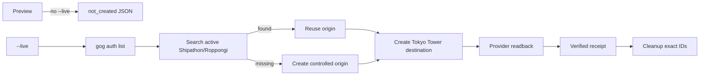

# SDD brief: real Calendar seed for Life Manager iOS demo

## Goal

実デモの直前に、既存の Google Calendar connection へ物理イベントを投入し、native Life Manager app が同じ実 Calendar を検出するための operator-only seed/cleanup boundary を提供する。route や Life Manager の判断結果はこのツールの責務ではない。

## Scope

変更対象は `apps/life-manager-ios-demo-tools/**` のみ。

- `gog` 0.17.0 の既存認証済み profile を read/write に使う。
- preview は外部副作用ゼロ。real create は `--live` の明示確認と primary integration run に限定する。
- origin は active Shipathon + Roppongi の既存 event を優先して再利用する。無ければ controlled origin を real create し、receipt に作成者を記録する。
- destination は Asia/Tokyo の現在時刻 +45分、30分間、Tokyo Tower location。
- create response と provider readback から machine-readable receipt を生成する。
- cleanup は receipt にある作成対象 ID のみを、destination → tool-created origin の順で削除する。

範囲外: iOS source、CoreLocation、backend、route engine、late-notice、calendar cache、OAuth UI、fake route/message/result。

## State flow

## Contract decisions

1. `gog calendar create <calendarId>` の calendar ID は positional `primary` とする。`--from/--to` は RFC3339 の `+09:00`、timezone metadata は `Asia/Tokyo` とする。
2. `--json --results-only --no-input` を全 provider boundary に付け、stdout は JSON、stderr は安全な固定 error code だけにする。
3. provider event ID は create/readback から取得する。summary/location から ID を推測しない。
4. origin の再利用/作成を `originCreatedByTool` と `createdEventIds` で明示し、既存ユーザー event を cleanup しない。
5. receipt は provider の organizer/attendee/account/access-token fields をコピーしない。

## Acceptance criteria

- `npm test` の固定時計テストが JST 境界、location、create/readback/delete argv、origin reuse/create、cleanup scope を検証する。
- preview の test double call count は0。
- active origin が無い live flow は origin を real create してから destination を create する。origin/create/readback 失敗時は destination を呼ばない。
- verified receipt は provider event ID と実 readback の location/start/end を含む。
- cleanup は destination と tool-created origin だけを消し、reused origin は消さない。
- live event create は primary integration/video run まで実行しない。

## Evidence sources

- `docs/superpowers/specs/2026-08-08-life-manager-ios-spec.md`: backend が Calendar/route の authority、production path で fake demo data を使わない境界。
- `docs/superpowers/plans/2026-08-08-life-manager-ios-master.md`: real controlled Calendar event を TestFlight journey で検証する計画、worktree/RED/GREEN/receipt/push の工程。
- `docs/superpowers/plans/2026-08-08-life-manager-ios-integration.md`: real Calendar を使った route journey と receipt の要求。
- `gog calendar --help`, `gog calendar create --help`, `gog calendar event --help`, `gog calendar delete --help`: installed `gog 0.17.0` の positional IDs と flag contract。
