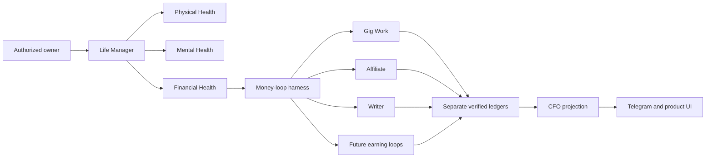
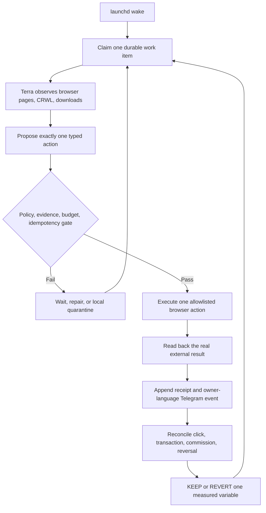
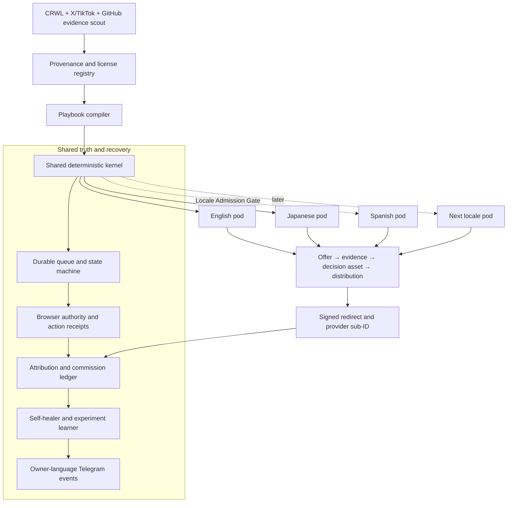
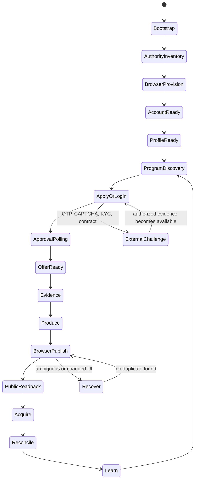
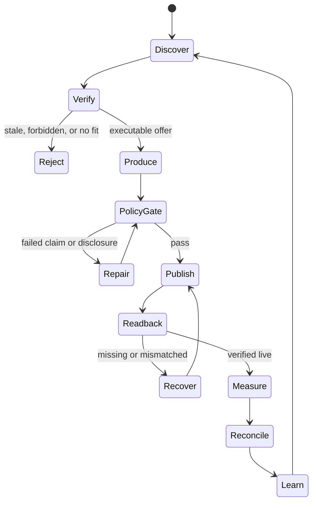

# Affiliate Agent — Revenue, Runtime, and Architecture SSOT

Last updated: 2026-08-16 JST

Implementation SSOT:

- Design and completion contract:
  `docs/superpowers/specs/2026-08-05-affiliate-agent-design.md`
- Atomic RED → GREEN → E2E plan:
  `docs/superpowers/plans/2026-08-05-affiliate-agent.md`

The ordered backlog in section 9 remains the product-level summary. The atomic
plan is authoritative for implementation order, exact files, tests, commits,
live verification, revenue gates, tenantization, and scale work.

## 0. Objective

Anicca is the company; Life Manager is the product, autonomous agent, and
canonical repository. Life Manager manages physical, mental, and financial
health. Affiliate Agent is one financial-health unit. It improves verified net
position through external affiliate receipts while preserving fees, reversals,
cost, concentration, cash timing, and policy risk. It never equates content,
clicks, estimates, pending commission, or GMV with earned money.

Canonical production ownership is reserved in the Life Manager repository at
`skills/affiliate/` with its redirect/API boundary at `apps/api/`. The runtime
tree is not present there until Task R0 imports and verifies it. The old
`/Users/anicca/profitable-claude/skills/affiliate` tree is migration evidence,
not a production home. Mutable state lives under
`${LIFE_MANAGER_STATE_HOME:-~/.local/state/life-manager}/affiliate/`; credentials,
sessions, provider exports, and ledgers never enter Git.

Build one Affiliate Agent inside Life Manager's financial organ that launches in
English first, then operates isolated Japanese and admitted additional-language
market pods. Spanish is the first expansion candidate after English and Japanese;
it is not admitted merely because it has many speakers. The Agent
continuously discovers lawful offers, publishes useful evidence-led content,
attributes clicks and conversions, records external commission
receipts, repairs interrupted runs, and reallocates effort without daily human or
Codex operation.

No two locale pods share one social identity, browser profile, affiliate link,
publication history, attribution cohort, experiment, or operating budget.
English is first. The verified English X
identity is now `sela` / `@selawmqt`, logged in through the isolated
`capafy-mkt-provision` CloakBrowser profile; legacy `@aniccaen` is not an active
X username. Postiz and every external publishing API are out of scope by product
decision. The Agent itself must provision an isolated browser profile, recover or
establish the authorized user account, configure the profile, publish through the
rendered website, and verify the public result. A dedicated Japanese canary is
admitted only after English Gate E0 and uses a different browser profile. Spanish
and every later locale must pass the Locale Admission Gate in section 8 rather
than being created as blind translations.

“End to end” is proved first on the current macOS host. The first graduation
condition is not portability: it is one unattended local run covering authorized
account recovery, affiliate application/approval polling, research, content,
browser publication, acquisition, click attribution, provider reconciliation,
Telegram reporting, recovery, learning, and a real external commission receipt.
After this local Agent earns with positive unit economics, its proven runtime is
packaged for a scratch computer. Installation, encrypted authority inventory,
browser/profile provisioning, and minimal operator credential intake remain Agent
states in that later packaging phase; they are not allowed to delay the local
money loop.

The machine cannot guarantee $10,000, $10,000,000, or $100,000,000 revenue. It guarantees
measurable attempts, honest receipts, bounded experiments, compliance gates, and
same-run recovery. Revenue targets are gates, not claims or forecasts.

Affiliate commission belongs only to this Agent's ledger. Writer Agent revenue
continues to mean direct payment for writing; shared research and editorial
techniques do not merge the ledgers.

## 1. Measured current state

| Surface | Observation | Runtime decision |
|---|---|---|
| Amazon Associates Japan | Browser confirmed an existing Amazon.co.jp account for the private SSOT application email. No password exists in Chrome or macOS Keychain; password recovery sent an OTP to the masked matching mailbox, but no currently authenticated Gmail or macOS Mail authority could read it. No Associates application was submitted | `AUTH_RECOVERY_OTP_REQUIRED`; resume the same recovery intent only after authorized mail access is available, then inspect existing Associates state before creating any application |
| Kit | A real PartnerStack application was submitted with truthful Anicca, website, `@selawmqt`, audience-size, channel, country, and region fields. Kit's authenticated application-email reply says it decided not to move forward. It lists four possible fit issues but does not identify one applicant-specific cause: creator-economy audience fit, prohibited promotion methods, inaccessible/insufficient website content, or insufficient promotion detail | `APPLICATION_REJECTED`; do not count approval or reapply unchanged. Reconsider only after an accessible content body, creator-helping-creator audience evidence, and a detailed organic promotion plan are live; coupon, cashback, and paid advertising remain excluded |
| HubSpot / Impact | The official HubSpot flow created a real Impact account, verified the authorized Japanese mobile number, fixed country/timezone/currency to Japan/Tokyo/USD, completed the truthful profile, verified `aniccaai.com`, and rendered the one-shot HubSpot application `In Review`. The original signup generated a password and entered it successfully, but its Keychain writer passed bare `security -w` and stored an empty item. A fresh-tab attempt proved the value was empty before password submission; no credential mismatch or account lock is claimed. Re-sending generic reset again reproduced a redirect chain ending at host `app.impact.com$changepasswordurl`; the official support UI also hid its first backend failure. Posting the documented minimum `email + comment` payload returned `hasErrors=false`, and Impact acknowledged Customer Solutions ticket `868262` | `APPLICATION_PENDING + AUTH_RECOVERY_PROVIDER_DEFECT`; poll the ticket without duplicate requests. Store the replacement only in the private local MD and `keychain://ai.anicca.affiliate.provider.impact/primary`, then require a fresh-tab login before Grammarly or another Impact application |
| Rakuten Affiliate | CDP rendered the public home page with `ログイン`; approval state is not observable | `AUTH_REQUIRED`, keep the provider adapter dormant |
| Postiz | A Japanese integration exists, but the product decision excludes Postiz | Do not read, connect, or use it in the Agent; this is not a blocker |
| X identity | User screenshot, authenticated browser, and public CRWL readback agree on `sela` / `@selawmqt`: 128 posts, 27 following, 0 followers, with mixed historical JA/EN Anicca posts. Stored credentials produced a real `auth_token`, `/home`, and profile link `/selawmqt`. X rejected legacy `@aniccaen` as inactive | Reuse `@selawmqt` as the English identity, then make its display name, bio, disclosure, and all future posts English-only before E0; preserve historical posts and never use Japanese `@aniccaxxx` or the shared daily-driver |
| X publication | No Affiliate placement exists. X's April 2026 rules warn that scripted website automation may permanently suspend an account | The user-selected implementation is browser-only. Enforce identity, disclosure, duplicate prevention, public readback, action caps, and immediate account quarantine; never describe this lane as platform-approved or evade challenges |
| clip loop | launchd is installed, last exit code is 0, and logs show production/posting through 2026-08-01 | Not banned. Reuse its publisher, renderer, attribution, and scoring contracts |
| recent clip runs | Contract reports `skipped`; older stderr shows Telegram DNS delivery failures | Diagnose scheduler/business gates separately from platform health |

### 1.1 Implementation progress

| Task | State | Receipt |
|---|---|---|
| R0 canonical convergence | Complete; current disabled release is `615206fd98fb555b0aada794454dd63e1cc95260` | Canonical skill and installer pass twice at 3/3; archived verifier 10/10; commission regression 6/6; manifests cover ten legacy files plus one archived parser dependency; remote SHA, immutable release bytes, valid JSON receipt, `current` symlink, untouched legacy state, and zero launchd owners all pass |
| F0 current-Mac bootstrap | Runtime and browser capability GREEN; Keychain admission corrected; disabled immutable release is `e3de264f4a9b1c5d34b49a913ff66ad6202dd318`; real provider admission remains open | CloakBrowser Chromium `145.0.7632.109` and pinned PBS CPython `3.14.7+20260814` are live-receipted. The original vault probe proved item existence only and incorrectly accepted an empty value. Admission now requires successful Keychain read plus non-empty bytes, without logging value, digest, or length. Provider refs are versioned in the program registry; Impact is `MISSING_OR_EMPTY`, so browser login remains disabled until official recovery and fresh-tab proof |
| P0/F1 legacy migration | Complete | Runtime commits `84cac1e7`, `3494f8ff`, `5b1927dc`; migration 8/8, legacy verification 10/10, commission regression 6/6; remote `feature/affiliate-agent-runtime` at `5b1927dc` |
| Legacy wrapper cutover | Blocked by design until Task 11 | F1 receipts `run.sh` and `affiliate-cli.sh` path/SHA-256/size while preserving their bytes; Task 11 must verify these receipts before scheduling the new orchestrator |

### 1.2 Truth checkpoint: implemented versus still hypothetical

This table prevents tests, fixtures, screenshots, or plans from being reported as
live autonomous operation.

| Surface | Current truth | What is not yet proven |
|---|---|---|
| Runtime | Legacy core still reports `DEAD` | No hourly/daily Affiliate Agent wake has completed |
| F1 migration | Implemented, reviewed, pushed, and re-run from final HEAD | It does not publish, browse, attribute, or earn |
| F2 Agent brain | Commit `d9ad4acd7cb0474cf1a825a94cfb49e7847da22e` is pushed; root replay on 2026-08-06 passed focused 16/16, Python 3.9 compile/shell syntax, and 30/30 related regressions | Full-suite collection is blocked by legacy `test_affiliate_verify.py` import-time `sys.exit()`; fresh review and live-provider execution remain open, so F2 stays open |
| Provider auth | HubSpot/Impact is `APPLICATION_PENDING + AUTH_RECOVERY_PROVIDER_DEFECT`; Kit is `APPLICATION_REJECTED`; Systeme.io is `EXTERNAL_CHALLENGE` at visible reCAPTCHA; Amazon JP is `AUTH_RECOVERY_OTP_REQUIRED`; Rakuten remains `AUTH_REQUIRED` | The Impact authenticated browser session is real, but its durable credential is not login-ready. No provider approval, tracking-link ownership, current executable offer, or payout setup is proven |
| Publication | Browser publisher is planned only | No Affiliate JA/EN placement has an action receipt plus public readback |
| Attribution | Design and API tasks remain open | No live redirect click is joined to an ASP transaction |
| Revenue | No new Affiliate revenue receipt | Legacy watermark, fixtures, clicks, estimates, and creator screenshots do not count |
| Telegram | The shared Life Manager allowlist target delivered a real Affiliate milestone with provider `messageId=7639`; the older F1 path failed because it did not use this resolved target | Reuse the validated target contract and build the Affiliate durable outbox/dedupe layer; delivery identity is no longer unknown |
| Autonomous operation | Queue, browser harness, recovery, launchd, and reports remain open | No-human-loop behavior is not yet achieved |

### 1.2.1 Active execution contract: provider review is never passive wait

A pending provider review blocks only that provider's executable tracking link.
It does not block the Affiliate Agent project or the rest of the English funnel.
While HubSpot/Impact remains `APPLICATION_PENDING`, the Agent MUST continue all
independent work below:

1. poll the authenticated Impact page and authorized Gmail for a state change,
   preserving one deterministic transition ID and never resubmitting the same
   application;
2. discover every current English B2B SaaS and creator/productivity program,
   read its official terms, inspect official CLI/API and licensed OSS support,
   and create a current eligibility receipt;
3. apply immediately to every program that passes the eligibility gate; do not
   bulk-apply to programs whose audience, traffic minimum, region, channel,
   website-content, payout, or policy requirements are not yet satisfied;
4. make `aniccaai.com` an accessible, content-rich owned acquisition surface and
   publish useful non-affiliate English foundation content before links exist;
5. rebrand and verify `@selawmqt` as the English identity, add the required
   disclosure, and build relevant organic distribution without claiming results;
6. implement the redirect/sub-ID boundary, append-only money ledger, policy gate,
   public readback, Telegram outbox, browser recovery, and launchd packaging;
7. prepare provider-specific placements as unpublished intents, then attach only
   an approved, owned, executable tracking link after an E-1 receipt exists.

The Agent MUST NOT report “waiting for approval” as the run result while any item
above is executable. A wait receipt is valid only for the provider-specific
application work item and MUST name the external reason, next poll time, durable
owner, and independent work selected for the same wake.

### 1.2.2 Current hard blockers, non-blockers, and honest struggles

| Condition | Class | Consequence and required action |
|---|---|---|
| HubSpot/Impact has not approved or rejected the application | External blocker for HubSpot link only | Continue polling with dedupe; execute the rest of the funnel and apply to other eligible programs |
| No provider has returned an owned executable tracking link | Hard blocker for E-1, E0, and real commission | Expand the qualified provider portfolio while improving the owned site and application evidence |
| Kit rejected the submitted application without naming one applicant-specific cause | Closed negative receipt | Do not reapply unchanged; first make audience fit, accessible content, and organic promotion evidence materially stronger |
| `@selawmqt` has zero followers and mixed historical language | Acquisition weakness, not implementation blocker | Rebrand future output to English, preserve history, publish useful material, and measure qualified reach honestly |
| The owned site does not yet present a deep affiliate-relevant English content body | Approval and conversion weakness | Publish evidence-led B2B SaaS/creator workflows and comparison foundations before another fit-sensitive application |
| `agent-browser 0.27.0` hung against the live multi-tab CloakBrowser | Tool-path failure, not browser incapability | Use the live-proven raw-CDP path now; retain the failure receipt and replace only when a candidate passes the same live postcondition |
| Provider signup/login/OTP/contract/application writes are not yet fully exposed by `affiliate provider` | Product implementation gap | Turn every successful operator action into an idempotent semantic playbook and CLI state |
| Redirect, click join, provider reconciliation, and Affiliate ledger are unbuilt | Revenue-truth implementation gap | Build before scaling publication; no click or estimate may be reported as commission |
| No first-party CTR, conversion, approval, reversal, or payout cohort exists | Learning uncertainty | Do not fabricate best/base/worst revenue forecasts; collect the first live 30-day cohort |
| Scratch-Mac dependency installation is incomplete | Packaging gap, not current-Mac money blocker | Finish only after the current Mac closes a positive-unit-economics local slice |

The most difficult part is not text generation. It is obtaining lawful provider
authority, preserving identity across browser recovery, proving every external
side effect exactly once, and joining a real provider transaction back to the
exact public placement without inventing revenue. Those are the harness defects
the implementation must close.

### 1.2.3 Desktop continuity and durable ownership

During an active local Codex execution, the operator MUST NOT force-quit the
ChatGPT/Codex desktop application because active local tool execution is not
guaranteed to survive process termination. Closing or minimizing a window is
allowed. Git commits, pushed branches, this SSOT, and runtime receipts are the
durable recovery boundary; they preserve progress but do not guarantee that an
in-flight command continues.

After the Affiliate launchd owner is installed and live-proven, provider polling,
research, publication recovery, reconciliation, and Telegram reporting MUST run
independently of the desktop application. The desktop then becomes an
observation/steering surface rather than the process owner.

### 1.3 R0 legacy inventory

The legacy source is clean within its own `skills/affiliate` path and contains
ten tracked files totaling 40,572 bytes. Its two pure suites pass 16/16 and four
shell entrypoints pass syntax checks. It is a Japanese Instagram carousel →
Amazon-account-total workflow, not the planned English/X Affiliate Agent.

Literal copying cannot produce a working loop. The fixed-path Instagram poster,
slideshow composer, Amazon report reader, and affiliate ledger recorder are
absent or moved, while the source also hardcodes one macOS user, Homebrew paths,
port 9225, and a Japanese browser profile. These gaps are recorded as
`UNAVAILABLE`, never silently replaced or reported as parity.

No Affiliate launchd service, tmux session, process, or open file is currently
live. Two old launchd plists exist only as disabled artifacts. R0 therefore
preserves the ten files byte-for-byte under canonical `skills/affiliate/legacy`,
receipts the archived verifier parser separately in `DEPENDENCIES.sha256`, and
adds a relocatable but non-executing skill shell. The focused installer test
proves immutable install, idempotency, stale-symlink repair, valid JSON receipt,
launchd non-interference, and fail-closed detection of a modified release. The
disabled release is installed from pushed SHA
`615206fd98fb555b0aada794454dd63e1cc95260` under
`~/.local/share/life-manager/affiliate/releases/`; its private ownership receipt
is under `~/.local/state/life-manager/affiliate/`. Live behavior parity and
cutover remain open until later provider/browser/publisher receipts.

### 1.4 No-dry-run equivalence rule

| Evidence | It may prove | It never proves |
|---|---|---|
| Unit/fixture test | Local contract behavior | Live login, publication, click, conversion, or revenue |
| CloakBrowser login page | Page reachability and observed auth state | Affiliate approval or account ownership |
| Fake browser/fixture response | Adapter parsing | A public X/article placement |
| `test=true` redirect click | Deployed redirect and click persistence | Organic buyer intent or commission |
| Provider report fixture | Reconciliation arithmetic | External approved or paid commission |
| Legacy commission watermark | Historical unattributed aggregate | New Agent revenue or placement attribution |

Every report labels evidence as `TEST`, `LIVE_READBACK`, or
`EXTERNAL_MONEY_RECEIPT`. Only the final class closes a revenue gate. A task with
external completion criteria remains open after code completion until the named
external receipt exists.

### 1.5 Ideal autonomous flow

The model is the planner and diagnostician. Deterministic code remains the money,
permission, idempotency, and evidence kernel. This is the target architecture,
not a claim about the current runtime.

## 2. Evidence-backed constraints

1. Every affiliate surface carries a clear disclosure adjacent to the link or
   recommendation. Amazon requires a prominent associate statement: “As an Amazon
   Associate I earn from qualifying purchases.”
   Source: [Amazon Associates Operating Agreement](https://affiliate-program.amazon.com/help/operating/agreement), section 5.
2. A post must help a reader decide; scaled thin or copied pages are rejected.
   Google defines scaled content abuse as generating many pages primarily to
   manipulate rankings rather than help users.
   Source: [Google Search spam policies](https://developers.google.com/search/docs/essentials/spam-policies).
3. The relationship must be obvious without making the reader hunt for it.
   Source: [FTC Disclosures 101](https://www.ftc.gov/business-guidance/resources/disclosures-101-social-media-influencers).
4. Rakuten explicitly supports product/service introductions on SNS and blogs,
   and exposes high-rate products and link-level reports.
   Source: [Rakuten Affiliate](https://affiliate.rakuten.co.jp/).
5. High-value Japanese CPA supply cannot be reduced to Amazon/Rakuten. A8.net
   supports only its registered/approved media and explicitly excludes Twitter
   advertising; afb reports roughly 17,000 promotions across 18 categories and
   identifies medical beauty and related lead-gen offers as high-price/high-
   conversion areas. Supply never implies channel eligibility.
   Sources: [A8.net](https://www.a8.net/), [afb](https://www.afi-b.com/).
6. Postiz exposes scheduling, articles, a public API, CLI, and MCP. It is a
   publisher adapter, not the Agent's brain or ledger.
   Source: [Postiz documentation](https://docs.postiz.com/).
7. Amazon does not guarantee traffic or commission income and may suspend an
   account for contract breaches. Amazon inventory is therefore not a revenue
   forecast and cannot bypass the policy gate.
   Source: [Amazon Associates Operating Agreement](https://affiliate-program.amazon.com/help/operating/agreement).
8. FTC disclosure must be hard to miss, accompany the endorsement, and use the
   same language as the endorsement. Locale-specific accounts and disclosures
   are therefore a contract, not a branding preference.
   Source: [FTC Disclosures 101](https://www.ftc.gov/business-guidance/resources/disclosures-101-social-media-influencers).
9. NerdWallet's official 2025 filing describes revenue per action, click, lead,
   and funded loan, but also reports organic-search pressure and a customer that
   represented 26% of revenue. Deep partner events work; channel and partner
   concentration remain material risks.
   Source: [NerdWallet 2025 Form 10-K](https://www.sec.gov/Archives/edgar/data/1625278/000162527826000014/nrds-20251231.htm).
10. A first-person five-figure affiliate launch used an existing email audience,
    social and blog distribution, years of product use, a 40% commission, and a
    staged launch funnel. It is evidence for trust and distribution, not evidence
    that copying a prompt reproduces revenue.
    Source: [Smart Passive Income five-figure affiliate promotion](https://www.smartpassiveincome.com/blog/5-figure-jv-affiliate-promotion/).
11. Current English candidate economics include Kit's 50% first-year commission,
    HubSpot's 30% monthly recurring commission for up to one year, and Semrush's
    tiered sale/trial commissions. These are candidates only until our own
    application, ownership, terms, and executable link are read back.
    Sources: [Kit Affiliate Program](https://kit.com/affiliate),
    [Kit Affiliate Terms](https://kit.com/affiliate-tos),
    [HubSpot Affiliate Program](https://www.hubspot.com/partners/affiliates), and
    [Semrush Affiliate Program](https://www.semrush.com/lp/affiliate-program/en/).
12. A8 forbids affiliate ads on Twitter, unregistered LINE messages and other
    unregistered media, publication of program reward conditions, and
    indiscriminate bulk partnership applications. Its high-ticket offers cannot
    be sent through the article's proposed X → LINE funnel unless a separate
    provider-specific written permission supersedes the observed terms.
    Source: [A8.net prohibited matters](https://www.a8.net/compliance/prohibited-matter.php),
    “Twitterについても広告を掲載することは禁止しています。”
13. First-person experience cannot be generated when the operator has not used
    the product. Source: [FTC Disclosures 101](https://www.ftc.gov/business-guidance/resources/disclosures-101-social-media-influencers),
    “You can’t talk about your experience with a product you haven’t tried.”
14. X allows separate language-specific brand accounts and localized cross-posts,
    but prohibits bulk/duplicative content, aggressive automated engagement, and
    scripted website automation. Source: [X authenticity policy](https://help.x.com/en/rules-and-policies/platform-manipulation),
    “branded entities specific to unique locations or languages”; and
    [X automation rules](https://help.x.com/en/rules-and-policies/x-automation),
    “Use non-API-based forms of automation, such as scripting the X website” may
    result in permanent suspension.
15. Awin's Spanish publisher page describes the real money state transition:
    tracked sales first appear pending, the advertiser validates them, and only
    approved commissions become payable. It also states there is no global
    minimum follower count, while each advertiser controls admission.
    Source: [Awin España — Afiliados](https://www.awin.com/es/afiliados).
16. Hotmart exposes products by format, niche, language, and popularity and says
    affiliates are paid for attributed sales. This proves multi-language offer
    supply, not that a translated campaign will convert or be approved.
    Source: [Hotmart Affiliates](https://hotmart.com/en/affiliates), “Sign up.
    Pick a product. Start promoting.”
17. Kit's current official page states “50% commission for 12 months” and a
    further “10-20% recurring revenue beyond 12 months when you earn status.” It
    also says commissions are held for 31 days for refunds. The Agent models the
    hold and status tiers instead of treating a click or pending sale as cash.
    Source: [Kit Affiliate Program](https://kit.com/affiliate).

Creator revenue screenshots and claims found on X are market signals only. They
never enter earnings or train a prompt as a winner without a matching external
receipt from this Agent.

### 2.1 External playbook intake: ブッタ article

The [2026-08 article by `@buttanoteragoya`](https://x.com/i/article/2084059581924454404) is stored as
`SELF_REPORTED_UNVERIFIED`: the profile and article are real, but the claimed
monthly income, approval rates, conversion funnel, and one-month result have no
public provider or payout receipts. It changes the workflow, not the revenue
forecast.

| Decision | Adopted pattern |
|---|---|
| COPY | Four boundaries: authenticated offer discovery → evidence-led decision asset → distribution variants → actual-data learning |
| COPY | Pain, mechanism, workflow, fit/not-fit, limitations, and one CTA |
| COPY | Generate hook variants and choose tomorrow's one action plus one stop action from observed data |
| TWEAK | Rank only offers returned by authenticated ASP/API/browser receipts; unknown approval rate, payout, or channel remains `UNKNOWN` |
| TWEAK | First-person copy requires an `ExperienceClaimReceipt`; otherwise use official evidence, direct tests, and explicit limitations |
| TWEAK | X, LINE, email, and owned pages each require a fresh `ChannelEligibilityReceipt`; owned registered pages are the default |
| REJECT | Revenue promises, predicted impressions/CVR, hidden advertising, fabricated experience, article-volume quotas, automated engagement, and A8 X/LINE direct ads |

Every external playbook stores `source_url`, author, capture time, claim type,
evidence grade, checked provider terms, `COPY|TWEAK|REJECT`, and reason. A prompt
is never promoted merely because its author reports income.

### 2.2 Continuous best-practice intake

The Agent searches official program pages with CRWL, creator cases and platform
discussion through authenticated browser/X collectors, and GitHub through `gh`
plus raw files. A source becomes executable knowledge only after:

1. capture with URL, immutable content hash, author, language, and evidence grade;
2. exact claim extraction and provider-policy cross-check;
3. license classification as `COPY_CODE`, `COPY_PATTERN`, or `NO_REUSE`;
4. one causal hypothesis and one-variable canary in exactly one locale pod;
5. promotion only from this Agent's mature external click/commission receipts.

Popularity, stars, screenshots, author income claims, estimates, and prompt scores
are discovery signals. They never become revenue, conversion truth, or an
auto-promoted winner.

### 2.3 Aggressive but bounded revenue policy

“Aggressive” means faster evidence collection, more creative variation, quicker
offer replacement, and higher capacity only after positive net receipts. It does
not mean hidden advertising, fabricated experience, unauthorized channels,
engagement manipulation, challenge evasion, or risking the payout account. The
browser-only X lane is an explicit accepted enforcement risk, not a claim of X
approval. The Agent may test strong hooks, contrarian angles, profile-versus-owned-page
distribution, pricing frames, CTA placement, and content format one variable at
a time. Any tactic that requires deception or threatens account/payout survival
has negative expected value and is rejected by the deterministic gate.

## 3. Single recommended strategy

Start with one narrow English buyer problem on `@selawmqt`. Its X login is
provisioned; account presentation and browser publishing remain Agent work. The initial
candidate set is non-regulated B2B SaaS and
creator/productivity software because its official programs expose higher or
recurring payouts and the existing English publication lane reduces launch
friction. Exact market-size superiority is unproven and is not a premise.
Before its first Affiliate placement, change the current `sela` presentation to
an English Anicca identity with an adjacent profile disclosure; future content
is English-only. The 128 historical mixed-language posts remain historical data,
not a reason to delete or fabricate a clean track record.

Initial English capacity allocation:

- 70%: one authenticated high-value or recurring software portfolio with a
  genuine reader fit;
- 20%: owned comparison/how-to assets and their measured distribution;
- 10%: bounded exploration, including Amazon only when executable and useful.

Regulated financial products are excluded from the initial lane despite proven
affiliate economics. Japanese discovery may continue read-only, but Japanese
publication stays disabled until English E0; Japanese J1 is then earned by its
own account, offer, placement, click lineage, and commission receipt.

Do not start as a generic deal feed. Publish decision assets: comparisons,
cost calculators, migration guides, tested workflows, failure-mode guides, and
“who should not buy” sections. Each content unit maps one reader problem to one
primary offer and at most two honest alternatives.

### 3.1 Money model

The loop earns only when an external partner approves a downstream event:

`net commission = qualified visits × observed partner conversion × confirmed payout − reversals − content/compute cost − paid acquisition`

The learner therefore ranks signals in this order: paid/approved net commission,
approved sale or lead, qualified trial, provider-confirmed click, then engagement.
Posts, views, and prompt scores are diagnostic proxies, never money. Before 30
days of live cohorts, each conversion input and revenue forecast remains
`unknown`; best/base/worst cases are computed only from observed receipts.

## 4. Architecture

This is one durable Agent with specialized workers, not independent agents with
separate truth. PostgreSQL/SQLite state and append-only receipts are canonical;
prompts and browser sessions are replaceable executors.

The kernel is shared code, not shared market state. Each locale pod owns its
identity, browser storage, provider membership, executable links, disclosures,
evidence pack, experiments, ledger partition, and budget. A useful English asset
may seed a hypothesis for Japanese or Spanish, but the destination pod must
re-research native intent, terms, claims, alternatives, and wording before a
canary. Translation alone can never authorize publication.

### 4.1 Components

| Component | Contract |
|---|---|
| Provider adapters | English B2B/creator programs first; Amazon, Rakuten, A8, afb, and later networks normalize offers, terms, commission events, and account health only after authenticated readback |
| Offer verifier | Re-reads landing page, price, availability, geo, payout, prohibited claims, allowed channels, disclosure, and expiry before publication |
| Portfolio allocator | Selects by expected **net** value: qualified intent × observed conversion × confirmed payout − refunds − content/compute cost − compliance risk |
| Evidence pack | Stores official facts, direct product evidence, alternatives, audience pain, counterclaims, and freshness TTL |
| Content studio | Produces an English article, X thread/post, X Article, carousel, slideshow, or video; the later Japanese pod uses independent evidence, identity, and localization rather than mixed-language reuse |
| Policy gate | Fail-closed for missing disclosure, unverified claims, prohibited categories, self-dealing, stale price, broken link, or unregistered surface |
| Browser publisher | Observe semantically, execute one typed action, then require before/after URL and observation hashes, expected identity, external object URL/ID when visible, screenshot hash, and fresh public readback. Before retrying an ambiguous publish, search the ledger and live account for the content fingerprint |
| Attribution | Agent-owned redirect records click ID, content, placement, offer, language, and experiment before redirecting to the signed affiliate URL |
| Receipt reconciler | Navigates provider dashboards and downloaded reports through the browser, hashes the source artifact, and joins transaction/sub-ID rows to clicks. Unknown is never zero; pending, approved, reversed, and paid remain distinct |
| Learner | Promotes a tactic only from mature cohorts and deepest common signal: net commission → approved orders → qualified leads → clicks → engagement |
| Recovery controller | Same `run_id`, artifact hash, placement, and publication intent resume after failure; exponential retry obeys provider `Retry-After` |
| Best-practice scout | Captures official terms, first-person cases, platform signals, and OSS code with provenance, license, evidence grade, TTL, and `COPY_CODE|COPY_PATTERN|NO_REUSE` disposition |
| Locale pod controller | Creates or resumes one isolated identity/provider/content/ledger slice only after the Locale Admission Gate; prevents cross-locale cookies, links, claims, and learning leakage |

### 4.2 Canonical records

`source_capture`, `crawler_adapter_receipt`, `provider_account`, `offer`,
`offer_snapshot`, `external_playbook_intake`,
`channel_eligibility_receipt`, `experience_claim_receipt`, `evidence_claim`, `content_unit`,
`placement`, `publish_intent`, `public_readback`, `click`, `conversion`,
`commission_receipt`, `experiment`, `policy_decision`, `wait_state`, and
`recovery_attempt` are the minimum entities.

Every commission receipt stores provider transaction ID, click/sub-ID when
available, currency, gross commission, reversal/refund, fees, net amount,
status, observed time, and immutable source hash. Canonical states are
`pending`, `approved`, `reversed`, and `paid`; UI may say “approved, not paid”
but that phrase is not a fifth storage state. Approved and paid are never combined.

## 5. Loop and state machine

The deterministic kernel owns transitions, leases, budgets, idempotency, money,
and receipts. One semantic browser planner handles unfamiliar pages. After a
successful path, the Agent stores a versioned playbook; later runs replay it and
invoke semantic recovery only when observation or postcondition hashes diverge.
This is one durable Agent with role prompts, not a swarm of independent ledgers.

Minimum receipt chain:

`BootstrapReceipt → AuthorityReceipt → AuthReceipt → ProfileReceipt → ProgramApplicationReceipt → OfferApprovalReceipt → EvidenceReceipt → PublishIntent → BrowserActionReceipt → PublicReadbackReceipt → ClickReceipt → CommissionReceipt → PayoutReceipt → LearningReceipt`.

Screenshots prove rendered state, not money. Only hashed provider dashboard/report
readback can create `pending`, `approved`, `reversed`, or `paid` commission rows.

Cadence:

- every 5 minutes: reconcile leases and ambiguous side effects, resume failed
  intents, ingest receipts, and flush the Telegram outbox; it does not create a
  new article every five minutes;
- hourly: offer/price/link/account health and provider/application polling;
- daily during launch: measure prior English cohorts, verify terms, choose one
  reader problem, produce at most one English primary decision asset, derive
  compliant distribution, perform public readback, and reconcile reports;
- 24/72 hours and 7/30 days: cohort measurement and learning;
- weekly: provider mix, reversals, net margin, concentration, and policy audit;
- monthly: close currency/reversal/payout truth and decide whether a locale or
  provider has earned more budget.

Platform publication windows block only that placement. Every wait has a retry
time and durable owner; “wait for next schedule” is invalid.

## 6. Self-improvement without self-corruption

- Preserve at least 20% exploration and require at least ten mature comparable
  placements before winner/loser mutation, matching the existing Marketing
  Engine scoring contract.
- Change one causal variable per experiment: offer, hook, proof shape, CTA,
  format, channel, or publish time.
- Optimize net approved commission per 1,000 qualified impressions and net
  commission per content dollar. Never optimize raw post volume.
- A provider, offer, prompt, or account is quarantined after repeated policy,
  reversal, link-health, or reach failures; the Agent shifts to an independent
  provider/channel while diagnosing it.
- Prompt mutations are versioned and reversible. A winning claim cannot be
  invented by the learner; factual claims always come from a fresh evidence pack.

## 7. Reuse and OSS decision

Reuse from the existing system:

- Writer Agent: research acquisition, JA/EN localization, X/article publisher
  adapters, public readback, same-run resume, claim registry;
- Marketing Engine: generic publication receipts, account-isolation patterns,
  slideshow/video/carousel renderers, mature-cohort scoring, and Telegram
  reporting; its Postiz publisher is explicitly not reused;
- Life Manager financial ledgers: verified money semantics and reporting.

Repository audit result: no inspected repository proves an autonomous affiliate
loop from account/application through an externally approved commission. We do
not fork a repository and call it the product. We copy only the following proven,
licensed parts into the existing local runtime:

| Repository | Measured truth | Decision |
|---|---|---|
| [BlockRunAI/Franklin](https://github.com/BlockRunAI/Franklin) | Apache-2.0 source; durable goals/scheduler, wallet budget, resumable sessions, task event logs, lost-task detection, and Telegram control. Its README says it **spends** money toward work; it does not reconcile affiliate income | `COPY_PATTERN`: bounded goals, cost caps, durable task lifecycle, evidence challenge. Do not import its wallet/trading subsystem or treat spend as earnings |
| [paraggit/affiliate-automation](https://github.com/paraggit/affiliate-automation) | MIT file; provider abstraction, retry/backoff, persistence, tests, content and Twitter scheduling. Runtime still asks `Start scheduler?`; no commission or payout ingest exists | `COPY_CODE` selectively: provider protocol, retry, and tests. Replace interactive scheduler and API publisher with our queue/browser/receipt kernel |
| [stay4ever role agents](https://github.com/stay4ever) | MIT files and small tested scout/content/analyst packages. Niche scores and performance examples use estimates or caller-supplied data | `COPY_CODE` selectively: role/tool schemas and disclosure template. Never import estimated traffic, CVR, or benchmark revenue as truth |
| [anacgr05/affiliate-agents](https://github.com/anacgr05/affiliate-agents) | Role graph, PostgreSQL/Redis/Celery/SSE and explicit human approval; no license file and no external commission reconciler | `COPY_PATTERN` only: critic/feedback state boundaries; do not copy code or human gate |
| [ricky-affiliate-agent](https://github.com/sujalmanpara/ricky-affiliate-agent) | Amazon → 15 images → Postiz. No license file despite README saying MIT; code warns “Commissions won't be tracked to your account” when the tag is absent | `NO_REUSE` as a base; Postiz and untracked output violate the product/revenue contract |
| [amazon-affiliate-automation-pipeline](https://github.com/haramhussain110/amazon-affiliate-automation-pipeline) | Five-file, unlicensed content pipeline; README says videos are “ready to check and post manually” and “I'm not auto-posting anything” | `NO_REUSE` as a base; at most reimplement the ASIN→video idea after provider-policy verification |
| [autonomous-marketing-agent](https://github.com/abandini/autonomous-marketing-agent) | No license file; scheduler/recovery shapes coexist with mock approvals and hard-coded revenue/conversion payloads | `NO_REUSE` code; retain only the abstract recovery vocabulary |
| [awesome-OpenClaw-Money-Maker](https://github.com/BlockRunAI/awesome-OpenClaw-Money-Maker) | A catalog, not an executable system; README says “These are potential earnings, not guarantees” | Discovery index only; every linked project receives its own code/license/money audit |

Local Writer/Gig loops are more valuable than any inspected affiliate repository
for production behavior: they already supply launchd ownership, same-run
reconciliation, public readback, durable receipts, and Telegram delivery patterns.
Their interfaces are reused while their ledgers remain isolated.

### 7.1 Closest end-to-end OSS and public-claim gate

No inspected OSS project closes the whole chain from lawful account authority to
an externally approved recurring income receipt. The nearest reusable systems
are complementary, not substitutes for the Affiliate Agent:

| Project | Closest proven boundary | Missing money boundary | Decision |
|---|---|---|---|
| [Nerfed-Lab/forage](https://github.com/Nerfed-Lab/forage) | MIT autonomous cycle, budgets, ledger, evolution, and Gumroad listing; cloned suite passed 39 tests | Its measured revenue remains `0.0`; Stripe/crypto payout and external receipt ingest remain TODO | Copy the economic-agent cycle and budget/ledger tests, not an earnings claim |
| [diptobiswas/agentwork](https://github.com/diptobiswas/agentwork) | Closest marketplace shape: agent profiles, gigs, escrow contract, and on-chain settlement vocabulary | Observed public market had one active agent, zero gigs, and `$0` earned; production recipient lookup remains TODO; no root license | Pattern only; do not copy unlicensed code or call escrow capability revenue |
| [coinbase/x402-paid-api-starter](https://github.com/coinbase/x402) | Closest real settlement substrate: idempotent transaction/settlement receipts; relevant cloned slice passed 13 tests | It does not acquire customers, publish, or choose profitable work | Reuse receipt/settlement patterns for an x402 loop, not as Affiliate Agent |
| [paraggit/affiliate-automation](https://github.com/paraggit/affiliate-automation) | Closest licensed affiliate code: MIT provider abstraction, persistence, retry, content, scheduling; audited suite passed 41 tests | Interactive confirmation; no program application, commission reconciliation, payout, or public ledger | Selective code reuse behind our deterministic queue/browser/receipt contracts |
| [No Human in the Loop](https://nohumanintheloop.com/) | Self-reported real-world precedent: zero approvals and `$2,152` from 74 Gumroad copies | Public GitHub is a static two-file site, not a reproducible harness/ledger, and has no reusable license | Evidence that generic “world's first money loop” is unsafe |

Until a public proof gate closes, README language is only: “We are building an
open-source, receipt-verified affiliate earning loop.” The qualified claim “To
our knowledge, Life Manager is the first open-source, receipt-verified agent loop
that autonomously operates affiliate marketing from authorized account bootstrap
through settled commission” becomes eligible only when all of these exist:

1. canonical public Life Manager source and reproducible macOS installation;
2. a live E1 commission and later payout receipt, redacted and content-addressed;
3. a privacy-safe append-only ledger separating gross, net, pending, approved,
   reversed, paid, currency, cost, and payout;
4. an independent verifier that replays receipt hashes and ledger invariants;
5. a public prior-art registry with search date, routes, repositories, licenses,
   code/tests inspected, and explicit uncertainty;
6. no secret, tax, bank, customer, session, or provider-internal identifier in
   the public projection.

This gate permits a qualified prior-art statement, never a guaranteed-income or
generic “world's first money-printing loop” claim.

### 7.2 Crawling and scraping substrate

“Every platform” is implemented as one typed `CrawlerAdapter` registry, not one
fragile scraper pretending every site has the same access model. Every adapter
returns normalized `SourceCapture` records with URL/object ID, platform, locale,
author, captured time, raw artifact hash, parser version, access route, and
readback class. Empty results are distinguishable from auth, rate-limit, parser,
policy, and upstream failures.

| Surface | Primary route | Clone/code evidence | Runtime decision |
|---|---|---|---|
| Public web and linked articles | Existing `crwl crawl`; Scrapy only for parser/HTML fallback | [Scrapy](https://github.com/scrapy/scrapy) is BSD-licensed; cloned retry, robots, and throttle suites passed 90 tests with 14 environment skips | Reuse the installed CLI first. Do not add a framework for a one-page fetch |
| Durable multi-page/JS crawl | Crawlee Python `HttpCrawler`/`PlaywrightCrawler` with persistent `RequestQueue`, session pool, robots delay, `Retry-After`, and backoff | [Crawlee Python](https://github.com/apify/crawlee-python) is Apache-2.0; cloned queue/session/throttle suites passed 338 tests with 2 memory-storage skips, and its official `HttpCrawler` example fetched `crawlee.dev` with 1 finished/0 failed | `COPY_CODE`/dependency only when a durable crawl is actually required; this is the shared substrate, not the Agent brain |
| X search and logged-in pages | Existing `x-search-cdp` on the exact daily-driver tab; CloakBrowser semantic read for authenticated articles | Local code drives the rendered tweet DOM. Current probe returned `no logged-in x.com tab`, so this route is not presently healthy | Repair/re-provision the authorized tab inside the Agent; never launch a duplicate browser silently |
| Public X tweet/profile fallback | `x-tweet-fetcher`: FxTwitter → Nitter → browser fallback, normalized schema and SQLite dedupe | [x-tweet-fetcher](https://github.com/ythx-101/x-tweet-fetcher) is MIT; 97 tests passed and live `@selawmqt` profile readback matched 128 posts, 0 followers, 27 following | Adopt for read-only public objects. X Articles still require a browser; no posting capability |
| X private-API fallback | None in production | [Twscrape](https://github.com/vladkens/twscrape) is MIT and 192 cloned tests passed, but it rotates accounts and consumes X internal GraphQL operations; fixture success does not prove live account safety | `NO_REUSE` initially. It may enter an isolated research canary only after a live/policy/account-risk review |
| TikTok | `clockworks/tiktok-scraper` and task-specific Apify Actors via their fetched input schemas | Existing code calls the Actor and normalizes videos/slideshows, but its current combined test file cannot collect because it still imports deleted `rss_parser`; old `drawrowfly/tiktok-scraper` is unlicensed and stale | Managed Actor adapter remains the candidate, but production admission requires a fresh one-item live dataset receipt and a repaired focused contract test |
| Instagram, Facebook, YouTube, Google Search/Trends/Maps | Task-specific Apify Actor selected by the local `apify-ultimate-scraper` registry | Actor IDs and input discovery exist locally; Actor implementation code is not assumed open source | Fetch actor schema, run a bounded live canary, hash dataset/schema, then admit. Never claim code reuse when only a hosted Actor is used |
| Reddit | PRAW with authorized read-only OAuth; public HTML through CRWL only as fallback | [PRAW](https://github.com/praw-dev/praw) is BSD-licensed; cloned auth/read-only/rate-limit unit slice passed 34 tests | Adopt official client semantics; do not use unauthenticated bulk-scraper repos as the primary route |
| GitHub | `gh` API/search plus raw files, then clone candidate repositories | GitHub CLI returned repositories and full clones supplied the code/license/test evidence in this audit | Already canonical; README alone never closes an audit |
| Amazon, Rakuten, A8, afb, PartnerStack and ASP dashboards | Official product/program API when explicitly allowed; otherwise isolated CloakBrowser rendered pages and report downloads | Affiliate-specific public scrapers either lack licenses, omit posting/revenue, or bypass the authenticated ownership state required by the ledger | Never substitute product scraping for provider approval, tracking-link ownership, or commission reconciliation |

Adapter selection follows a fixed ladder: official/authenticated interface →
installed CRWL → licensed public-object adapter → Crawlee/Scrapy → rendered
CloakBrowser. A failed route emits evidence and advances only to an allowed
fallback. It never rotates stolen accounts, bypasses challenges, or turns a parser
failure into an empty market signal.

No external prompt or source is copied unless its license permits reuse. Public
workflow ideas are reimplemented against our own contracts and evidence.

## 8. Revenue gates

| Gate | Verifiable completion |
|---|---|
| E-1 | English provider auth and ownership readback for one executable offer on the dedicated English identity |
| E0 | One English placement has public readback, a working redirect, and a provider click/sub-ID receipt; this unlocks a separate Japanese canary |
| E1 | First non-test English approved commission joined end-to-end |
| J-1 | After E0, Japanese provider/account ownership and one executable offer are independently read back |
| J0/J1 | Japanese public placement/click lineage, then approved commission, each closed independently of English |
| L0 | Any later locale has a separate identity/browser/provider/link/disclosure, at least one executable offer, native evidence review, and a receipted canary; Spanish is the first expansion candidate |
| A2 | Four revenue-positive weeks, positive net margin, zero manual execution |
| A3 | Three consecutive months at $10,000 gross affiliate commission with net, reversals, and attribution reported separately |
| A4 | Diversified scale: no provider, offer, or channel exceeds 40% of net commission |
| A5 | $10,000,000 cumulative or monthly target is defined explicitly and then met only by external receipts; never inferred from traffic |
| A6 | $100,000,000 monthly net remains `HORIZON_OPEN` until one externally settled month passes FX, reversal, cost, concentration, policy, partner-capacity, and tenant-isolation audits; GMV and forecasts do not count |

Best/base/worst planning is computed only after 30 days of real funnel data.
Before that, revenue is `unknown`, not a fabricated conversion forecast.

## 9. Ordered implementation backlog

1. Converge legacy Affiliate source into `life-manager/skills/affiliate` from a
   clean worktree; prove hash/behavior parity, isolate mutable state, and leave
   every existing live loop untouched until receipted cutover.
2. Make one narrow English vertical slice run unattended on the current Mac:
   preserve the Kit rejection, resume Amazon/provider state, acquire one
   executable offer, research one
   buyer problem, publish one owned placement plus eligible X distribution through
   the browser, verify the public result, reconcile clicks/commission, and report
   every transition to Telegram.
3. Create the minimum Agent schema and append-only Affiliate ledger required by
   that live slice; add invariants for
   unknown, pending, approved, reversed, and paid money.
4. Implement the semantic browser harness, typed action grammar, leases,
   screenshots/DOM hashes, download capture, postcondition checks, ambiguous-side-
   effect dedupe, playbook cache, selector-drift recovery, and crash resume.
5. Implement the `CrawlerAdapter` registry and `SourceCapture` contract. Wire the
   already-installed CRWL/gh routes first, then the audited X public fallback,
   PRAW, and one-item Apify canaries; every route must distinguish empty, auth,
   rate-limit, parser, policy, and upstream failure.
6. Make account discovery/signup/login/recovery/profile setup first-class states.
   Ship them as one reusable `affiliate provider` CLI inside the Affiliate skill,
   including dependency admission, vault references, browser-profile selection,
   signup, login, OTP/challenge resume, contractual-consent receipt, profile and
   channel setup, ownership verification, one-shot submission, and rendered
   readback. Before each provider adapter, search official CLI/API support and
   licensed GitHub implementations; reuse inspected code when it closes the same
   postcondition, otherwise cache the live semantic-browser playbook. Verify
   `@selawmqt`, rebrand it in English, and prove identity after every write.
   The first shipped command is `affiliate provider inspect`: it uses the
   working raw-CDP path after `agent-browser 0.27.0` hung against the live
   multi-tab CloakBrowser, selects one origin/title/path-bound provider tab,
   classifies only known rendered markers, and emits an atomic sanitized
   receipt. HubSpot/Impact is the first versioned playbook; submit/resume remains
   separate until duplicate-side-effect protection is implemented.
   `affiliate provider poll` now turns that observation into durable loop state:
   the initial or changed state emits one deterministic `transition_id`, while an
   unchanged retry emits `NO_STATE_CHANGE`. This is the idempotency boundary for
   the later approval-to-tracking-link action; no launchd owner is installed yet.
7. Discover all current English candidates and apply to every program that
   passes the audience, website, traffic, region, channel, payout, and policy
   eligibility gate; read back at least two real applications. Activate only an
   actually authenticated offer with current terms and an executable link.
8. Implement the signed redirect/sub-ID service and verify click → provider
   report joining before producing content at scale.
9. Extract Writer research/localization/publication contracts behind shared
   interfaces without changing the Writer revenue ledger.
10. Add English Affiliate manifests for browser-published X and owned articles;
   keep clip/slideshow/video renderers as format adapters.
11. Add the fail-closed policy/disclosure gate and official-source freshness TTL.
12. Close English E0, then unlock only a separate budget-capped Japanese canary
    while the English local daily loop continues toward its first approved
    commission and E1. Japanese production scale still waits for its own J0/J1.
13. Enable mature-cohort learning only after ten comparable placements; promote
   net commission as the deepest reward when available.
14. Add provider/channel quarantine, same-run recovery, health reporting, and
   launchd ownership.
15. Scale content and providers only after the first approved commission and
    positive unit economics.
16. After A3, publish the privacy-safe proof ledger, independent verifier, and
    prior-art registry; only then unlock qualified README/site “first” language.
17. Only after the local Agent proves positive unit economics, package its proven
    dependencies, credential-intake contract, isolated profiles, installer, and
    recovery checks for one-command operator-owned installations.
18. Add Spanish only through L0, then rank every later locale by executable-offer
    density × observed qualified intent × confirmed net payout minus acquisition,
    compliance, support, and account-risk cost. Population and translation volume
    are not admission criteria.

## 10. Rejected designs

- **Generic high-volume AI SEO farm:** fastest way to produce pages, but violates
  the reader-value and search-quality constraints and teaches from vanity volume.
- **Amazon/Rakuten-only:** simplest auth model, but low-price physical goods alone
  create concentration and payout ceilings.
- **X-only direct links:** cheap distribution, but weak ownership, fragile reach,
  poor long-form trust, and incomplete attribution.
- **Separate autonomous agents with separate ledgers:** parallel-looking but
  produces duplicate offers, conflicting claims, and double-counted revenue.

The strongest rejected alternative is the Amazon/Rakuten deal-feed model: it
has abundant inventory and easy creative generation. It loses because a feed
optimizes output count instead of reader intent and net commission, and it
cannot safely support the $10,000 gate without extreme traffic.

The most likely way this recommendation is wrong is that an authenticated
provider reveals an unusually strong, durable, low-reversal physical-product
program. The allocator can discover that from receipts and increase its share
without changing the architecture.

## 11. Visible uncertainties and blocked proof

### 11.1 Cleared implementation decisions

- All external platform operations are browser-only. Postiz and third-party
  publishing/affiliate APIs are neither prerequisites nor fallbacks. Internal
  local HTTP/SQLite interfaces and the owned redirect remain allowed.
- Rebranding, account creation/recovery, program application, dashboard scraping,
  report download, and payout reconciliation are Agent states, not manual setup.
- Architecture is one durable portfolio Agent with specialized role prompts and
  one ledger; it is not a multi-agent swarm with separate truths.
- Stable flows are deterministic cached playbooks; unfamiliar or drifted pages
  invoke the semantic planner; every write requires fresh rendered readback.
- Browser retries are at-most-once: an ambiguous write is externally searched by
  content/action fingerprint before any retry.
- The $10,000/month target closes only after three consecutive externally
  receipted months; software completion cannot promise revenue.

### 11.2 Must be cleared by implementation tests

- Reproducible bootstrap on a clean macOS user/profile; pinned browser/runtime
  versions; encrypted secret persistence; upgrades and rollback. Ubuntu parity is
  not an initial completion condition.
- Semantic action schema, browser profile leases, account switching, downloads,
  DOM/screenshot hashing, selector drift, localization, popups, and crash resume.
- Signup/login/recovery/profile workflows that resume without duplicating an
  account, application, post, or payout request.
- Reliable publication fingerprinting when a website returns an ambiguous result;
  deletion/edit/repost policy; acquisition cadence and account-risk caps.
- Durable scheduler ownership, watchdog, cost budgets, Telegram outbox/dedupe,
  receipt compaction, disaster recovery, and safe remote updates.
- Provider playbook discovery and promotion: how many successful replays are
  needed before a semantic path becomes cached, and what drift revokes it.
- Browser-only provider-report normalization, currency/FX timestamps, sub-ID
  coverage, reversal windows, and payout artifact integrity.

### 11.3 Can only be learned from live canaries

- The English niche is fixed to B2B SaaS and creator/productivity software.
  HubSpot is the first pending browser-verified application; Kit is a rejected
  receipt and Semrush remains unqualified until its current audience/site gate is
  satisfied. Live canaries determine which approved offer, content format,
  cadence, and acquisition path produces the highest approved net commission.
- Actual reach throttling/suspension rate, UI-drift rate, provider approval rate,
  CTR, partner conversion, reversal/refund rate, payout delay, and unit economics.
- Time and capacity required for the first approved commission, $10k/month, and
  later scale; prompt copying cannot determine these outcomes.

### 11.4 Irreducible external constraints

- A scratch computer cannot invent a legal identity, email/phone ownership, tax
  data, payout account, contractual consent, or affiliate-program acceptance.
  The deployment contract therefore requires an authorized identity bundle.
- Email/SMS OTP may be automated only when the user-authorized inbox/device is
  available. CAPTCHA, biometric checks, KYC, tax attestations, and contracts are
  never bypassed or fabricated; the Agent records `EXTERNAL_CHALLENGE` and keeps
  independent work running.
- X explicitly warns that non-API website scripting may permanently suspend an
  account. Browser-only operation is the user's accepted product direction, but
  no implementation can make it platform-approved or guarantee account survival.
- Providers may reject the applicant, prohibit a channel, change terms/UI, reverse
  commissions, withhold payout, or terminate a program. Quarantine and portfolio
  diversification limit damage; they cannot erase this uncertainty.

- Kit has one receipted application and an authenticated official rejection
  email. The email lists possible audience, promotion-method, website-content,
  and application-detail issues without selecting one applicant-specific cause.
  Kit stays `APPLICATION_REJECTED`; no unchanged reapplication is allowed.
- English X ownership/login is resolved as `sela` / `@selawmqt`; legacy
  `@aniccaen` is inactive. The account has 128 mixed-language historical posts
  and 0 followers, so rebranding and audience acquisition are required and
  organic distribution power remains unproven.
- No browser-published Affiliate X placement or owned conversion page exists yet.
- Amazon JP is `AUTH_RECOVERY_OTP_REQUIRED`; Rakuten remains `AUTH_REQUIRED`;
  Associates/affiliate acceptance is unknown.
- English total addressable market and the claim that it is larger than Japanese
  are not quantified by the collected primary sources.
- No first-party audience baseline exists yet: qualified impressions, clicks,
  email subscribers, conversion rate, reversal rate, and payout delay are unknown.
- HubSpot and every newly discovered program are candidate economics until
  approval, allowed-channel ownership, executable-link readback, and realized
  payout. Kit is already rejected; Semrush is not yet an eligible application.
- The Smart Passive Income result is a first-person case with an established
  audience and relationship; its causal contribution cannot be isolated and its
  outcome is not transferable by prompt copying.
- Inspected OSS repositories show useful role/adapter/runtime patterns but no
  verified autonomous approved-commission loop. Code reuse is limited to actual
  compatible license files; README license claims and popularity are insufficient.
- The current `x-search-cdp` probe has no logged-in X tab. Public profile fallback
  works, but authenticated X search/article collection remains unhealthy until the
  Agent restores and verifies the exact daily-driver tab.
- The existing TikTok Apify adapter has implementation code, but its combined
  test module imports a deleted `rss_parser`; it needs a focused test and live
  one-item Actor receipt before Affiliate production use.
- Spanish has official multi-language program supply, but no first-party account,
  audience, executable offer, native canary, or unit economics. It remains a
  candidate pod, not a proven second-largest or next-most-profitable market.
- F2 has a pushed implementation and root-verified focused tests, but lacks fresh
  review, live model/provider boundary proof, a clean worktree audit, and a
  collection-safe all-tests command.
- Telegram target and provider delivery are resolved by live `messageId=7639`;
  Affiliate-specific durable outbox, snapshot parity, and dedupe remain unbuilt.
- No production Affiliate placement, organic click, approved commission, paid
  payout, hourly/daily launchd wake, or crash-recovery E2E exists yet.
- `ai.anicca.affiliate-reconcile` and `ai.anicca.affiliate-daily` are not registered
  in the user launchd domain, and no `affiliate-core` tmux session exists.
- `$10k`, `$10M`, and `$100M` are outcome gates. There is no honest date or
  probability forecast until live cohorts and partner capacity are measured.
