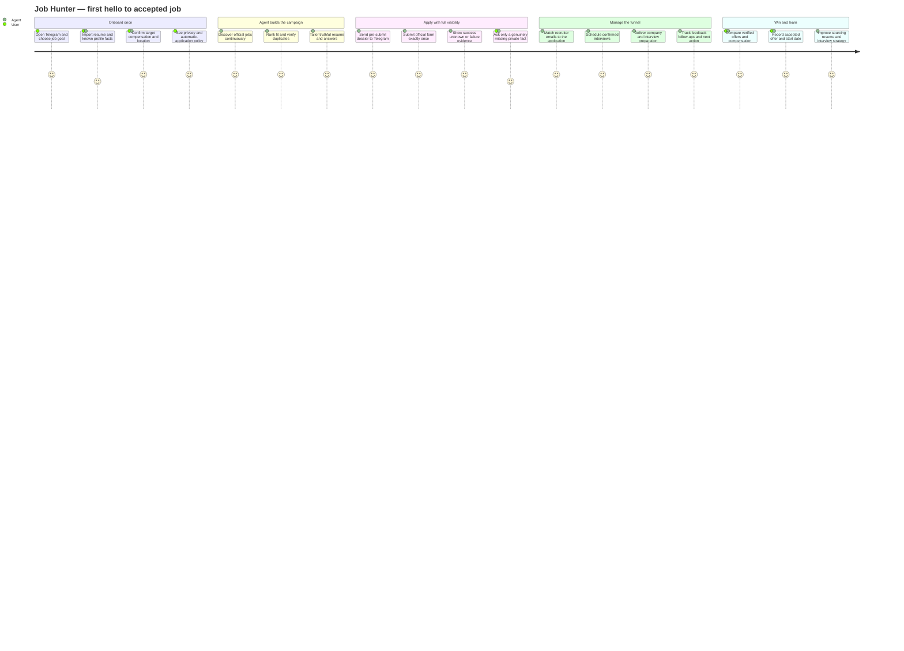
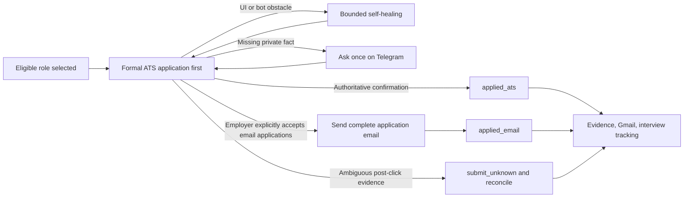
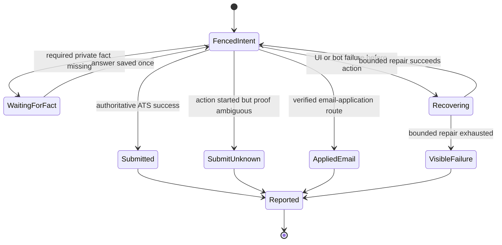
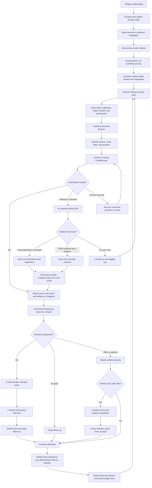

# Job Hunter Local Completion — Progress and Execution Spec

**Branch:** `docs/job-hunter-spec-20260805`
**Worktree:** `/Users/anicca/anicca-project/.worktrees/job-hunter-spec-20260805`
**Canonical repository:** `https://github.com/Daisuke134/life-manager`  
**Base:** `origin/main` at `2099a29da61345a120d2f68a819d7b854dcebd83`  
**Configured upstream:** `canonical/docs/job-hunter-spec-20260805`
**Scope:** Job Hunter only. Connector, Fundraising, CFO, Crypto, and Gig Work are excluded.  
**Last updated:** 2026-08-07 JST
**Active atomic task:** `PERSIST-06` — prove restart-safe continuation of the same
application/thread between non-side-effect form steps, with no repeated question,
command rediscovery, page-owner collision, or duplicate Submit. `PERSIST-05e` passed
the installed Submit-disabled Ashby canary at `pre_submit_ready`. `PERSIST-05d`
replaced the resident application lane's disposable `codex exec --ephemeral`
invocation with the application-bound app-server thread start/resume path while
leaving Ledger, browser ownership, Submit authority, Gmail, Telegram, and release
boundaries unchanged. `PERSIST-05c` materialized the selected
application, canonical route, grounded resume, posting, answers, and exact hashes
before browser fill without prematurely creating a submit intent. `PERSIST-05b`
live-inspected one genuinely new official
Ashby form and deterministically generated its ready answers artifact from private
profile facts with zero missing required answers.
`PERSIST-05a` now canonicalizes candidate URLs and Ledger evidence aliases, then
excludes every terminal, submitted, rejected, and submit-unknown application before
route materialization or browser pre-submit. The resident
thread now has the proved `job-hunter` capability profile: `danger-full-access`,
network, shell/filesystem, the shared Codex skill home, Job Hunter ATS CLI access,
and `approvalPolicy=never`, while retaining the PERSIST-04 secret filter.
`PERSIST-04` proved the secret-reference-only boundary between the persistent thread
and the existing private profile/credential stores. `PERSIST-03` added and live-proved
the thin direct-stdio Codex app-server protocol
client for start, resume, turn, read, archive, compact, fork, and structured events
without recreating app-server behavior. `PERSIST-02` added the minimal atomic
`work_type + work_id -> app-server thread_id` registry with active uniqueness,
generation lineage, and joined run/release identifiers. Codex app-server remains
the owner of persisted rollout history and thread event semantics. `PERSIST-01` proved the
subscription-authenticated Codex app-server thread can start, survive client exit,
and resume. No Job Hunter resident
release is activated or kicked until `PERSIST-01` through `PERSIST-05` and the
no-submit Ashby `pre_submit_ready` canary pass.
Run 94 on release `a46ba36928f22dc250df5af7ffc500967a507311` proved the
persistent thread can resume in the installed cwd with its non-secret runtime context,
inspect the exact OpenAI form, and produce a no-submit fill with `missing=[]`,
`repair=[]`, eleven verified receipts, a private pre-submit screenshot, and zero
submission attempts. It still exited 76 because the agent wrote the valid fill receipt
to an invented filename while the deterministic driver correctly required
`$JOB_SEARCH_ASHBY_APPLY_RESULT`. The active fix pins that one output path and leaves
Submit disabled for the rerun.
Run 96 on release `e5027567938b2198d8ac0187cefdc33f8650f5c8` resumed the
same thread, repeated the exact verified fill, and generated a valid claim-ready ATS
snapshot and browser owner receipt. Submit remained at zero because all ten ordinary
daily slots were already occupied and `submission_prepare` did not expose Ledger's
existing user-authorized overflow parameters. Dais explicitly authorized this exact
OpenAI application in chat. The active fix exposes only that existing fenced overflow
path through the CLI; dedupe, terminal-route, intent, and one-click gates remain intact.
Run 97 on release `a9d805602ac9d265049a7e0b1e68d2c75ad6e63b` proved the
explicit overflow reaches the installed agent, but stopped before claim because the
agent incorrectly treated `pre_submit_screenshot` as a string instead of the verified
`{path, sha256}` object. Submit and intent counts remained zero. The active recipe now
delegates shape validation to the deterministic `ashby_apply verify` command and pins
every subsequent CLI flag under one fail-fast transaction.
**Status:** The immutable four-lane runtime, grounded materials, ownership fences,
Gmail ingestion, Telegram outbox, quota accounting, Ashby surface classifier, and
loopback OpenTelemetry Collector/private trace index are implemented. The application
LaunchAgent is loaded on a 3,600-second schedule and is idle after resident run 92;
CloakBrowser CDP and the observability Collector are running. The
authoritative projection contains ten historical `submitted`, sixteen
`submit_unknown`, six `rejected`, two `materials_ready`, and five `discovered`.
Seven submissions count toward the current day's confirmed quota. Three historical
submissions are resident-loop confirmations: Cursor and two NVIDIA
roles, all confirmed through Gmail fallback rather than ATS-site confirmation. The
owner-authorized OpenAI Ashby success is `dais_manual`, not resident proof. There are
zero verified interviews and zero offers. `L-49K2C1` is complete:
its isolated CloakBrowser E2E verified changed field layouts across fill, select,
check, and upload with zero Submit controls/actions and preserved all baseline pages.
The active immutable release is `867cf10cc50a3f949d35c83b9d2b5902cafa45db`.
The complete Job Hunter suite passes 549/549. Run 85 proves truthful outreach
reporting and clean provider logs but does not prove a new resident ATS submission.

## 1. Acceptance criteria — done condition

The Mac mini Job Hunter autonomously wakes every hour, discovers high-upside roles,
verifies fit, creates truthful
tailored materials, submits eligible applications, captures an authoritative
receipt, works toward ten unique confirmed applications per day, polls Gmail through
`gog` every five minutes, updates the company funnel,
creates confirmed interview events in Google Calendar, reports every material
change in natural Japanese on Telegram, and improves its strategy from verified
outcomes.

Completion requires all of the following:

- one confirmed real Ashby application and receipt;
- one confirmed real Workday application and receipt;
- one ATS-blocked fixture that proves the resident worker continues through the
  alternate-route ladder, sends at most one role-linked email when permitted, and
  continues to another eligible posting without development-session intervention;
- official job URL, company, role, compensation, location, and fit thesis;
- exact submitted resume and cover letter for every application;
- every employer question and submitted answer preserved as a private artifact;
- Gmail thread ID bound to the correct application;
- one real interview email converted into a Google Calendar event;
- Telegram message IDs for application, progression, interview, and learning reports;
- hourly application, five-minute inbox, weekly learning, and guardian
  LaunchAgents healthy on the stable runtime;
- `summary.v2`, Telegram, ledger, and rebuilt event projections agree;
- the Dais campaign continues beyond technical local-product proof until one
  authoritative offer at or above the verified USD 100,000 annual threshold is
  recorded, compared, and presented for the owner's decision;
- all Job Hunter tests green; and
- every meaningful change committed and pushed.

## 2. Overview — product outcome

Job Hunter uses high throughput without optimizing vanity volume. It maximizes the probability that the
user reaches a dream job they would gladly accept but may not have discovered or
attempted alone. The initial target is Dais; the local contract must remain
profile-driven so Life Manager can later onboard any person, including users with
limited job-search knowledge or agency.

The objective is an AI-native, AI-maximal, high-growth peer environment where the
user can build and improve advanced AI systems. Foreign-capital companies in Japan,
Tokyo-based global teams, and employers supporting Japan-based remote employment,
EOR, or contracting are preferred. Traditional Japanese employers are not a default
target, but Japanese application documents remain supported when explicitly needed.

### 2.1 End-to-end user experience — from first Telegram message to accepted offer

Telegram is the primary product surface; the Mac mini resident is the executor, and
the Ledger is the truth. A user never has to operate an ATS, remember what was sent,
or manually reconstruct the hiring funnel.



The visible Telegram contract is:

| Moment | What the user sees | Required receipt |
|---|---|---|
| First start | Campaign goal, compensation, locations, role families, autonomy and privacy summary | Profile version and campaign ID |
| Candidate chosen | Company, role, official URL, fit thesis, gaps, duplicate state and intended route | Ledger application ID |
| Before submit | Exact resume, cover letter, every question and proposed answer, plus missing-fact status | Materials manifest and hashes |
| Missing fact | One concise Telegram question with why the official form requires it | Question ID; answer saved to private profile once |
| After action | Exact `submitted`, `submit_unknown`, `failed`, or `outreach_only` wording; never euphemisms | ATS/Gmail response, screenshots, intent and fence |
| Daily progress | Confirmed applications, unknown attempts, failures by reason, interviews, remaining quota and next action | Projection version and Telegram message ID |
| Recruiter reply | Company, stage change, full relevant message, deadline and response action | Gmail message/thread ID |
| Interview | Calendar time/link, participants, submitted dossier, likely questions and practice pack | Calendar event ID and artifact hashes |
| Offer | Base, bonus, equity, currency, verified conversion, deadline and comparison | Offer evidence and decision state |
| Accepted | Employer, role, compensation, start date, closed follow-ups and retained campaign history | Authoritative acceptance event |

### 2.2 Demo and productization contract

The first public demo is a real, redacted replay of one complete resident-owned path:
onboarding → discovery → exact materials → official ATS Submit → authoritative receipt
→ Telegram report → matched recruiter reply → Calendar interview → preparation pack.
It must use Browser Harness/CloakBrowser recordings and immutable Ledger events; it
must not reenact a completed application or show mock success as live proof.

Public sourcing is allowed only after the Dais proof gate below passes. Secrets,
private profile facts, employer correspondence, resumes, recordings, and raw browser
profiles stay outside the repository. The sourced package may include the orchestration
engine, provider interfaces, ATS domain skills, schemas, tests, redacted demo fixtures,
and local installation instructions.

Public-launch gate:

1. one resident-owned authoritative ATS submission, not a development-session action;
2. one full Telegram dossier reopened and hash-verified on a phone;
3. one missing-fact Telegram answer persisted and reused without a second question;
4. one honest failure/unknown report with no silent stop or misleading success label;
5. one real recruiter email matched to the correct application and stage;
6. one real interview Calendar event and preparation pack;
7. duplicate, privacy, concurrency, and crash-recovery E2Es green;
8. tenant-isolated storage, credentials, browser profile, Ledger, retention, deletion,
   export, consent, and pause/stop controls for a non-Dais user; and
9. a redacted end-to-end demo generated from real evidence.

## 3. Compensation policy — single source of truth

All versioned strategy, private profile validation, ranking, prompts, form answers,
Telegram copy, and learning reports must use one compensation contract:

| Policy | JPY |
|---|---:|
| Hard floor | 8,000,000 |
| Default target | 10,000,000 |
| Priority search range | 10,000,000–30,000,000 |
| Stretch | 30,000,000+ |

Rules:

1. Reject a role only when authoritative compensation proves its maximum is below
   JPY 8,000,000.
2. JPY 8,000,000–9,999,999 is an acceptable band, not the search target. It requires
   exceptional AI mission, peers, learning value, or strategic upside.
3. Rank JPY 10,000,000+ roles above otherwise equivalent lower-paid roles.
4. Do not anchor a high-paying employer down to JPY 10,000,000. When a role publishes
   a higher range, answer inside that range based on scope and total compensation.
5. The normal answer is: `JPY 10M+ target; flexible based on role scope, total
   compensation, and growth opportunity.`
6. Never infer or disclose current compensation.
7. Unknown compensation is not an automatic rejection; verify it or ask at the
   appropriate hiring stage.
8. Store published base, recruiter-confirmed base, bonus, equity, currency, and
   total compensation separately. Never label a role `six_figure_usd` until the
   verified annual base or explicitly defined total-compensation value is at least
   USD 100,000 using the latest available Bank of Japan 17:00 JST USD/JPY mid rate.
   Persist the BOJ release URL, observation date, rate, source currency, target
   currency, and converted amount with the classification receipt. Source:
   [Bank of Japan — Foreign Exchange Rates (Daily)](https://www.boj.or.jp/en/statistics/market/forex/fxdaily/index.htm).

### 3.1 Income outcome and the USD 10K/month target

For Dais, this loop targets employment compensation, not product MRR. `Six figure`
means at least USD 100,000 annual compensation. USD 10,000 per month means USD
120,000 annualized gross compensation. The JPY 10M default target is an acceptable
search floor but does not automatically equal USD 10K/month; the loop must preserve
currency, annual base, bonus, equity, and the timestamped BOJ conversion before
claiming either target. The practical route is: high-fit applications → recruiter
replies → interviews → competing offers → verified accepted compensation. The later
multi-user Web product may create real MRR, but Dais's salary must never be reported
as product revenue or MRR.

### 3.2 August 2026 campaign target and planning truth

The campaign's hard operating target is the first verified six-figure USD offer by
2026-08-31 JST. This is a goal, not a promise: neither a resume nor application
volume can guarantee an employer decision or hiring timeline. The loop may report a
forecast only from observed confirmed applications, replies, interviews, and stage
velocity; when those observations are absent, the date remains `unknown`.

The campaign runs one ten-confirmed-applications-per-day portfolio instead of betting
on one employer:

| Daily lane | Confirmed/day | Purpose |
|---|---:|---|
| Dream frontier AI | 2 | OpenAI, Anthropic, and equivalent high-upside roles |
| Tokyo/global AI employers | 5 | Highest location fit and sufficiently broad role coverage |
| Fast remote startups/direct founder routes | 3 | Shorter decision cycles and additional high-upside surface |

The counts are allocation targets, not permission to weaken truth, compensation,
duplicate, authorization, CAPTCHA, or authoritative-receipt gates. An unfilled lane
spills into another eligible lane on the same day. A founder conversation counts as
outreach, not an application, until tied to a verified role and receipt.

Planning scenarios are operational hypotheses, never probability claims:

- best case: a fast-moving startup produces interviews within one to two weeks and
  a verified offer during 2026-08-20–2026-08-31;
- base case: interviews begin in August and the first qualifying offer arrives in
  September or October; and
- worst case: the first 50 confirmed applications produce no qualifying interview,
  forcing the L-69 funnel diagnosis while the campaign continues.

The role surface is real but does not establish personal selection odds. On
2026-08-05, OpenAI's official search showed `735 jobs`, including Tokyo listings for
AI Deployment Engineer and Forward Deployed Engineer. Anthropic's official hiring
page says, "We care about what you can do, not where you learned to do it," and
describes live technical interviews plus experience and motivation discussions.
Sources: [OpenAI Careers Search](https://openai.com/careers/search/),
[Anthropic Careers](https://www.anthropic.com/careers).

## 4. Location, travel, citizenship, clearance, and start date

- Tokyo on-site or hybrid is eligible.
- Japan-remote is eligible.
- Global remote is eligible when Japan-based employment, EOR, or contracting is
  supported.
- Domestic and international travel are positive preferences, including roles with
  frequent client-site travel.
- Verified Japanese citizenship satisfies a Japanese-citizenship requirement.
- Japanese citizenship does not prove possession of a named security clearance.
- A clearance requirement is not an automatic rejection when the user may undergo
  the employer or government clearance process.
- Answer `currently holds clearance` only from a verified private fact. Otherwise
  preserve `unknown` and escalate only if the form cannot be answered truthfully.
- Availability policy must use the private profile. Current owner direction is an
  autumn start, with employer notice lead time handled truthfully; no exact date is
  invented.

## 5. Autonomy contract

### 5.1 Default behavior

The default is autonomous application, not approval-before-submit.

Once base resumes and candidate facts are accepted, Job Hunter:

1. discovers and verifies an official job;
2. evaluates compensation, location, experience level, work authorization, posting
   legitimacy, and expiry;
3. creates a job-specific resume, cover letter, and answer set;
4. validates every claim against private fact IDs;
5. submits through the existing CloakBrowser or the bounded alternate-route ladder;
6. records an authoritative receipt or `submit_unknown`;
7. reports the result and exact artifacts on Telegram; and
8. follows all later email and interview stages automatically.

There is no routine `Apply / Skip / Edit` approval gate. The user may have many
applications and offers and choose among verified outcomes later.

The resident Job Hunter is the only permitted actor for live discovery, form fill,
submission, receipt capture, and reconciliation. A development chat may change code,
install an immutable release, trigger the installed LaunchAgent, and observe its
receipts; it MUST NOT perform a live application itself or count a development-session
browser action as product E2E. If the resident loop cannot complete an ATS, it records
the failure class, learns through a tested adapter change, or uses the bounded
human-only handoff below. It then continues to other supported ATS and direct-email
routes instead of treating one ATS failure as a global stop.

#### 5.1.1 Thin resident agent — execution SSOT

The simplest production architecture is the installed hourly Terra agent plus one
small browser toolbelt, not a separate workflow per ATS. `job_search_loop.ashby_apply`
already provides deterministic `inspect → fill → apply → verify` operations for
Ashby. The generic semantic observer/classifier exposes the same current-page facts
for Greenhouse, Workday, and direct employer forms. Terra owns adaptation when field
labels, ordering, widgets, or optional questions differ.

For every selected role, the resident executes this one natural-language goal:

1. reject any durable duplicate and choose a new eligible official posting;
2. open the official application surface in the existing CloakBrowser profile;
3. inspect current controls, fill profile-grounded answers, and upload the selected
   resume;
4. adapt to harmless form variation, then use the single fenced Submit action once;
5. verify an authoritative ATS response or confirmation page;
6. if formal submission cannot be confirmed, use the verified email ladder and then
   continue to another employer; and
7. persist the receipt in Ledger and report the exact route and evidence on Telegram.

Scripts supply stable browser, Ledger, receipt, and idempotency primitives; they do
not replace the agent's judgment. Do not make Terra rediscover CLI usage by reading
the repository during each hourly pass, and do not add a new ATS-specific state
machine before a measured form difference proves the existing adaptive path cannot
handle it.

### 5.2 Minimal human-only boundary

Job Hunter asks the user only when a truthful, authorized completion is impossible
without personal action or missing private context:

- video recording or live interview;
- identity verification, signature, or biometric step;
- CAPTCHA that cannot be completed through the authorized existing session;
- unknown legal, clearance-held, current-compensation, reference, or sensitive
  personal answer;
- proctored/live assessment or assessment with prohibited/unspecified AI policy;
- offer acceptance or binding employment agreement.

The Telegram request must contain one question, enough context to decide, the
official link, and compact buttons where supported. After the answer, Job Hunter
continues and reports the authoritative outcome. It must not make the user repeat
facts already stored in the private profile.

### 5.3 Representation policy

Routine applications and recruiter correspondence use the user's natural first
person. They do not insert unsolicited statements such as `I am an AI` or `an AI
assistant sent this`. They also never fabricate experience, impersonate the user in
identity-bound interviews or videos, violate assessment rules, or give a false answer
when an employer directly requires disclosure.

### 5.4 Three-lane ownership and duplicate prevention

Every application has exactly one durable owner: `agent`, `dais_manual`, or
`recruiter`. Company plus normalized role plus official posting identity is unique
across all owners. A manual or recruiter application is imported before the next
autonomous pass and permanently fences the agent from submitting the same role.

Palantir applications already submitted by Dais are `dais_manual`; Job Hunter tracks
their Gmail outcomes but MUST NOT submit them again. Manual and recruiter lanes do
not need autonomous material generation unless their application record lacks the
exact submitted artifacts.

### 5.5 Relationship and founder-outreach lane

Companies without a verified open role, including the current BlockRun relationship,
do not enter the ATS application lane. They enter a separate `founder_outreach`
pipeline with product research, a truthful working contribution or concrete proposal,
direct outreach, reply tracking, and a verified paid-trial, contract, or employment
outcome. The lane never invents a vacancy and its outcomes are reported separately
from application conversion.

### 5.6 ATS failure and alternate-route contract

One blocked ATS is never a successful reason to end an hourly pass. The resident Job
Hunter, not Codex, Claude, or a development shell, owns this deterministic route
ladder for the same verified role:

1. attempt the canonical official ATS once under the existing intent and receipt
   fence;
2. discover and verify another official employer-controlled application URL for the
   identical role, then attempt it once under the same cross-route duplicate key;
3. when the employer explicitly publishes a recruiting address or states that email
   applications are accepted, send one role-specific application email with the
   truthful tailored resume, official posting URL, and exact message artifact;
4. otherwise, when a relevant recruiter, hiring manager, or founder has a verified
   public work address, send one personalized role-linked outreach email asking for
   the accepted application route or consideration, attach the truthful resume, and
   classify it as `recruiting_outreach`, not `confirmed_application`;
5. if the same role still lacks an authoritative application receipt, preserve its
   terminal route state and immediately continue to the next eligible role on a
   different supported ATS or employer site during the same pass.

An email provider acknowledgement proves only `email_sent`. It becomes a confirmed
application only when the employer explicitly accepts email applications, replies
that the candidate is under consideration, or supplies another authoritative
application receipt. The ledger binds ATS attempts, alternate URLs, email message
IDs, recipients, artifacts, and replies to one company-role identity so no route can
duplicate another. Gmail's API exposes a provider message send operation, but a send
receipt is not an employer hiring-stage decision. Source:
[Gmail API — users.messages.send](https://developers.google.com/workspace/gmail/api/reference/rest/v1/users.messages/send).

The worker MUST NOT guess private addresses, use scraped personal email, contact
privacy/security/support addresses, send generic bulk mail, repeat an unanswered
role email, evade CAPTCHA or anti-bot controls, or claim that outreach was an
application. Public company recruiting addresses and public role-relevant work
addresses remain eligible. A route failure records its exact class and evidence; it
never causes the development session to take over.

The daily report MUST lead with confirmed applications, then separately report ATS
failures, email applications, recruiting outreach, and quota deficit. It never says
`applied` when only a click or outbound email exists. It also never reports an empty
pass as success: the resident worker continues through eligible roles and routes
until the confirmed cap is met or all currently discovered eligible candidates have
durable terminal route states, then the next hourly wake expands discovery.

### 5.7 Runtime cadence and model contract

- Application passes run every hour, continuously. Each day targets 100–300 newly
  discovered postings, 30–50 deep evaluations, 15–20 complete application dossiers,
  and exactly ten unique confirmed submissions under the initial hard cap.
- Fewer than ten confirmed submissions is a visible `quota_deficit`, not a successful
  empty pass. The next hourly wake expands sources, queries, and eligible adjacent
  segments while preserving the JPY floor, truth, authorization, expiry, duplicate,
  and human-only boundaries. It never invents a vacancy or submits a bad known fit
  merely to fill quota.
- ATS failures do not consume the confirmed-submission cap. Email applications and
  recruiting outreach have separate daily counters; neither reduces the obligation
  to continue searching for ten authoritative confirmed submissions.
- The daily portfolio is initially two dream/high-touch, five strong-fit, and three
  adjacent-stretch applications. A quota change requires the experiment gate below.
- Gmail polling through `gog` runs every five minutes. A deterministic query and
  immutable-message checkpoint return immediately without a model call when empty.
- `gpt-5.6-luna` handles high-volume, non-side-effect extraction, normalization, and
  preliminary ranking. `gpt-5.6-terra` medium handles deep fit, truthful tailoring,
  employer answers, Gmail interpretation, and any decision leading to an external
  side effect. Terra high handles dream applications and the weekly hypothesis.
- Weekly learning uses Terra to propose exactly one bounded strategy change. Wilson
  interval comparison, minimum sample thresholds, safety rollback, promotion, and
  active-generation switching remain deterministic code; the model never overrides
  those gates.
- A model-route change requires a replay eval on the same immutable snapshots and a
  measured quality, latency, and cost improvement without weakening evidence.

Model-selection source: [OpenAI — Using GPT-5.6](https://developers.openai.com/api/docs/guides/latest-model.md).
The controlling distinction is: `gpt-5.6-terra` balances intelligence and cost,
while `gpt-5.6-luna` serves efficient high-volume workloads. Representative replay
evidence, not the model label, remains the activation gate.

### 5.8 Upstream maximal-reuse contract

Pin [MadsLorentzen/ai-job-search v1.3.0](https://github.com/MadsLorentzen/ai-job-search/releases/tag/v1.3.0)
and record its tag commit, file hashes, and license in
`upstream-adoption.v1.json`. Every upstream component is classified `reuse`, `adapt`,
or `supersede`, with reason, local owner, tests, and last-reviewed upstream commit.

| Upstream capability | Local treatment | Contract |
|---|---|---|
| `/setup` document ingestion and fact grounding | reuse/adapt | Populate the private fact ledger; never copy unverified tailored claims back into profile truth |
| portal discovery, `seen_jobs` dedupe, `/rank` rubric | reuse/adapt | Add Japan/global sources; retain dead-posting, location, language, deadline, and honest-gap gates |
| `/apply` research, drafting, reviewer, ATS checks | reuse/adapt | Keep its grounded artifact chain, then add autonomous CloakBrowser submission and receipts |
| `/outcome`, follow-up, archived posting/CV/letter | reuse/adapt | Project into the event ledger; preserve exact submitted artifacts and authoritative stages |
| `/gmail-sync` message taxonomy | adapt | Replace approval batch with `gog`, immutable IDs, safe automatic transitions, Calendar, and Telegram |
| `/interview` exact-artifact preparation | reuse/adapt | Trigger automatically from verified progression and add Calendar/debrief evidence |
| `/upskill`, `/html-report`, one-way destination sync | reuse/adapt | Feed verified gaps and ledger projections; never make CSV, HTML, or Notion a second SSOT |
| interactive execution and CSV/file state | supersede | Resident launchd loops plus SQLite append-only events, idempotency, leases, and side-effect receipts |

Each upstream release triggers a tag diff, privacy/security review, adoption-manifest
update, ported tests, and same-snapshot regression replay. We reuse upstream workflow
semantics and artifacts maximally, but do not maintain two sources of truth and do
not import interactive assumptions that weaken autonomous evidence fencing.
Primary workflow references: [setup](https://github.com/MadsLorentzen/ai-job-search/blob/v1.3.0/.claude/commands/setup.md),
[rank](https://github.com/MadsLorentzen/ai-job-search/blob/v1.3.0/.claude/commands/rank.md),
[apply](https://github.com/MadsLorentzen/ai-job-search/blob/v1.3.0/.claude/commands/apply.md),
[outcome](https://github.com/MadsLorentzen/ai-job-search/blob/v1.3.0/.claude/commands/outcome.md),
[Gmail sync](https://github.com/MadsLorentzen/ai-job-search/blob/v1.3.0/.claude/commands/gmail-sync.md),
and [interview](https://github.com/MadsLorentzen/ai-job-search/blob/v1.3.0/.claude/commands/interview.md).

### 5.9 Open-source agent-loop stack

Job Hunter MUST compose existing open-source layers instead of recreating a complete
agent platform inside prompts. This stack also defines the reusable execution model
for Writer, CFO, Crypto, Affiliator, and Marketing agents; each product supplies its
own domain activities, policy, evidence, and optimization objective.

| Layer | Pinned upstream | Treatment | Boundary |
|---|---|---|---|
| Career brain | `MadsLorentzen/ai-job-search` v1.3.0 | reuse/adapt | Grounded profile, evaluation, documents, outcomes, Gmail taxonomy, and interview preparation |
| Job operations | `santifer/career-ops` v1.25.0 | reuse/adapt | Public ATS scan, liveness, repost/cross-listing dedupe, knockout pre-scan, ATS fill knowledge, follow-up, and reporting |
| Browser executor | `browser-use/browser-use` v0.13.7 | adapt | Execute bounded ATS form workflows through the existing private browser profile; preserve exact screenshots/history but replace its example prompt's guessing and self-asserted success |
| Durable loop kernel | `temporalio/temporal` v1.31.2 plus Python SDK v1.31.0 | reuse/adapt | Schedule, durable workflow history, retries only for pre-side-effect activities, signals, cancellation, crash recovery, and worker identity |
| Local safety envelope | Job Hunter ledger and Guardian | retain | Truth, compensation, ownership, provenance, quota, idempotency, exact ATS/Gmail confirmation, Telegram evidence, and no-retry unknown state |

Source contracts:

- Browser Use explicitly supports a job-application task and says its Python library
  can "run many tasks on a schedule or in parallel"; its MIT engine is adopted, but
  the published job example's instruction to make a best guess is forbidden.
  Sources: [Browser Use README](https://github.com/browser-use/browser-use),
  [job-application example](https://github.com/browser-use/browser-use/blob/v0.13.7/examples/use-cases/apply_to_job.py).
- Temporal describes workflows as resilient execution that "automatically handles
  intermittent failures, and retries failed operations" and provides first-class
  interval schedules. Only deterministic, pre-side-effect Job Hunter activities may
  use automatic retry.
  Sources: [Temporal](https://github.com/temporalio/temporal/tree/v1.31.2),
  [Python schedule example](https://github.com/temporalio/samples-python/blob/main/schedules/start_schedule.py).
- Career-Ops states "Career-Ops never submits." Its form knowledge is adopted below
  the local submit fence; its human-submit boundary does not become the Job Hunter
  product boundary.
  Source: [Career-Ops ATS Auto-Fill](https://github.com/santifer/career-ops/blob/career-ops-v1.25.0/docs/APPLY_AUTOFILL.md).

Rejected whole-system candidates:

- `feder-cr/Jobs_Applier_AI_Agent_AIHawk` is AGPL, LinkedIn-centered, and states that
  third-party provider plugins were removed from the public repository. It is a
  research reference only; Job Hunter does not automate LinkedIn or import its
  runtime. Source: [AIHawk README](https://github.com/feder-cr/Jobs_Applier_AI_Agent_AIHawk).
- `billmal071/job-agent` is MIT and resembles the target product, but its current
  external-ATS implementation force-clicks/JavaScript-clicks Submit, treats generic
  page text or URL fragments as success, uses non-durable APScheduler, counts dry-run
  applications, permits blind retry of failed rows, and attempts an hCaptcha checkbox.
  It is an adversarial comparison fixture, not an executable dependency.
  Sources: [external ATS implementation](https://github.com/billmal071/job-agent/blob/main/src/job_agent/platforms/external_ats.py),
  [scheduler](https://github.com/billmal071/job-agent/blob/main/src/job_agent/orchestrator/engine.py),
  [pipeline](https://github.com/billmal071/job-agent/blob/main/src/job_agent/orchestrator/pipeline.py).

Claude and Codex are builders and observers, never resident operators. They may edit,
test, release, trigger, and inspect a Temporal-owned worker. Every external side
effect requires a worker identity and durable workflow/activity receipt; an
interactive development process cannot mint that authority.

### 5.10 Self-improvement contract

The optimization objective is confirmed interview and offer conversion, not raw
submission count. Every application freezes its source, query, role family, fit
score, compensation band, location model, resume variant, message emphasis, model
route, owner, and strategy generation before submission. Only ATS receipts, immutable
Gmail messages, verified manual/recruiter updates, and Calendar/provider receipts may
create outcomes.

The loop is:

1. hourly collection, ranking, dossier generation, and quota execution create
   traceable cohorts;
2. daily monitoring reports throughput, quota deficit, funnel movement, data quality,
   and safety, but cannot promote strategy;
3. weekly Terra analysis cites an immutable cohort and proposes exactly one bounded
   variable change, such as source, role family, resume emphasis, or search query;
4. deterministic code rejects changes that alter truth, compensation floor,
   authorization, duplicate, human-only, or receipt requirements;
5. eligible applications receive a stable randomized 20% baseline holdout and 80%
   candidate assignment recorded before generation;
6. neither arm is judged before at least ten resolved authoritative outcomes; Wilson
   intervals and delayed-outcome windows are calculated by code;
7. promote only when the candidate lower bound exceeds the baseline upper bound;
   otherwise retain the baseline, and roll back immediately on safety regression or
   after three consecutive candidate failures;
8. persist the generation pointer, evidence snapshot, decision receipt, and Telegram
   report so projections can be rebuilt exactly.

The first 50 confirmed applications are calibration, not proof of an offer. At that
checkpoint, interview conversion of at least 10% keeps the mix, at least 20% permits
a bounded experiment up to 15/day, and below 5% forces source/segment/material
diagnosis before any volume increase. Submission-only or unresolved cohorts never
justify a promotion.

## 6. Resume and artifact contract

### 6.1 Base resume onboarding

Before autonomous application begins for a profile, Telegram delivers each base
resume for review in the user's preferred languages. The user corrects the base once;
future job-specific variants change emphasis and ordering, never facts.

Current Dais base artifacts:

| Variant | Private path | Telegram message ID |
|---|---|---:|
| English Applied AI / Agent Engineer | `~/.local/share/anicca/job-search/materials/master/Daisuke_Narita_AI_Resume.pdf` | 6084 |
| English AI Product / Solutions / Business | `~/.local/share/anicca/job-search/materials/business/Daisuke_Narita_AI_Business_Resume.pdf` | 6085 |
| Japanese AI work history | `~/.local/share/anicca/job-search/materials/japan/Daisuke_Narita_Japan_AI_Resume.pdf` | 6086 |

The superseding accepted baseline is recorded in
`~/.local/share/anicca/job-search/materials/baseline.v1.json`:

| Variant | SHA-256 | Telegram message ID |
|---|---|---:|
| English Applied AI / Agent Engineer | `31d8ca96a396526d23a8a4de4dcffdb8cc773cd7ff43db04e52a0e4c35e2d21e` | 6119 |
| English AI Product / Solutions | `2e3ed9c27c7c4abc6dc6ff478c5718821d3d4ad4a5034c99f808841f41a1cd88` | 6120 |
| Japanese 履歴書, no photograph | `e23efc2c9c09e0780a6dcdcf92c1487e6beafb5880ebc2f5dd77da54c67dd5d4` | 6121 |
| Japanese 職務経歴書 | `13e4e3a78152182a7dad411f00b3846150151721396e16eefaefe7548edd94b9` | 6122 |

The historical 6084–6086 artifacts are superseded and must never be selected for a
new application. Production routing continues to use the stable `master`, `business`,
and `japan` filenames, which have been overwritten by the accepted files above.

### 6.2 Per-application immutable dossier

Every application stores and links:

- official posting URL and captured posting;
- company, role, compensation, location, work mode, and source;
- fit thesis, verified strengths, honest gaps, and rejection/escalation reasons;
- submitted resume path and SHA-256;
- submitted cover-letter path and SHA-256;
- every application question and exact submitted answer;
- ATS snapshot and submission receipt;
- Gmail thread and message IDs;
- stage timeline, interview Calendar event ID, follow-ups, and outcome;
- strategy generation used for the decision.

The owner-facing application dossier is a first-class immutable artifact, not a
summary reconstructed later. It contains the exact official question text in display
order, the exact submitted answer, answer provenance (`profile_fact`,
`owner_verified`, or deterministic legal/profile routing), the selected-state proof
for every radio/boolean/combobox, the exact submitted document filenames and hashes,
and the start-date/work-authorization/sponsorship values. The interview pack consumes
this dossier directly so preparation cannot contradict the submitted application.

No receipt means no `application completed` claim.

### 6.3 Language routing

- English or foreign-capital role: English engineering or business resume plus an
  English job-specific cover letter.
- Japanese role that requests Japanese documents: Ministry of Health, Labour and
  Welfare style `履歴書` plus a separate job-specific `職務経歴書`.
- Employer language and requested document types control routing, not a person's
  name, nationality, or company origin.
- The Dais Japanese 履歴書 does not include a photograph. Document date, motivation,
  and preference fields are included only when required by the selected official
  format or employer.

### 6.4 Dais base-resume correction contract

Autonomous submission remains disabled until the corrected base resumes are rendered,
visually inspected, delivered to Telegram, and accepted as the new content-addressed
baseline. The current 6084–6086 artifacts are review inputs, not approved submission
defaults.

#### Verified timeline and naming

The first occurrence uses the full organization name followed by its abbreviation.
Later occurrences may use the abbreviation. Employment, client/deployment context,
research affiliation, education, internship, and independent work remain separate.

| Period | Resume identity |
|---|---|
| 2020–2024 | Keio University — B.A. in Political Science |
| 2021-01–2022-01 | A10 Lab Inc. — Marketing Intern |
| 2024-04–2026-04 | Nara Institute of Science and Technology (NAIST), with research at Advanced Telecommunications Research Institute International (ATR) |
| 2025-04–Present | Mitsubishi UFJ Information Technology, Ltd. (MUIT) — Applied AI / AI agent work |

The resume must never state or imply that Dais is or was employed by MUFG. MUFG Bank
appears as the owner and operating context of the internal CRM into which Dais
contributed through his employment at MUIT.
Headings such as `MUIT / MUFG` are forbidden.

#### MUIT and ICLR 2026 narrative

MUIT is the primary professional experience. A reader is assumed to know nothing
about MUIT, the internal project, or Agentforce. The resume therefore defines
Agentforce on first use as Salesforce's platform for building and operating AI
agents, explains the enterprise-CRM users and purpose, and avoids unexplained product
jargon.

The CRM deployment, Databricks observability workflow, prompt tuning, context
engineering, and relationship-manager summaries are parts of one approximately
year-long Agentforce deployment project. They must never be presented as unrelated
projects. ICLR 2026 is a separate MUIT achievement.

The base claim set must capture and preserve:

- deployment and prompt tuning of AI agents in MUFG Bank's internal CRM;
- company-information summarization for relationship-manager workflows;
- an observability workflow/tool built in Databricks for a CRM Agentforce agent;
- use of Databricks Genie Code to analyze agent-output logs and improve agent
  effectiveness;
- contribution through MUIT to Japan's first production deployment of Agentforce for
  Financial Services by a financial institution; and
- participation in ICLR 2026 in Rio de Janeiro as a MUIT achievement, synthesis of
  frontier-AI research for an internal executive briefing, and communication of the
  findings through MUIT's official two-part YouTube report.

`executive briefing` or `senior executives` is used unless the verified private fact
records the exact audience as C-suite. Attendance, contribution, and communication
are strong claims; sole ownership, sole deployment leadership, and invented impact
numbers are forbidden.

Approved English content direction, subject to fact-ledger validation:

```text
Mitsubishi UFJ Information Technology, Ltd. (MUIT)
Applied AI / AI Agent Engineering
Tokyo, Japan | Apr 2025–Present

Enterprise CRM AI Agent Deployment

• Contributed to Japan's first production deployment by a financial institution of
  Salesforce Agentforce—a platform for building and operating AI agents—integrating
  agent capabilities into MUFG Bank's internal CRM system used by sales
  professionals, through his role at MUIT.
• Built an observability workflow in Databricks to analyze the agents' inputs,
  outputs, and responses to sales professionals. Used Genie Code to investigate
  behavior, identify response-quality issues, and support improvements in agent
  effectiveness.
• Supported prompt tuning and context engineering for the deployed AI agents,
  including agents that generate company-information summaries for relationship
  managers.

ICLR 2026 Research Communication

• Represented MUIT at ICLR 2026 in Rio de Janeiro; synthesized frontier-AI research
  for an internal executive briefing and presented key findings through MUIT's
  official two-part conference report.

  ICLR 2026 Conference Report
```

The final line is a tappable text link to the user-specified latter-part YouTube URL.
The visible label must not say `Watch`, `YouTube`, `Part 2`, or `latter part`; the
destination alone identifies the linked video.

Approved Japanese content direction, subject to the same validation:

```text
三菱UFJインフォメーションテクノロジー株式会社（MUIT）
応用AI・AIエージェント関連業務
2025年4月〜現在

社内CRMへのAIエージェント導入プロジェクト

・AIエージェントを構築・運用するSalesforceのプラットフォーム
  「Agentforce」を、三菱UFJ銀行の営業担当者が利用する社内CRMへ導入する
  プロジェクトにMUITの担当者として参画。金融機関として国内初となる
  本番導入に貢献。
・AIエージェントへの入力、生成された回答、営業担当者への回答内容を分析する
  オブザーバビリティ基盤をDatabricks上で構築。Genie Codeを活用して挙動や
  回答品質の問題を調査し、エージェントの有効性改善を支援。
・企業情報を営業担当者向けに要約する機能を含むAIエージェントについて、
  プロンプト調整とコンテキストエンジニアリングを支援。

ICLR 2026の調査・社内外発信

・MUITの業務としてブラジル・リオデジャネイロで開催されたICLR 2026に参加。
  最先端AI研究を整理して経営層向けに社内報告し、MUIT公式の前編・後編
  カンファレンスレポートを通じて社外にも発信。

  ICLR 2026参加レポート
```

The Japanese link label follows the same rule: it links to the user-specified
latter-part video but does not display `後編`, `YouTube`, or an imperative CTA.

#### English resume information architecture

The English engineering and business variants are one-page, single-column,
ATS-readable application resumes for an early-career candidate. Age, birth date,
photograph, marital status, and current salary are excluded.

Order:

1. name, role-specific headline, Tokyo/Japan, email, LinkedIn, GitHub profile, and a
   compact `ICLR 2026 Conference Report` link;
2. two-line role-specific summary;
3. professional experience, led by MUIT and followed by the A10 Lab internship;
4. education and research: NAIST/ATR and Keio with explicit dates;
5. selected independent projects;
6. compact skills and languages.

The header does not contain a generic `Portfolio` link, a standalone Life Manager
link, or an Anicca link. Project links live next to their projects. The direct ICLR
report appears once in the compact header and again as `ICLR 2026 Conference Report`
inside the MUIT achievement; both point to the user-specified latter-part video. A
general portfolio may appear only in the independent-projects section as `More
projects` when space and ATS extraction remain clean.

Engineering summary direction:

```text
Applied AI engineer at Mitsubishi UFJ Information Technology with experience
deploying and observing AI agents in a regulated banking environment. Combines
enterprise AI delivery, agentic product development, neuroscience/ML research, and
bilingual Japanese-English communication.
```

Business/solutions summary direction:

```text
AI solutions and product professional at Mitsubishi UFJ Information Technology,
translating frontier AI research into regulated enterprise delivery, customer
workflows, and clear executive communication in Japanese and English.
```

#### Independent projects and links

Independent work comes after professional experience and education/research. It is
not presented as employment. Project names own their links:

```text
Life Manager — Autonomous Personal Operations Agent
Web: https://aniccaai.com/life-manager
Source: https://github.com/Daisuke134/life-manager

Built an open-source, local-first agent system that coordinates calendar, commute,
phone, Telegram, and life workflows, with persistent scheduling and verified
side-effect handling.
```

```text
Anicca — iOS Affirmation App
Product: https://aniccaai.com/affirmation-app
App Store: https://apps.apple.com/jp/app/id6755129214

Built and shipped a mobile affirmation app with 45+ ratings and a 4.5/5 rating.
```

The Anicca rating statement is an owner-verified resume fact. Use `45+ ratings` and
`4.5/5 rating` as provided; do not spend runtime or owner time re-searching it during
base-resume generation. The product link is
`https://aniccaai.com/affirmation-app`; the App Store link remains beside it.

#### Japanese document architecture

Japanese applications that request domestic-format documents receive two separate
artifacts:

1. `履歴書` based on the Ministry of Health, Labour and Welfare A4 example, containing
   chronological education/employment, qualifications, language, motivation, and
   applicant preferences as required; and
2. `職務経歴書`, normally one to two pages, containing professional summary, MUIT
   achievements including ICLR 2026, NAIST/ATR research, verified skills, independent
   projects, A10 Lab internship, and role-specific self-promotion.

The Japanese chronology uses the full legal employer name and never lists MUFG as an
employer. The English resume excludes age; the Japanese 履歴書 handles birth date and
photo only under the selected official/employer document contract.

#### Full base-resume content blueprint

The renderer owns layout, but the following is the complete approved information
architecture. Contact and profile URLs are resolved from the private profile at
render time and are not duplicated in this versioned document.

**English Applied AI / Agent Engineer base (one page)**

1. Header: `Daisuke Narita | Applied AI & Agent Engineer | Tokyo, Japan`, followed by
   private-profile email, LinkedIn, GitHub, and `ICLR 2026 Conference Report`.
2. Summary:

   ```text
   Applied AI engineer at Mitsubishi UFJ Information Technology with experience
   deploying and observing AI agents in a regulated banking environment. Combines
   enterprise AI delivery, agentic product development, neuroscience/ML research,
   and bilingual Japanese-English communication.
   ```

3. Experience:
   - the complete MUIT `Enterprise CRM AI Agent Deployment` and `ICLR 2026 Research
     Communication` content defined above;
   - `A10 Lab Inc. — Marketing Intern | Jan 2021–Jan 2022`: managed a JPY 20M
     campaign budget, reduced CPA by 10%, and achieved record paid acquisition.
4. Education and research:
   - `Nara Institute of Science and Technology (NAIST) | Apr 2024–Apr 2026`:
     master's research using EEG and machine learning to detect mind wandering;
     research conducted and presented at Advanced Telecommunications Research
     Institute International (ATR); founded a weekly community for applying Claude
     Code, Codex, Cursor, and AI-agent workflows to research and daily work;
   - `Keio University | 2020–2024`: B.A. in Political Science.
5. Independent projects:
   - `Life Manager — Autonomous Personal Operations Agent` with
     `https://aniccaai.com/life-manager` and
     `https://github.com/Daisuke134/life-manager`: an open-source, local-first agent
     system coordinating calendar, commute, phone, Telegram, and life workflows with
     persistent scheduling and verified side-effect handling;
   - `Anicca — Mobile Affirmation App` with
     `https://aniccaai.com/affirmation-app` and its App Store link: built and shipped
     a mobile affirmation app with 45+ ratings and a 4.5/5 rating.
6. Skills and languages:
   - skills are generated only from approved facts and include AI agents,
     Agentforce, prompt tuning, context engineering, Databricks, Genie Code,
     Python/ML where supported, Swift/iOS, observability, and CRM workflows;
   - Japanese native; English TOEFL iBT 96 and Duolingo English Test 140; Spanish
     DELE B1.

The business/solutions English variant uses the same chronology, facts, links, and
projects. It changes only the headline, two-line summary, bullet ordering, and
role-relevant emphasis; it may not create a separate factual baseline.

**Japanese 履歴書 (separate official-style artifact)**

1. date, name, contact details, and birth date as required by the selected
   official/employer contract, all sourced from the private profile; no photograph;
2. chronological education and employment:
   - 2020–2024 慶應義塾大学 法学部政治学科;
   - 2021年1月–2022年1月 株式会社A10 Lab マーケティングインターン;
   - 2024年4月–2026年4月 奈良先端科学技術大学院大学, with ATR research
     described as a research affiliation rather than employment;
   - 2025年4月–現在 三菱UFJインフォメーションテクノロジー株式会社;
3. qualifications and languages from approved private facts;
4. role-specific 志望動機 generated only for a selected employer; and
5. 本人希望欄 containing only truthful job-specific constraints, never compensation
   or unsupported preferences by default.

**Japanese 職務経歴書 (one to two pages)**

1. Header: `成田大祐 | 応用AI・AIエージェントエンジニア | 東京`, followed by
   private-profile contact details and `ICLR 2026参加レポート`.
2. 職務要約:

   ```text
   三菱UFJインフォメーションテクノロジーにて、三菱UFJ銀行の社内CRMへ
   AIエージェントを導入するプロジェクトに従事。AIエージェントの導入支援、
   プロンプト・コンテキスト設計、Databricks上のオブザーバビリティ基盤構築に
   加え、AI/機械学習研究、個人プロダクト開発、日英での技術発信経験を持つ。
   ```

3. 職務経歴:
   - the complete MUIT `社内CRMへのAIエージェント導入プロジェクト` and
     `ICLR 2026の調査・社内外発信` content defined above;
   - `株式会社A10 Lab — マーケティングインターン | 2021年1月–2022年1月`:
     2,000万円の
     広告予算を運用し、CPAを10%削減、有料獲得数の過去最高を達成。
4. 研究・学歴:
   - 奈良先端科学技術大学院大学でEEGと機械学習によるマインドワンダリング
     検出を研究し、ATRで研究・発表を実施;
   - Claude Code、Codex、Cursor、AIエージェント活用を扱う週次コミュニティを
     設立;
   - 慶應義塾大学 法学部政治学科卒業。
5. 個人開発:
   - Life Manager with both web and GitHub links and the same approved description;
   - Anicca with product/App Store links and the owner-verified `45件以上、評価4.5/5`.
6. 活かせるスキル・語学 and job-specific 自己PR use only approved facts and the
   same language scores as the English base.

#### Resume acceptance gate

Each corrected artifact must pass all of the following before autonomous submission:

- all claims map to approved private fact IDs and exact source/evidence class;
- organization names, dates, employment/affiliation types, and chronology agree;
- MUIT employment and MUFG deployment context are unambiguous;
- ICLR 2026 is prominent under MUIT and its public URL resolves;
- independent projects appear below professional experience and education/research;
- project links resolve and the generic header portfolio link is absent;
- English output is one page, single-column, and ATS text extraction is complete;
- Japanese 履歴書 and 職務経歴書 are separate and match the official routing policy;
- unsupported superlatives, sole-ownership wording, age emphasis, secrets, and
  private-only links are absent;
- visual inspection confirms hierarchy, line wrapping, whitespace, and link labels;
- the exact PDFs are delivered to Telegram with message IDs; and
- the accepted SHA-256 values become the only base inputs for future tailoring.

## 7. Telegram product UX

Telegram is the proactive command center. Messages are concise, emotional, natural
Japanese for a non-technical user. Normal copy never exposes runner names, exit
codes, bounded/none wording, internal hashes, secrets, or implementation details.

Every link must be tappable Markdown. Private artifacts are sent as Telegram
documents or through an authenticated artifact URL; raw local filesystem paths are
not presented as tappable mobile links.

### 7.1 Confirmed application

```text
💼 Anthropicへの応募が完了しました！

職種: Software Engineer
想定年収: ¥12,000,000〜¥18,000,000
勤務地: 東京 / Hybrid

この求人を選んだ理由:
AI agent開発、TypeScript/Node.js、日英での業務経験が要件に合っています。

[求人ページを開く]
[提出したResumeを見る・ダウンロード]
[Cover Letterを見る・ダウンロード]
[提出した質問と回答を全部見る]
[応募成功画面を見る]

応募確認:
企業の応募完了画面と確認メールで確認しました。これから返信を追跡します。
```

The same Telegram event delivers or links one content-addressed private application
package containing: submitted resume; submitted cover letter when present; a mobile-
readable question/answer dossier; pre-submit, post-action, and terminal screenshots;
ATS confirmation evidence; Gmail confirmation metadata; official job URL; application
ID; current stage; and next automatic action. Telegram must ACK every document/link
separately. A text-only success message, a local filesystem path, or a resume without
the exact answers fails this UX. Replays deduplicate by application ID plus package
manifest SHA-256.

### 7.2 Uncertain submission

```text
⚠️ Sierraへの提出結果を確認しています。

送信操作の後に正式な完了表示が確認できませんでした。
重複応募はせず、企業ページと確認メールを自動で照合します。
```

### 7.3 Selection progression

```text
🎉 OpenAIの一次面接に進みました！

職種: AI Deployment Engineer
面接: 10月14日 14:00
Google Calendar: 登録しました

これは大きな前進です。提出した資料と求人内容を基に、面接準備も始めました。

[提出したResume]
[Cover Letter]
[面接準備を見る]
```

Use emotion appropriate to the event:

- application: `💼` / `✅`;
- recruiter interest: `✨`;
- interview progression: `🎉`;
- offer: `🚀🎊`;
- rejection: supportive and factual, never celebratory or shaming;
- operational delay: calm `⚠️`, with what the system will do next.

The message generator receives structured event facts plus an event-specific tone
contract. A deterministic validator checks that all required facts and links remain
present and that forbidden technical copy and unsupported claims are absent.

### 7.4 Human-only request

```text
🎥 Palantirの応募を続けるため、短い動画が必要です。

質問:
「顧客の難しい課題を技術で解決した経験を教えてください」

あなたの確認済み経験から、90秒の話す内容を用意しました。
[台本を見る] [録画ページを開く]

録画後に「完了」を押してください。残りの応募はJob Hunterが続けます。
```

### 7.5 Weekly pipeline

The weekly report includes a tappable company table with role, compensation,
location, current stage, elapsed time, next automatic action, and artifact links.
It separately reports discovery, application, confirmed-application, recruiter,
screen, interview, offer, accepted, rejected, withdrawn, and silence stages.

### 7.6 Self-improvement report

Every promoted, rolled-back, or inconclusive strategy decision is reported in plain
language:

```text
🧠 今週の求人活動から学んだこと

英語のAI Solutions求人は、Engineering求人より返信率が高い傾向でした。
次の応募では、金融AIの導入経験と顧客課題の解決をResumeの上部に出します。

まだ応募数が少ないため、給与基準や勤務地条件は変更しません。
```

Learning changes exactly one bounded strategy variable at a time, preserves 20%
holdout, requires authoritative outcome evidence, and rolls back on safety or quality
regression. Telegram reports the evidence class, human-readable conclusion, next
change, and whether the strategy was promoted, unchanged, or rolled back.

## 8. Observable tracker and stage model

The tracker exposes:

- full company list from discovery through final outcome;
- application owner (`agent`, `dais_manual`, or `recruiter`) and duplicate fence;
- stage conversion and failure reasons;
- immutable application artifacts;
- posting legitimacy and work-authorization findings;
- expired-post verification;
- interview prep and debrief;
- follow-up cadence and silence policy;
- compensation distribution and JPY 10M+ target rate;
- source, role-family, resume variant, and segment Pareto;
- baseline/candidate strategy, 20% holdout, and rollback state;
- daily quota target, confirmed count, deficit reason, and last healthy
  application/inbox/learning/guardian runs;
- confirmed-application, recruiter-reply, interview, final-round, offer, and
  acceptance rates with explicit numerators and denominators;
- median time to first reply and interview, verified compensation distribution, and
  the share of offers at or above JPY 8M, JPY 10M, JPY 30M, and verified USD 100K;
- segment breakdown by source, owner, role family, location model, compensation band,
  company stage, resume variant, message emphasis, and strategy generation; and
- founder-outreach activity and paid outcomes in a separate funnel that never
  contaminates ATS application conversion.

`summary.v2`, Telegram, and the local Career surface are projections of the same
ledger/event stream and cannot maintain independent truth.

Gmail is the primary external outcome feed but not the system of record. Every `gog`
message is keyed by immutable Gmail message ID, matched against company, role,
recipient, sender domain, and post-application time, and then appended to the event
ledger. ATS completion evidence, exact submitted artifacts, Calendar IDs, and Gmail
events remain independently auditable.

## 9. Stable local runtime — no worktree dependency

LaunchAgents must never point to `.worktrees`, feature branches, or disposable
developer checkouts. They point only to stable launchers under:

```text
~/.local/libexec/anicca/job-search/
```

The stable launcher resolves an atomically switched immutable release:

```text
~/.local/share/anicca/job-search/releases/<git-commit>/
~/.local/share/anicca/job-search/current -> releases/<git-commit>/
```

Deployment sequence:

1. build a content-addressed release away from `current`;
2. verify origin, commit, executable paths, permissions, imports, private config
   readability, ledger integrity, Gmail read, and browser ownership;
3. atomically switch `current`;
4. run an isolated non-submitting health pass;
5. retain the last known-good release; and
6. roll back the pointer if activation fails.

The Guardian checks stable launcher existence, release target, expected commit,
LaunchAgent program path, schedule, last success, SQLite integrity, Gmail access,
CloakBrowser owner, Telegram outbox, stale leases, and uncertain side effects. It
repairs only deterministic pre-side-effect failures and sends one low-noise alert
after bounded recovery fails.

The stable schedule is an hourly application pass, a five-minute inbox pass, a
weekly learning pass, and a guardian health pass. The ten-confirmed-per-day quota,
portfolio mix, quota deficits, and duplicate fences are ledger-backed across all
wakes. Hourly execution never authorizes duplicate, fabricated, or known-ineligible
submissions.

## 10. As-Is / To-Be

| Concern | As-Is | To-Be |
|---|---|---|
| Runtime | Three installed agents reference a deleted worktree and exit 78 | Stable immutable release and launcher paths |
| Application cadence | One 08:30 daily wake | Hourly continuous pass; ten confirmed/day initial cap |
| Inbox | `gog` works; 15-minute agent exists but runtime path is broken | Healthy five-minute deterministic-first Gmail reconciliation |
| Compensation | Versioned JPY 5.5M floor / JPY 7M target | JPY 8M floor / JPY 10M target / JPY 30M stretch |
| Ownership | Agent applications exist without complete manual/recruiter import | One owner per application and cross-lane duplicate fence |
| Palantir | Dais applied manually; not yet durably fenced | Track outcome only; autonomous resubmission impossible |
| BlockRun | Could be mistaken for an ATS target | Separate founder-outreach funnel; no invented vacancy |
| Models | Daily/inbox use Terra; high-value class routes to Luna | Luna volume prefilter; Terra side-effect quality and weekly hypothesis; deterministic statistics |
| Outcomes | `summary.v1`; zero authoritative funnel outcomes | Event-backed `summary.v2` with reply/interview/final/offer metrics |
| Product | Dais-only local implementation | Dais proof gate, then isolated multi-user Web product |

## 11. Current verified state

- The active immutable release has four stable lanes: application, inbox, learning,
  and dedicated browser. The hourly application schedule and five-minute inbox
  schedule are installed. The application LaunchAgent is loaded with a 3,600-second
  interval and currently has no running process; L-65 still requires simultaneous
  health proof for all four lanes.
- The private compensation profile, Luna/Terra route map, manual/recruiter ownership
  fences, Palantir manual import, `summary.v2`, and Telegram outbox are implemented.
- Current `gog gmail search` succeeds.
- The authoritative projection contains 25 applications: seven `submitted`, twelve
  `submit_unknown`, and six `rejected`. The seven submitted rows are three resident
  Gmail-fallback confirmations (Cursor and two NVIDIA roles), two legacy development
  E2Es (LayerX and Exture), the Dais-manual Palantir import, and the owner-authorized
  Dais-manual OpenAI Ashby reference success. It contains zero confirmed resident
  ATS-site submissions: Cursor's site click is `delivery_unknown`, NVIDIA finished by
  Gmail rather than Workday, and the successful OpenAI Ashby submission was the
  owner-authorized development-session reference.
- No PNG/JPEG/WebP submission screenshot exists in the Sierra, Camunda, or Cohere
  evidence directories. A later screenshot of an ordinary job page MUST NOT be
  presented as historical submission proof.
- Corrected base resumes rendered as four one-page PDFs, visually inspected, selected
  through the production stable filenames, and delivered with Telegram message IDs
  6119–6122. The prior 6084–6086 files are superseded.

### 11.1 Submission truth and current limitation

- `confirmed submitted` requires an authoritative ATS response/confirmation or a
  uniquely matched Gmail receipt. A physical click is never submission proof.
- `submit_unknown` means the form was clicked but no authoritative terminal signal
  was observed. It counts as neither confirmed submission nor safe retry, and the
  same posting MUST NOT be clicked again.
- Sierra, Camunda, and Cohere exposed the same Ashby failure class: valid rendered
  forms reached one physical click, but the official submit request, reCAPTCHA
  execution, visible validation error, confirmation, and immediate Gmail receipt
  were absent. These runs are preserved as `submit_unknown`, not reported as
  successful applications, and not silently skipped.
- Earlier L-49 runs used the development session as the live browser actor. This is
  now a prohibited verification method. Every future live application MUST originate
  from the installed Job Hunter LaunchAgent; the development session only triggers
  and observes that durable loop.
- The daily LaunchAgent stays loaded and scheduled. The development session may
  kickstart and observe it, but never performs an application itself. A failed run is
  repaired and the same resident launcher is kicked again; ambiguous postings remain
  protected by their per-posting duplicate fence while the worker continues to other
  eligible routes and roles. Job Hunter is not yet producing ten confirmed
  applications per day.
- Ashby as a platform is not globally skipped. Eligible Ashby postings remain
  discoverable and rankable. No new Submit click is authorized until `L-49K3` adds
  the resident-only fenced semantic action and no-second-click recovery. Workday has
  not yet had its required real confirmed E2E.
- Every future live attempt MUST capture three immutable screenshots: fully validated
  pre-submit form, immediate post-action state, and authoritative confirmation or
  visible failure state. Each image binds application ID, intent fence, URL hash,
  captured-at timestamp, and SHA-256. Telegram receives the confirmation/failure
  screenshot with a natural-language status; absence of the required image prevents
  `confirmed submitted`.

## 12. Execution order and remaining TODO

### 12.0 Non-negotiable application-first contract

The Job Hunter agent architecture and the boundary between model judgment and
deterministic safeguards are defined in
`docs/superpowers/specs/2026-08-06-job-hunter-agent-architecture-design.md`. This
section remains the outcome contract and execution-order SSOT. Any prompt or code
that prescribes a complete decision tree, makes a diagnostic terminal, or restores a
production no-submit mode contradicts both documents.

Job Hunter exists to apply, not to silently abandon eligible roles. Every selected
role remains active until it reaches one truthful durable state:

1. `applied_ats` — the formal employer/ATS application is authoritatively confirmed; or
2. `applied_email` — a verified recipient explicitly accepts applications by email and
   Job Hunter sends the complete application there; or
3. `submit_unknown` — the ATS action may have happened but confirmation is insufficient,
   retry is forbidden, the reason is visible on Telegram, and reconciliation continues.

There is no silent terminal `skip`, `blocked`, `needs_fact`, `needs_repair`, `captcha`,
or `no_submit` outcome. These are visible transient states with an owner and next
action. A previously applied or ambiguously clicked duplicate resolves to its existing
durable state and MUST NOT be clicked or mailed twice.

Formal ATS application is the default and must receive bounded self-healing before any
route change: deterministic ATS recipe → Browser Harness semantic recovery → CamoFox
only after measured bot blocking → Terra only for an unfamiliar required question or
widget. Missing private facts route to Telegram, are saved once, and resume the same
intent. Email application is a rare fallback, never a generic escape hatch: the
employer or verified recipient must explicitly accept applications by email. Recruiting
outreach is a separate funnel and can never satisfy an application outcome or quota.

The LLM Job Hunter owns natural-language judgment. It uses the strongest truthful
profile evidence available, records uncertainty for later correction, omits optional
questions when possible, and never allows a minor mismatch to prevent application.
It MUST NOT fabricate identity, employment, education, or legal eligibility. When a
required answer cannot be stated truthfully, it asks the user on Telegram, persists the
answer privately, and resumes; if no truthful answer can legally exist, it reports the
exact ineligibility instead of sending a disguised application email.

Evidence, screenshots, telemetry, Gmail matching, and Ledger reconciliation observe
and improve applications; they do not grant permission to apply. Their failure creates
repair work after or alongside the application route and MUST NOT suppress ATS Submit
or an employer-authorized email-application route.



Application-first acceptance matrix:

| Scenario | Required observable outcome |
|---|---|
| ATS returns authoritative success | Exactly one `applied_ats`; send no fallback email |
| CAPTCHA, bot block, or unsupported control | Browser Harness/CamoFox/Terra recovery under the same fence; report every attempt |
| Required private answer is unknown | Ask once on Telegram, save privately, then resume the same official form |
| ATS action started but confirmation is ambiguous | Never click or mail again; `submit_unknown`; reconcile ATS/Gmail and report visibly |
| Screenshot, telemetry, or evidence packaging fails | Application route still executes; repair is queued separately |
| Employer explicitly accepts application email | Exactly one complete email application with resume and full Telegram copy |
| Only a general recruiter/contact address exists | Optional `outreach_only`; never label/count it as an application |
| Existing durable application is discovered | Resolve to its existing `applied_ats` or `applied_email`; send nothing twice |
| Resident crashes or wakes twice | Resume the unfinished route and preserve at-most-once ATS/email effects |

| E2E item | Value |
|---|---|
| UI change | None |
| Maestro | Not required; this is a macOS resident browser/Gmail workflow |
| Required E2E | Installed LaunchAgent performs one real application ending in authoritative ATS or Gmail evidence |

Boundaries: Job Hunter MUST NOT fabricate identity, employment, education, or legal
eligibility; MUST NOT duplicate an already applied role; and MUST NOT let observability,
evidence quality, or missing optional data become application permission gates.

An item is atomic only when it changes one contract and has one independently
observable completion receipt. Every item closes RED → GREEN → real verification →
this spec update → commit/push → Telegram milestone before the next item starts.

### 12.1 Completed foundation

- [x] **F-01** — Create the isolated Job Hunter branch/worktree and record baseline.
- [x] **F-02** — Rebase the isolated branch onto the recorded canonical base.
- [x] **F-03** — Establish the 203-test green baseline.
- [x] **F-04** — Accept the English Applied AI base resume.
- [x] **F-05** — Accept the English AI Product/Solutions base resume.
- [x] **F-06** — Accept the Japanese `履歴書`.
- [x] **F-07** — Accept the Japanese `職務経歴書`.
- [x] **F-08** — Install the four accepted resume hashes as the production baseline.

### 12.2 Local autonomous loop — execute strictly in order

- [x] **L-01** — Pin upstream `ai-job-search` v1.3.0 commit, hashes, and license.
  Receipt: `config/upstream-lock.v1.json`; tag commit `a8a10011126f443e0041bb4924a1106c2f7f7536`;
  tree `dd84a322610becd7c46b74f823d1e4ebc1c8432d`; MIT license content
  SHA-256 `accbf0accb87b7b905dd7ee0c7013075f0453637acf354ddae6fc0e4d8282e8e`;
  `tests.test_upstream_lock` PASS.
- [x] **L-02** — Record every v1.3.0 component as `reuse`, `adapt`, or `supersede` in
  `upstream-adoption.v1.json`. Receipt: 27 explicit decisions (`reuse` 4, `adapt` 14,
  `supersede` 9), each with upstream paths, reason, local contract, and owning atomic
  task; `tests.test_upstream_lock` PASS.
- [x] **L-03** — Diff upstream `master` against v1.3.0 and record candidate changes.
  Receipt: master `fcefb8150fb073ae0d86b5b7a6f09e94aa5976ee` is three commits and
  13 files ahead; language-gate regression tests route to L-06 and robots-aware web
  research routes to L-05–L-10; automatic activation is false;
  `tests.test_upstream_lock` PASS.
- [x] **L-04** — Port the upstream grounded profile-ingestion contract. Receipt:
  document-manifest CLI accepts CV, LinkedIn, diploma, and reference sources; every
  fact preserves source path, SHA-256, and source span; conflicting values fail
  closed; tailored application outputs cannot become profile truth; profile setup
  suite PASS.
- [x] **L-05** — Port the upstream discovery and `seen_jobs` dedupe contract.
  Receipt: default discovery removes Denmark-only and unauthorized LinkedIn
  automation; results persist canonical URL, canonical job ID, and provider;
  cross-provider duplicates collapse to one posting with official-source preference;
  exhausted automation still requests browser fallback; discovery/state suites PASS.
- [x] **L-06** — Port the upstream ranking, veto, deadline, and honest-gap contract.
  Receipt: Job and Evaluation persist language gate/note, deadline, strengths, and
  gaps; language FAIL vetoes, FLAG remains eligible and visible, expired postings
  reject, seven-day deadlines warn, and evidence survives evaluation; ranking suite
  PASS.
- [x] **L-07** — Port the upstream application research and artifact-chain contract.
  Receipt: immutable ledger artifacts bind official posting, company research,
  resume draft, cover-letter draft, and answer draft to one application; each record
  verifies private file permissions and SHA-256, retains approved fact IDs and HTTPS
  source URLs, and rejects update/delete; ledger artifact-chain tests PASS.
- [x] **L-08** — Port the upstream outcome, follow-up, and archive contract. Receipt:
  authoritative outcomes remain immutable; follow-ups become due after ten days,
  stop after two or any outcome, require evidence hashes, and replay idempotently;
  application archive rebuilds artifacts, outcomes, and follow-ups from ledger state;
  ledger suite PASS.
- [x] **L-09** — Port the upstream Gmail classification semantics into `gog` events.
  Receipt: each selected gog message yields one deterministic redacted event keyed by
  immutable message/thread IDs, timestamp, classification, funnel suggestion, and
  evidence SHA-256; English and Japanese confirmation, recruiter, assessment,
  interview, offer, and rejection semantics are covered; raw body is not emitted;
  operations suite PASS.
- [x] **L-10** — Port the upstream interview-preparation contract. Receipt:
  one application ID resolves exactly one archived posting, resume draft, and
  cover-letter draft; current privacy and SHA-256 are reverified, missing,
  ambiguous, unavailable, public, or mutated artifacts fail closed; the resulting
  context exposes provenance rather than artifact contents and has one deterministic
  context SHA-256; interview-prep and full 223-test suites PASS.
- [x] **L-11** — Port the upstream upskill and reporting projections without adding
  a second source of truth. Receipt: ranked score, explicit gaps, and evidence hash
  are fixed once per canonical application in the ledger; the deterministic upskill
  projection deduplicates jobs, weights recorded gaps by fit delta, filters skills
  already present in the supplied profile, counts missing historical gap data without
  inference, and hashes the rebuilt result; source rows are immutable and no CSV,
  Markdown, HTML, or destination becomes authoritative; full 225-test suite PASS.
- [x] **L-12** — Build a content-addressed immutable local release. Receipt:
  commit `fe5f09e069e365e3599a9fae67a0cbf7ed6ecf62` produced 130 normalized
  entries with archive SHA-256
  `0460f170489e79b308e0a31ef8df9d9d031a1e55a77c43eb99e947e4b8dbcc4b`;
  two independent builds are byte-identical, checksum and manifest commit verify,
  private/profile/database files are absent, release imports pass, and the extracted
  release under the stable data root contains zero user-writable paths; `current`
  remains untouched until L-17; release E2E and full 225-test suite PASS.
- [x] **L-13** — Install the stable launcher under `~/.local/libexec/anicca/job-search/`.
  Receipt: daily, inbox, and learning launchers are installed mode 0555; each
  resolves only a physical `current` target below the stable releases root, rejects
  absent activation, escaped targets, missing manifests/runners, and writable
  releases before exec, and preserves lane arguments; isolated launcher E2E and full
  226-test suite PASS; the real inactive launcher exits 78 without side effects.
- [x] **L-14** — Point the application LaunchAgent at the stable launcher. Receipt:
  installer rendering and the real loaded `ai.anicca.job-search-daily` both resolve
  `/Users/anicca/.local/libexec/anicca/job-search/daily`, plist lint passes, no
  worktree path remains in the loaded daily program, and pre-activation RunAtLoad
  fails closed with exit 78; full 226-test suite PASS.
- [x] **L-15** — Point the inbox LaunchAgent at the stable launcher. Receipt:
  installer rendering and the real loaded `ai.anicca.job-search-inbox` both resolve
  `/Users/anicca/.local/libexec/anicca/job-search/inbox`, plist lint passes, no
  worktree path remains in the loaded inbox program, and pre-activation RunAtLoad
  fails closed with exit 78; full 226-test suite PASS.
- [x] **L-16** — Point the learning LaunchAgent at the stable launcher. Receipt:
  installer rendering and the real loaded `ai.anicca.job-search-learning` both
  resolve `/Users/anicca/.local/libexec/anicca/job-search/learning`, plist lint
  passes, no worktree path remains in the loaded learning program, and
  pre-activation RunAtLoad fails closed with exit 78; all three macOS lanes now use
  stable launchers and the full 226-test suite PASS.
- [x] **L-17** — Activate the immutable release through the stable pointer. Receipt:
  `current` was atomically switched from absent to immutable release
  `fe5f09e069e365e3599a9fae67a0cbf7ed6ecf62`; resolved target, manifest commit,
  zero writable paths, lane runners, core imports, canonical profile/install modes,
  provider authentication, ledger/prep/outbox integrity, three loaded stable
  ProgramArguments, CloakBrowser CDP, and a send-disabled `gog` Gmail read all PASS;
  no application, email, Calendar, model, or Telegram side effect was triggered.
- [x] **L-17A** — Prove rollback to the last-known-good release. Receipt:
  the atomic release controller validates canonical release location, manifest
  commit, zero writable paths, and all three runners before pointer mutation;
  isolated `old → new → rollback old` preserves the displaced release as
  `previous`, while a writable candidate is rejected without changing `current`;
  production `current` remains on the verified release; full 228-test suite PASS.
- [x] **L-18** — Migrate the private profile to the JPY 8M hard floor. Receipt:
  canonical private profile moved from JPY 7M to JPY 8M minimum while preserving
  JPY 10M target and JPY 30M stretch; the human-readable compensation statement,
  structured fields, 0600 mode, and profile schema all agree; before/after SHA-256
  differ and no private profile content was committed or transmitted.
- [x] **L-19** — Migrate the strategy to the JPY 10M target and JPY 30M stretch.
  Receipt: committed strategy, runtime settings, and ranker agree on JPY 8M hard
  floor and JPY 10M target, retain JPY 30M stretch, reject known compensation below
  floor, award partial compensation fit below target, and expose all three values to
  runtime consumers; focused 20-test and full 229-test suites PASS. Immutable release
  `a952b2dfe959417310d4dbb718e386bb8a40e5dc` (archive SHA-256
  `31a83f0b5bf1f984ca8bf319b9f0abedc6c073625bfb537b5baa98e4b8396399`)
  is active with zero writable paths, and the prior release remains `previous`.
- [x] **L-20** — Implement timestamped BOJ-rate USD 100K classification. Receipt:
  classification requires verified annual base or explicitly defined annual total
  compensation, value/currency, official BOJ daily PDF URL and SHA-256, URL-matching
  observation date, 17:00 JST bid/offer, calculated mid, source/target currencies,
  converted USD, boolean, and deterministic receipt SHA-256; BOJ's official daily
  index states the 9:00/17:00 USD/JPY figures are bid/offer mid rates, and the
  2026-08-04 PDF fixes 17:00 at 157.80–157.82 (mid 157.81); exact USD 100K boundary,
  one-yen-below, and fail-closed evidence tests plus full 231-test suite PASS.
  Immutable release `8893e951eb30d2f5bc232ced01a9d2e5bbf746a0` (archive
  SHA-256 `2821e87902053ee104b889802a4d0e0b0cc4b72ae041e9460248a91e92d4573a`)
  is active and proves the boundary from the installed classifier.
- [x] **L-21** — Implement travel-positive ranking. Receipt: explicit domestic,
  international, combined, or frequent client-site travel adds one independently
  visible five-point component; unspecified/none is neutral, invalid free-form scope
  fails ingestion, and travel never overrides Japan, compensation, language,
  clearance, expiry, or score gates; focused 16-test and full 233-test suites PASS.
  Immutable release `e67ffc2a883ff640077d9ef6cae323bfef2d7301` (archive
  SHA-256 `74cf3a1cee785d2660e175a92ce1b0a4fe8fcf4a4d2f737f3f96e6149eb4c96a`)
  is active and proves the installed travel component.
- [x] **L-22** — Replace blanket clearance rejection with truthful clearance-state
  handling. Receipt: legacy unspecified requirements become verification warnings;
  obtainable-after-hire requirements remain eligible with process warnings; a
  current-clearance requirement fails unless current possession is verified, and
  verified ineligibility fails; candidate state remains explicit and citizenship is
  never substituted for clearance evidence; focused 18-test and full 235-test suites
  PASS. Immutable release `8603b295e1bcd5e715780b72267a58bee2c9c92a`
  (archive SHA-256
  `1703460ff4b41a502ebaee90a68766585b0bd676e7b5730e44a213323e3626a0`)
  is active and proves the three clearance paths from installed code.
- [x] **L-23** — Configure the application LaunchAgent for a 3,600-second interval.
  Receipt: daily template and isolated installed plist use only `StartInterval=3600`,
  the former 08:30 calendar trigger is absent, lane separation remains intact, and
  focused scheduler plus full 235-test suites PASS. The first real RunAtLoad pass
  exposed a release-external spec dependency and rendered private profile values in
  provider stdout before any application submission. The daily LaunchAgent was
  booted out before the next hourly run. The release-contained prompt now forbids
  shell rendering of the private profile, passes private values only into browser
  `fill()` sinks, and scans every provider stdout transcript before accepting a run.
  The original transcript is detected fail-closed with exit 76; its mode-0600 receipt
  contains only eight leaked field keys plus the transcript SHA-256, never leaked
  values. Focused 13-test and full 238-test suites PASS. Daily remains intentionally
  unloaded until L-25 replaces the obsolete two-slot runtime cap with the contracted
  ten-confirmed-application cap. Immutable release
  `a5d436d4b910d6f5abe423ee76f8a601ba99639c` (archive SHA-256
  `fc294932eafe3d0651d6bf0e5f1f0a951f7589786d467531318d4ffb7b6f7458`)
  is active with zero writable paths; release
  `2d9fa9be73e1aed79d8fc8307525b56db7551ed4` is retained as `previous`.
- [x] **L-24** — Configure the inbox LaunchAgent for a 300-second interval. Receipt:
  source template, isolated installer output, immutable release, and real installed
  plist all use `StartInterval=300`; stable launcher path and lane separation remain
  intact; focused 15-test and full 238-test suites PASS. Immutable release
  `d9319c11c9ce1eb4c52282221398ff045c22bb4b` (archive SHA-256
  `6f5f8cc1bd3fbd1fd60973899023d462f686aefc3113965df714a150f58f9cdf`)
  is active with zero writable paths. Real RunAtLoad exited zero after one Terra
  medium attempt, while its result truthfully records
  `transient_gmail_provider_failure`: zero messages, replies, or Calendar events were
  processed. The interval slice is complete; provider-success E2E remains owned by
  the later Gmail reconciliation slice and is not claimed here.
- [x] **L-25** — Enforce the initial ten-confirmed-applications daily cap. Receipt:
  committed strategy, validated settings, pre-browser daily gate, and transactional
  ledger allocator all use ten slots; two consumed slots no longer stop a pass, ten
  consumed slots stop before browser/model startup, the eleventh claim is rejected,
  and twenty concurrent claims atomically yield exactly ten intents. A
  `submit_unknown` retains its slot to prevent unsafe resubmission; confirmed
  shortfall is handled separately by L-27. Focused 11-test and full 239-test suites
  PASS. Immutable release `9427aafd973cf1c1d29016a3e3ce5bcb23b2b235`
  (archive SHA-256
  `4df206d1536966d0702ab22b7ea482f423aeb389a7ed4119e8354c0aede53a42`)
  is active with zero writable paths; daily remains unloaded until L-26 installs the
  contracted portfolio allocation.
- [x] **L-26** — Enforce the daily 2 dream / 5 strong-fit / 3 adjacent portfolio.
  Receipt: deterministic classification assigns dream only at score 95+ or verified
  JPY 20M+ compensation, assigns eligible technical-business role families to
  adjacent, and assigns other eligible AI roles to strong-fit; scores below the hard
  75 threshold cannot be classified. The ledger transaction enforces independent
  caps of 2/5/3 and rejects bucket overflow without relabeling. Strategy validation
  fails closed if the committed limits or dream thresholds drift from code, and the
  browser contract must pass the helper result as `portfolio_bucket`. Focused
  16-test and full 247-test suites PASS. A mode-0600 copy of the real ledger migrated
  all five existing slots to `legacy_unallocated` without loss while the production
  ledger SHA-256 remained unchanged. Immutable release
  `58a49ec1a5ece9f9c253404b47a796dd6cbf71c3` (archive SHA-256
  `afc2bfde3d64e28e2d5d498a19b588472ad17074bb64739f1b907e2e83033aa7`)
  is active with zero writable paths; daily remains unloaded until the durable
  deficit/recovery slices are installed.
- [x] **L-27** — Persist a `quota_deficit` event when fewer than ten submissions are
  confirmed. Receipt: an append-only ledger table records Japan day, total confirmed,
  total deficit, 2/5/3 confirmed and missing bucket counts, reason, deterministic
  payload SHA-256, and content-addressed event ID. Identical hourly observations are
  idempotent; improved counts create a new immutable event; ten confirmed creates no
  deficit. Legacy submitted slots count toward the total without fabricating a
  portfolio bucket. Every daily summary exit invokes the recorder and writes a
  mode-0600 receipt. Focused 4-test and full 250-test suites PASS. A real-ledger
  read-only backup produced one event after two identical records, with both
  immutability triggers present and the production ledger SHA-256 unchanged. The
  authoritative production history is two submitted slots on 2026-07-28 and three
  `submit_unknown` slots across 2026-07-29/31; 2026-08-05 therefore truthfully has
  zero confirmed and deficit ten. Immutable release
  `ffd7a9ba778e224a422a711399ba5e0610c3c187` (archive SHA-256
  `25cd8a68fbfead03117566ad4225d3bf36b2f829aa8c2e3054c9cd765de905ac`)
  is active with zero writable paths; daily remains unloaded until L-28 installs the
  deterministic recovery expansion.
- [x] **L-28** — Expand sources and queries after a quota deficit without weakening
  any hard gate. Receipt: the runtime builds a mode-0600 recovery plan from current
  2/5/3 confirmed counts and durable deficit history before browser/model startup.
  Morning zero-state starts at level one rather than falsely reporting quota met;
  unchanged deficit age expands monotonically from 6 bilingual queries/4 scopes to
  12/6 after one hour and 18/9 after two hours. Scopes progress through broad web,
  official company careers, Ashby, Greenhouse, Lever, Workday, SmartRecruiters,
  Tokyo tech, and remote boards; every candidate still requires an official posting.
  The exact Japan, JPY 8M, truth, AI evidence, language, expiry, clearance,
  cross-owner duplicate, and CAPTCHA gates remain identical at every level. The
  prompt no longer falsely claims Freehire or LinkedIn execution and explicitly
  prohibits unauthorized LinkedIn scraping. Focused 8-test and full 255-test suites
  PASS. A real-ledger backup produced the 6→12→18 query and 4→6→9 scope progression,
  stable hard gates, receipt mode 0600, and unchanged production ledger SHA-256.
  Immutable release `a0e1e1a3cabf1d80710fc2246bc61d817c621e0d`
  (archive SHA-256
  `1a7c712001ad9c9ed329b54e584d21d6f59657cad9f8496463d3bc873517b570`)
  is active with zero writable paths; daily remains unloaded pending owner and
  duplicate fencing.
- [x] **L-29** — Add `agent`, `dais_manual`, and `recruiter` as exclusive owners.
  Receipt: applications persist exactly one validated owner from the three-value
  enumeration; autonomous attributed applications are always `agent`; existing rows
  migrate non-destructively to `agent`; summary projections expose owner; and a DB
  trigger rejects owner mutation while allowing normal state transitions. Focused
  3-test and full 257-test suites PASS. A real-ledger backup migrated all five
  existing applications to `agent`, exposed only `agent` in summary, rejected a
  direct owner update, retained mode 0600, and left the production ledger SHA-256
  unchanged. Immutable release `9ec49aa7f9fa1de596154fc4858f238cdc815489`
  (archive SHA-256
  `a8fad6bac903c21fd9b1c1cf06173c31d0eea7e47ec5da543aecbf94b306d4af`)
  is active with zero writable paths; daily remains unloaded until cross-owner
  duplicate fencing is complete.
- [x] **L-30** — Enforce cross-owner posting duplicate prevention. Receipt: the
  posting identity is the canonical official URL, independent of company/title text
  or tracking parameters; a same-owner replay returns the original application ID;
  a different owner raises a fence naming the existing owner; and attributed agent
  creation cannot adopt a manual/recruiter posting. A DB unique index protects the
  URL under concurrent writers. Focused 3-test and full 260-test suites PASS. A
  real-ledger backup created the unique index, fenced a recruiter replay against an
  existing agent URL, kept the application count at five, retained mode 0600, and
  left the production ledger SHA-256 unchanged. Immutable release
  `26e841659e8dd2e92bb305b516512e546fd7af56` (archive SHA-256
  `df63c00fd1c2c181f956ed2143601a101ace71741eae0d5362aa934923713e64`)
  is active with zero writable paths; daily remains unloaded until the known manual
  application is imported.
- [x] **L-31** — Import the existing Palantir application as `dais_manual`. Receipt:
  read-only `gog` Gmail evidence identifies Palantir Technologies, role `Deployment
  Strategist - Japan Forward Deployed`, official Lever sender, received 2024-12-10
  05:36:18 JST, and immutable Gmail message ID `193ad2318e7e9ccd`; no official posting
  URL exists in the confirmation or current discovery results, so no URL was
  fabricated. The historical-import contract stores a content hash plus exact
  normalized company/title alias, not message body or email address; creates a
  submitted external application; makes exact replay idempotent; and fences a future
  agent URL for the same role. Focused 4-test and full 264-test suites PASS.
  Immutable release `bd2e813bbbffa1b07b7f0c35c832b9877d6a9711`
  (archive SHA-256
  `10a1359702dfbf3b6ae769084178ca4f110e2bb66d66a970d606bda1a65c8ef3`)
  is active with zero writable paths. Production import increased applications from
  five to six, produced exactly one mode-0600 external-import receipt, persisted
  owner `dais_manual` and state `submitted`, returned `already_imported` on replay,
  and rejected an agent reapplication probe. Daily remains unloaded while the
  independent founder-outreach lane is built.
- [x] **L-32** — Create the independent BlockRun `founder_outreach` funnel.
  Receipt: founder targets/events use independent tables and state machine, never an
  application row, ATS quota, or invented vacancy. Evidence-bearing transitions are
  append-only and idempotent; impossible jumps such as research directly to
  employment fail closed. Focused 3-test and full 267-test suites PASS. GitHub
  primary evidence identifies Daisuke's BlockRunAI/blockrun-mcp PR #82, created
  2026-07-26 and closed 2026-08-04; maintainer Gmail evidence says the contribution
  was careful work and closure was a scope rather than quality decision. Immutable
  release `8cda9872407431c07bf13c8b458995a0338a7ea8` (archive SHA-256
  `0af38612c8e4c732b7d5bd6b306203157745e6a54271e605497b5bc7f7418105`)
  is active with zero writable paths. Production target
  `dee8ed2948442a29b60b194ef47091deadcd49da300cf8417a596cdd7179a834`
  has four historical events and current state `replied`; exact reply replay is
  idempotent, receipt mode is 0600, and application count remains six. No proposal or
  new outbound message exists yet; next founder-lane state is truthfully
  `proposal_ready`. Daily remains unloaded while model authority routing is enforced.
- [x] **L-33** — Route extraction, normalization, and prefilter work to Luna.
  Receipt: the daily pass now runs a bounded `repeatable-agent` prefilter before the
  browser lane, and runtime config resolves that class first to GPT-5.6 Luna at
  medium effort while `browser-lane-agent` remains GPT-5.6 Terra medium. The Luna
  result has a strict schema, is copied into the daily evidence directory mode 0600,
  and becomes untrusted lead input for the Terra pass. Daily quota short-circuiting,
  honest browser-lane budget blocking, call ordering, shell syntax, focused E2E, and
  the full 268-test suite PASS. Immutable release
  `e21f38ace48cd5bd9b82bc710a0363be2a43d1c6` (archive SHA-256
  `af256b296e444128fec906494d24db53a17ff5e5dafbe8e05d8f79f5ade5ca54`)
  is active with zero writable paths and the prior release remains available for
  rollback. Daily remains unloaded; this slice caused no application, email,
  Calendar, model-scheduled wake, or Telegram side effect.
- [x] **L-34** — Deny Luna authority for browser submission or outbound messages.
  Receipt: `repeatable-agent` now launches Codex in read-only sandbox mode without
  approval/sandbox bypass, launches the Claude fallback with an empty tool set, and
  removes Telegram, Gmail, Google, `gog`, browser, profile, Slack, Discord, Resend,
  and SMTP authority variables from the child environment while retaining the
  public-search credential. Three RED authority tests reproduced every prior gap;
  GREEN plus the full 14-test shared-runner and 268-test Job Hunter suites PASS.
  Immutable release `f5ff17f2251020fdc8288878b0c0dedcbb2a1d21` (archive
  SHA-256 `6bc665b42376f0d25df11bd773a7415cdbccbe60db9fe383d2705aca4a3fecc2`)
  is active with zero writable paths and the previous release retained for rollback.
  Daily remains unloaded and no application, email, Calendar, or model-driven
  outbound side effect occurred.
- [x] **L-35** — Route deep fit, tailoring, and employer answers to Terra medium.
  Receipt: the daily pipeline now executes Luna public prefilter, Terra-medium
  composition planning, then Terra-medium browser submission in that measured order.
  The planning pass creates a strict per-job dossier containing grounded deep-fit
  strengths and gaps, one allowed resume variant, grounded employer-answer drafts,
  and explicit blocked questions; it has no browser or outbound authority. The
  browser pass treats the dossier as advisory and revalidates source spans, fact IDs,
  official facts, resume routing, and deterministic hard gates. Planning output and
  provider logs are mode 0600 and pass the same private-profile leak scanner before
  submission. Focused 16-test and full 269-test suites PASS. Immutable release
  `3b9d1a9a969f6b98fa64909232151b5129316e90` (archive SHA-256
  `419f86dc2d9312ffa4132e4ba8d82537be24c935cdff071e6ae701347fcfb2de`)
  is active with zero writable paths and rollback retained. Daily remains unloaded;
  no application, email, Calendar, or model-driven outbound side effect occurred.
- [x] **L-36** — Route dream applications and weekly hypotheses to Terra high.
  Receipt: a Job-Hunter-only `job-search-terra-high` route resolves exclusively to
  GPT-5.6 Terra high, requires a non-empty escalation reason, runs read-only, has no
  browser or outbound credentials, and leaves shared high-value routes unchanged.
  The daily pass creates high-depth dossiers only for roles that the committed
  ranker and portfolio classifier call `dream`; the browser independently rechecks
  that classification and retains sole submission authority. The weekly pass reads
  an immutable deterministic decision report and emits exactly one bounded,
  falsifiable hypothesis without promotion, rollback, strategy mutation, or hard-gate
  authority. Real-runner weekly E2E proved schema, budget, explicit escalation,
  mode-0600 receipts, and at-most-once deterministic Telegram delivery. Shared-runner
  15-test and Job Hunter 271-test suites PASS. Immutable release
  `dec99970c5fdc19e5cedc63efe8e73a60122c912` (archive SHA-256
  `cf4cb386c235ff6fe7591e99718c1e72f68b27964654a67d4f609296732652c0`)
  is active with zero writable paths and rollback retained. Schedulers remain
  unchanged; no application, email, Calendar, or new production model side effect
  occurred.
- [x] **L-37** — Replay Luna/Terra routes on one immutable snapshot.
  Receipt: candidate release `70debb4faf2fefec06f2afd00acfd6b1d119615e`
  (archive SHA-256
  `42ebbff5902d37297d426d1896d61880da666f2689b0cfe52df4827b04b8bbbc`)
  ran three paired Luna-medium/Terra-medium trials over the same three-case snapshot
  SHA-256 `627a74d547e3f0c03c973e6d4659e004ee3cc24bca7774967556c40dd3e53e03`.
  Every trial retained 100% hard-gate quality and required evidence. Median Luna was
  14.570 seconds and USD 0.015471 versus Terra at 15.331 seconds and USD 0.0378585,
  so Luna was both faster and cheaper without weaker evidence. The mode-0600 PASS
  receipt SHA-256 is
  `c48c748726588e1b1241dd81e9b4db67809214c659c0160bf0a771386782cbed`;
  the harness records an earlier honest single-sample latency FAIL and requires
  minimum quality across all samples plus median performance. Full 277-test suite
  PASS. The candidate has zero writable paths and remains inactive pending L-37A;
  no application, browser, email, Calendar, or Telegram side effect occurred.
- [x] **L-37A** — Activate only the route map that passed the replay gate.
  Receipt: the activation controller binds candidate commit, route-config hash,
  candidate-contained snapshot hash, replay receipt self-hash, exact Luna/Terra
  model and effort, three samples per route, and all six schema-valid attempts before
  delegating to the existing atomic release switch. Copied evidence under another
  commit, route drift, receipt tampering, non-PASS status, missing quality/evidence,
  or one invalid attempt fails closed; full 280-test suite PASS. Production gate
  SHA-256 `920275f42d171791f648fc30cfb87d2b2fde940fd9767b8f47917061583f0454`
  approved replay receipt SHA-256
  `c48c748726588e1b1241dd81e9b4db67809214c659c0160bf0a771386782cbed`
  and atomically activated
  `70debb4faf2fefec06f2afd00acfd6b1d119615e`; previous release
  `dec99970c5fdc19e5cedc63efe8e73a60122c912` remains rollback-ready. Activation
  receipt is mode 0600 and daily remains unloaded, so no application, browser,
  email, Calendar, or Telegram side effect occurred.
- [x] **L-38** — Append immutable Gmail message IDs through the deterministic `gog`
  checkpoint. Receipt: both recruiting and submission-confirmation scans now use the
  installed `gog` 0.17.0 contract (`--max`, not unsupported `--limit`) with JSON,
  `--wrap-untrusted`, `--gmail-no-send`, and `--no-input`; full thread reads also
  sanitize content. The private version-2 checkpoint owns unique immutable message
  IDs, preserves legacy thread cutoffs, observes a later message in the same thread,
  acknowledges only the exact processed candidate subset after a durable result, and
  rejects unknown, duplicate, or mismatched IDs. Real read-only `gog` scan detected
  three unprocessed recruiting messages with zero model calls; the production inbox
  run used Terra medium successfully at the runner/schema layer. Its downstream
  transient result acknowledged zero, and an isolated replay proved checkpoint
  SHA-256 `5435729811fed152edcfc65cd488e3ae243bcfb7a9e5988a6450d28b1d011de8`
  remained byte-identical, so all three candidates remain retryable rather than
  falsely seen. Production checkpoint remains version 2, mode 0600, with three prior
  unique message IDs. Gmail-focused 19-test and full 282-test suites PASS. Immutable
  release `92e55cc15b97f2e9560346af7ed94710d8e968b2` (archive SHA-256
  `3c031c726c748ae4025b1aa99068c693954087638efb25b97090bf5532d48707`)
  is active with zero writable paths and the replay-approved route config unchanged.
  Daily remains unloaded; no application, reply, or Calendar side effect occurred.
- [x] **L-39** — Match Gmail events to applications or fail closed as ambiguous.
  Receipt: the local `gog` scan supplies sanitized private message payloads to Terra
  medium without requiring provider-side Gmail authentication and emits counts only
  to stdout. Terra extracts verbatim-grounded company, title, and optional posting
  URL; the deterministic ledger driver alone decides `matched`, `no_match`,
  `ambiguous`, or `insufficient_evidence`. Every decision and every unique match is
  append-only with no-update/no-delete triggers; copied evidence, mismatched scan
  metadata, duplicate IDs, model-invented spans, and message rebinding fail closed.
  Focused 34-test and full 290-test suites PASS. A production-ledger copy migrated
  with `integrity_check=ok`, one decision table, and two immutability triggers while
  the production ledger SHA remained unchanged. Immutable release
  `45274787de7aaa15e73dfa83cb18ff847d93d129` (archive SHA-256
  `a12c4bd0f8ef75ff4557c225581e753f2ca01cda152f3559696dca84d8435489`)
  is active with zero writable paths and replay-approved route SHA-256
  `66d5efecdfffed8cd9a294736d00aed83701c67220a22608728b140c9c740409`.
  Real inbox E2E processed all three retryable messages in one Terra medium attempt,
  persisted three deterministic decisions and zero false application matches,
  advanced the private checkpoint from three to six exact message IDs, and exited
  zero without Calendar or reply side effects. Immediate replay found zero new mail,
  made zero model attempts, preserved three decisions and six checkpoint IDs, and
  exited zero. Daily remains intentionally unloaded.
- [x] **L-40** — Persist exact submitted resume, cover letter, and employer answers
  for each application. Receipt: every browser submission must persist an immutable
  material receipt keyed by the exact `intent_id + fence` after filling and before
  the submit click. The ledger rereads and hashes the selected resume, stores the
  complete cover-letter text or an explicit null, canonicalizes every exact employer
  question/answer with approved fact IDs, and binds the whole payload to a SHA-256.
  `submitted` and `submit_unknown` fail closed without that receipt; exact replay is
  idempotent before or after completion, while changed resume, letter, answer,
  intent, or fence is rejected. No-update/no-delete triggers protect the receipt.
  Related 48-test and full 293-test suites PASS. A production-ledger copy migrated
  with `integrity_check=ok`, preserved six applications and eight submission
  attempts, added the empty receipt table plus two immutability triggers, and left
  production SHA unchanged. Isolated production-shaped E2E proved unrecorded submit
  rejection, successful submit only after an exact receipt, valid receipt SHA,
  blocked direct update/delete, database integrity, and unchanged production ledger.
  Immutable release `19045067c869cf5d384ed31d979f36ad39794c5c`
  (archive SHA-256
  `74138c45fd9069b5f477caa1c38365f794995e5a0b437b02684117f1ca513062`)
  is active with zero writable paths and unchanged replay-approved model routes.
  Daily remains intentionally unloaded; no real application was submitted in L-40.
- [x] **L-41** — Rebuild `summary.v2` exclusively from the event ledger. Receipt:
  application events are now protected by no-update/no-delete triggers, application
  identity is immutable, and `current_state` can change only after a matching event
  is appended in the same transaction. The replay validates a continuous transition
  chain from either `discovered` or a fully evidenced external-import origin; late
  `submit_unknown → submitted` is accepted only with the dedicated Gmail evidence
  fields. `summary.v2` derives current counts, owner counts, ATS current states, and
  ever-submitted coverage from that stream, removes the non-authoritative CLI model
  label, contains no application identity/URL/email, and hashes the canonical
  projection. Focused 33-test and full 293-test suites PASS. A production-ledger
  copy rebuilt twice byte-identically with privacy scan PASS and production SHA
  unchanged. Active release `642702838d24c88caa49ca4e7c46b753186a2fbb`
  (archive SHA-256
  `ec027f178f2f8dd57cea548aa0051e76be2fe717129511be2b098c6310e0cd84`)
  installed four production protection triggers and generated the real private
  `summary.v2` mode 0600, 418 bytes, file SHA-256
  `135c03d49f62fc8a47f47e14759a2ab583ac768bcda2c291b0fe5b1aa4bca1c6`.
  Two production rebuilds were byte-identical: three submitted, three
  `submit_unknown`, five agent-owned, one Dais-manual, and zero confirmed required
  ATS adapters. Daily remains unloaded and no application side effect occurred.
- [x] **L-42** — Expose explicit funnel numerators and denominators in the tracker.
  Receipt: `summary.v2` now contains confirmed-application, recruiter-reply,
  interview, final-round, offer, and acceptance metrics with an explicit numerator,
  denominator, and rate; zero denominators produce null rather than an invented 0%.
  Cohorts are fixed: attempted submissions for confirmation, confirmed applications
  for reply/interview/offer, interviews for final round, and offers for acceptance.
  A numerator outside its denominator cohort fails summary generation instead of
  hiding a missing upstream event. `final_round` is now a first-class authoritative
  funnel stage. Exact synthetic cohort and invalid-cohort tests plus full 295-test
  suite PASS. Production-copy replay exposed all six metric triplets without changing
  production. Immutable release
  `1ba668d12239f2bb39d09be750160825fc5d5c86` (archive SHA-256
  `c6300b09c8d7d46d9ac6d090699f5b3bb43f7a5efe65f183dbca08b32db4b10b`)
  is active with zero writable paths and unchanged replay-approved routes. The real
  private `summary.v2` is mode 0600, 854 bytes, SHA-256
  `20922f9728fab4e854912c5bf0b9c04093b83d9f116d17cebe9761eb9f760fbc`:
  confirmed application 0/6, while reply/interview/final/offer/acceptance each have
  denominator zero and null rate. Daily remains unloaded.
- [x] **L-43** — Render the Telegram daily pipeline projection from `summary.v2`.
  Receipt: a deterministic Japanese renderer verifies the canonical projection
  SHA-256 before reading any value and prints all six funnel numerator/denominator
  pairs, owner counts, and required-ATS coverage without URLs, company names, email,
  or model prose. A tampered projection cannot reach the sender. Every terminal daily
  path refreshes summary then invokes the same renderer; the browser model is
  forbidden from composing or sending tracker truth. Existing daily outbox semantics
  retain the stable day key, content-addressed correction, uncertain-delivery fence,
  and identical-message dedupe. Focused 14-test and full 298-test suites PASS.
  Immutable release `8f0439ab729cbdf820f25f4fa08140fd80dc3e02`
  (archive SHA-256
  `5de0d121071408de155ef461f6821258067f897952ef992b8a152953bb78ec34`)
  is active with zero writable paths and unchanged routes. Real production delivery
  sent natural-language pipeline message ID `6883` under event key
  `job-search-daily:2026-08-05`; immediate replay returned the same message ID and
  key with no second send. Both receipts are mode 0600. Daily remains unloaded.
- [x] **L-44** — Validate event-specific Telegram tone without changing event facts.
  Receipt: application, recruiter-interest, interview, offer, rejection, and
  operational-delay reports now render from one strict structured-fact contract with
  event-specific Japanese tone (`💼`, `✨`, `🎉`, `🚀🎊`, supportive rejection, calm
  `⚠️`). Company, title, stage, timestamp, next action, and HTTPS Markdown links are
  exact inputs; validation accepts only the deterministic render, so changed facts,
  links, emoji, or unsupported claims fail as drift. Private paths, raw local links,
  runner/exit/hash/bounded language, non-HTTPS links, and messages over Telegram's
  limit are rejected. Focused 3-test and full 301-test suites PASS. Immutable release
  `6c77e3166121bfb28839318fa8f6713893d6e7f6` (archive SHA-256
  `3f46b00a7f1805fe5a8deb09097922de13de4bdf157ed8d6751ee1dbc3063f66`)
  is active with zero writable paths and unchanged routes. Installed-code E2E
  rendered and validated all six kinds with six unique fact hashes and six unique
  message hashes; the mode-0600 receipt is 198 bytes. No Telegram message was sent
  for synthetic tone validation, and Daily remains unloaded.
- [x] **L-45A** — Implement the Guardian release-health check. Receipt: every
  activation and rollback atomically writes a mode-0600 canonical active-release
  receipt binding expected commit, manifest SHA-256, and route-config SHA-256.
  Guardian requires that receipt, the canonical `current` symlink, immutable release
  directory, manifest commit/hash, route hash, all three executable release runners,
  and all three executable non-writable stable launchers to agree; receipt tamper,
  pointer drift, writable release, missing runner/launcher, or hash drift fails
  closed. Focused 4-test and full 303-test suites PASS. Immutable release
  `e98ada000564e67208dcd92a5e5f8d9203c00d48` (archive SHA-256
  `780d3551e91a594e85d4d223afe0d5497e58197439b7d246d4e6b2621e2b122e`)
  is active with zero writable paths. Production active receipt is mode 0600 and 254
  bytes. Real Guardian report is `healthy`, mode 0600 and 322 bytes, with three
  release runners, three stable launchers, manifest SHA-256
  `4d5ed4d176b02ff0e64ea0659150bf4d68209fd66481f7c998820bec2fc198a7`,
  and replay-approved route SHA-256
  `66d5efecdfffed8cd9a294736d00aed83701c67220a22608728b140c9c740409`.
  Daily remains unloaded; the check performed no repair or external side effect.
- [x] **L-45B** — Implement the Guardian schedule-health check. Receipt: Guardian
  parses the actual installed plists and live `launchctl` state for all three lanes,
  requiring canonical stable programs, RunAtLoad, daily 3,600-second interval, inbox
  300-second interval, learning Sunday 09:15 calendar schedule, loaded state, at
  least one run, zero last exit, and lane-specific evidence freshness. An explicit
  intentional-disable set distinguishes a safety hold from failure; a disabled lane
  that is nevertheless loaded fails. Interval drift, wrong program/label, missing or
  stale evidence, never-run state, nonzero exit, and unloaded required lane are
  enumerated reasons. Related 10-test and full 305-test suites PASS. Immutable release
  `67eb5ef0021ba229e575e523cecc69d8755e554e` (archive SHA-256
  `6d419566d30950c958ff9e158d1f84fe1d02649991f29109f85d965f52b0ba4d`)
  is active with zero writable paths. The real mode-0600, 519-byte schedule report
  truthfully says `unhealthy`: daily is intentionally disabled with no fault; inbox
  is loaded at 300 seconds with 29 runs, last exit zero, and fresh evidence; learning
  is loaded on the exact weekly schedule but has one run with last exit 78. L-45B
  detects only and performed no kick, reload, repair, or external side effect.
- [x] **L-45C** — Implement the Guardian ledger-health check. Receipt: the check
  opens the production SQLite ledger with a read-only URI and verifies physical
  integrity, foreign keys, 15 required immutability triggers, every application
  event chain and current-state projection, mode 0600, and submission claims older
  than the two-hour fence limit without exposing company, URL, or application IDs.
  Four focused and full 309-test suites PASS. Immutable release
  `f82cb1f5127bb30341d0ab98929fcbfb3339dfe1` (archive SHA-256
  `a13a41959849748fc94aa8c7a3384c683c322b8c669b1b53d12c1ad2af995640`)
  is active with zero writable paths and preserves approved route SHA-256
  `66d5efecdfffed8cd9a294736d00aed83701c67220a22608728b140c9c740409`.
  The installed-release E2E report is `healthy`, mode 0600 and 242 bytes: SQLite
  says `ok`, foreign-key and missing-trigger counts are zero, six applications and
  32 events reconstruct exactly, and active/stale submission claims are both zero.
  The check performed no ledger mutation, lane kick, browser action, or application.
- [x] **L-45D** — Implement the Guardian Gmail-health check. Receipt: Guardian
  uses the configured account with `gog auth doctor --check`, then performs a
  noninteractive, JSON, wrapped, Gmail-no-send search limited to one thread. It
  also validates the private version-2 checkpoint, duplicate-free identifiers,
  and mode 0600, while excluding the account, message content, thread IDs, stdout,
  and stderr from its report. Four focused and full 313-test suites PASS.
  Immutable release `b83ece2a5e9ce1d84e175d4eaeeb7bfa3265dddf`
  (archive SHA-256
  `647a30171663aeb64ce0388d332dc8fe912a95a1294de1c5ffcd323147404565`)
  is active with zero writable paths and the approved route SHA unchanged. The
  installed-release E2E report is `healthy`, mode 0600 and 155 bytes: refresh-token
  auth check and Gmail read both pass, the one-result probe returns one thread,
  and the checkpoint contains six processed message IDs. No message was sent,
  marked read, modified, deleted, or exposed by the health check.
- [x] **L-45E** — Implement the Guardian browser-owner health check. Receipt:
  Guardian requires a mode-0600 version-2 owner receipt binding the daily owner,
  lease ID, positive fence, live holder PID, acquisition/expiry interval, and exact
  loopback endpoint. It separately verifies a single loopback listener, listener/PID
  agreement, and a live CDP probe, while excluding PID, lease, websocket, and probe
  errors from the report. Four focused and full 317-test suites PASS. Immutable
  release `df643175ed0c94580302810b6e1600b2b9074fad` (archive SHA-256
  `3af94f77f028a9d4cf3262fd3d1429541db8fee2bbced6d8d6d14100c7cf6ac8`)
  is active with zero writable paths and the approved route SHA unchanged. The
  installed-release report is truthfully `unhealthy`, mode 0600 and 182 bytes:
  CDP is ready with exactly one loopback listener, but the legacy receipt merely
  declares the owner and has no lease, fence, PID, or expiry proof. L-45E detects
  only; it did not navigate, restart, kill, or reassign the browser. L-47 owns the
  fenced sole-owner correction.
- [x] **L-45F** — Implement the Guardian Telegram-outbox health check. Receipt:
  read-only Guardian verifies mode 0600, SQLite integrity, allowed states, per-state
  fence/message invariants, unique sent message IDs, lease timestamp columns, and
  counts `send_started` as an uncertain side effect without retrying or exposing
  payloads or provider IDs. Three focused and full 320-test suites PASS. Immutable
  release `cb8de5178d356d72da3f89138f7fa7feef7a73f2` (archive SHA-256
  `61264780adb8d32bac027afa88ed616a13c977f0188785a4faddd22bd1ae67ec`)
  is active with zero writable paths. The installed-release report is truthfully
  `unhealthy`, mode 0600 and 207 bytes: SQLite integrity is `ok`, 17 rows are sent,
  three rows remain `send_started`, and the legacy schema lacks lease timestamps.
  L-45F performed no state update or Telegram retry; L-46 may recover only proven
  pre-side-effect rows, never these uncertain sends.
- [x] **L-46** — Bound Guardian auto-recovery to deterministic pre-side-effect
  faults. Receipt: Outbox now records creation, claim, send-start, and completion
  boundaries. Guardian repairs mode-0600 private paths and only claims older than
  two hours whose `send_started_at` is null, using the original event key, fence,
  status, and a single SQLite write transaction. Each pass permits at most three
  actions, one verification pass, and one content-addressed alert attempt; alert
  transport failure is never retried. `send_started`, browser navigation, submission
  claims, and all other uncertain states are immutable to recovery. Six focused,
  related 21-test, and full 326-test suites PASS without warnings. Immutable release
  `f6e3c65a903fd0fa771b8e7614c59c0299978a15` (archive SHA-256
  `216c1dff9d664050ead2d334c6e07b86cf4a4ff00e1276890085a88ddd3d3e1a`)
  is active with zero writable paths and the approved route SHA unchanged. Isolated
  CLI E2E recovered one stale pre-send claim, preserved one `send_started`, and sent
  one deduplicated alert. Production migration added all four timestamp columns;
  recovery changed zero uncertain rows, preserved all three `send_started`, sent one
  receipted Guardian alert, and immediate replay left sent count at 18 with exactly
  one Guardian alert event. Production outbox now reports only the three pre-existing
  uncertain side effects; the former timestamp-schema fault is resolved.
- [x] **L-47** — Make `ai.anicca.job-search-daily` the sole CloakBrowser owner.
  Receipt: the daily pass now acquires the existing `interactive:dais` browser
  identity only through `browser-guard.sh`, fails closed on BUSY or identity
  mismatch before invoking the browser-lane runner, records a private version-2
  receipt with a monotonic fence plus distinct live holder and Chromium PIDs,
  renews the lease every five minutes, and registers owner-checked release before
  the runner starts. Guardian now validates the live holder PID separately from
  the sole loopback Chromium listener PID and rejects stale heartbeats. Fifteen
  focused tests pass; the 320-test non-canonical suite plus 45 subtests passes;
  syntax, bytecode, and diff checks pass. Two isolated real-guard E2Es proved
  acquire/renew/release with mode 0600 and no remaining lease, and proved a
  concurrent second holder is blocked without receiving a receipt. The loaded
  shared browser was not navigated, killed, restarted, or reassigned, and the
  immutable release `5a22501a7a42e650c7b4a2183aa852c9720b4b07` (archive
  SHA-256 `3dd23974b1ddfb5f940f97310431ebc32a383ca6a9ec404e1ca2869da35508ca`)
  is active with zero writable paths; previous release
  `f6e3c65a903fd0fa771b8e7614c59c0299978a15` remains rollback-ready and the
  approved route SHA is unchanged. The daily LaunchAgent remains intentionally
  unloaded. The pre-existing canonical
  runtime harness still terminates its parent test process without a capturable
  exit status even on its unchanged full-quota path; no success is claimed for
  those ten harness cases.
- [x] **L-48** — Prove Job Hunter closes only browser pages it created.
  Receipt: a deterministic fenced `PageOwnership` boundary captures immutable
  baseline target IDs, rejects adoption of a baseline target, registers only exact
  target IDs created in the current lease/fence, and closes only the intersection
  of registered and currently live targets through individual
  `Target.closeTarget` calls. A new fence cannot inherit the prior run's pages.
  Its mode-0600 receipt contains only hashes and counts, never raw target or lease
  IDs. The release prompt now forbids browser/context-wide closure and requires
  `Target.getTargets` baseline capture plus per-page `Target.getTargetInfo`.
  Twenty-one focused tests and the 325-test non-canonical suite plus 45 subtests
  pass; an isolated CDP-session test sent exactly one close command for the owned
  page and zero for the existing human tab or unregistered popup. This follows
  Playwright's documented warning that context closure closes all context pages and
  CDP's specified target-ID-scoped close operation. No live page, browser, email,
  Calendar event, or application was touched. Immutable release
  `8de3f7de61726a51215b3e5c83c05bab0c608091` (archive SHA-256
  `68eafec10b1e2ff519314969ce1a7763f80db916e15500a6e481025074dc1497`)
  is active with zero writable paths; `5a22501a7a42e650c7b4a2183aa852c9720b4b07`
  remains rollback-ready and the approved route SHA is unchanged.
- [x] **L-47A** — Give Job Hunter a dedicated CloakBrowser profile and dynamic
  CDP identity. Live L-49 preflight found the shared `interactive:dais` browser
  had 52 pages and 94 total targets; Playwright could not complete CDP attach in
  60 seconds. The inspection process was terminated, its lease was released,
  and the shared browser and all existing tabs were preserved. L-47's lease is
  necessary but not sufficient: Job Hunter must not attach to unrelated human
  targets. Receipt: a fourth immutable `browser` lane now supervises the private
  `job-search-daily` profile on a loopback-only dynamic CDP port, and Daily leases
  only the registered `job-search:dais` identity. Release validation and Guardian
  require all four lanes while safely migrating the prior three-lane rollback
  release. Full non-canonical suite: 327 tests plus 45 subtests PASS. Production
  browser LaunchAgent is running at measured dynamic port 55260 with a distinct
  browser UUID and zero registry collisions. Real isolated E2E measured one
  baseline page, Playwright CDP connect in 0.337 seconds, the exact Sierra Ashby
  application title, one Job Hunter-created page closed, and a clean lease release.
  Immutable release `ee07aa53742883f909d2f91486772eda6ffa733a` (archive SHA-256
  `1e325b77f4ff8fa9c878ca4337e564b051638319f2491b7fb30569c8915cd93f`)
  is active with zero writable paths; previous release
  `8de3f7de61726a51215b3e5c83c05bab0c608091` remains rollback-ready. Daily stayed
  unloaded and no application, form input, email, or Calendar side effect occurred.
- [ ] **L-49** — Submit one eligible real Ashby application and store its
  authoritative receipt. Current Cursor receipt: the official Cursor careers page
  still listed `Field Engineering - Japan` and exposed an Ashby-backed embedded
  application even though the stale direct Ashby hosted URL rendered `Page not
  found`. The posting scored 80, passed Japan and ATS gates, had no duplicate, and
  used the newly corrected English technical-business resume in adjacent slot 4.
  Two fenced retries stopped safely at `pre_click`: the first rejected an ambiguous
  profile email selector and the second found that the custom sponsorship radio
  cannot be checked through the hidden input. A fresh third fence used the verified
  visible `No` label, recorded exact materials, durably committed `clicked`, and
  clicked once. No matching Ashby submit mutation response, exact success UI, or
  immediate Cursor/Anysphere/Ashby Gmail receipt was captured. The ledger therefore
  records `submit_unknown`, forbids retry, retains one immutable materials receipt,
  and has SQLite integrity `ok`; every owned page and browser lease was released.
  A second official Tokyo attempt used Applied Intuition's claim-ready Solution
  Engineer form, score 80 strong-fit, the technical-business resume, and an 89-word
  bounded answer backed by three approved facts. Its first fence stopped before
  click when no fact-bound current-company answer was found; the fresh second fence
  used the approved `mufg` fact for `MUIT`, recorded materials, committed `clicked`,
  and clicked once. The request predicate again timed out without a captured submit
  mutation, exact success UI, or matching Gmail receipt, so Applied is also
  `submit_unknown` and cannot be retried. This repeated failure indicates the
  request `operationName` allowlist may incorrectly contain GraphQL response field
  names; another live click is forbidden until the official current bundle proves
  the actual operation names under test. A later Notion Japan BDR attempt passed
  the official AI-role, score 80, adjacent-quota, resume-routing, duplicate, ATS,
  native-validity, selected-answer, and material-receipt gates. It committed
  `clicked` and clicked once, but no response matched within 45 seconds and no
  immediate Notion/Ashby Gmail receipt existed. The ledger records
  `submit_unknown` and forbids retry. Redacted diagnosis then reproduced the same
  filled form without submitting: zero `:invalid` controls, enabled Submit, one
  resume, and selected custom answers. Therefore another live click is forbidden
  until request capture starts before the click and correlates the exact matching
  request object to its response without depending on a response-only predicate.
  The next Supabase AI Platform Engineer attempt was globally remote, score 80,
  strong-fit, claim-ready, candidate-arm assigned, and used the engineering resume
  plus five fact-bound answers. It passed native validity and selected-state checks,
  recorded exact materials, committed `clicked`, and clicked once, but again emitted
  no matching request and no application Gmail receipt. The current official Ashby
  bundle proves the submit handler first awaits invisible reCAPTCHA `job_apply`; on
  rejection it shows the official robot-verification error and never invokes the
  GraphQL mutation. Supabase remains `submit_unknown` under the current conservative
  phase contract and cannot be retried.
- [ ] **L-49A** — Reconcile the Sierra `submit_unknown` without resubmitting it;
  if neither Ashby nor Gmail yields authoritative confirmation, submit a different
  eligible Ashby posting exactly once. Receipt so far: the official Sierra Japan
  `Strategist, Agent Development` posting was live, Tokyo onsite, JPY 20M–30M,
  scored 100 in the dream bucket, and had no ledger duplicate. The exact Japanese
  resume and five required employer answers were bound to submit intent fence 2.
  The first form attempt stopped before click because the LinkedIn textbox and
  LinkedIn source radio shared an accessible label; its slot was released. The
  corrected attempt clicked `Submit Application` exactly once, but the exact Ashby
  success message did not become visible within 30 seconds and the immediate Gmail
  query returned no Sierra/Ashby message. The ledger therefore records
  `submit_unknown`, not `submitted`, and forbids retrying the same posting.
- [x] **L-49B** — Make the live Ashby executor persist `pre_click`, `clicked`, and
  `confirmed` phases durably outside the Playwright worker before another live
  application. The fallback OpenAI `AI Deployment Engineer - Tokyo` form was live
  and its exact English resume and required answers were fenced in the ledger. The
  browser worker then exited without returning a result while the intent remained
  `submit_claimed`; no owned page, exact success text, or matching Gmail receipt was
  recoverable. It was conservatively reconciled to `submit_unknown` and must never
  be retried. A third live submission is forbidden until worker exit can be mapped
  deterministically to click phase and every terminal path releases its lease.
  Receipt: every submission attempt now creates a fenced `pre_click` phase; exact
  material persistence is required before ordered `clicked` and `confirmed`
  transitions. Interrupted reconciliation deterministically maps `pre_click` to
  retryable `not_submitted` and `clicked`/`confirmed` to non-retryable
  `submit_unknown`. Stale fences and skipped phases fail closed. Both browser prompts
  require the durable transition immediately before the physical click and exact ATS
  confirmation before `confirmed`. Focused ledger tests and the full 340-test suite
  PASS; the full suite completed in 465.617 seconds. Immutable release
  `020c6135a8a6c16b05854c4bc79c1912e38f68c9` (archive SHA-256
  `2a631331ce812d3f6bba5a3ef683067974bec8ba48e297fcfd3ad09e728cf81f`)
  is active with zero writable paths, four runners, four stable launchers, unchanged
  approved route SHA, and Guardian `healthy`. Production migration created 11 click
  phase rows with SQLite integrity `ok`; Daily remains unloaded.
- [x] **L-49C** — Capture and validate the authoritative Ashby submit result rather
  than assuming one theme's success copy. Live follow-up first proved the dedicated
  browser had three orphan Sierra tabs and Playwright attach timed out at 12 seconds.
  One target matched its PageOwnership SHA and was closed; with Daily unloaded and
  no live lease or human page, the dedicated browser lane was restarted. It returned
  with one about:blank page, a new UUID, zero collisions, and measured 0.030-second
  attach. The Sierra Agent Engineer was then fenced before input because its canonical
  URL already had historical `submit_unknown`. A current Snowflake Associate Solution
  Engineer posting passed official API, fit, duplicate, form, material, and answer
  gates; its durable phase reached `clicked`, but the Sierra-specific success sentence
  did not appear. Twenty redacted Ashby POST statuses were 200/204, but HTTP status is
  not the GraphQL result. Immediate Gmail search was empty. The official current Ashby
  bundle defines Snowflake's null-theme fallback as `Your application was successfully
  submitted. We'll contact you if there are next steps.` and success only when the
  mutation result typename is `FormSubmitSuccess`. A reconstructed success body hash
  did not match the captured post-click body hash, so Snowflake remains
  `submit_unknown` and cannot be retried. Before a third click, persist only the
  GraphQL result typename plus exact redacted `role=status`/`role=alert` text, and
  accept `submitted` only from `FormSubmitSuccess` with matching UI state. Receipt:
  the executor now recognizes only Ashby's exact single- and multi-form mutation
  names, keeps request variables memory-only, hashes status and alert text, and
  requires every result typename to be `FormSubmitSuccess`, the exact expected
  status UI, and no alert before `authoritative_success=true`. HTTP 200 and
  `FormRender` fail closed. Six focused classifier tests, eight prompt tests, and the
  full 346-test suite PASS; the full suite completed in 22.061 seconds. Immutable
  release `10827867ad4f52255a6908a5eaaf4005e3690012` (archive SHA-256
  `ec614a2ba4648e27368882d3417c43f7611041e1b28853624e9bbd0ef2736e07`)
  is active with four runners, four stable launchers, unchanged approved route SHA,
  and Guardian `healthy`. Production ledger integrity is `ok` with 12 durable click
  phase rows; Daily remains unloaded.
- [x] **L-49D** — Route the configured AI business role-family names through the
  technical-business resume selector. The live Cursor Japan Field Engineering form
  is claim-ready and the deterministic evaluator scores it 80 in the adjacent
  bucket, but the configured `ai_sales_engineering` name currently misses the
  resume router's abbreviated `sales_engineering` allowlist. Do not claim or fill
  the live form until the configured business-family names select the exact English
  technical-business resume under test and an immutable release is active. Receipt:
  all nine configured AI business-family names now route to the technical-business
  resume while Japanese postings still override to the Japanese resume. The focused
  three-test file and full 347-test suite PASS; the full suite completed in 18.019
  seconds. Immutable release
  `2d6b8836f9cc5aa3e8a002159fa4056372b21e1d` (archive SHA-256
  `b2b3a2150e3245b860cdabbeb8f42b29eb22632bcb4844190d90c34f1f7cc460`)
  is active with Guardian `healthy` and the approved route SHA unchanged. Daily
  remains unloaded.
- [x] **L-49E** — Add a bounded application-answer mode that preserves official job
  source text and an ordered non-empty subset of approved fact claims while enforcing
  the employer's exact word limit. Applied Intuition's live Tokyo Solution Engineer
  form is Ashby claim-ready and asks for `Why Applied Intuition?` in around 100 words
  maximum, but every current grounded template is 138–158 words. Do not claim or
  truncate the live answer until builder and validator both enforce the same bound.
  Receipt: bounded mode selects the longest non-empty ordered prefix of the role
  template's approved facts that fits with the grounded role reason; validator
  enforces the same positive word limit and rejects reordered, empty, or oversized
  output. Normal messages still require every configured fact. Focused eight tests
  and the full 349-test suite PASS; the full suite completed in 102.631 seconds.
  Immutable release `2ae55554f75a93d45a71a5c2b2ec80b305a0fed9`
  (archive SHA-256
  `22dcee0d1da989363c544d2950bc23e5fdf811ef14e6a77304e47a1595d5d06f`)
  is active with Guardian `healthy` and the approved route SHA unchanged. Daily
  remains unloaded.
- [x] **L-49F** — Extract the exact current Ashby submit request `operationName`
  values from the official bundle and keep them distinct from response data field
  names. Update the response predicate and classifier tests before another live
  application; HTTP status and an unmatched POST remain non-authoritative. Receipt:
  the official current bundle names requests
  `ApiSubmitSingleApplicationFormAction` and `ApiSubmitMultipleFormsAction`, while
  their response fields are `submitApplicationFormAction` and
  `submitMultipleFormsAction`. The request predicate now accepts only the two API
  operation names and explicitly rejects both field names. Focused six tests and the
  full 349-test suite PASS; the full suite completed in 18.801 seconds. Immutable
  release `2b15e2e9f376da017f94b57be190296a783ff392` (archive SHA-256
  `f9fdaa773ed77c359ea1c83a8644ce896b54871204bf80f3952fea7e81c06afb`)
  is active with Guardian `healthy` and the approved route SHA unchanged. Daily
  remains unloaded.
- [x] **L-49G** — Capture the PII-free submit operation at request time and correlate
  the exact Playwright request object to its response. Support both one-operation
  JSON objects and batched JSON arrays, reject response field names and unrelated
  operations, attach capture before the physical click, and fail closed when no
  exact response arrives. Prove this under focused and full tests before another
  live Ashby application. Receipt: `submit_operation_from_payload` accepts exactly
  one official submit operation from a JSON object or batched array and rejects
  malformed, unrelated, response-field, and ambiguous multi-submit payloads. Both
  browser prompts now attach request capture before the click and await that exact
  request object's response. Focused 18 tests and the full 353-test suite PASS; the
  full suite completed in 17.149 seconds. Immutable release
  `1ceac25e1c8da9ba5a9d17adfaee747d7fca26e4` (archive SHA-256
  `73f04e485b113e5599aacade7ab00f4f917999d405d658e3e72e88fc213c8936`)
  is active with zero writable paths, release Guardian `healthy`, ledger integrity
  `ok`, zero active submission claims, and the approved route SHA unchanged. Daily
  remains unloaded.
- [x] **L-49H** — Add a fenced submit-transport phase independent of the physical
  click phase. New attempts begin `pre_request`; the exact captured GraphQL submit
  request durably advances to `request_started`. Permit a clicked attempt to become
  retryable `not_submitted` only when an immutable PII-free receipt proves the exact
  official pre-request reCAPTCHA blocker while transport remains `pre_request`.
  `request_started` and every unproven clicked exit remain non-retryable
  `submit_unknown`. Prove ordering, stale-fence rejection, quota release, legacy
  behavior, and prompt sequencing under focused and full tests before another live
  click. Receipt: transport and client-block receipts are separate append-only
  tables. New claims start `pre_request`; only a committed click may advance to
  `request_started`. The one allowed official pre-request reCAPTCHA blocker requires
  an active fence, exact materials, clicked phase, pre-request transport, and a
  lowercase evidence SHA before returning the slot as `not_submitted`. Every
  unproven click and request-started interruption remains `submit_unknown`.
  Production migration backfilled all 19 attempts; all 10 historical unknowns map
  conservatively to `request_started`, with integrity `ok`. Focused 47 tests and the
  full 358-test suite PASS; the full suite completed in 18.797 seconds. Immutable
  release `58898399e8dc73f69d322e75f06b28fdcd49c7aa` (archive SHA-256
  `f12805527d8145bb827a49dd9778a5ba020a20b6685ecf94900915755f508e69`)
  is active with zero writable paths, both release and ledger Guardian `healthy`,
  zero active claims, and the approved route SHA unchanged. Daily remains unloaded.
- [x] **L-49I** — Persist a PII-free post-click Ashby observation receipt that
  distinguishes native/custom validation rejection, reCAPTCHA execution or
  rejection, an exact submit request, exact status/alert text, and a silent timeout.
  Require custom-button selected state before the click, capture every visible
  application-form error after the click, and keep any unproven clicked attempt
  non-retryable. Prove the classifier and prompt ordering under focused and full
  tests before another live Ashby click. Live trigger: Camunda `AI Process Forward
  Deployed Engineer` was globally remote with Japan employment available, scored
  85 strong-fit, used the technical-business resume, and was claimed in strong-fit
  slot 8. Fence 2 stopped safely before click because the location list was still
  `Loading...`; the slot was released. A read-only probe established the official
  option `Tokyo, Tokyo Prefecture, Japan`. Fresh fence 3 selected that option,
  recorded the exact resume and nine fact-bound employer answers, committed
  `clicked`, and clicked once. Neither an exact submit request nor the known robot
  verification error appeared within 45 seconds, and the immediate Camunda/Ashby
  Gmail query returned zero messages. The ledger therefore records
  `submit_unknown`, forbids retrying Camunda, preserves slot 8, has SQLite integrity
  `ok`, and released the exact owned page and browser lease. Another live Ashby
  click is forbidden until this observation gap is closed. Receipt: the new pure
  classifier prioritizes an exact official submit request, recognizes only the
  exact approved reCAPTCHA rejection as retryable, and distinguishes validation
  rejection, reCAPTCHA pending, silent timeout, and no terminal signal without
  persisting raw error text. Both browser contracts now require rendered
  custom-button state checks and pre-click request, reCAPTCHA, and visible-error
  observers. Focused 24 tests and the full 364-test suite PASS; the full suite
  completed in 30.516 seconds. Immutable release
  `433ba0b0a239edc00da46d8b3a9ea098984c427f` (archive SHA-256
  `1c64453f7f755b9b32f63dd69b555d281e0b7150eedd73f93c1ed04e18e9eeea`)
  is active with zero writable paths, four runners, four stable launchers, unchanged
  approved route SHA, and release Guardian `healthy`. Ledger Guardian is `healthy`
  with 14 applications, 84 events, zero active claims, and zero stale claims. Daily
  remains unloaded.
- [x] **L-49J** — Restore owner-facing natural-language Telegram milestone delivery
  before another live application. The required `send-telegram.sh` command is absent
  on the current Mac, so the 2026-08-05 Job Hunter milestone failed locally with
  `no such file or directory` and produced no provider receipt. Discover the
  installed owner Telegram transport without exposing secrets, send one concise
  natural-language status message with `artifact: none`, persist the real provider
  message ID, and prove duplicate delivery is suppressed. Do not attach spec,
  Markdown, logs, resumes, or other files unless the owner explicitly asks for that
  exact artifact. Receipt: the installed transport is the existing fenced
  `job_search_loop.telegram.send_once` path through
  `/opt/homebrew/bin/openclaw`, not the absent `send-telegram.sh`. One natural
  Japanese status message with `artifact: none` was sent under immutable event key
  `job-search-milestone:l49i:433ba0b0a239edc00da46d8b3a9ea098984c427f` and
  Telegram acknowledged provider message ID `7026`. Replaying the exact event key
  and body returned the same message ID without changing the durable completion
  receipt; SQLite integrity remained `ok`. The outbox Guardian still identifies
  three older unrelated `send_started` rows as uncertain. Telegram's installed
  transport rejects read-history with `Unsupported Telegram action: read`, so those
  rows remain quarantined and were not blindly resent. No file was attached.
- [x] **L-49K0A** — Pin `santifer/career-ops` v1.25.0, tag commit, tree, license,
  release URL, and file hashes as a second immutable upstream. Do not copy or execute
  unpinned upstream code. Receipt: official release
  `career-ops-v1.25.0` resolves to commit
  `ae1a92dd1a4d299e637ce5d96f18e79f743a50ba` and tree
  `f0003d2870570efbb4595997d85bcb16e9586814`; the commit-addressed tarball SHA-256 is
  `65762e626ac69d83880b361a882ea4714387025940643ed03b4cd2481b555234`.
  The recursive tree contains 965 blobs. MIT copyright, package version 1.25.0,
  and the Git blob, byte size, and SHA-256 values for `LICENSE`, `README.md`,
  `docs/APPLY_AUTOFILL.md`, and `package.json` were re-downloaded from the exact
  commit and matched the committed lock. The focused RED failed because the second
  upstream was absent; focused GREEN PASS, the real archive verification PASS, and
  the final full 365-test suite PASS in 22.183 seconds. No upstream code was executed or
  activated.
- [x] **L-49K0A1** — Pin `browser-use/browser-use` v0.13.7, tag commit, tree, MIT
  license, dependency lock, and the exact job-application example hashes. Record all
  upstream actions and history/screenshot contracts consumed by Job Hunter. Receipt:
  the official tag is `0.13.7` rather than `v0.13.7`; it resolves to commit
  `f0aa3a8bb03779c71a5aa262d389e3bfe6b77cdc`, tree
  `6ebd132305353e4e62d8b7f61736ccbcbb377ab8`, and 480 blobs. The exact-commit
  archive, MIT license, `README.md`, `pyproject.toml`, and
  `examples/use-cases/apply_to_job.py` Git blob, size, and SHA-256 values match the
  committed lock. Upstream ships no dependency lock, so `uv 0.10.7` resolves the
  exact `browser-use==0.13.7` input for Python 3.12 on macOS arm64 into a hash-locked
  102-package file. Header and annotations are disabled so replay from a different
  working directory reproduces SHA-256
  `3ac583136825fd6af93fb86e370189fa3f7c3095b18f5061788b69e81a5e5e21`.
  Action registry, agent history, screenshot, and job-application example source
  paths are recorded. Focused RED detected the missing upstream; focused GREEN and
  dependency-lock replay PASS. No Browser Use code is imported, executed, or active.
- [x] **L-49K0A1F** — Add a regression test requiring every object in the Codex
  prefilter response schema, including `candidates.items`, to declare
  `additionalProperties: false`; repair the schema; build and activate a new immutable
  release; kickstart the installed LaunchAgent; and prove from resident artifacts that
  prefilter succeeds and execution reaches the application actor. A Telegram deficit
  report alone does not pass this task.
  PASS evidence: commits `49601fecc`, `fad41642e`, and `41f06d23e` repaired the
  prefilter and Terra-high strict schemas and raised the daily repair-run budget to
  1,048,576. Focused model/pipeline/release tests pass 22/22. Installed release
  `41f06d23e26b171787edad0e86ed9bbd74f52e6a` produced resident run
  `daily-20260805-221126`: Luna prefilter, Terra-medium plan, Terra-high dossier,
  and Terra-medium browser actor all returned schema-valid success. The dedicated
  CloakBrowser was restarted after a measured Playwright CDP initialization timeout;
  post-restart attach proved one context. The browser actor executed 24 searches and
  observed 102 unverified links but incorrectly returned `no_eligible_job_found`
  without verifying any posting. That remaining discovery-to-verification defect is
  owned by existing task L-49K0C and is not an application receipt.
- [x] **L-49K0A1G** — Make discovery-to-verification durable and truthful. Persist
  every discovered official-looking link before model exit; visit, normalize,
  liveness-check, deduplicate, and hard-gate each queued link until ten confirmed
  applications are reached or the durable queue is genuinely exhausted. Reject
  `no_eligible_job_found` whenever any unverified link remains. Regression fixture:
  24 searches plus 102 links can never produce zero verified postings and a clean
  terminal result.
  - Implemented locally: a private SQLite candidate queue canonically deduplicates
    discovered URLs, records source/query family and verification disposition, and
    exposes pending/verify/summary operations to the resident browser actor.
  - Implemented locally: `run-daily.sh` validates the browser result against durable
    queue state before privacy scanning or final reporting. A claimed
    `no_eligible_job_found` with 102 pending links is now exit 76, never success.
  - Verified locally: focused contract/runtime suite 25/25 and complete Job Hunter
    suite 373/373 pass.
  - Verified in the resident loop: immutable release `ef7794bf191e00122df5738072606960b7b2e658`
    produced `daily-20260805-223823`. The Job Hunter persisted 48 candidate links,
    visited 34, durably rejected all 34, and left 14 browser-failed links pending.
    It returned `verification_incomplete`, not `no_eligible_job_found`; the terminal
    receipt preserved 34 verified / 14 pending and the process exited 76. No
    application was claimed or reported. A `TargetClosedError` interrupted the
    remaining 14 and is retained under browser self-healing task `L-49K0A1I`.
    Telegram still reused message ID 7173 and remains owned by `L-49K0A1J`.
- [x] **L-49K0A1H** — Repair privacy classification without weakening real secret
  detection. Public job/location terms such as Tokyo and Japan must not become a
  profile leak merely because they equal mailing-address components; exact private
  contact values in model transcripts must still force exit 76. Prove both positive
  and negative fixtures, then rerun the resident pipeline to exit zero.
  - Receipt: the scanner excludes only mailing-address `city`, `state_region`, and
    `country` from transcript matching. Application email, phone, date of birth,
    address line, and postal code remain fail-closed. The public Tokyo/Japan fixture
    passes while exact private address-line/postal-code evidence still raises
    `ProfileLeakError`; focused privacy tests pass 4/4 and the complete Job Hunter
    suite passes 440/440. Immutable release
    `5d238816dc09aac220ec471c8e9a2999c0401b90` (archive SHA-256
    `fe28c4ed3a0867b0911e0ed38a74efe8bdfed151a0d7aadaf324bc8ea3d0401a`)
    is active with previous release `c1e7cafa2065c455e7aaed4a3f4228cb8c671751`
    rollback-ready. Existing launchd run `daily-20260806-111125`, run count 32,
    resident worker PID 15329, lease `20366521...eb4eb`, and fence 95 exited zero.
    Both mode-0600 privacy receipts are `clean`, scanned five still-sensitive values,
    and contain zero leaked fields. The run attempted three ATS forms, clicked Submit
    zero times, and delivered daily Telegram report message ID `7377`.
- [x] **L-49K0A1I** — Make the dedicated CloakBrowser owner prove a real Playwright
  or Browser Use CDP attach, not HTTP readiness alone. On initialization timeout it
  restarts only `ai.anicca.job-search-browser`, re-resolves `DevToolsActivePort`,
  reacquires the fence, and retries once before the application actor starts.
  - Receipt: low-level ownership now records `leased`, never `ready`; only a real
    Playwright CDP attach with a default context promotes the mode-0600 receipt to
    `ready`. An injected first initialization timeout released the lease, restarted
    only `ai.anicca.job-search-browser`, waited for bounded guard readiness,
    re-resolved a different endpoint, acquired fence 99, and succeeded on the one
    allowed retry against browser PID 95086/context count 1. The lease was released.
    A second attach failure releases the fresh lease and cannot retry again. Focused
    owner tests pass 10/10, the full Job Hunter suite passes 445/445, and shell syntax
    passes. Immutable release `f4fa6c72f0e923b4500f573fbe675c2c2a32409f`
    (archive SHA-256
    `3e55982d5f15fb153dcf505f0537f0791a8094497951e85a1dd399f11019f6d8`)
    is active. Existing launchd run `daily-20260806-112604`, run count 34, holder PID
    95554, resident worker PID 97447, browser PID 95086, lease `aa56dc50...ec9e`, and
    fence 100 then attached normally on its first attempt and exited zero. It clicked
    Submit zero times. Its report reused Telegram message ID 7377, leaving `L-49K0A1J`
    correctly open.
- [x] **L-49K0A1J** — Make each materially changed resident run produce a unique,
  deduplicated Telegram event and provider message ID. A previous deficit message ID
  such as `7173` cannot serve as proof for a later run; confirmed applications attach
  their exact screenshots and authoritative ATS/Gmail receipt.
  - Material-state identity complete: the event digest is the canonical hash of the
    signed summary projection, active immutable release commit, and browser terminal
    facts; provider message IDs are excluded. An exact replay deduplicates, while a
    changed release or terminal state creates a new event even when the human-facing
    funnel text is unchanged. Focused reporting tests pass 7/7 and the full Job
    Hunter suite passes 448/448. Immutable release
    `d9645083bdb57048a8db259372f5944e412af8c0` (archive SHA-256
    `c5db6c1dcf182e68e54f436799a8187b07b031590c69b6f61fd0e28ccba14f3d`)
    produced resident run `daily-20260806-113230`, run count 35, exit zero. Telegram
    acknowledged fresh event `job-search-daily:2026-08-06:state:8a890a702b99c40d`
    with provider message ID `7597`, not prior `7377`; exact replay returned `7597`
    and SQLite contains exactly one row for that event.
  - Evidence delivery complete: an append-only ledger row binds the submitted intent,
    exact fence, resume, pre-submit/post-action/terminal screenshots, and authoritative
    ATS/Gmail receipt to verified on-disk SHA-256 values. Missing files, stale fences,
    non-submitted intents, hash mismatch, and changed replay fail closed. The reporter
    creates one deterministic mode-0600 ZIP with six fixed entries (five originals and
    a path-free canonical manifest) and delivers it once under
    `application-evidence:{application_id}:{bundle_sha256}`. Bundled applications are
    excluded from the legacy resume-only delivery. Focused evidence tests pass 7/7;
    the complete Job Hunter suite passes 452/452. Immutable release
    `af74945214e1b381f9e9584ad4d17ec68a3bdcc9` (archive SHA-256
    `38d6f37ed4ff12a8b5013f75c48bd36ff402f9feecc9962a6bbe506bfb0124da`)
    produced resident run `daily-20260806-122332`, run count 36, exit zero and
    Telegram message ID `7621`. Production SQLite integrity is `ok`; the new table
    exists with zero rows, and both reporter passes delivered zero evidence/resume
    artifacts rather than fabricating a confirmed application.
- [x] **L-49K0A2** — Pin `temporalio/temporal` v1.31.2 and `temporalio/sdk-python`
  v1.31.0 with MIT licenses, server/CLI/SDK artifacts, protocol versions, and local
  rollback. Prove an isolated local server and Python worker can survive worker
  restart without duplicating an activity.
  - Supply-chain pin complete: server `v1.31.2` commit
    `19a774302c613da9adc4436ab14278ccdca8e0a5` and Python SDK `1.31.0` commit
    `84b519e0ff407b049da88ac7d1711f110494ff4d` are content-addressed with MIT
    license hashes, official macOS arm64 artifact/checksum hashes, consumed SDK
    contracts, and explicit local rollback policies. The isolated official server
    artifact SHA-256 is
    `cef6f8a28da8fe276b1b502062f05a0cff9466451d4f07f70ec1c5a0cbd3d4fb`; its
    reported version/revision are `1.31.2` and
    `19a774302c613da9adc4436ab14278ccdca8e0a5`. Python SDK `1.31.0` connected by
    gRPC and completed workflow `job-hunter-restart-proof-33304`: worker PID `33305`
    recorded the effect and was killed with exit `-9`; replacement PID `33313`
    completed activity attempt 2. The durable ledger proves `attempt_count=2` and
    `effect_count=1`. The fixture keeps the retry side effect idempotent under a
    unique key. Its focused test and the complete Job Hunter suite pass 453/453.

### 12.2A Historical blocking execution order

This subsection preserves the route by which the current runtime was built. Its
unchecked language is superseded by **Ordered remaining execution — Big Two first,
then general browser coverage** below; in particular, recruiting outreach is no longer
an application fallback.

The detailed tasks below remain the requirements, but execution follows this critical
path. The first milestone is not a complete framework: it is one real resident
application. Build only the minimum truthful tools and at-most-once memory needed to
let the LLM act, release them, and immediately run the installed loop. Do not place
exhaustive branch tests, complete dossiers, cross-lane projections, learning, or Web
work before that live proof. After the first application, harden what the real run
reveals and prove self-healing before production campaign activation.

Completed foundations include `L-49K0A1G`, `L-49K0B`, `L-49K0C`, `L-49K0C1`,
`L-49K1`, OpenTelemetry `O1`/`O2`/`O5`, and all currently checked O3/O4 slices.
The first unchecked resident action and first unchecked development action may run in
parallel only where explicitly stated below. Otherwise preserve this order:

1. [x] Close `L-49K3A1c` — preserve independent ATS/email fences and make every
   unconfirmed ATS observation select the first verified recruiting-email tool.
2. [x] Complete `L-49K3A2` plus the minimum `L-49K0C2O3b2c` span — expose exactly
   one semantic Submit action to the LLM and return the live result as an observation.
3. [x] Complete the minimum `L-49K3B` release slice — activate the natural-language
   application goal, ATS action fence, authoritative Gmail receipt, Telegram report,
   and immutable resident release `abb4eafaad6764902bf7960f0dbea6e6bd545201`.
4. [x] Trigger the existing LaunchAgent and watch one real role to an authoritative
   terminal application. Resident run `daily-20260806-221921` selected Cursor
   `Solutions Architect, Japan`, attempted the formal ATS first, observed a pre-submit
   `TimeoutError`, then sent the same truthful resume application by Gmail. Receipt:
   `applied_email`, application ID
   `d11cc27f1bfcadc569c9ce3dcab6cba084c0005fcc832acc9a9c15324659b933`, Gmail
   provider ID `gmail:19fd74214d1fc23e`, Telegram message ID `7950`, exit zero.
5. [x] **Close Cursor recovery at the measured at-most-once boundary.** Resident run
   `daily-20260806-224128` rediscovered the current official Cursor form, registered
   it as `alternate_official`, and performed one fenced Submit under browser fence
   `139`. Post-click observation was interrupted, so Ledger truth is
   `delivery_unknown`, provider ID `cursor:ambiguous-after-click`; the route is
   observe-only and MUST NOT be clicked again. The application remains authoritatively
   applied by its one delivered Gmail receipt and is counted once. Run
   `daily-20260806-230438` reconciled this state without resubmitting, exited zero,
   passed terminal validation at 46 verified/110 remaining, and Telegram-reported
   message ID `7985`.
6. [x] **Connect the completed minimum ApplyPilot-inspired discovery components to
   the resident (`L-49K5B4`), then release/install and run the real loop before broad
   site-pattern or form-framework work.** `L-49K5A`, `L-49K5B1`, `L-49K5B2`,
   `L-49K5B3a`, and `L-49K5B3b` are complete. Pin
   `Pickle-Pixel/ApplyPilot` commit
   `4a8d521f67f5139811c0a910ef37410f8e6d836a`, preserve AGPL-3.0 copyright and
   license notices for copied code, and record changed upstream files. Adopt only
   JobSpy discovery, Workday/direct-career discovery, SmartExtract enrichment, site
   patterns, and generic Playwright form/CAPTCHA classification. DO NOT adopt model
   `RESULT:APPLIED` as truth, `bypassPermissions`, unpinned
   `@playwright/mcp@latest`, manual-ATS skip, ApplyPilot's jobs table, or a second
   Chrome/queue/continuous-loop owner. Sources:
   https://github.com/Pickle-Pixel/ApplyPilot/tree/4a8d521f67f5139811c0a910ef37410f8e6d836a ;
   https://choosealicense.com/licenses/agpl-3.0/ ;
   https://docs.github.com/en/repositories/managing-your-repositorys-settings-and-features/customizing-your-repository/licensing-a-repository
7. [ ] Execute the installed resident live proof (`L-49K5D`) immediately after B4,
   then close `L-49K3A3`, the remaining `L-49K3B`, `L-49K4`,
   and remaining `L-49K0C2` children from measured behavior. Run the installed
   resident against one new eligible non-Workday employer with no prior ambiguous
   click. Formal ATS is first; email is permitted only when an authoritative employer
   route explicitly accepts applications by email. Require authoritative ATS or Gmail
   receipt, exact artifacts, Ledger truth, and Telegram evidence before proceeding.
   Resident run 72 (`daily-20260807-005344`) did not satisfy this item: it opened the
   OpenAI Ashby application and observed 31 controls, but chose a posting already
   owned by `dais_manual`, treated required legal-eligibility answers as ungrounded,
   clicked no Submit, sent no email, and produced no new application receipt. The
   next run must choose a genuinely new employer and use the existing Ashby CLI and
   generic browser toolbelt directly instead of spending the pass rediscovering their
   commands from repository source.
8. [x] `L-51` and `L-52` — historical Workday/Gmail route proof against one new eligible
   Workday employer and prove one authoritative real Workday application, exact
   artifacts, Ledger receipt, and Telegram evidence. These receipts do not authorize
   future generic recruiting outreach as an application fallback.
9. [ ] Finish the observability proof in
   `L-49K0C2O6`: index one joined live trace from resident PID/release/browser/fence
   through route/evidence/Telegram, and replace generic surface failure with the
   measured cause. Then close the non-Temporal portions of O3/O4; O4c3 stays owned by
   `L-49K0D2` and must not fabricate Workflow/Activity IDs early.
10. [ ] Implement `L-66A` through `L-66F` from
   `docs/superpowers/specs/2026-08-06-job-hunter-self-healing-design.md`. The minimum
   production gate is OpenTelemetry failure → content-addressed Repair Case → isolated
   Terra RED/GREEN repair → fresh Sol falsification → no-send canary → immutable
   promotion/rollback → same-application resume → Telegram receipt, with no main
   development session in that loop. Terra owns every routine self-healing decision,
   diagnosis, patch, and retry. Sol is not a resident loop model: invoke one fresh,
   read-only Sol falsification only after a Terra candidate has already passed RED,
   GREEN, focused, full-suite, privacy, and release-build gates. A failed executable
   gate rejects the candidate without spending a Sol call. Agents SDK does not own
   scheduling, application truth, or repair truth; launchd, Ledger, OpenTelemetry,
   Guardian, and the subscription-authenticated Codex runtime retain those contracts.
11. [ ] Complete `PERSIST-01` through `PERSIST-07` in
   `docs/superpowers/specs/2026-08-07-life-manager-persistent-agent-runtime.md`.
   The adopted runtime is Codex app-server, not a custom conversation server or the
   disposable `codex exec --ephemeral` path. Persist one fenced thread binding per
   application, resume it after interruption or repair, compact it without losing
   work identity, and expose CloakBrowser, Ledger, Gmail, Telegram, Gmail-monitor,
   and Calendar as explicit resident capabilities.
12. [ ] `L-49K0D`, `L-49K0D2`, then `L-53` through `L-57` — add tracker projections,
   move the four working lanes to restart-safe Temporal workflows, and prove Gmail,
   Calendar, interview preparation, and debrief from authoritative events.
13. [ ] `L-58` through `L-66` — prove conversion metrics, one-variable learning,
   rollback, Telegram, simultaneous health, and freeze the working local contract.
14. [ ] `L-67` through `L-73` — operate the Dais campaign through fifty confirmed
   applications, a verified interview, a qualifying written offer, comparison,
   negotiation brief, and owner decision.
15. [ ] `W-01` through `W-30` — only after local completion, build and verify the
   tenant-isolated Web product.

Current production truth measured from the ledger and resident receipts:

- the installed resident Job Hunter has three authoritative applications, zero
  verified interviews, and zero offers. All three are website-first attempts that
  became confirmed applications through Gmail fallback, not confirmed ATS-site
  submissions. Cursor `Solutions Architect, Japan` is `applied_email` under
  application ID
  `d11cc27f1bfcadc569c9ce3dcab6cba084c0005fcc832acc9a9c15324659b933`; Gmail
  provider ID `gmail:19fd74214d1fc23e` and Telegram message ID `7950` are the
  authoritative receipts. The original ATS route failed before Submit. The current
  official alternate route later received one fenced click, but confirmation
  observation was interrupted; it is `delivery_unknown` with provider ID
  `cursor:ambiguous-after-click` and MUST NOT be retried. Latest resident run
  `daily-20260806-230438` exited zero, returned the existing application under
  `submit_unknown`, passed terminal validation with 46 verified/110 remaining links,
  and sent Telegram message ID `7985`. This does not upgrade ATS truth. NVIDIA
  `Solution Architect - Agentic AI` and `Solution Architect, Generative AI` were
  attempted on NVIDIA's Workday tenant by resident run `daily-20260807-001435`, but
  neither finished on Workday. Their authoritative confirmations are Gmail fallback
  IDs `gmail:19fd7aba7ada5c43` and `gmail:19fd7ad5ec2c290b`, with Telegram messages
  `8042` and corrected `8046`. Ledger projects Cursor and both NVIDIA roles as
  `submitted`. The joined live application trace remains unfinished under
  `L-49K0C2O6`;
- one owner-authorized interactive diagnostic successfully submitted OpenAI
  `AI Deployment Engineer, Startups` in Tokyo through the existing dedicated
  CloakBrowser profile. This is a measured reference trace, not resident-loop proof:
  `Application` tab opened; English resume uploaded; exact required answers selected;
  Submit executed once; reCAPTCHA completed without a human challenge; Ashby
  `ApiSubmitSingleApplicationFormAction` returned HTTP 200; the terminal page stated
  `Your application was successfully submitted`; and Gmail delivered `Thank you for
  applying to OpenAI` with message ID `19fd5b82e11097f4`;
- the reference success image SHA-256 is
  `8ed35a14223b33357acbb321c3db4e419d226904991242e148d5794646b0f95a`.
  The ledger records this one-off as `dais_manual / submitted`, preserving the
  builder/operator boundary; it cannot satisfy the resident actor or campaign gates;
- the ledger projection contains eight `submitted` rows: five agent-owned rows and
  three `dais_manual` rows. The manual rows are Palantir, the OpenAI Ashby reference,
  and Neural Concept `Solution Engineer - Japan`. Only the three Gmail-confirmed
  Cursor/NVIDIA rows are resident-loop application proof; Neural Concept is the
  development-session proof of the exact path the resident must now repeat;
- development-session attempts against Replit `Japan Growth Lead`, Cohere `Partner
  Development Manager - Japan`, and OpenAI `Forward Deployed Engineer - Tokyo`
  each received one fenced click but no authoritative terminal confirmation and are
  `dais_manual / submit_unknown`. They MUST NOT be clicked again. The OpenAI attempt
  classified `recaptcha_pending`; immediate Gmail searches yielded no new receipt;
- twelve agent-owned rows remain `submit_unknown` and MUST NOT be counted or blindly
  retried;
- Gmail contains the OpenAI confirmation above, but the inbox loop acknowledged it
  with `matched_count=0` because the interactive diagnostic did not create a resident
  submit intent. That historical reconciliation gap remains; it does not negate the
  later Cursor resident Gmail provider receipt;
- resident run `daily-20260806-160111` discovered 155 links, verified 37, and selected
  OpenAI `AI Success Engineer - Tokyo` (95), `Field Security Specialist` (95), and
  `AI Deployment Engineer, Startups` (80). The third was correctly audited as
  `skipped_cross_owner` because the owner diagnostic already submitted it; the first
  two were materialized and all three attempts continued under resident fence 114.
  No application was submitted. All three surfaces classified as `none`, but failure
  paths persisted only the classification and not raw non-private controls, so
  selector mismatch versus render timing remains deliberately unknown;
- Gmail fallback is connected to the resident pass and produced the Cursor and two
  NVIDIA `applied_email` receipts. ATS-site automation is not yet proven end-to-end
  by the resident: OpenAI Ashby is the development-session reference, Cursor is
  `delivery_unknown` after one click, and both NVIDIA confirmations came from Gmail.
  Resident run 72 then reached a live OpenAI Ashby application form but produced no
  new receipt because it selected a `dais_manual` duplicate and stopped at ungrounded
  legal questions. `L-49K5D` remains the first atomic task.

Measured reference timing: the final pre-submit image was captured at 15:16:45 JST
and the terminal success image at 15:17:53 JST, so the verified final submit phase was
68 seconds. The complete interactive diagnostic took several minutes because it
included inspection and correction. A future 20-second or one-to-three-minute claim
must come from resident production measurements, never extrapolation from this demo.

OpenTelemetry decision and primary sources:

- Adopt OpenTelemetry now for cross-process traces, metrics, and correlated logs;
  retain the event ledger as business truth, immutable receipts/screenshots as
  action proof, Guardian as the bounded repair policy, and Temporal history as
  durable workflow state. OpenTelemetry never asserts that an application succeeded.
- OpenTelemetry's official overview says it generates, collects, and exports traces,
  metrics, and logs, is vendor/tool agnostic, and "is not an observability backend
  itself": https://opentelemetry.io/docs/what-is-opentelemetry/
- The official Collector contract is a proxy that receives, processes, and exports
  telemetry: https://opentelemetry.io/docs/collector/
- Temporal's official observability contract exposes Workflow/Activity metrics,
  tracing, logging, Search Attributes, and Web UI:
  https://docs.temporal.io/evaluate/development-production-features/observability
- Exact researched pins are OpenTelemetry Python SDK `1.44.0` and Collector
  `0.158.0`; dependency hashes and a local backend/UI pin remain release inputs, not
  floating installs.
- Current absence is a design omission, not an OpenTelemetry limitation: the Job
  Hunter dependency locks, runtime, scripts, and code contain no OpenTelemetry SDK,
  OTLP endpoint, Collector, trace context, or backend. Earlier work optimized the
  ledger/receipt safety boundary and Temporal durability without implementing the
  standard telemetry layer, so detailed artifacts existed but the final worker result
  collapsed three distinct failures into `application_surface_not_found`.
- Ashby's official `applicationForm.submit` endpoint cannot serve as a candidate-side
  shortcut: it requires Basic Auth with an employer-issued API key carrying
  `candidatesWrite`. Source: https://developers.ashbyhq.com/reference/applicationformsubmit-1.md
  and https://developers.ashbyhq.com/docs/authentication.md. Public Ashby CLIs either
  browse job boards or require that same organization API key; they cannot submit an
  applicant to OpenAI. The reusable shortcut is therefore a release-contained
  deterministic `ashby_apply` adapter over the existing CloakBrowser session, with
  models used for ranking, grounded answer composition, and unknown-UI repair—not
  routine clicking.
- [x] **L-49K0B** — Inventory every `career-ops` v1.25.0 capability as `reuse`,
  `adapt`, or `supersede`, including ATS scan providers, liveness, repost/dedup,
  scoring, pipeline, CV fact verification, apply autofill, tracker, outcomes,
  follow-up, weekly digest, Web UI, and automation. Every decision names a local
  contract, owner task, and parity test.
  - Source pin: `santifer/career-ops` release `career-ops-v1.25.0`, commit
    `ae1a92dd1a4d299e637ce5d96f18e79f743a50ba`, MIT. GitHub release and the pinned
    `package.json` both report 1.25.0; the tag is not named `v1.25.0`.
  - `adapt` — public ATS/board providers (`providers/*.mjs`, including Ashby,
    Greenhouse, Lever, Workable, and Workday). Owner `L-49K0C`; local contracts
    `discovery.py` and `candidate_queue.py`; parity: pinned provider fixtures produce
    the same canonical URL/title/company/location/posted-date fields without PII.
  - `adapt` — ATS discovery and Workday coordinate probing (`discover-ats.mjs`).
    Owner `L-49K0C`; local contract durable candidate queue; parity: vendor URL
    generation, duplicate suppression, invalid slug, SSRF, and unresolved-company
    cases from `discover-ats.test.mjs`.
  - `adapt` — API/browser liveness and challenge classification
    (`liveness-api.mjs`, `liveness-browser.mjs`, `liveness-core.mjs`). Owner
    `L-49K0C`; local contract candidate verification disposition; parity: live,
    removed, private-host rejection, challenge, timeout, and headed-fallback cases.
  - `adapt` — URL/company-role/repost/JD fingerprint dedupe (`scan.mjs`,
    `detect-reposts.mjs`, `jd-similarity.mjs`). Owner `L-49K0C`; local contracts
    candidate canonical URL plus ledger cross-owner duplicate fence; parity: UTM,
    role suffix, company alias, repost-window, hard mismatch, and CV-reuse fixtures.
  - `supersede` — A-F/1.0-5.0 scoring. Local `ranking.py` compensation, Japan,
    language, clearance, expiry, AI-evidence, and portfolio gates remain authority.
    Owner `L-49K0C`; parity proves imported metadata can improve coverage but cannot
    weaken a local hard gate (`test_ranking.py`).
  - `supersede` — Markdown URL pipeline. Local private SQLite candidate queue and
    append-only ledger remain the only workflow/state authorities. Owner
    `L-49K0C`; parity proves crash-resume, idempotent rediscovery, and no clean
    terminal result while pending candidates remain (`test_candidate_queue.py`).
  - `adapt` — CV claim audit (`verify-cv-facts.mjs`). Owner `L-49K0C`; local
    `materials.py`, `resume_routing.py`, and immutable submission-material receipt
    remain authority; parity ports metric/nonmetric/forbidden-phrase fixtures and
    proves no source-span-less claim reaches a form (`test_materials.py`).
  - `adapt` — ATS-specific autofill knowledge from `modes/apply.md`: Ashby duplicate
    warning, Lever checkbox/radio CAPTCHA avoidance, Workable fresh-element/paste,
    react-select re-snapshot, cross-ATS handoff detection, and Workday real input
    events/value verification. Owners `L-49K0C` and `L-49K0D1`; local click fence,
    CAPTCHA prohibition, and confirmation classifiers remain authority. Parity uses
    local Ashby/Workday fixtures plus new Greenhouse/Lever/Workable fixtures; Submit
    is never inherited from Career Ops, whose documented UX requires the human to
    click it.
  - `supersede` — `data/applications.md` tracker. Local `ledger.py` is SSOT and
    `summary.py` is a projection. Owner `L-49K0D`; parity proves projection rebuild,
    immutable transitions, and cross-owner dedupe (`test_ledger.py`,
    `test_summary.py`).
  - `adapt` — outcome/reply classification, follow-up cadence, funnel velocity, and
    weekly digest. Owner `L-49K0D`; local Gmail matching and ledger events remain
    authority. Parity ports reply ambiguity, follow-up date, status-transition, and
    velocity fixtures without importing a second state store (`test_gmail_matching.py`,
    `test_outcome_attribution.py`, `test_learning_pass.py`).
  - `supersede` — Go TUI/Web UI for local completion; Telegram plus durable summary
    are the owner UX. Owner `W-01` onward may adapt read-only dashboard projections
    only after local completion; parity requires tenant isolation and zero direct
    mutation of the ledger.
  - `supersede` — cron/launchd recipe and prompt triage. Existing resident launchd
    owners remain authority until `L-49K0D2` moves orchestration to Temporal. Parity
    requires scheduled crash-resume, idempotency, and actor provenance; no Career
    Ops worker may submit or mint local ledger authority.
  - Upstream evidence: against the pinned commit, ATS discovery 106/106,
    repost/dedup 233/233, JD similarity 15/15, follow-up cadence 21/21, and the
    liveness-core representative cases 11/11 pass (386 total). These fixtures are
    the parity source for `L-49K0C`; passing upstream alone does not authorize a live
    application or replace local confirmation evidence.
- [x] **L-49K0B1** — Inventory Browser Use and Temporal components as `reuse`,
  `adapt`, or `supersede`. Explicitly supersede Browser Use's best-guess answers,
  self-reported success, unrestricted Submit action, CAPTCHA handling, and generic
  retry; explicitly map Temporal workflow/activity/schedule/signal/cancellation/
  heartbeat/history contracts to the Job Hunter ledger and Guardian.
  - Machine-readable runtime adoption inventory now covers 16/16 required
    components against the exact Browser Use, Temporal Server, and Python SDK pins.
    Browser best-guess answers, self-reported success, unrestricted Submit, CAPTCHA
    handling, and generic retry are all `supersede`; each points to the verified
    profile, receipt fence, blocked-route continuation, or bounded retry authority.
    Temporal workflow, activity, schedule, signal, cancellation, heartbeat, and
    history map to run identity, idempotency/side-effect fences, cadence, validated
    commands, uncertain-effect handling, Guardian progress, and replay evidence.
    Every parity path is verified to exist. Focused inventory test and the complete
    Job Hunter suite pass 454/454.
- [x] **L-49K0C** — Port the non-side-effect `career-ops` capabilities that improve
  coverage before another live application: public ATS discovery, liveness,
  cross-listing/repost dedupe, knockout pre-scan, and ATS-specific form-fill
  behaviors for Ashby, Greenhouse, Lever, Workable, and Workday. Preserve local
  compensation, truth, authorization, ownership, and evidence gates.
  - [x] `API-1` — Port strict HTTPS posting-to-public-API resolution for Ashby,
    Greenhouse, Lever, Workable, and Workday. All API hosts are fixed; unsafe,
    traversal, credential-bearing, lookalike, and non-HTTPS inputs fall back rather
    than fetch. Ashby and Workable board-level responses require exact posting
    membership. Focused tests 12/12 and full Job Hunter tests 377/377 pass.
  - [x] `API-2` — Execute bounded no-redirect public API liveness and persist a
    PII-free receipt. Only exact 200/membership is active and exact 404/410 or board
    absence is expired; timeout, redirect, 429, 5xx, parse drift, and network error
    remain pending for browser fallback.
    - Implemented locally: bounded GET with redirect refusal, exact status handling,
      Ashby/Workable membership classification, URL-hashed mode-0600 receipts, and
      browser-fallback prompt contract. Focused tests 24/24 and full Job Hunter suite
      382/382 pass. The current durable pending queue contains 11 browser-only URLs,
      so completion remains unchecked until a resident run observes an API-supported
      ATS posting and persists its liveness receipt.
    - Resident evidence: immutable release `0c2179b1b1d0a1afa740bcb8e75dfe3a53f086cf`
      produced `daily-20260805-235710`. The actor searched 80 links, deduplicated
      them into the existing 48-link queue, retained 37 rejected / 11 pending, and
      produced zero ATS-liveness receipts because all pending URLs were browser-only.
      It returned `not_submitted` with blocker
      `official_posting_requires_deterministic_normalization`; application count was
      zero and Telegram again reused message ID 7173. API-2 therefore remains open.
      The next RED moves ATS sweep execution out of prompt discretion and into the
      deterministic daily driver before the browser actor.
    - Implemented after that resident failure: `run-daily.sh` now executes a
      deterministic pending-queue ATS sweep before acquiring browser ownership or
      starting the model actor. It writes one URL-hashed receipt per supported ATS
      attempt, rejects only exact expired results, and leaves active or inconclusive
      candidates pending for full normalization/browser fallback. Focused tests
      31/31 and full Job Hunter tests 383/383 pass. Production API-supported receipt
      proof remains coupled to `SCAN-1`, because the current 11 pending URLs are all
      browser-only.
    - Resident ordering proof: immutable release
      `ee2b422e9bd4272388f412e0cdf5564e6077211d` produced
      `daily-20260806-000711`. Its deterministic sweep completed at 00:08:34 JST
      with 48 discovered / 37 rejected / 11 pending / zero API-supported candidates;
      the browser actor stdout began afterward at 00:08:55 JST. Thus the sweep no
      longer depends on model compliance. API-2 remains unchecked only for the first
      real supported-ATS receipt, which `SCAN-1` must supply.
    - Resident completion proof: immutable release
      `1d308a2281fb958650d23c5d21c13a12c13e2e65`, run
      `daily-20260806-004512`, executed the deterministic sweep over the expanded
      queue and classified 80/80 supported ATS postings as active. It persisted 80
      separate URL-hashed JSON receipts under the run evidence directory; every
      sampled receipt is mode 0600, contains no raw posting URL, identifies the ATS,
      and records `result=active` with `ashby_api_ok` or the equivalent exact API
      code. The sweep recorded zero expired and zero inconclusive results. Active
      postings correctly remain pending for downstream normalization rather than
      being falsely rejected.
  - [x] `SCAN-1` — Port board-level discovery and normalized job metadata fixtures.
    - Rejected path: Career Ops EchoJobs passed mocked upstream tests but its live
      public endpoint returned Cloudflare HTTP 403 for both browser and Career Ops
      user agents on 2026-08-06. It is not shipped as a working provider.
    - Implemented locally: Career Ops `discover-ats.mjs` v1.25.0 live-probed 15 AI
      companies and resolved 12 official boards. The release registry pins OpenAI,
      Anthropic, Cohere, Scale AI, Sierra, Harvey, Perplexity, Cursor, Vercel,
      Replit, ElevenLabs, and LangChain to official Ashby/Greenhouse slugs. The
      provider performs bounded parallel no-redirect API reads, normalizes official
      metadata, shares a private 15-minute cache across queries, ranks by grounded
      title/location/description matches, and caps each model-facing query at 25
      results with descriptions bounded to 500 characters.
    - Live read-only proof: 2,723 official postings were fetched; the bounded query
      returned 100/100 API-2-supported URLs (87 Ashby, 13 Greenhouse), including 11
      Japan-or-remote location matches. Focused tests 17/17 and full Job Hunter suite
      387/387 pass. Completion remains unchecked until the resident prefilter places
      these results in the durable candidate queue and API-2 writes real receipts.
    - First resident failure: release `34ee831071f6bcf4f09cf794e57baaf62b433b95`,
      run `daily-20260806-001719`, reached the provider but every query failed with
      macOS sandbox `Operation not permitted` while attempting to create the shared
      cache under the state root. This produced zero candidates and is not proof of
      discovery.
    - Fixed locally: the unsandboxed deterministic daily driver now refreshes the
      private cache before Luna starts; sandboxed query processes consume it
      read-only and never attempt state writes. Refresh failure remains nonfatal and
      query processes can fetch without caching. Resident release `770e1f6a7`, run
      `daily-20260806-002415`, then refreshed 2,722 official postings successfully,
      proving that permission repair, but Luna exhausted its 32,768-token budget
      while consuming the still-oversized query results and returned no structured
      prefilter result. This is a failed run, not discovery completion.
    - Bounded-context fix: each query now returns at most 25 jobs, model-facing
      descriptions are limited to 500 characters, and provider diagnostics no
      longer duplicate every full result. A live official query returns 25 supported
      ATS jobs in a 27,353-byte discovery payload. Resident release `49445a0d2`, run
      `daily-20260806-003052`, nevertheless produced a 210,336-byte Luna transcript:
      the model executed all six searches, received every command payload in its
      context, attempted another Japan-only extraction, and ended without final JSON.
      It submitted zero applications and is a second failed proof.
    - Deterministic prefilter fix: discovery no longer asks Luna to execute shell
      searches. `job_search_loop.prefilter` executes every recovery query, continues
      across provider failure, records bounded provider diagnostics, deduplicates by
      canonical URL, preserves bucket/language/official source, and emits the strict
      prefilter schema directly as a mode-0600 artifact. Terra retains deep-fit,
      tailoring, and employer-answer judgment. A live six-query run completed in
      4.9 seconds with 80 unique candidates, 21 Japan-explicit candidates, official
      ATS success 6/6, Firecrawl failure 6/6 without pipeline failure, and a 50KB
      artifact. Focused tests 25/25, shell syntax, and full Job Hunter tests 391/391
      pass.
    - Resident completion proof: immutable release `cd2866efc76c6c2d9c747dfe2633d7464118da49`,
      run `daily-20260806-003739`, refreshed 2,723 official postings and wrote a
      51,537-byte mode-0600 prefilter result containing 80 unique candidates and 21
      explicit Japan matches. The resident browser owner consumed that artifact and
      expanded the durable candidate queue from 48 to 128 links; unverified links
      increased from 11 to 91. The run submitted zero applications because Terra
      plan and Terra-high returned zero dossiers for the oversized deep-analysis
      batch, then terminal validation correctly exited 76. This proves discovery and
      persistence only; it does not prove application or API-2 receipt completion.
  - [x] `DEDUP-1` — Port company-role, repost-window, and JD-fingerprint parity.
    - Implemented locally from Career Ops v1.25.0 `scan.mjs`,
      `detect-reposts.mjs`, and `fingerprint-core.mjs`: URL identity strips only an
      explicit tracking allowlist and preserves `gh_jid`-style identity parameters;
      company-role keys fold corporate suffixes and trailing location/remote tags;
      rejected/expired rows do not seed repost suppression; and descriptions with
      at least 200 normalized characters receive a zero-dependency 64-bit SimHash
      over 3-token shingles. Cross-company fingerprints deduplicate only at the
      upstream 0.92 threshold inside a 90-day window.
    - The deterministic driver now writes prefilter candidates into the durable
      queue before any model, records a private receipt, and runs ATS liveness before
      Terra instead of spending model tokens first. A live six-query artifact had 80
      candidates and 73 valid JD fingerprints; an empty queue retained 77 candidates
      with 70 fingerprints and suppressed three company-role duplicates. Replaying
      the same 80 inputs inserted zero and reported 80 duplicates. Focused tests
      40/40, shell syntax, and the full Job Hunter suite 399/399 pass.
    - Resident completion proof: immutable release
      `c84a2f863f51ebc5c79a06a57aace82b8853c77a`, run
      `daily-20260806-010005`, observed 80 prefilter candidates, inserted zero,
      reported 80 duplicates, and kept the durable queue at 128 total / 91 pending.
      Its mode-0600 candidate receipt was written before the ATS sweep. The sweep
      then classified 79 active, one inconclusive, zero expired, and started Terra
      only after the sweep receipt existed. Thus repeated hourly discovery no longer
      grows the queue, and an ambiguous API result is not silently rejected.
  - [x] `GATE-1` — Port cheap knockout pre-scan without weakening local ranking.
    - Implemented locally from Career Ops' conservative salary/content/country/visa
      filter semantics: missing public facts remain `needs_verification`; only an
      explicit JPY range whose maximum is below 8,000,000 is rejected at this stage.
      Title relevance and Japan location add deterministic priority without deleting
      the rest of the discovery set.
    - Prefilter output is now split: a mode-0600 112KB queue artifact retains all 80
      live candidates, while a mode-0600 19KB Terra artifact contains the top 12.
      In the live read-only proof, all 12 shortlisted roles had explicit relevant
      titles, Japan/Tokyo location evidence, and official-URL-bound exact title,
      location, and description source spans; zero of the 80 were rejected for
      unknown compensation. Focused tests 29/29, shell syntax, and the full Job
      Hunter suite 402/402 pass.
    - Resident completion proof: immutable release `9802c7a00caeb6c5ba889aa09aeb005e9afd5915`,
      run `daily-20260806-011036`, retained all 80 candidates, sent the top 12 Japan
      roles with exact official source spans to Terra, and received 12 dossiers with
      zero blockers. The browser actor then reported zero submissions, 37 verified
      durable links, and 91 pending links; these are FILL-1 failures, not fabricated
      GATE-1 success or application evidence.
  - [x] `FILL-1` — Port ATS-specific non-submit form behavior behind local fences.
    - [x] `FILL-1A` — Persist the local deterministic ranking result, normalized
      compensation evidence, role-family inputs, and exact official description
      span on each shortlisted candidate before any model runs. Produce at least one
      ranking-ready candidate without relabeling an unknown public fact as known;
      ATS `claim_ready` remains a later browser-snapshot decision.
      - RED proof: the focused prefilter test required `role_family`,
        unknown-safe compensation state, deterministic score/components, portfolio
        bucket, readiness, and URL-bound input spans. It fails at the first missing
        field (`KeyError: role_family`; 1 error / 2 tests), proving these values are
        not yet connected rather than pretending the candidate is application-ready.
      - GREEN proof: the focused tests pass 2/2 and the full Job Hunter suite passes
        402/402. A fresh official-source local run found 81 candidates and produced
        12 bounded Terra candidates: seven ranking-ready (two dream, three
        strong-fit, two adjacent), with scores 75–95. All 12 compensation values
        remained explicit `unknown`; none was converted to zero or invented.
      - Resident proof: immutable release
        `a4d1a49fe68fb6b9886fdeb4424a799e506f1644`, run
        `daily-20260806-082606`, reproduced seven ranking-ready candidates with the
        same 2/3/2 portfolio split before any model ran. Terra was then correctly
        blocked by the already-exhausted daily token budget and launchd exited 75;
        the run performed no browser action and produced no application claim.
    - [x] `FILL-1B` — Replace model-authored temporary browser scripts with one
      release-contained browser worker. Enforce one worker per run and one atomic
      ledger claim per cross-route role key before opening or filling an ATS.
      - `run-daily.sh` no longer launches a `browser-lane-agent`; it invokes the
        committed `job_search_loop.browser_worker` exactly once after the browser
        owner lease is ready. A non-blocking OS file lock rejects a second worker,
        and the worker binds its private mode-0600 receipt to the daily holder PID,
        browser lease ID, and fence. Until FILL-1C supplies the field adapter it
        returns zero submissions and an explicit `candidate_links_await_fill_adapter`
        blocker. Focused runtime/ownership tests pass 35/35 and the full Job Hunter
        suite passes 405/405; no model-authored `/tmp/browser_pass.py` execution path
        remains in the daily driver.
    - [x] `FILL-1C` — Implement and fixture-test non-submit field discovery/fill for
      Ashby, Greenhouse, Lever, Workable, and Workday. Persist exact questions,
      grounded answers, selected resume hash, pre-click screenshot, and a terminal
      `claim_ready` receipt; do not click Submit in this slice.
      - [x] `FILL-1C1` — Detect all five ATS from exact hostname boundaries and build
        a deterministic non-submit plan. The plan includes only grounded first name,
        last name, email, and resume actions; preserves exact question text, fact IDs,
        resume path/hash, frame/control identity; excludes Submit structurally; and
        leaves every unknown required question as an explicit blocker. Focused tests
        pass 15/15 and the full Job Hunter suite passes 406/406.
      - [x] `FILL-1C2` — Execute the plan through a bounded page adapter, verify the
        entered values without logging private values, capture the pre-submit image,
        and persist a mode-0600 receipt binding snapshot hash, plan hash, resume hash,
        owner lease/fence, and unresolved blockers. Submit remains unreachable.
        - The executor exposes only fill, read-back, upload verification, and
          screenshot operations. It recalculates the selected resume hash from disk,
          rejects any unsupported action including Submit, and records exact grounded
          question/answer/fact IDs only inside the private receipt. A zero-blocker
          fixture becomes `claim_ready`; the receipt and image are mode 0600 and
          retain `submit_clicked=false`. ATS-focused tests pass 13/13 and the full
          Job Hunter suite passes 407/407.
      - [x] `FILL-1C3` — Bind the receipt to the ledger's existing ATS snapshot and
        `claim_submission` gate so only a fully validated, zero-blocker form becomes
        ATS `claim_ready`; a partial form remains pending and consumes no quota slot.
        - `Ledger.claim_submission` now independently hashes and validates the fill
          receipt, requires `claim_ready`, `submit_clicked=false`, zero blockers,
          matching official URL, ATS snapshot hash, and selected resume hash, plus a
          browser owner lease/fence. The receipt path/hash is stored on the intent and
          every attempt. A blocked receipt consumes zero slots. Ledger-focused tests
          pass 40/40, cross-module claim tests pass 49/49, and the full Job Hunter
          suite passes 408/408.
    - [x] `FILL-1D` — Trigger the installed resident loop and prove it reaches a real
      ATS pre-submit state through the single worker. The development session only
      watches evidence. Any CAPTCHA or unsupported field remains explicit and the
      same pass continues to another eligible role.
      - Implemented locally: the single worker now receives the deterministic
        prefilter, private profile path, materials root, and evidence directory. It
        selects the highest-priority ranking-ready supported candidate, attaches to
        the existing CloakBrowser CDP endpoint, records baseline target IDs, creates
        and registers one owned page, captures a value-free ATS snapshot, fills only
        grounded contact fields, uploads the hash-verified routed resume, captures a
        pre-submit image/receipt, and closes only its owned page. The adapter has no
        Submit operation and never returns legal answers by inference. Ashby's
        single `Name` field is grounded from `profile.name`. Focused adapter/runtime
        tests and the full Job Hunter suite pass 412/412.
      - Resident proof remains open. The current Asia/Tokyo daily model budget was
        exhausted by earlier runs. The daily driver now treats an exact Terra
        `budget_blocked` receipt as a bounded analysis skip, writes explicit empty
        Terra artifacts, and still runs the deterministic pre-submit worker without
        increasing the token budget. Any other Terra failure still stops the pass.
        Release activation plus a launchd trigger must now prove the worker against
        the real ATS before this task can be checked complete.
      - Partial resident proof: immutable release
        `0f1ec0def7b00ea83763bcf74370fd5acdfeb701`, run
        `daily-20260806-085331`, received an exact Terra `budget_blocked` receipt,
        skipped Terra-high, then continued to the single resident CloakBrowser worker
        and exited zero. The worker opened OpenAI's real Ashby application for `AI
        Success Engineer - Tokyo`, fence 88, captured one owned target over a
        ten-target baseline, filled Legal Name and Email, uploaded the hash-verified
        engineering resume, and wrote mode-0600 ATS snapshot, fill receipt, and
        261,610-byte pre-submit image. It clicked Submit zero times and recorded two
        blockers: `Phone Number` and the ungrounded start-date placeholder `Pick
        date...`.
      - Newly observed defect: the screenshot also shows required location,
        work-authorization, sponsorship, Tokyo-office, and certification groups, but
        their question labels/required state were not represented by the value-free
        control snapshot. The current blocked receipt prevents a false claim. FILL-1D
        remains open until group labels are captured, every unanswered required group
        is a blocker, verified phone is filled, and the same resident pass continues
        to another candidate when one role remains blocked.
      - Local repair complete, resident proof still required: the value-free snapshot
        now captures nearby question-group labels and treats their explicit required
        marker as required without collecting entered values. Verified `profile.base`
        and verified phone are grounded answers; legal/work-authorization/start-date/
        certification questions remain blockers unless an exact private-profile fact
        exists. The worker now ranks up to three supported candidates, preserves each
        candidate's separate snapshot/fill/image evidence, continues after a blocked
        form, and stops only at a zero-blocker pre-submit state without exposing a
        Submit operation. Focused tests pass 24/24 and the full Job Hunter suite passes
        416/416. The next atomic action is immutable release activation followed by a
        resident launchd run proving group capture and same-pass continuation on real
        ATS pages.
      - Resident run `daily-20260806-090319` exposed a second real-DOM defect rather
        than producing a false application claim. The broad ancestor lookup attached
        the location question to unrelated buttons and a textarea; Playwright then
        rejected an attempted fill on a button and the outer exception collapsed the
        pass to `pre_submit_error:Error`. The run submitted zero jobs. The repair now
        collects group questions only for unlabeled controls/comboboxes, limits the
        location answer to an actual combobox, treats question groups as fail-closed
        blockers, treats personal-attestation checkboxes as owner-only blockers, and
        isolates each candidate exception so the next ranked candidate still runs.
        Related tests pass 27/27 and the full suite passes 419/419. A new immutable
        resident run is required before FILL-1D is complete.
      - Resident run `daily-20260806-090916` proved same-pass continuation: the
        installed Job Hunter processed three ranked OpenAI Ashby roles and persisted
        three independent snapshots, fill receipts, and pre-submit screenshots. It
        exposed every observed start-date, work-authorization, sponsorship,
        office-attendance, and attestation question as a blocker and submitted zero.
        The receipts show `profile.base` was entered and read back, but empty
        dropdown/link controls carrying the same group label produced a duplicate
        location blocker. Phone remained blocked because the private profile's exact
        trusted status is `verified_from_sent_resume`, while the adapter accepted only
        the literal `verified`. The local repair limits group lookup to comboboxes and
        explicit Yes/No choice buttons, accepts any `verified*` phone provenance, and
        projects `attempted_count` into the browser result. Related tests pass 27/27
        and the full suite remains 419/419. One resident replay must prove phone and
        location disappear from blockers while the legal questions remain blocked.
      - Final resident proof: immutable release
        `5901c32eb1e8446d66c5a5a067d4e527be45f7d4`, run
        `daily-20260806-091317`, fence 92, processed three ranked OpenAI Ashby
        applications in one pass and exited zero. Each private receipt contains five
        verified actions: grounded legal name, application email, verified phone,
        grounded location, and hash-verified resume upload. The worker persisted three
        mode-0600 snapshots, fill receipts, and pre-submit screenshots (248,346,
        254,235, and 240,765 bytes), reported `attempted_count=3`, and clicked Submit
        zero times. Location and phone no longer appear as blockers. Only ungrounded
        start date, work authorization, sponsorship, role-specific office attendance,
        and personal attestation remain explicit. This proves the installed resident
        loop—not the development session—performs bounded ATS fill and continues after
        blocked forms.
- [x] **L-49K0C1** — Historical route foundation superseded by section 12.0. It
  implemented the former same-role ladder: canonical ATS,
  alternate official employer URL, explicitly accepted recruiting-email application,
  verified public work-address recruiting outreach, then the next eligible role.
  Bind every route to one cross-route duplicate key and preserve the exact message,
  resume, recipient provenance, provider ID, delivery state, and employer reply.
  - [x] `L-49K0C1A` — Add one deterministic ordered route model and append-only ledger
    projection keyed by the canonical company-role identity. A role may have many
    routes, but only one route may enter `action_started` or a terminal delivered/
    unknown state; persist route kind, official URL, exact message/resume hashes,
    recipient provenance, provider ID, delivery state, and reply evidence.
    - The existing private ledger now stores canonical ATS, alternate official URL,
      accepted recruiting email, and outreach routes under one normalized
      company-role key and deterministic ordinal. A partial unique fence permits only
      one `action_started`, delivered, unknown-delivery, or replied route across every
      cross-listed URL. Only `resident_worker` can claim action authority; a proved
      failure releases the next route, while delivered/unknown permanently prevents a
      second action. Exact private message/resume paths and hashes, recipient/source
      provenance, provider ID, delivery evidence, and reply evidence rebuild from the
      projection plus immutable route events. Focused ledger tests pass 43/43 and the
      full Job Hunter suite passes 422/422.
  - [x] `L-49K0C1B` — Discover alternate URLs and recipient addresses only from
    employer-controlled pages or an explicitly linked official recruiting provider.
    Record source URL/content hash and distinguish `accepts_applications` from
    `outreach_only`; a public address alone never implies application acceptance.
    - Provenance verification now requires HTTPS, exact employer/approved-provider
      hostname boundaries, an exact content SHA-256, and the complete target URL or
      recipient address in that official source. A recipient becomes
      `accepts_applications` only when its same source sentence explicitly directs an
      application/resume/CV by email; a careers-question/public address is
      `outreach_only`. Alternate URLs must be exact links to an employer domain or an
      approved ATS provider; lookalike domains and hash drift fail closed. Provenance
      and route-ledger tests pass 8/8 and the full suite passes 427/427.
  - [x] `L-49K0C1C` — Execute the ordered ladder at most once per route. Email an
    application only when the provenance explicitly accepts it; otherwise allow one
    bounded recruiting outreach message, then continue to the next role. Preserve the
    exact provider receipt and never retry an unknown delivery.
    - The message-route executor refuses to skip an eligible browser route, claims
      `action_started` before transport, passes a route/fence idempotency key, and
      permits accepted application email or outreach-only routes according to the
      provenance class. The `gog gmail send` adapter uses `--body-file` and `--attach`
      with `--json --no-input`; only an authoritative Gmail message ID becomes
      delivered. Timeout, transport exception, missing ID, malformed JSON/status, or
      invalid evidence becomes `delivery_unknown` and cannot be retried. Delivered
      and unknown routes are at most once across the company-role key. No live email
      was sent in this slice; fake-transport tests pass 14/14 and the full suite passes
      433/433.
    - Section 12.0 supersedes the former `outreach_only` terminal behavior. A verified
      official recruiting, careers, hiring-manager, or recruiter work address is now
      an application-email destination and receives the selected resume. L-49K3A1
      implements the required ledger and executor migration.
  - [x] `L-49K0C1D` — Trigger the installed resident worker on a no-send fixture and
    prove ATS failure advances through every eligible route in order, cross-route
    duplicate fencing holds across crashes/replay, and the development session
    cannot mint route action authority.
    - Local implementation complete; resident proof remains open. A fixed private
      `route-fixture-request.json` is consumed by the existing hourly launchd before
      discovery, models, Playwright, or any delivery transport. The same leased
      browser worker runs a dedicated no-send action with actor/PID/run/lease/fence
      provenance. Scenario A advances canonical ATS, alternate official URL,
      accepted recruiting email, and outreach exactly once, records all four as
      failed, then proves replay has no eligible route. Scenario B persists
      `action_started`, reopens SQLite as a crash replay, and proves the next route is
      cross-route fenced. The fixture uses zero external sends; direct
      Codex/Claude/shell/Python actor names are rejected. Shell syntax passes,
      focused tests pass 30/30, and the full Job Hunter suite passes 437/437. Next:
      build/activate an immutable release, write one fixture request, kickstart the
      existing daily launchd, and inspect its resident receipts before checking this
      task complete.
    - Resident proof complete: immutable release
      `c1e7cafa2065c455e7aaed4a3f4228cb8c671751`, existing launchd run
      `daily-20260806-095413`, holder PID 7783, resident worker PID 7857, lease
      `eee13486...432d7`, fence 93, exited zero. The worker consumed request
      `resident-route-fixture-20260806-01` before models/browser work and recorded
      canonical ATS, alternate official URL, accepted recruiting email, and outreach
      in exact order; every route transitioned `eligible → action_started → failed`.
      Replay returned `no_eligible_route`; a persisted `action_started` crash followed
      by SQLite reopen returned `cross_route_fenced`. The worker/result receipts agree
      on actor, run, PID, lease, fence, and `send_count=0`; all evidence files are mode
      0600 and the trigger request was atomically consumed into the run evidence.
- [ ] **L-49K0C2** — Prove an ATS bot block, CAPTCHA, timeout, unsupported form, or
  uncertain answer cannot end a selected application. The resident worker records the
  diagnostic, sends the application by email in the same pass, executes every
  eligible remaining route once, moves to a different supported role during the same
  pass, and reports confirmed applications, email applications, outreach, and deficit
  separately. Codex, Claude, and the development shell perform zero live actions.
  - [x] `L-49K0C2O1` — Pin OpenTelemetry Python `1.44.0`, Collector `0.158.0`, and
    the `grafana/otel-lgtm` local development backend by immutable image digest and
    license/checksum metadata. The backend bundles Collector, Prometheus, Tempo,
    Loki, Pyroscope, and Grafana; its official repository explicitly limits it to
    development/demo/testing: https://github.com/grafana/docker-otel-lgtm. Files:
    modify `config/upstream-lock.v1.json`, create one hash-locked telemetry runtime
    file, and extend `tests/test_upstream_lock.py` (3 files, soft target 90 LOC).
    - Completion receipt: official release commits/trees and Apache-2.0 license
      hashes are pinned for all three upstreams. The Collector darwin-arm64 archive
      is pinned to SHA-256 `e2b68a...f636`; the multi-architecture LGTM `0.30.0`
      image is registry-pinned to `sha256:46ca02...ffd8`. A uv 0.10.7-generated,
      hash-required Python 3.12 arm64 lock resolves 14 packages from the two exact
      OpenTelemetry 1.44.0 roots. Focused and full upstream-lock tests pass (1/1,
      8/8); an isolated venv installs and imports the SDK/exporter from the lock,
      and a fresh Docker registry HEAD returns the pinned digest.
  - [x] `L-49K0C2O2` — Implement one privacy-fenced telemetry boundary with OTLP
    export and deterministic no-backend fallback. Define resource attributes
    `service.name=anicca-job-hunter`, release SHA, lane, resident actor, and host hash;
    prohibit name, email, phone, resume text, answers, raw HTML, raw URL query, and
    screenshot bytes. Files: create `job_search_loop/telemetry.py` and
    `tests/test_telemetry.py` (2 files, soft target 100 LOC).
    - Completion receipt: `telemetry.py` exposes one allowlist-only boundary. It
      hashes the hostname, emits the required service/release/lane/resident resource
      identity, rejects private keys and non-token string values before the SDK, and
      turns missing/broken SDK/exporter/span paths into non-recording spans without
      changing application control flow. Four focused tests pass. A real isolated
      Python 3.12 runtime installed from the O1 hash lock emitted an `hourly_pass`
      OTLP protobuf POST to a loopback HTTP receiver, returned 32/16-character trace
      and span IDs, and flushed successfully; the first E2E exposed and then closed
      a missing-provider flush defect.
  - [x] `L-49K0C2O2H` — Disable OpenTelemetry SDK automatic exception event/status
    recording so exception messages and stack frames can never bypass the O2
    allowlist. Keep only explicit `exception.type` (2 files, soft target 40 LOC).
    - Completion receipt: the safe span context passes `record_exception=False` and
      `set_status_on_exception=False`; a focused SDK contract test raises an exception
      containing a private answer, proves it propagates to application logic, and
      proves both automatic recording flags are false.
  - [ ] `L-49K0C2O3` — Instrument the application trace hierarchy without private
    payloads. Parent closes only after both children close.
    - [x] `L-49K0C2O3a` — Add `browser.navigate → page.ready` spans at the pinned
      Browser Use backend boundary. Record redirect count, readyState, DOM control
      and text counts, duration, and exception class; never record the raw URL or DOM.
      Files: extend the O2 span handle in `telemetry.py`, then modify
      `browser_use_adapter.py` and `tests/test_browser_use_adapter.py` (3 files,
      soft target 100 LOC). The span-handle extension is required because duration
      and exception class are known only after navigation/snapshot starts.
      - Completion receipt: the pinned backend accepts the O2 boundary and emits
        `browser.navigate` and `page.ready`. Navigation records duration and only the
        exception class on failure; readiness records duration, redirect count,
        readyState, control count, and visible-text character count. Raw URL/query,
        DOM, and exception message never enter span attributes. The O2 span handle now
        accepts completion-time attributes through the same allowlist and silently
        drops SDK/validation faults. Focused adapter plus telemetry tests pass 13/13.
    - [ ] `L-49K0C2O3b` — Complete resident orchestration/ATS spans. Parent closes
      only after both children close.
      - [x] `L-49K0C2O3b1` — Add `candidate → route → surface.classify →
        application.open → form.snapshot → form.fill` to `browser_use_ats.py` and its
        focused tests. Pass one telemetry instance into the pinned backend; record
        surface type, blocker code, duration, exception class, and evidence SHA—not
        private values (2 files, soft target 100 LOC).
        - Completion receipt: one injected telemetry object flows from resident
          pre-submit into the pinned backend and emits hashed candidate/route IDs,
          surface classification/opening, form snapshot SHA, and form-fill duration.
          Raw posting URL/query and private form values are absent. Focused resident
          ATS tests pass 5/5, including a full candidate attempt with a private query
          fixture; the O2H boundary independently prevents exception payload leakage.
      - [ ] `L-49K0C2O3b2` — Complete resident pass/submit/confirmation spans.
        Parent closes only after all three children close.
        - [x] `L-49K0C2O3b2a` — Add `hourly_pass` at `browser_worker.run_worker`
          with injected telemetry and focused tests (2 files, soft target 60 LOC).
          - Completion receipt: the span begins only after the exclusive resident
            worker lock is acquired and covers fixture, candidate queue, resident
            pre-submit, and receipt completion paths. The exact same telemetry object
            is passed to Browser Use pre-submit; focused worker/ATS/privacy tests pass
            18/18. No development-session execution path gains browser authority.
        - [x] `L-49K0C2O3b2b` — Add `submit.intent` and `confirmation.observe` at
          the existing ledger claim and authoritative Gmail/ATS reconciliation
          boundaries, split into claim and confirmation slices of at most 3 files
          and 100 LOC each.
          - [x] `L-49K0C2O3b2b1` — Inject the resident telemetry boundary into
            `Ledger` and wrap only the validated claim transaction in `submit.intent`.
            Record the canonical application ID, never resume, answers, receipt body,
            or URL (2 files, soft target 60 LOC).
            - Completion receipt: RED proved a real successful claim produced zero
              spans. GREEN produces exactly one `submit.intent` with only
              `application.id`; focused test passes 1/1 and the complete ledger suite
              passes 42/42. Search inspection also caught and removed an initial span
              insertion at the unrelated artifact transaction before GREEN.
          - [x] `L-49K0C2O3b2b2` — Wrap deterministic Gmail/ATS reconciliation in
            `confirmation.observe`, recording only hashed application/evidence IDs,
            matched/blocked status, duration, and exception class.
            - Completion receipt: one telemetry object is injected into the Gmail
              reconciliation driver and reopened ledger. RED proved both exact Ashby
              confirmation and blocked spoof paths emitted zero spans. GREEN emits
              one observation per valid unseen message: exact matches contain only
              application ID, evidence SHA, boolean result, and duration; blocked
              no-match/ambiguous/fence paths contain only boolean result, blocker
              code, and duration. Gmail message/thread IDs and bodies stay out of
              telemetry. Focused success/spoof tests pass 2/2 and the complete
              confirmation suite passes 7/7.
        - [x] `L-49K0C2O3b2c` — Add `submit.action` inside `L-49K3`'s fenced
          semantic resident Submit activity. This cannot be implemented earlier:
          the measured runtime has ledger intent/click/transport fences but no
          resident Submit executor, and Browser Use explicitly rejects `submit`.
          Builder/development processes retain zero live-submit authority.
  - [ ] `L-49K0C2O4` — Correlate `trace_id`/`span_id` through Temporal Workflow and
    Activity IDs, application/route IDs, ledger events, owner/worker receipts,
    evidence manifests, Guardian repair cases, and Telegram reports. OTel remains
    diagnostic; only authoritative ledger transitions can say `submitted`. Parent
    closes only after all children close.
    - [x] `L-49K0C2O4a` — Persist the resident `hourly_pass` trace/span IDs in the
      running/completed worker receipt and worker result. Missing backend yields
      explicit null IDs, never fabricated values (2 files, soft target 80 LOC).
      - Completion receipt: RED proved the running receipt lacked `trace_id` and
        `span_id`. GREEN captures both IDs from the actual `hourly_pass` handle after
        the resident exclusive lock, accepts only lowercase 32/16-character hex, and
        writes the same values to running/completed receipts plus normal/fixture
        results. Invalid or no-backend values become explicit null. Focused worker
        tests pass 8/8.
    - [x] `L-49K0C2O4b` — Persist validated trace/span IDs with application/route
      ledger events and evidence manifests via one migration. Split ledger schema/
      write and evidence projection into slices of at most 3 files and 100 LOC.
      - [x] `L-49K0C2O4b1` — Add nullable `trace_id`/`span_id` migration columns to
        immutable application events, application-route events, and submission
        evidence bundles without rewriting historical rows (2 files, soft target
        60 LOC).
        - Completion receipt: RED failed for all three immutable tables. GREEN uses
          additive nullable SQLite migration columns, preserves historical rows, and
          is idempotent on reopen. Focused schema test passes 1/1 and the complete
          ledger suite passes 43/43.
      - [x] `L-49K0C2O4b2` — Validate and write current correlation IDs at event and
        evidence creation boundaries; reject malformed IDs and keep missing backend
        values null.
        - [x] `L-49K0C2O4b2a` — Write current validated IDs to immutable application
          and route events (3 files, soft target 90 LOC).
          - Completion receipt: RED found both event classes stored null despite an
            active correlation. GREEN reads the SDK current span through the O2
            boundary, validates lowercase 32/16-character IDs again at the ledger,
            and inserts them atomically with immutable application/route events.
            Missing, malformed, or failing context resolves to null. Focused test
            passes 1/1; ledger plus telemetry suites pass 49/49.
        - [x] `L-49K0C2O4b2b` — Write the same IDs to the submission evidence bundle
          and prove its content-addressed report preserves them.
          - Completion receipt: RED showed a content-addressed submitted evidence
            report returned null correlation under an active span. GREEN stores the
            validated IDs atomically on first bundle creation and returns them through
            the existing report; idempotent replay preserves the first correlation.
            Correlation remains diagnostic and does not change the authoritative
            artifact bundle SHA. Focused test passes 1/1; ledger suite passes 44/44.
    - [ ] `L-49K0C2O4c` — Carry the same IDs through owner-visible reporting and
      runtime repair. Parent closes only after all children close.
      - [x] `L-49K0C2O4c1` — Include validated evidence `trace_id`/`span_id` in the
        private application archive manifest, Telegram message, and delivery receipt;
        missing IDs remain explicit null (2 files, soft target 70 LOC).
        - Completion receipt: RED proved both the owner-facing message and delivery
          receipt dropped correlation and no validation boundary existed. GREEN
          accepts only one lowercase 32/16-character hex pair, writes it to the
          private archive manifest, renders it in the Telegram evidence message, and
          returns it in the delivery receipt. Missing or malformed correlation becomes
          an explicit null pair and never leaks arbitrary text. Focused tests pass
          2/2, application-reporting tests pass 6/6, and the full suite passes 488/488.
      - [x] `L-49K0C2O4c2` — Include validated current `trace_id`/`span_id` in each
        Guardian recovery case, alert, and receipt without adding private payloads
        (2 files, soft target 80 LOC).
        - Completion receipt: RED proved Guardian had no telemetry boundary and its
          repair report and alert could not be joined to a trace. GREEN wraps the
          unchanged bounded recovery policy in `guardian.repair`, accepts only one
          lowercase 32/16-character hex pair from that span, and copies it to the
          repair report and incomplete-recovery alert. Disabled/unavailable telemetry
          produces explicit null IDs. Focused test passes 1/1, Guardian recovery tests
          pass 7/7, and the full suite passes 489/489.
      - [ ] `L-49K0C2O4c3` — Require Temporal Workflow/Activity IDs and their mapping
        to trace/span IDs inside `L-49K0D2`, where the resident cron migration to
        Temporal is implemented. The measured resident runtime has no Temporal
        Workflow or Activity today, so this gate may not fabricate those IDs early.
  - [x] `L-49K0C2O5` — Install native loopback-only OpenTelemetry collection, private
    durable trace storage, health evidence, bounded retention, and an operator query
    view. Docker is not a runtime dependency. Export failure must never stop
    applications. Parent closes only after all children.
    - [x] `L-49K0C2O5a` — Replace the discarded Docker LGTM prototype with the
      digest-pinned native Collector contract: OTLP HTTP bound only to `127.0.0.1`,
      private file-backed trace export, bounded queue/batch behavior, and a
      machine-readable health receipt (3 files, soft target 100 LOC).
      - Completion receipt: RED failed because the native Collector configuration
        did not exist. GREEN removes the Docker launcher/config entirely and adds an
        OTLP HTTP receiver bound only to `127.0.0.1:4318`, a two-second/128-span batch,
        a private environment-resolved JSON file exporter, 10 MB/30-day/10-backup
        rotation, and loopback health endpoint. Contract test passes 1/1, adjacent
        pin/telemetry tests pass 13/13, and the full suite passes 490/490. Exact
        Collector binary validation remains the first gate of O5b.
    - [x] `L-49K0C2O5b` — Install the exact pinned darwin-arm64 Collector binary and a
      dedicated resident LaunchAgent, then prove checksum, restart, loopback-only
      listener, and non-blocking exporter failure (3 files, soft target 100 LOC).
      - Completion receipt: RED proved no dedicated LaunchAgent/installer existed.
        GREEN verifies the official v0.158.0 archive SHA-256 before installing a
        versioned mode-0500 binary, installs the OTel 1.44 SDK from the O1 hash-lock
        into the actual resident Python with `uv`, writes a mode-0600 plist and trace
        file, and retries only the dedicated launchd bootstrap across unload races.
        Real E2E reports Collector v0.158.0 running, restart PID 39212 -> 39664,
        health ready, OTLP 4318 and health 13133 bound only to `127.0.0.1`, and one
        resident-Python `hourly_pass` span decoded from the private mode-0600 JSONL.
        Browser Use and OTel import together. The existing broken-backend test proves
        exporter initialization failure is non-fatal. Focused launchd/observability
        tests pass 10/10 and the full suite passes 491/491. A measured immediate
        post-install probe exposed a readiness race; the installer now waits at most
        ten seconds for health and atomically writes a mode-0600 receipt containing
        only version, PID, archive SHA, and loopback endpoints.
    - [x] `L-49K0C2O5c` — Add private indexed trace queries and 30-day/size-bounded
      retention for pass/candidate/route timelines, failure classes, confirmation,
      repair, promotion/rollback, and resumed outcome. Grafana remains optional for
      the later web product, not a local Submit dependency (3 files, soft target
      100 LOC).
      - Completion receipt: RED failed because no trace index existed. GREEN ingests
        Collector JSONL into a mode-0600 SQLite index keyed by trace/span, indexes
        failure/application timelines, deduplicates replay, stores only the existing
        telemetry allowlist, and prunes by nanosecond cutoff. A private email fixture
        is absent from the stored/query projection. Focused test passes 1/1,
        observability tests pass 7/7, and the full suite passes 492/492. File rotation
        remains bounded at 10 MB/30 days/10 backups by O5a; the index exposes an
        atomic cutoff prune used by maintenance.
    - Decision correction: Grafana documents Docker LGTM as the easiest combined
      backend for development/demo/testing, but Apple recommends `launchd` for macOS
      user agents and OpenTelemetry documents a same-host Collector agent pattern.
      Because this Mac has prior Docker operational failures and Submit must not
      depend on Docker/Colima health, native Collector + launchd is the smaller
      production failure surface. Sources: https://grafana.com/docs/opentelemetry/docker-lgtm/ ;
      https://opentelemetry.io/docs/collector/deploy/agent/ ;
      https://developer.apple.com/library/archive/documentation/MacOSX/Conceptual/BPSystemStartup/Chapters/CreatingLaunchdJobs.html
  - [ ] `L-49K0C2O6` — Trigger the installed resident loop on one live application and
    prove one trace joins resident PID, release SHA, Browser Use executor, fence,
    candidate, route, detailed blank/overview/form classification, evidence hashes,
    worker receipt, and Telegram message ID in Grafana and the private trace index.
    Then rerun a real eligible candidate through the resident actor only. A generic
    `application_surface_not_found` without its observed cause fails this gate.
    - Joined-index slice receipt: RED failed because `TraceIndex` had no application
      timeline and discarded resource identity. GREEN now projects only
      `service.version`, `job_hunter.lane`, and `job_hunter.resident_actor`, joins them
      with allowlisted application/route/failure/evidence/confirmation span fields,
      migrates the existing private SQLite index in place, and excludes injected email
      values. Focused timeline passes 1/1 and telemetry/index passes 7/7. The complete
      suite runs 513 tests with two pre-existing prompt-topology failures; no trace
      test fails.
    - Live gap, therefore O6 remains unchecked: the private Collector JSONL contains
      only two old-release `hourly_pass` spans. The Cursor application timeline is
      empty because the resident path emitted no application, route, browser-fence,
      evidence, or Telegram span. The daily LaunchAgent is not running and its latest
      exit is `EX_PROTOCOL` (76). The next O6 slice must instrument and release the
      joined resident spans, repair the measured protocol exit, and obtain one real
      resident trace; it must not synthesize missing identifiers.
    - Protocol root-cause and GREEN receipt: run `daily-20260806-224128` correctly
      re-read the durable queue before returning, but it invented direct SQL that
      counted a nonexistent `status='verified'`. The queue represents verified rows
      as terminal `eligible` or `rejected`, so Terra reported 0 verified/156 remaining
      while the canonical `candidate_queue summary` contract computes the projection.
      The resident prompt now requires that canonical CLI immediately before final
      JSON, forbids direct-SQL count reconstruction, and exposes the deterministic
      prefilter artifact. The obsolete Ashby-only prompt assertion now verifies the
      generic one-official-role-at-a-time contract. RED reproduced the missing summary
      instruction; GREEN passes prompt contracts 14/14 and the complete suite 513/513.
      O6 remains unchecked until this release produces the joined live resident trace.
  - [x] `C2A` — Persist cross-candidate continuation proof from the release-contained
    browser runner through `browser-worker-result.json`. Each attempt records only
    candidate index, official URL SHA-256, role family, and outcome; raw URLs and
    private answers are excluded. `continued_after_failure` becomes true only when a
    failed first candidate is followed by another attempt. RED proved the audit was
    absent; focused runner/worker regressions pass 14/14 after propagation.
  - [ ] `C2B` — After a canonical or alternate browser route reaches a definite
    pre-send failure, consume every remaining eligible alternate/email/outreach route
    exactly once under the same resident actor, run ID, application ID, and fence.
    - Production wiring gap measured after C2A: `route_provenance`,
      `route_executor`, `GogApplicationTransport`, and the application-route ledger
      exist and are tested, but the installed worker currently reaches them only via
      the no-send fixture. Ranked live candidates contain the canonical official URL
      but no verified alternate URL or public recruiting-recipient provenance. Email
      fallback is therefore not yet wired into the resident pass.
    - [x] `C2B1` — Idempotently materialize each ranked candidate as one ledger
      application with its ordinal-1 canonical ATS route before browser execution.
      The resident worker now receives the existing application ledger explicitly,
      writes at most the same three ranked browser candidates through `add_application`
      and `register_application_route`, and persists application/route IDs plus only
      the official URL SHA-256 in its result. A repeated input produces the identical
      IDs and one eligible canonical route; focused tests pass 3/3 and the launchd
      shell parses successfully.
    - [ ] `C2B2` — Enrich that application only with alternate URLs and public emails
      accepted by the existing official-source provenance verifiers; never guess an
      address and distinguish application email from outreach-only.
    - [ ] `C2B3` — On a definite browser pre-send failure, mark only that route failed
      and execute the next eligible route once; unknown post-send outcomes stop all
      cross-route retry.
    - [ ] `C2B4` — Bind each route claim and receipt to resident actor, worker PID,
      run ID, application ID, lease ID, and monotonic fence.
  - [ ] `C2C` — Persist and Telegram-report per-pass confirmed ATS, confirmed email,
    outreach-only, delivery-unknown, and deficit counts without conflation.
  - [ ] `C2D` — Trigger the installed resident loop and prove a failed first browser
    candidate continues to another role and its eligible routes in the same pass.
- [ ] **L-49K0D** — Port `career-ops` tracker, outcome, follow-up, and weekly-digest
  behavior only as projections over the existing event ledger. They MUST NOT become
  a second source of truth or weaken deterministic Gmail matching.
- [x] **L-49K0D1** — Replace the prompt-owned Playwright executor with a pinned
  Browser Use adapter connected to the dedicated CloakBrowser profile. The adapter
  exposes only locally authorized actions, captures before/after/terminal images,
  and cannot mark success without an authoritative local confirmation classifier.
  - Adapter policy slice complete: exact Browser Use `0.13.7` is required before
    session construction; CDP must be loopback, `captcha_solver=False`,
    `keep_alive=True`, and a non-empty official-domain allowlist is mandatory.
    The public action surface contains only navigate, snapshot, fill/read, upload
    verification, and screenshot. Click, Submit, CAPTCHA solving, and success marking
    fail before reaching the backend. Before/after/terminal images are owner-fenced,
    mode 0600, and SHA-256 addressed. The installer now atomically constructs a
    Python 3.12 runtime from the hash-locked 0.13.7 dependency set; every resident
    lane selects that interpreter when present. A real isolated bootstrap completed
    in 4.7 seconds and imported exact `browser-use==0.13.7` plus `BrowserSession`.
    Focused runtime/release tests pass 10/10 and the complete suite passes 462/462.
    BrowserSession-backed navigate/snapshot/fill/read/upload/screenshot operations
    now share one async bridge; root-frame and official-domain allowlists fail
    closed. `browser_worker` now imports `browser_use_ats`, which produces fenced
    before/after/terminal evidence and never exposes Submit. A read-only E2E attached
    exact 0.13.7 to the dedicated live CloakBrowser endpoint, observed one frame,
    captured a real screenshot with SHA-256
    `401aca8b2184149ee856286215e3f7125a63102e2cd81e756d6453a4ae029b11`,
    and disconnected without navigation or input. Focused tests pass 7/7 and the
    complete suite passes 466/466. The first installed resident execution on release
    `742850bf46ddab5ff0581a99e2ed20c64320aa59` failed before the worker because
    `browser_owner` still imported Playwright for its CDP health check, while the
    intentionally isolated Browser Use runtime contains no Playwright. This is a real
    D1 migration defect; no application was attempted in that failed run. The owner
    probe now uses exact Browser Use 0.13.7 for a read-only attach and DOM snapshot,
    and every runner result carries `executor=browser-use-0.13.7`, including the
    no-candidate path, so resident provenance is observable. Focused regression tests
    pass 18/18. Remaining before checking D1: pass the complete suite, activate the
    repaired immutable release, and observe the installed resident worker execute it.
    Resident proof on repaired release
    `6f8ae371163bcee622a47b5fe9d0cbddfe54fc51`: launchd run
    `daily-20260806-140524` exited 0; owner PID 30406 acquired fence 106 and exact
    `browser-use/0.13.7` attached on its first attempt with one context; resident
    worker PID 31662 completed after discovering 155 links, verifying 37, and trying
    three ranked candidates. All three truthfully ended
    `application_surface_not_found`, so confirmed applications remained zero. The
    daily loop sent Telegram message ID `7660`. This run exposed one evidence defect:
    `browser-worker-result.json` and its receipt discarded the runner's executor
    identity. The worker now propagates `executor=browser-use-0.13.7` into both files
    with `actor=resident_worker`. Remaining before checking D1: full regression and
    one resident replay proving those durable executor fields. Final resident proof:
    immutable release `05daa3858ec4258ee2985ebaf6de7f50357e8e34`, launchd run
    `daily-20260806-140834`, holder PID 36232, worker PID 38261, fence 107. Both
    `browser-worker-result.json` and `browser-worker-receipt.json` durably record
    `executor=browser-use-0.13.7`; the receipt records `actor=resident_worker`.
    Three candidates were attempted, all truthfully remained
    `application_surface_not_found`, submitted stayed empty, launchd exited 0, and
    Telegram delivery returned message ID `7662`. D1 is complete without any
    development-session browser action or fabricated submission.
- [ ] **L-49K0D2** — Wrap hourly application, five-minute Gmail, weekly learning,
  Telegram delivery, and Guardian reconciliation as Temporal workflows/activities.
  External side effects use explicit idempotency keys and no automatic retry after
  `action_started`; only deterministic pre-side-effect activities retry.
- [ ] **L-49K0E** — Prove actor provenance: trigger the installed Job Hunter
  launcher on one live application and verify that discovery, evaluation,
  material generation, browser ownership, Temporal workflow/activity identity, and
  receipts identify the resident worker, not the development session. Reject direct
  Codex, Claude, shell, Python, and Playwright attempts to mint Submit authority.
  Future live E2E MUST use this trigger-and-observe path.
- [x] **L-49K1** — Add the Ashby surface state machine measured in the OpenAI
  reference success. After `page.ready`, recognize Overview separately from the
  application form, locate the semantic `Application` tab or `Apply for this Job`
  control by accessible role/name, execute exactly one open action, wait for required
  form controls rather than navigation `commit`, and persist before/after surface
  snapshots. Fixtures must cover blank commit, delayed render, Overview with both
  controls, direct `/application`, stale ref, and no application surface. Files:
  modify `browser_use_ats.py`, `browser_use_adapter.py`, and focused tests (3 files,
  soft target 100 LOC; split state classification from action execution if exceeded).
  - [x] `L-49K1A` — Add only a semantic application-entry action to the Browser Use
    boundary. The backend may click an element only when its live accessible role,
    tag, and normalized text identify the `Application` tab or `Apply for this Job`;
    stale indices and every other element fail closed. The authorized surface exposes
    `open_application`, never a generic `click` or Submit. Files: modify
    `browser_use_adapter.py` and `tests/test_browser_use_adapter.py` (2 files, soft
    target 80 LOC).
    - Completion receipt: commit `d3b1a427a` added only `open_application` to the
      authorized boundary. The backend re-reads the live element metadata and clicks
      only anchor+tab `Application` or anchor/button `Apply for this Job`; a live
      `Submit Application`, generic click, cross-frame, and stale index fail closed.
      Current adapter plus surface suites pass 14/14. K1 remains open because K1B
      still lacks the required raw failure snapshot.
  - [x] `L-49K1B0` — Keep the resident worker moving when canonical-route
    materialization encounters a posting already owned by the manual or recruiter
    lane. Preserve the ledger fence, skip only that candidate, persist a hashed skip
    audit, and continue to the next ranked candidate instead of crashing the whole
    pass. Reproduce and close resident run `daily-20260806-155557`, which reached a
    ready CloakBrowser owner at fence 113 but exited 1 on `canonical posting is
    already owned by dais_manual`. Files: modify `candidate_routes.py` and
    `tests/test_candidate_routes.py` (2 files, soft target 80 LOC).
    Receipt: release `248d14c8a927ef19bd0e393bfc36f865b228fe02`, resident
    run `daily-20260806-160111`, owner fence 114. The worker completed, audited one
    `skipped_cross_owner`, materialized two later candidates, attempted all three,
    and launchd exited 0. Focused 2/2 and full 474/474 tests passed.
  - [x] `L-49K1B` — Add the deterministic blank/delayed-render/Overview/direct-form/
    stale-ref/no-surface state machine, using `L-49K1A` to open the form and one fresh
    snapshot to recover a stale ref. Persist the before/after surface classification
    and the raw control snapshot even on failure, then fail unless required form
    controls appear. Resident run `daily-20260806-160111` continued across all three
    candidates but classified every surface as `none`; the missing failure snapshot
    must be added before diagnosing selector text versus render timing. Files: modify
    `browser_use_ats.py` and `tests/test_browser_use_ats.py` (2 files, soft target
    100 LOC).
    - Completion receipt: commit `8e2f50be0` implemented blank commit/delayed render,
      Overview semantic open, direct form, one stale-ref refresh, and no-surface
      failure. A fresh RED then proved no-surface discarded the raw controls; GREEN
      now atomically stores the last raw snapshot plus classification on both success
      and failure. Focused adapter/surface tests pass 14/14 and the full suite passes
      492/492. K1 is complete without authorizing generic click or Submit.
    - Resident repair receipt: run `daily-20260806-175239` attempted three OpenAI
      Ashby candidates. Two snapshots were still blank after the former single retry;
      the third exposed the semantic `Application` tab and `Apply for this Job` but
      the immediate post-open snapshot was still Overview. All three therefore ended
      `RuntimeError`, submitted zero, and continued across candidates. The resolver
      now polls blank render for at most 4.5 seconds and, after exactly one semantic
      open, polls required form controls for at most five seconds. This repairs the
      measured failure without generic click or repeated application-open actions.
    - Resident recheck receipt: release `1e9bd5ffce95e1398097cab71525cc5217d05b09`,
      run `daily-20260806-175749`, owner fence 117. The resident worker—not the
      development session—attempted all three ranked OpenAI Ashby candidates and
      continued after each failure, but all three remained blank after the former
      five-second render ceiling and ended `application_surface_not_found`; confirmed
      submissions remained zero. This proves the remaining defect is the browser
      boundary's premature render deadline, not model selection or candidate
      abandonment. The same-page observation window is now bounded at 30 seconds
      before failover, exits immediately when controls/form appear, and still opens
      an application entry at most once. Next verification is another installed
      resident launch, not a development-session form submission.
    - Root-cause correction: resident run `daily-20260806-180310`, fence 118,
      remained on each of three OpenAI Ashby candidates for the expanded window and
      still produced three empty snapshots, three `application_surface_not_found`
      failures, and zero submissions. A read-only comparison against the same live
      CloakBrowser target proved the browser held the correct OpenAI URL/title plus
      5,908 body-text characters and 14 controls. The delay hypothesis is therefore
      rejected: Browser Use session/focus translation, not CloakBrowser or Ashby
      render time, was the failing boundary. Per owner direction, the resident
      default is now the existing direct CloakBrowser CDP executor
      (`playwright_ats.py`, receipt executor `cloakbrowser-cdp`); the resident apply
      path no longer imports or invokes `browser_use_ats.py`. Browser Use remains
      historical code only and is not an authorized fallback for the live loop.
    - Architecture correction: the live daily pass is one GPT-5.6 Terra
      `application-lane-agent`, not a chain of planning, dream-ranking, and bounded
      form-action agents. It receives the outcome in natural language, connects
      directly to the fenced CloakBrowser CDP session, and owns evaluation, live UI
      interpretation, truthful form completion, Submit, evidence, ledger, Gmail,
      and Telegram end to end. Unknown websites and controls are observed and
      handled by that same process; absence from a predefined action table is never
      a stop reason. Deterministic queue, policy, ledger, and receipt programs remain
      validators and durable tools, not decision-making agents.
    - First single-agent launch receipt: release `8f37fdf1265b7bccf74c9c2145fd5e1300086bc2`,
      run `daily-20260806-182545`, fence 120. Candidate refresh and 100-item ATS
      liveness completed, both former model stages recorded `skipped_single_agent`,
      but the only Terra application call was rejected before attempt zero because
      obsolete same-day multi-agent usage had consumed 1,005,084 of the 1,048,576
      token daily ceiling. The daily application Loop no longer configures a model
      token gate at all. Confirmed-application quota, truthful-fact policy, Submit
      confirmation, and duplicate fences remain; token accounting cannot stop the
      Job Hunter before it attempts work.
    - Owner-visibility correction: each resident run sends deduplicated Telegram
      milestones at exploration start, ATS candidate verification completion, and
      the single Terra application start; existing terminal and per-application
      reports remain authoritative. Telegram transport is best-effort and never
      stops hunting or submission. The first live progress correction was delivered
      as Telegram message ID `7801` while run `daily-20260806-182939` was actively
      checking more than 76 ATS URLs.
    - Navigation defect receipt: that run finished with zero submissions after
      discovering 156 links, verifying 38, leaving 118 pending, and opening only
      three pages. All three evaluations returned `application_surface_not_found`,
      even though the live redacted controls contained Penguin Solutions
      `Apply now »` and HERP `応募へ進む`. The prompt had evaluated job-detail pages
      before application-entry navigation and then ordered a stop on evaluator
      failure. The live contract now requires the single Terra owner to use its
      enabled Codex tools plus direct Playwright/CloakBrowser CDP, activate grounded
      application-entry controls before ATS evaluation, follow same-tab/popup/frame
      transitions, and treat this error on a page with an Apply control as an
      executor defect to repair in-process. The application route has only GPT-5.6
      Terra medium; it cannot silently fall back to another model.
    - Render-race receipt: run `daily-20260806-183755` successfully advanced to
      OpenAI Ashby `/application` and DeNA HERP `/apply`, but its first 32 saved ATS
      evaluations still returned `application_surface_not_found`. A simultaneous
      read-only CDP comparison measured 12 inputs and 2 textareas on the live OpenAI
      form and 12 inputs and 3 textareas on the live HERP form while the saved
      snapshots contained only eight navigation controls. The contract now requires
      a semantic form-field wait and frame recapture; a navigation-only snapshot on
      an application URL is incomplete evidence and must never be evaluated as a
      candidate failure.
    - Eligibility-order correction: that run reached and partially filled live
      OpenAI and HERP forms but returned zero Submit with blocker
      `official_posting_requires_full_normalization_and_hard_gate_review`. Prefilter
      already contained ranking-ready, gate-pass Tokyo candidates such as OpenAI AI
      Success Engineer (score 95), but the worker left all candidates ineligible and
      attempted breadth-first verification. The live contract now matches the
      deterministic ranker: explicit compensation below JPY 8M rejects; unpublished
      compensation remains truthful `unknown` and does not block. The owner must
      fully verify and submit the highest-ranked official candidate before resuming
      breadth-first pending-link verification.
    - Browser-owner correction: run `daily-20260806-184621` completed 90 liveness
      checks but stalled before Terra because `browser_owner.py` still defaulted to
      `PinnedBrowserUseBackend`. Its domain watchdog closed live HERP and OpenAI tabs
      as disallowed, popup handlers timed out, and acquire restarted CloakBrowser
      repeatedly (fences 123 and 124). The owner attach probe now uses only direct
      Playwright `connect_over_cdp`; stopping the probe disconnects its transport
      without calling `browser.close()` or touching tabs. No live Job Hunter path
      imports Browser Use.
    - Critical-path simplification: the live daily route no longer uses the historical
      exhaustive `daily-pass.md` contract or performs a 100-link liveness sweep before
      Terra. It uses `daily-apply-simple.md`: one Terra process selects the highest
      grounded candidate, navigates and submits through CloakBrowser, confirms and
      reports it, then continues. Deterministic liveness runs after candidate
      selection as needed. The only per-candidate pre-Submit stops are a durable
      duplicate, genuinely missing required personal/legal facts, visible CAPTCHA,
      or explicit compensation below JPY 8M. Pending links, unfamiliar UI,
      unpublished compensation, and evaluator failure cannot end a zero-attempt pass.
    - Dead-lease correction: runs `daily-20260806-185626` and
      `daily-20260806-185908` both ended before Terra with `browser lease busy`.
      Holder PID 89904 was absent, but the generic browser guard retained its dead
      lease for a 1,800-second agent-shell grace period. Job Hunter's holder is the
      long-lived launchd wrapper, so acquire now sets stale seconds to zero: a live
      PID remains exclusive, while a dead wrapper lease is reclaimed immediately.
    - Run-56 execution correction: the single Terra process reached the live OpenAI
      Ashby application, observed the required start-date question, and correctly
      refused to invent an answer. Owner direction establishes `2026-12-01`, now
      stored only in the private profile. The same run then called
      `add_application(owner="agent")` against an existing `dais_manual` record and
      hit `FenceError` twice while trying later candidates. Cross-owner ownership is
      still retained for duplicate safety, but it is no longer an execution stop:
      an already-submitted manual/recruiter record is preserved and skipped without
      mutation, and the same Terra must immediately continue to the next candidate.
      Candidate blockers never end the pass while another eligible candidate exists.
    - Run-57 live receipt: release `7f14056e0` launched the single Terra on browser
      fence 127. Terra preserved the prior OpenAI state without a cross-owner crash,
      opened the OpenAI application route, then continued to the ElevenLabs Japan
      Ashby application instead of ending the pass. The next observed missing fact
      was Japan sponsorship. Because the verified profile already establishes
      Japanese citizenship and unrestricted Japan work authorization, the private
      profile now explicitly records `requires_employment_sponsorship_in_japan=false`
      with provenance. This removes repeated legal-answer rediscovery without
      weakening truthfulness or duplicate-Submit protection. Submit evidence remains
      required before this run can count an application.
    - Run-57 Ashby adaptation receipt: Terra clicked the ElevenLabs button but the
      final submission did not occur; the only observed POSTs saved form values and
      the screenshot remained on a form with required answers blank. The first live
      error was an invalid CSS `#<uuid>` selector; the next OpenAI attempt timed out
      on nonexistent `#_systemfield_location`. Ashby `data-field-path` values are
      container keys, not guaranteed DOM IDs. The live contract now requires exact
      attribute selection followed by the real nested control, treats selector
      timeout as an in-session executor defect, and forbids naming validation-page
      artifacts `post-submit` or `submitted`. The recruiter LinkedIn URL was removed
      from the private candidate profile after visual proof that it would have sent
      false applicant information. Japan start date, sponsorship, work authorization,
      and Tokyo three-day availability are now explicit private facts.
    - Historical dream-killer audit, superseded by section 12.0: `ranking_ready`, `gate_status`, fit
      score, years of experience, skill match, AI wording, compensation, and location
      were still acting as pre-application rejection gates even though applying is
      reversible and the owner wants breadth. They are now ordering signals only.
      Every active official posting enters the serial application lane. The only
      candidate-level abandon reasons were an authoritative prior Submit/unknown,
      closed posting, a truly absent required personal/legal answer, or CAPTCHA.
      Those abandon outcomes no longer exist: each now resolves to an existing prior
      application or to the email application route for the same role.
    - Upstream code audit: pinned `MadsLorentzen/ai-job-search` v1.3.0 supplies the
      strongest grounded-profile, requirement-coverage, document, Gmail outcome, and
      interview-prep contracts, but its `/apply` explicitly asks the user before
      drafting and is not an autonomous Submit loop. Pinned `santifer/career-ops`
      v1.25.0 supplies ATS discovery, field extraction/prefill, vendor quirks,
      tracker, and follow-up logic, but its live fill route explicitly says `NEVER
      submits` and hands the browser to a human. Job Hunter must reuse those grounded
      answer and deterministic field-fill patterns while adding its own receipt-
      fenced Submit, confirmation, evidence, and Telegram continuation layer.
- [x] **L-49K2** — Make the resident fill contract complete and inspectable. Route the
  exact accepted resume; fill verified identity/contact/location/start-date fields;
  select work authorization and sponsorship answers from the private profile; verify
  active state for every boolean/radio/combobox; persist exact question text, exact
  answer, provenance fact IDs, selected-state evidence, resume filename/hash, and
  pre-submit screenshot in the private application dossier. Any unanswered required
  field, unknown legal fact, or selector ambiguity becomes a diagnostic and routes
  the same role to email when ATS cannot proceed. Files: modify `browser_fill.py`, material receipt,
  and focused tests (3 files, soft target 100 LOC per slice).
  - [x] `L-49K2A` — Extend deterministic field/question classification and build
    semantic `fill`, `select`, `check`, and `upload` actions for start date, location,
    work authorization, sponsorship, and attestations only from non-empty private
    fact IDs. Unknown/ambiguous required groups remain blockers (2 files, soft target
    100 LOC).
    - Completion receipt: RED showed only location became a plain fill while start
      date, work authorization, sponsorship, and attestation all remained blockers.
      GREEN groups each exact question once and creates `select`, `fill`, or `check`
      only when a non-empty answer/fact-ID pair exists and a live option matches.
      Unknown legal facts, false attestation, and unmatched choices remain blockers.
      Focused test passes 1/1, ATS tests pass 18/18, and the full suite passes 493/493.
  - [x] `L-49K2B` — Superseded, not implemented: a per-control Browser Use action
    table would recreate the measured stop-on-undefined defect. The single live
    Terra Job Hunter instead interprets select, check, upload, and unseen controls
    directly in CloakBrowser while deterministic policy validates private facts.
  - [x] `L-49K2C` — In one resident pass, have that same Job Hunter complete every
    live field and verify value/selected/checked state, then persist ordered exact
    question/answer/fact IDs, resume filename/hash, and pre-submit screenshot. Any
    genuinely unresolved required fact is retained for correction and routes the
    same application to email; an undefined UI action never terminates it.
    - [x] `L-49K2C1` — Replace per-run handwritten Playwright with one deterministic
      Ashby Apply CLI core. The CLI extracts every live `[data-field-path]` group,
      records exact question/required/control metadata, and re-resolves its nested
      live control before every fill, select, check, and resume upload. It accepts a
      grounded question-to-answer map with fact IDs; it never hardcodes a
      posting-specific UUID or reuses a stale global control index. Completion
      receipt: the OpenAI failure class (a UUID copied between applications) fails
      before implementation, then the CLI fills and verifies a changed field layout
      without handwritten Playwright. Files: create `ashby_apply.py`, add one focused
      test file, update this spec (3 files, soft target 180 LOC).
      - Completion receipt: the CLI has
        `inspect`/`fill`, exact-question answer mapping, live `data-field-path`
        re-resolution, fill/select/check/upload execution, fact-ID receipts, and it
        closes only its owned page rather than the shared CloakBrowser. RED proved
        the module missing and then proved Ashby's internal checkbox incorrectly won
        over its Yes/No buttons. Focused Ashby suites pass 23/23. A read-only live
        OpenAI Ashby inspection extracted 12 current fields and proved the phone UUID
        differs from the stale UUID used by run 57; authorization/sponsorship are now
        classified as select while the standalone attestation is check. The isolated
        local-DOM E2E used the real CloakBrowser CDP at `127.0.0.1:9222`, re-resolved
        four changed field paths, and verified one fill, select, check, and upload.
        It found zero Submit controls, executed zero Submit actions, preserved all 14
        baseline pages, closed only its owned page, and wrote a mode-0600 receipt at
        `~/.local/state/anicca/job-search/evidence/l49k2c1-20260806T111322Z/e2e-receipt.json`.
        The result SHA-256 is
        `c29799375faa86d53c0c8d59ab9d0eb55e56b99350b10b5300deab3605bad35c`.
        Focused tests pass 23/23. The full suite remains 498 tests with the same four
        failures and four errors in pre-existing `run-daily.sh` assertions expecting
        the superseded Browser Worker/Terra-plan topology; no C1 test regressed.
    - [x] `L-49K2C2` — Wire the resident Terra pass to call the CLI for inspect/fill
      instead of emitting Python or JavaScript. Terra owns only candidate choice and
      grounded answer-map generation. A truly absent personal/legal fact returns a
      transient `needs_fact` diagnostic; an unfamiliar control returns transient
      `needs_repair` with exact field metadata. Neither is terminal: the same role
      proceeds to email if ATS cannot be completed in the current pass.
      - [x] `L-49K2C2A` — Add a deterministic resident fill-result validator. Only a
        `ready` result containing one or more verified fill/select/check/upload
        receipts becomes `pre_submit_ready`; empty, unverified, non-ready, or Submit
        actions fail closed. RED failed because the validator was absent. GREEN plus
        adjacent Ashby suites pass 24/24.
      - [x] `L-49K2C2B` — Historical implementation superseded by section 12.0: the
        resident release was temporarily CLI-only and no-submit. The daily
        runtime exports the release-contained module/result path and
        `JOB_SEARCH_SUBMIT_ENABLED=0`; the Terra prompt owns only candidate choice and
        exact-question grounded answer-map creation. An explicit fill-canary request
        requires a valid CLI receipt or exits 76 even when the model reports success.
        RED proved missing receipt returned zero; GREEN rejects it. The formerly
        stale eight runtime assertions now cover the single-agent topology, related
        suites pass 37/37, and the then-complete suite passed 500/500.
      - [x] `L-49K2C2C` — Superseded and removed as a release gate. Historical
        no-submit resident canaries proved actor/owner/fence provenance and correct
        deterministic filling, but zero Submit is no longer a valid completion
        target. Run `daily-20260806-210718` is the final fill proof: five of five
        controls verified and start date `2026-12-01` grounded by
        `profile.start_date`. Every subsequent resident E2E MUST end `applied_ats`
        or `applied_email`.
        - 2026-08-06 resident attempt `daily-20260806-202525` ran installed immutable
          release `538b0728b4c87b0f8f6a17951c0f847b43bb1d42` through LaunchAgent
          `ai.anicca.job-search-daily`. Owner evidence proved identity
          `job-search:dais`, owner label `ai.anicca.job-search-daily`, holder PID
          `89208`, dedicated CDP attach ready, and fence `130`. The CLI reached the
          OpenAI Ashby application and correctly returned `needs_fact` for the
          unanswered required question `When can you start a new role?`; the private
          profile contains no start-date/notice-period fact, so the system did not
          infer one. It executed zero Submit actions, left Ledger at 22 rows
          (`submitted=4`, `submit_unknown=12`, `rejected=6`), left submit intents at
          14 and attempts at 25, and preserved all five pre-existing dedicated-browser
          page IDs. This is a valid fail-closed safety result, not C2C completion.
          The attempt exposed two runtime defects before retry: failed verification
          left an empty mode-0644 receipt, and a Telegram daily-report timeout masked canary
          RC 76 as exit 1 and left owner evidence at `ready` instead of `released`.
        - The exposed runtime defects are repaired under TDD before the next canary.
          Invalid CLI verification now emits a structured `rejected` receipt with RC
          2; the daily wrapper always stores it mode 0600 and preserves primary RC
          76. Daily-report transport failure is recorded as a mode-0600
          `delivery_failed` receipt without overriding application-lane status. The
          browser lease receipt now binds a stable hash of identity, holder, host,
          port, and browser UUID, so the guard's heartbeat timestamp refresh cannot
          make the true owner unable to release. The three exact RED reproductions
          are GREEN; adjacent runtime, launchd, browser-owner, reporting, and Ashby
          suites pass 41/41, and the current complete suite passes 503/503.
        - Repair commit `2979b77ceaf86f94e8c901c3d90376e29976f93e` is pushed,
          built as a commit-pinned artifact, SHA-256 verified, installed read-only,
          and activated as the stable resident release. Previous release
          `538b0728b4c87b0f8f6a17951c0f847b43bb1d42` remains the rollback target. The
          The next canary was intentionally paused only for the missing candidate
          fact answering when a new role can start; no value was inferred.
        - The user supplied `12/1` and instructed that it be baked into the system.
          Private profile `candidate.start_date` is `2026-12-01`, and authoritative
          fact `availability_start_date_20261201` now states availability to start a
          new role on December 1, 2026 with the user instruction as evidence. Profile
          validation passes with 26 unique facts, no duplicate IDs, and mode 0600.
          The installed resident no-submit canary is now the next action.
        - Resident retry `daily-20260806-204901` ran installed release
          `2979b77ceaf86f94e8c901c3d90376e29976f93e` through LaunchAgent
          `ai.anicca.job-search-daily` with identity `job-search:dais`, fence 131,
          and holder PID 41907. It exited 0, verified five non-Submit controls, kept
          `submitted` and `submit_unknown` empty, preserved all five baseline browser
          page IDs, left Ledger at 22 rows / 14 submit intents / 25 attempts, released
          the lease, and sent private evidence with Telegram message ID 7889. This is
          still not C2C completion: the answer map filled `When can you start a new
          role?` with the unrelated Tokyo-office-availability claim and cited
          `availability_tokyo_office_three_days_20260806`. The CLI accepted it because
          `build_actions` checks only non-empty fact IDs and `validate_fill_result`
          checks only action kind and browser verification; neither binds standard
          answers to the private profile. Add deterministic profile grounding at fill
          and verify boundaries, then rerun the same installed no-submit canary.
        - Deterministic profile grounding is implemented under TDD. RED reproduced
          three defects: the grounding function was absent for both an unrelated
          standard answer and an invented custom fact ID, and CLI `verify` accepted a
          ready receipt without any private profile. GREEN binds Legal Name, Email,
          Phone Number, and start date to exact `candidate` values plus canonical
          `profile.*` IDs; custom questions may cite only IDs present in `facts[]`.
          The same validator runs before browser actions and again in resident
          `verify --profile`. Four focused tests pass, the real bad artifact is now
          rejected with RC 2 / `standard answer is not profile-grounded`, adjacent
          suites pass 48/48, and the complete suite passes 506/506.
        - Resident rerun `daily-20260806-210718` used installed release
          `82e6bcd52479c2c81b063cdee3d242e5dd708bb4`, LaunchAgent
          `ai.anicca.job-search-daily`, identity `job-search:dais`, holder PID
          96510, browser PID 86406, and fence 132. It exited 0 with CLI status
          `ready`, five of five controls verified, and the exact start-date answer
          `2026-12-01` grounded by `profile.start_date`; `submitted` and
          `submit_unknown` remained empty. The gate stays open because neither the
          CLI result nor the immutable run directory contained the required
          pre-submit screenshot.
        - Root cause is deterministic: `ashby_apply.py` verified fields and closed
          the page without calling `page.screenshot`, while `validate_fill_result`
          accepted receipts without image evidence. TDD now captures a full-page
          mode-0600 image adjacent to the private result and requires a non-empty
          file with a matching SHA-256 before `pre_submit_ready`. RED failed on the
          absent capture/validation contract; GREEN passes focused 9/9, adjacent
          37/37, and the complete suite 508/508. Release `8025a28e18c17038c6215f6a10a0d8e7c9c81fe3`
          is installed; section 12.0 supersedes the planned second no-submit canary.
        - Final historical no-submit diagnostic `daily-20260806-211903` exited 0 on
          resident run 63, verified five controls including `2026-12-01` grounded by
          `profile.start_date`, and captured a mode-0600 pre-submit image whose
          measured SHA-256 matches
          `5e50d58c87fb8ee5eefefd4b7bb6bb0ab2751dab7283000698e941e0d342e612`.
          It submitted zero applications, so section 12.0 classifies it as a
          diagnostic only—not campaign success. No subsequent resident request may
          use `no_submit`; the next run must resolve through ATS or email application.
- [ ] **L-49K3** — Give the registered resident worker the complete two-route
  application action. It attempts exactly one fenced semantic ATS Submit first and
  observes the request, reCAPTCHA outcome, HTTP result, terminal success text, URL,
  and Gmail confirmation. Any result without authoritative ATS confirmation invokes
  the Gmail application route for the same role in the same pass. An ambiguous ATS
  action is never clicked twice; it still receives one application email explaining
  that the formal form was attempted. Include crash-before-click, crash-after-click,
  delayed success, HTTP error, visible validation error, CAPTCHA, silent timeout,
  missing fact, unknown control, duplicate wake, and actor-provenance tests. Every
  case ends `applied_ats` or `applied_email`.
  - [ ] `L-49K3A` — Extend the same Ashby Apply CLI with exactly one fenced ATS
    Submit and connect every non-confirmed result to the existing Gmail application
    executor in the same resident pass. Its only terminal results are `applied_ats`
    and `applied_email`; former blocker values remain diagnostic fields only.
    - [x] `L-49K3A1` — Replace the company-role-wide single-action fence with two
      ordered, independently idempotent route fences: ATS at most once, then email at
      most once only when ATS lacks authoritative confirmation. Reclassify every
      verified official recruiting/careers/hiring-manager/recruiter work address as
      an application-email destination, attach the selected resume, and eliminate
      `outreach_only` as a terminal route.
      - [x] `L-49K3A1a` — Reclassify every verified official recruiting/careers/
        hiring-manager/recruiter work address as `recruiting_email /
        accepts_applications`; the message executor always attaches the selected
        resume and exposes no outreach-only terminal result.
        - RED proved an official careers address without explicit apply-by-email
          wording became `recruiting_outreach`. GREEN preserves HTTPS, authorized
          domain, content SHA, source-span, and email validation while returning
          `recruiting_email / accepts_applications` for every verified address.
          Focused provenance/executor tests pass 9/9; adjacent route suites pass 16/16.
      - [x] `L-49K3A1b` — Replace the company-role-wide live-action uniqueness rule
        with route-kind fences that permit at most one ATS action followed by at most
        one email action, while preserving at-most-once replay per individual route.
        - RED proved an ATS `action_started` row fenced the email route. GREEN migrates
          the SQLite unique index and claim query to independent ATS/email action
          classes. The crash fixture rejects a second ATS claim after reopen while
          accepting the email fallback claim. Focused ledger/executor/fixture tests
          pass 9/9.
      - [x] `L-49K3A1c` — Make route selection treat only authoritative ATS success
        as terminal. ATS `failed`, ambiguous, CAPTCHA, timeout, or other unconfirmed
        diagnostics select the first eligible recruiting email; delivered/unknown
        email remains at most once.
        - RED proved that an ATS `action_started` row incorrectly ended all routing as
          `cross_route_terminal`. GREEN treats only delivered/replied ATS evidence as
          confirmed, selects the verified resume-bearing Gmail route for every other
          ATS state, and normalizes legacy outreach transport to application email.
          Mutation checks fail when either the ATS-confirmed guard or email
          normalization is removed. Fresh adjacent tests pass 18/18 and the complete
          Job Hunter suite passes 510/510.
    - [x] `L-49K3A2` — Add exactly one semantic ATS Submit to the resident Ashby CLI.
      Attach request/response and visible confirmation observers before the click;
      never retry an ambiguous ATS action and immediately invoke L-49K3A1 email.
      - The new `apply` mode keeps fill and Submit on the same CloakBrowser page,
        requires grounded answers/resume/profile plus an existing Ledger intent and
        fence, starts `submit.action`, attaches the exact Ashby request observer,
        commits click before one physical click, commits request-started for that exact
        request, and returns the existing GraphQL-plus-visible-status authoritative
        observation without persisting request variables. The natural-language
        resident prompt and `JOB_SEARCH_SUBMIT_ENABLED=1` are now active for the next
        immutable release.
    - [ ] `L-49K3A3` — Make the resident orchestration exhaustive. Success, CAPTCHA,
      bot block, closed form, missing fact, unknown control, validation error, timeout,
      crash, and missing ATS confirmation each prove exactly one final outcome:
      `applied_ats` or `applied_email`, with no third terminal branch.
  - [ ] `L-49K3B` — Connect both terminal receipts to Ledger, immutable evidence,
    Telegram delivery, and same-application crash resume. ATS confirmation proves
    `applied_ats`; an authoritative Gmail provider message ID proves `applied_email`.
- [ ] **L-49K4** — Build one content-addressed owner application package from the
  authoritative dossier: official posting, exact submitted resume and cover letter,
  complete ordered question/answer/provenance report, selected-state summary,
  pre/post/terminal screenshots, ATS request/confirmation metadata, Gmail message
  metadata, stage, and next action. Validate that the package contains no secret and
  that every hash resolves before enqueueing Telegram. Files: create one dossier
  renderer, extend evidence manifest/projection, and focused tests (3 files, soft
  target 100 LOC).
- [ ] **L-49K5** — Adopt the useful ApplyPilot upstream components into the generic
  resident Job Hunter while preserving one launchd owner, one CloakBrowser owner, and
  Ledger-only application truth.
  - [x] `L-49K5A` — Add an exact upstream lock and adoption ledger for ApplyPilot
    commit `4a8d521f67f5139811c0a910ef37410f8e6d836a`. Preserve the upstream AGPL-3.0
    license and copyright notices, record copied/changed paths, and keep the adopted
    Job Hunter component's corresponding source publicly available. Do not declare
    unrelated monorepo code AGPL without a separate license audit.
    - Evidence: `config/upstream-lock.v1.json` fixes tree
      `a81d5265f4313aeadc9da0099974ea2beeb90657`, 40 blobs, archive SHA-256
      `951f7cf084023ddb4648496f29987ede848e33c64fbaf36468880dc3557bc9d1`,
      and AGPL license SHA-256
      `0d96a4ff68ad6d4b6f1f30f713b18d5184912ba8dd389f86aa7710db079abcb0`.
      `config/applypilot-adoption.v1.json` records twelve `adapt`/`supersede`
      decisions, assigns `L-49K5B`/`L-49K5C`, keeps the monorepo MIT, reserves
      `vendor/applypilot-derived` as the AGPL corresponding-source boundary, and
      truthfully records `copied_paths: []` before any upstream code is copied.
      The complete upstream-lock suite passes 10/10 and the complete Job Hunter suite
      passes 515/515; the previously reported eight full-suite failures do not
      reproduce on this tree.
  - [x] `L-49K5B` — Port JobSpy, Workday/direct-career discovery, SmartExtract, and
    pinned site patterns behind the existing candidate normalization contract. Every
    discovered role enters the current candidate queue; no ApplyPilot jobs table,
    continuous poller, scheduler, or second queue is allowed. Prove canonical dedupe,
    official-source provenance, expiry classification, and restart replay.
    - [x] `L-49K5B1` — Adapt ApplyPilot's JobSpy result contract into a bounded
      provider that emits Job Hunter discovery rows and enqueues them through the
      existing `CandidateQueue`. Preserve exact upstream-derived paths/notices in the
      adoption ledger; do not import ApplyPilot database or scheduler ownership.
      Prove URL normalization, canonical dedupe, source provenance, direct official
      application URL preference, and malformed-row rejection.
      - Evidence: `job_search_loop/jobspy_adapter.py` independently implements the
        pinned upstream row contract with zero copied source lines. It validates
        HTTP(S), requires company/title, prefers `job_url_direct`, records
        `jobspy:<site>:official_direct` provenance, and sends every valid row through
        the existing `CandidateQueue`; malformed rows are counted before persistence.
        `config/applypilot-adoption.v1.json` retains `copied_paths: []` and records the
        MIT implementation path plus its exact upstream contract path. The combined
        JobSpy/adoption focused suite passes 13/13.
    - [x] `L-49K5B2` — Adapt Workday CXS and direct-career discovery behind the same
      provider contract. Use the pinned employer/site patterns, bound pagination and
      timeouts, retain official posting provenance, and enqueue only through the
      existing queue. Prove restart replay and expired/unlisted classification.
      - [x] `L-49K5B2a` — Implement the bounded Workday CXS provider contract with
        strict HTTPS Workday-host validation, safe tenant/site identifiers, POST
        payload, timeout/no-redirect requirements, bounded pagination, direct official
        job URLs, and inactive/malformed classification. No persistence in this slice.
        - Evidence: `job_search_loop/workday_discovery.py` independently implements
          the pinned CXS contract with zero copied source lines. It permits only fixed
          HTTPS `myworkdayjobs.com`/`myworkdaysite.com` subdomains, validates tenant,
          site and relative job paths, requires 12-second no-redirect requests, and
          caps both pages and results. Active rows retain official Workday provenance;
          inactive and malformed rows are counted but not emitted. Focused provider
          tests pass 3/3.
      - [x] `L-49K5B2b` — Pin the adopted employer/site registry, pass B2a results
        through the existing `CandidateQueue`, and prove canonical dedupe, official
        provenance, inactive exclusion, and restart replay without a second database.
        - Evidence: `config/workday-boards.v1.json` pins nine global employers to
          ApplyPilot employer-registry blob
          `528732e7bebdc0541b538d6e95590e4b651e399b`. `ingest_workday_boards`
          converts only active rows into `official_workday:<company>` candidates and
          calls the existing `CandidateQueue`; a second identical run inserts zero and
          records the canonical duplicate. No ApplyPilot database, poller, or scheduler
          is imported. Workday focused tests pass 5/5.
    - [x] `L-49K5B3` — Adapt SmartExtract and detail enrichment behind the existing
      normalized candidate contract. Bound fetched content, retain source URL and
      extraction provenance, and never let enrichment create a second job record or
      success truth.
      - [x] `L-49K5B3a` — Define a pure bounded enrichment receipt keyed by the
        existing canonical candidate URL. Validate source/application URLs, cap text,
        retain provider provenance, and discard model-supplied application status so
        enrichment cannot create a candidate or claim submission success.
        - Evidence: `job_search_loop/enrichment_contract.py` returns a versioned,
          SHA-256-addressed receipt keyed to the existing canonical candidate. It caps
          description text at 4,000 characters, accepts only HTTP(S) source/apply URLs,
          retains extraction provider, and has no application status, provider receipt,
          candidate creation, browser, or persistence API. Unsafe apply URLs and
          model-supplied `applied` claims are discarded. Focused tests pass 3/3.
      - [x] `L-49K5B3b` — Adapt SmartExtract JSON-LD and captured-API job rows into
        the existing normalized discovery contract. Bound inspected payloads and
        emitted rows; malformed selectors/data never become executable browser input.
        - Evidence: `job_search_loop/smart_extract_contract.py` accepts only passive
          `json_ld` or `api_response` rows, requires an explicit job URL and title,
          resolves relative links, caps output at 50 and descriptions at 1,000
          characters, and distinguishes same-origin official results from cross-origin
          leads. Any selector/script/extraction-plan key is rejected rather than
          executed. It owns no browser, LLM, queue, or database. Focused tests pass
          3/3, including the empty-URL regression found during GREEN.
      - [x] `L-49K5B3c` — **Deferred until after the next installed resident live
        application proof.** Pin the useful direct-career site patterns and run their
        outputs through B3b and the existing queue. Do not create a second Playwright
        browser, LLM owner, database, or continuous extractor loop.
        - Evidence: `config/direct-career-sites.v1.json` pins twelve global/remote
          career-discovery targets to ApplyPilot `sites.yaml` blob
          `5107aca850034334ad351b283e3694db989b2f8d`. The independently implemented
          `ingest_site_pattern_captures` accepts only captures from a registered HTTPS
          host, routes passive `json_ld`/`api_response` rows through B3b, preserves
          official-versus-cross-origin-lead provenance, and calls the existing
          `CandidateQueue` once. It creates no fetcher, browser, model, database, or
          scheduler. A real-config focused test proves a nested
          `hiringOrganization.name` reaches the durable queue; SmartExtract,
          candidate-queue, and adoption focused tests pass 22/22.
    - [x] `L-49K5B4` — Wire the completed minimum B1/B2/B3a/B3b contracts into the
      resident discovery pass, build and install the release, and immediately trigger
      the existing launchd loop. The completion gate is not a large fixture matrix:
      it is a real run whose discovered candidates remain in the existing queue and
      which proceeds to ATS-first application with one Gmail fallback. Add only the
      smallest regression check required by the observed integration boundary.
      - In progress: `workday_cxs` is now the third default discovery provider beside
        Firecrawl and official Ashby/Greenhouse boards. A read-only live query for
        `AI Japan` reached all nine pinned Workday boards, returned 97 official rows
        from eight boards, and isolated one board failure without stopping discovery.
        Existing discovery/Workday focused tests pass 9/9. Release installation and
        the resident application receipt remain required before this item is complete.
      - Installed live run `daily-20260806-234905` used release `7f1e04814185f8e...`,
        discovered 449 durable links, produced 12 shortlisted candidates, and sent its
        terminal Telegram report as message `8023`. It did not create a new application:
        46 links were verified, 403 remained unverified, and the queue exposed only one
        eligible link, which was an existing OpenAI duplicate. Cursor remained one
        counted Gmail delivery (`gmail:19fd74214d1fc23e`) plus an at-most-once official
        ATS `delivery_unknown`; the resident correctly did not click again. The observed
        integration fault is that `run-daily.sh` persisted the full 441-row prefilter
        queue as discovered-only instead of promoting the selected `gate_status=pass`
        and `ranking_ready=true` shortlist. B4 therefore remains open until the shortlist
        handoff is fixed and a rerun produces a new ATS or Gmail provider receipt.
      - Local fix verified: `run-daily.sh` now sends the 12-row selected prefilter result
        to the durable queue, and `CandidateQueue.ingest_prefilter` immediately promotes
        only `gate_status=pass && ranking_ready=true` rows. Replaying the exact run-67
        shortlist against an isolated queue produced 9 eligible and 3 still-unverified
        candidates. Candidate-queue and canonical-runtime focused checks pass 20/20.
        Release installation and the new provider receipt remain the open completion gate.
      - Installed rerun `daily-20260806-235928` on release `f02f826c7...` proved the
        shortlist handoff in production: 12 candidates were observed, durable eligible
        count rose from 1 to 5, verified count rose from 46 to 50, and Telegram terminal
        report `8030` was sent. It still created no new receipt because the application
        prompt contained a static Cursor recovery block; despite five eligible roles,
        Terra re-read the already-terminal Cursor Gmail/ATS-unknown history and returned.
        Remove that one-off recovery block and rerun; Ledger dedupe remains the generic
        protection against replay.
      - Installed run `daily-20260807-000505` on release `4c7902077...` skipped the
        terminal Cursor history, selected new candidates, opened the real NVIDIA
        Workday `Solution Architect, Generative AI` application, chose `Apply Manually`,
        and reached tenant account creation with the private credential store. It did
        not submit: Workday's visible `data-automation-id=click_filter` wrapper
        intercepted the hidden `button[type=submit]`; Terra returned `blocked` instead
        of adapting the selector or executing required Gmail fallback. Telegram daily
        report `8037` was sent. B4/L-51 remain open. The next atomic fix is to click the
        visible semantic wrapper, verify the step transition, and prohibit a selected
        role from ending as diagnostic-only `blocked` without ATS/Gmail receipt.
      - Installed run `daily-20260807-001435` on release `02be66aa6...` completed two
        new real Workday-posting applications through required Gmail fallback. NVIDIA
        `Solution Architect - Agentic AI` has authoritative Gmail receipt
        `19fd7aba7ada5c43` (`SENT`) and Telegram evidence message `8042`. NVIDIA
        `Solution Architect, Generative AI` has authoritative Gmail receipt
        `19fd7ad5ec2c290b` (`SENT`); an initial wrong receipt string in Telegram `8045`
        was corrected by message `8046`. The resident run result is `applied_email`,
        and daily report `8047` was sent. Both Ledger routes are `delivered` with
        resident actor, fence 144, and the exact engineering resume. The remaining
        integration fault is projection: both applications remain `discovered` and
        daily confirmed count remains zero even though route truth is delivered.
        `complete_application_route` now projects authoritative delivery into application
        state, daily slot, and confirmed-application funnel outcome; focused route tests
        pass 9/9. Reconcile the three existing delivered routes before closing B4/L-51.
      - Completion: all three historical delivered Gmail routes were reconciled without
        any resend. Cursor is confirmed on 2026-08-06; both NVIDIA roles are confirmed
        on 2026-08-07 with slots 1 and 2. Their applications are `submitted`, route
        receipts remain authoritative, and funnel outcomes are `confirmed_application`
        from Gmail evidence. Release `8be6cee8f...` is active with immutable manifest
        SHA-256 `f571544fa0d46bcd54727e90875e152b9d259808ad304ff098257c47b273a01e`;
        rollback release is `02be66aa6...`. B4 is complete.
  - [x] `L-49K5C` — Port generic Playwright form and CAPTCHA/SSO/page classification
    into the existing fenced CloakBrowser application lane. Keep the resident Terra
    agent as the adaptive owner. Do not use `bypassPermissions`, unpinned packages,
    model `RESULT:APPLIED`, manual-ATS skip, or a second Chrome profile owner.
    Authoritative ATS confirmation or Gmail provider ID remains the only application
    success evidence.
    - [x] `L-49K5C1` — Add a pure bounded classifier for the existing resident semantic
      snapshot. Distinguish job detail, account/auth, application form, validation
      error, visible CAPTCHA, blocked SSO, closed posting, confirmation-like page, and
      unknown without executing browser actions or accepting model success prose.
      CAPTCHA/SSO/closed classifications route to Gmail fallback rather than a
      no-application state; confirmation-like pages still require the authoritative
      ATS confirmation contract.
      - Evidence: `job_search_loop/ats_page_classifier.py` reads at most 20 frames and
        500 controls per frame from an HTTP(S) semantic snapshot and emits one of the
        nine required observations. It performs no navigation, fill, click, Submit,
        email, or persistence action and always returns `application_confirmed=false`.
        Visible CAPTCHA, blocked SSO, and closed posting map to
        `gmail_fallback_required`; confirmation-like text maps only to
        `authoritative_confirmation_required`. One table-driven regression plus the
        existing browser boundary and Ashby confirmation suites pass 25/25.
    - [x] `L-49K5C2` — Give the classifier result to the same fenced Terra owner and
      adapt generic form filling to the current semantic controls. Preserve profile
      grounding, one browser/profile owner, one submit fence, and ATS-first ordering.
      Unexpected or unsupported controls remain an agent observation and then Gmail
      fallback, never a terminal skip.
      - Evidence: `job_search_loop.ats_page_observer` validates the ready owner receipt,
        loopback endpoint, lease, and fence; attaches read-only to the existing
        CloakBrowser context; selects its current HTTP(S) page; and persists the
        bounded C1 snapshot/classification with `browser_action_count=0`. It never
        opens, navigates, fills, clicks, submits, closes, or creates a browser profile.
        `run-daily.sh` exposes only the private evidence directory, and the resident
        prompt tells Terra to use the observation adaptively: continue grounded form
        work, or apply by Gmail for CAPTCHA/SSO/closed/unsupported surfaces. A
        confirmation-like page still cannot create success truth. Observer,
        classifier, browser-owner boundary, Browser Use surface, and prompt focused
        tests pass 32/32; the daily zsh entrypoint parses cleanly.
    - [x] `L-49K5C3` — Build and install the release, then run no-send canaries across
      representative Ashby, Greenhouse, and Workday surfaces. Prove page transitions,
      field grounding, artifact capture, and fallback selection without Submit or
      email side effects. Do not add a second fixture matrix beyond the smallest
      regressions exposed by the canary.
      - Evidence: immutable release `33d9c608d270d3929fdd033d06ba156461fd84ce`
        was activated with Guardian `healthy`, then the existing launchd owner ran
        resident pass 71 (`daily-20260807-005035`) under fence 145. It navigated live
        OpenAI Ashby, Anthropic Greenhouse, and NVIDIA Workday surfaces and persisted
        mode-0600 JSON plus PNG evidence for each. Ashby classified
        `application_form` with five grounded actions; Greenhouse classified
        `application_form` with four grounded actions; Workday classified
        `account_auth` without inventing a form. All generated plans explicitly had
        `submit_action_included=false`; the terminal receipt records three
        navigations, zero Submit, and zero email sends. Installed blocked-SSO
        observation maps to `gmail_fallback_required`. The request was consumed,
        launchd exited 0, and the exact browser lease was released. Local canary and
        canonical-runtime focused tests pass 26/26.
  - [ ] `L-49K5D` — Run the installed resident against two new real employers using
    the adopted path: one non-Workday official ATS first, then Workday under `L-51`.
    Each role MUST finish through confirmed ATS or a verified employer-authorized
    application-email route, store
    its immutable evidence chain, and report its provider receipt to Telegram. A
    clicked-but-unknown route remains observe-only and the agent continues with a new
    eligible role rather than replaying it.
    - In progress: the resident application prompt now requires employer and ATS-family
      diversity: a new non-Workday employer first, then a different Workday employer
      after the first receipt, with later roles continuing to alternate when eligible
      choices remain. This is the daily default, not a one-run test override.
    - Run 72 evidence: `daily-20260807-005344` used installed release
      `08ec98f5ad84a82838392e37d60c1912f707c70d`, opened OpenAI's live Ashby
      application, classified `application_form`, and observed 31 controls including
      resume upload and `Submit Application`. It performed zero browser actions and
      zero Submit because the chosen posting was already owned by `dais_manual` and
      required legal answers were not grounded. No Gmail route was eligible for that
      duplicate, so the run produced zero new receipts and exited zero. This proves
      observation, not resident Ashby submission, and leaves `L-49K5D` open.
    - Development-session reference: Codex used the same deterministic Ashby CLI
      primitives against Neural Concept `Solution Engineer - Japan`, verified eight
      grounded fields and the exact English resume, and clicked Submit exactly once.
      Ashby returned HTTP 200 with `ApiSubmitSingleApplicationFormAction` and
      `FormSubmitSuccess`; the visible terminal status stated `Your application has
      been successfully submitted!`. Terminal image SHA-256 is
      `e73a212752d3ca020b16bae36ca19578ba437dcf434b054daff414e467cb430b`, and
      Ledger intent `ba756dd2089745148dfb15da992fd2fa` is `submitted`. This proves
      the shared browser/CLI path but not the resident actor, so `L-49K5D` remains
      open until the installed loop repeats it and Telegram acknowledges the result.
      The measured defect was a company-specific Ashby success sentence: the
      classifier now accepts only the conjunction of the exact official submit
      mutation, GraphQL `FormSubmitSuccess`, visible `Success` status containing
      `your application` plus `successfully submitted`, and no alert.
    - Release/run status: commit `66f9c760e8a4bc3db7bead03e53f5cce2986eebd`
      is the active immutable release; the previous release is
      `dfbebb3e2018d1a42a6b916c4e355b937f06377a`. The complete Job Hunter suite
      passed 544/544 before activation, live summary reconstruction passes, and
      Guardian reports `healthy`. Launchd run 74,
      `daily-20260807-015421`, attempted LangChain Ashby for application
      `fcd5aea271106d3cac08e1dfe42645d29275a4fc5415429bead7dbf485968081`.
      Its deterministic Submit path stopped at the exact failure class
      `FenceError: invalid submission click phase: clicked -> clicked`; it must not
      re-click. The subsequent authoritative Gmail provider receipt is real delivery
      only: its durable route metadata is `route_kind=recruiting_outreach` and
      `recipient_acceptance=outreach_only`, so it is recruiting outreach rather than
      `applied_email` or a confirmed application and must not be resent. Telegram
      message ID `8109` records that truthful outreach delivery. Ledger reconciliation
      preserves the ambiguous ATS click and immutable delivered-route evidence while
      removing the false confirmed-application projection. The correction is accepted
      only when its adjacent legacy projection, exact delivered outreach route, and
      immutable delivery receipt all agree; it does not count as `ever_submitted` or
      Ashby progress. `L-49K5D` remains open:
      this run produced neither a confirmed ATS application nor an explicitly accepted
      email application. The resident must continue with a new eligible role rather
      than replaying either action.
      Post-correction runtime projection separately exposes Neural Concept Ashby event
      row 144 for application `16d3…`: `submit_unknown -> submitted` is bound to
      intent `ba756dd2089745148dfb15da992fd2fa`, fence `1`, source
      `ashby_graphql_plus_visible_success`, and terminal SHA-256
      `e73a212752d3ca020b16bae36ca19578ba437dcf434b054daff414e467cb430b`.
      The post-`e9eaad517` live projection check found no
      `submission_evidence_bundles` row and no `application_artifacts` row for that
      confirmation, so the earlier fixture's ATS bundle was not a durable runtime
      fact and no screenshot path is invented. Summary and Guardian accept the
      immutable event only when its exact source and terminal SHA above are present
      alongside the same application/intent/fence's submitted intent and attempt,
      immutable materials receipt, confirmed click, and request-started transport.
      Launchd run 82 (`daily-20260807-093423`) then exited zero on the replacement
      release and sent Telegram message `8243`, but its terminal
      `daily_quota_reached` was false: quota evidence reported seven confirmed and a
      deficit of three while the shell stopped on eleven historical daily-slot rows.
      The driver now gates only on `confirmed_daily_count >= 10`; failed and unknown
      historical slots cannot suppress the remaining application work. Focused shell
      and canonical-runtime tests pass 1/1 and 12/12, and the full suite passes
      544/544. Launchd run 83 (`daily-20260807-093721`) proved the corrected gate:
      it continued past seven confirmed applications, discovered 450 links, verified
      50, found five eligible roles, acquired the browser fence, and entered the
      application lane. It did not prove `L-49K5D`. OpenAI Ashby liveness failed;
      Salesforce Workday then stopped at
      `workday:unsupported_required_question_gmail_fallback`. The delivered Gmail
      receipt `gmail:19fd9aed461fb89c` is explicitly
      `route_kind=recruiting_outreach`, `recipient_acceptance=outreach_only`, and the
      Ledger application remains `materials_ready`; it is not an application and
      must not count toward quota. Agent report Telegram message `8252` and daily
      report message `8253` exist. The run exited 76 because the privacy scan found
      `application_email` in a provider log. Its Telegram phrase “Application sent”
      is materially misleading for outreach-only delivery and must be corrected
      before another external send.

### Why completion took so long — measured failure chain and permanent gates

The problem was not one broken selector. The system repeatedly crossed layers without
one end-to-end owner and then treated partial evidence as completion. The permanent
answer is not “never encounter a failure”; external ATS pages will change. The promise
is that failures become bounded, visible, non-duplicating states that the resident can
recover from without the user spending another development session supervising it.

| Measured failure class | What happened | Why it consumed repeated work | Permanent gate |
|---|---|---|---|
| Actor mismatch | Development Codex proved Neural Concept Ashby, but the installed resident did not | A successful browser action was mistaken for product E2E | Only installed-resident application IDs can close the live proof gate |
| Evidence mismatch | A physical click existed without official request/success evidence | Click, delivery, outreach, and accepted application were conflated | State transition requires provider-specific authoritative evidence; otherwise `submit_unknown` |
| Unsafe retry pressure | Ambiguous Ashby clicks invited another attempt | No single fence initially owned click and reconciliation together | One intent, one browser owner, one Submit authority; ambiguous means no re-click/no mail |
| Wrong fallback semantics | General recruiting outreach was counted/described as an application | “Email sent” was treated as “application accepted” | `recipient_acceptance` is mandatory; `outreach_only` is a separate funnel and quota-excluded |
| Silent UX | Failures and exact sent contents were not consistently visible in Telegram | Runtime artifacts existed but the user could not trust or understand the agent | Every state change requires a natural-language Telegram event plus exact dossier and provider message ID |
| Missing-fact dead end | Unsupported/unknown required answers stopped a run | Private profile memory and resumable Telegram question were not the same state machine | Durable question ID → one answer → private profile version → same fenced intent resumes |
| Rediscovery tax | Resident spent early runtime rereading CLI help and source | Successful Ashby/Workday mechanics were not compiled into its tool boundary | Known ATS domain skill loads before browsing; help/source discovery is a tested failure |
| Quota truth bug | Run 82 stopped on historical slots despite only seven confirmed | Historical attempts and confirmed submissions shared a stop condition | Only authoritative confirmed count controls quota; unknown/failure cannot suppress work |
| Privacy/reporting coupling | Run 83 leaked a private email into provider logs and exited 76 | Private evidence and observable diagnostics lacked a strict projection boundary | Private store allowlist plus public-log redaction test before activation |
| Framework churn | ATS-specific fixes accumulated before the general browser boundary was proven | Each new page variation looked like a new workflow | CloakBrowser owner + Browser Harness recovery + small ATS skills; CamoFox/Terra only on measured escalation |

The non-regression invariant is:



No path permits silent disappearance, duplicate Submit, generic-outreach success, or a
status that Telegram cannot explain. “Never fail again” therefore means every external
failure is classified, visible, resumable where safe, and converted into a regression
test/domain skill before release—not that a third-party website can never change.

Self-improvement and self-healing are required, not prohibited. Every stable operation
MUST live in a typed CLI or deterministic script: discovery, ranking inputs, profile
lookup, answer generation, fill, verification, CAPTCHA preparation, intent/fence,
Submit, confirmation, Gmail reconciliation, Telegram reporting, and resume. Luna may
select and invoke these bounded commands because correctness does not depend on model
prose. Browser Harness owns only live semantic adaptation for a changed DOM, unfamiliar
field, modal, or navigation; after a successful repair it emits a replayable domain
recipe which is promoted into the CLI/script path. Terra is escalation for genuinely
new semantics, not the routine executor.

The isolated repair worker is forbidden only from performing external side effects in
its development worktree. That separation is not a ban on autonomous repair: it fixes,
verifies, builds, and promotes an immutable release automatically, then the registered
resident worker resumes the original durable workflow. A request whose Submit is still
pre-click/pre-request may resume its existing fence; a clicked or request-started
unknown can only reconcile receipts and move to another role, never click again.

The current atomic proof is Ashby-only. `submit-targeted-ashby.sh` is the executable
Ashby transaction CLI and MUST accept a new official URL without pre-created answers
or a pre-existing application row. It deterministically runs prepare/grounded-answer
generation, fill verification, claim materialization, application/route creation when
absent, intent/fence preparation, CAPTCHA preflight, one Submit, and confirmation.
The live proof target is the unsubmitted OpenAI `AI Deployment Engineer, Startups`
Ashby posting. Only after this CLI produces authoritative end-to-end evidence may the
resident Job Hunter invoke the same transaction without Terra; other ATS adapters are
deferred until this single-site vertical slice is closed.

The first CLI proof correctly rejected OpenAI `AI Deployment Engineer, Startups`
before intent/Submit because canonical identity was already owned by `dais_manual`,
despite no exact-URL application row. The replacement proof target is ElevenLabs
`Account Manager - Japan`. Its first prepare stopped pre-click with three adapter
gaps: generic `Location`, `Link to your LinkedIn profile`, and a source selector whose
available truthful option is `Job board`. These are stable Ashby mappings and are
compiled into the adapter; they are not delegated to Terra or Browser Harness.

The second ElevenLabs CLI pass performed exactly one fenced Submit and received HTTP
200, `ApiSubmitSingleApplicationFormAction`, typed `FormSubmitSuccess`, no alert, and
Gmail receipt `19fdb630faed4c2b` with subject `ElevenLabs | Application Received`.
The receipt body names `Account Manager - Japan` and states that ElevenLabs received
the application. The old classifier still returned `ats_unconfirmed` because it
required one OpenAI/Neural-specific visible sentence, and the CLI left the Ledger
intent nonterminal. The generic contract is corrected: the official typed Ashby
submit success plus no alert is authoritative regardless of employer copy; the CLI
itself completes `submitted`, or `submit_unknown` after any request-started result
that lacks authoritative success.

The development-session vertical slice is closed with real evidence. ElevenLabs
`Account Manager - Japan` application `b512ff8a8352344624a8414362f8b7433ca867c191c6e09eb233c1680145bb12`
used intent `3e1c012f22d34973a53885478a1c82a7`, fence 1, exact resume SHA-256
`2e3ed9c27c7c4abc6dc6ff478c5718821d3d4ad4a5034c99f808841f41a1cd88`,
and one official Ashby Submit. Gmail message/thread `19fdb630faed4c2b`, authenticated
from the ElevenLabs Hiring Team at `no-reply@ashbyhq.com`, states that ElevenLabs
received the application for the exact role. Reconciliation evidence SHA-256 is
`e2f87da4177398b6fc7ed3046adba9250444da9843e3b2b191c7db796686e374`;
Ledger application and intent are both `submitted`. Submit-result SHA-256 is
`105a9c0702c85028733b524a1e9f80554d94bf478f4772e8ea08fcd8e86ac42c` and
pre-submit screenshot SHA-256 is
`53f0d436c3775793fe712e4f71a1dfb3b54339102d4c2d17e57fcc4ba97969ff`.
The only active slice is installed-resident parity: activate this exact CLI release
and have Job Hunter select a different unsubmitted Ashby role and complete it without
Terra.

Installed run 106 was stopped before any CLI artifact or Submit because it still
routed a targeted Ashby request through the persistent model and spent the live pass
in model orchestration. This is rejected as fake progress. For targeted `mode=submit`,
`run-daily.sh` now invokes the deterministic Ashby transaction directly, records its
terminal result, and never starts Codex/Terra/Luna. Models remain only outside the
known Ashby execution path.

Run 106 reached the old model-owned transaction just before termination and performed
one OpenAI Partner Director Submit. Ashby returned HTTP 200 but a visible alert and no
typed success; intent `e57b78feb6914ae097293407aceaf188` is `submit_unknown` and
MUST never retry. The direct resident proof therefore moves to a different company,
Cursor `Field Engineering - Japan`, with no existing application row. Targeted
application IDs are optional because the deterministic transaction creates the
canonical application and route before claiming its fence.

Required experience questions never become a human wait. Daisuke explicitly attests
that these answers are Yes, including on-premise deployment experience. The reusable
attestation is stored once in the private profile; the Ashby adapter answers Yes and
continues without Telegram interruption.

Run 102 (`daily-20260807-170443`) targeted Sierra `Sales Engineer - Tokyo` on
immutable release `9a4880d8448d8376b90b362e14cecc4131ae3f97`. Its request already
contained the official URL, ready grounded answers, exact resume, application ID,
portfolio bucket, owner-authorized overflow, and exact reason. The resident still
recomposed the transaction and invoked `ashby_apply.py` without `--endpoint` and
`--url`; argument validation stopped before Submit, created no intent, and returned
`blocked`. This is deterministic orchestration failure, not CAPTCHA or UI failure.
The repair adds `scripts/submit-targeted-ashby.sh`: the resident passes only the
request path; the script reads every argument and owns fill → verify → claim → prepare
→ one fenced apply. Browser Harness handles only unsupported fields or UI shapes
returned by that transaction and cannot invent or bypass submission state.
Run 103 (`daily-20260807-171245`) proved that transaction through fill, verify,
claim, and prepared intent `b7dd8dcfdc8e4188869e91625d196645`, fence 1, then
stopped pre-click/pre-request because the persistent runner environment allowlist
omitted `CAPSOLVER_API_KEY`. The repair passes that named variable without logging its
value and lets a targeted request resume the same pre-click intent/fence instead of
claiming a duplicate.
Run 104 (`daily-20260807-172021`) resumed that exact intent/fence on immutable release
`fce028728f7e81c87a74f304eeb3b5a5e6006ff0`. CapSolver returned a ready
`ReCaptchaV3TaskProxyLess` token for action `job_apply`; the script performed exactly
one fenced Submit. Ashby returned HTTP 200 and operation
`ApiSubmitMultipleFormsAction`, but also a visible alert and no
`FormSubmitSuccess`, so the authoritative classifier returned `unconfirmed`.
Ledger truth is click `clicked`, transport `request_started`, application
`submit_claimed`; the resident correctly emitted `submit_unknown` and did not retry.
The pre-submit screenshot SHA-256 is
`afcb928f0cae2635f6a73abbc1b38c188869a30832349b1e1cc9322d62e3226a`.
Telegram terminal message ID is `8485`. A Gmail search for Sierra or the exact role
over the last day returned zero threads, so no receipt upgrades this outcome to
submitted. Sierra is terminal observe-only; the next live role MUST be a different
eligible employer.

### Ordered remaining execution — Big Two first, then general browser coverage

This order is authoritative. Complete, verify, update this SSOT, commit, and push one
item before starting the next.

1. [x] **L-49K5D1 — Repair send truth and privacy.** Make outreach-only Gmail
   impossible to label or count as an application; deliver the full email body,
   recipient, subject, route kind, acceptance class, reason, resume, and all answered
   questions to Telegram; redact `application_email` from provider logs without
   removing it from the private evidence store. No new external application send is
   allowed until focused tests, the full suite, immutable release activation, and an
   installed-run Telegram proof pass.
   - Implementation GREEN: run 83 proved the resident embedded the private profile
     email in an ad-hoc shell command, invoked Telegram directly, and labeled a
     delivered `outreach_only` route “Application sent.” RED added exactly two
     regressions for the prompt boundary and deterministic dossier. The live prompt
     now forbids direct Telegram, private values in shell/source/output, generic
     outreach fallback, and per-run CLI/source rediscovery. The deterministic reporter
     reads delivered outreach truth plus hash-verified saved message/resume artifacts,
     labels it `Recruiting outreach — not an application`, and sends recipient,
     canonical subject, exact full saved body, route/acceptance, receipt, and resume
     under one idempotency key. Focused tests pass 2/2 and the adjacent
     reporting/prompt/route/privacy tests pass 37/37. The first full-suite attempt used
     the incomplete worktree virtualenv and had one Playwright import error; the
     installed runtime Python then passed the complete suite 546/546. Installed-run
     proof and Telegram provider ACK remain required before checking this item.
   - Installed run 84 (`daily-20260807-101843`) used release `448554daf31bd7fad6684decbbe897aa982785b0`
     and made no ATS, Gmail, or application side effect. It stopped before discovery
     because the first historical outreach dossier's `openclaw` document transport
     timed out after 60 seconds; its outbox row is durably `send_started`, so blind
     retry is forbidden. One measured regression now makes `DeliveryUncertain`,
     transport timeout, nonzero transport failure, and invalid ACK nonfatal to the
     resident pass: the dossier result is `delivery_unknown`, later retry is fenced,
     and application work continues. Reporting/prompt tests pass 23/23 and the full
     suite passes 547/547. A new immutable release and installed run remain required.
   - Completion receipt: immutable release
     `f9047684fbdaea8379037381a56343744bd240cd` is active. Installed run 85
     (`daily-20260807-102339`, launchd run count 85) crossed the historical outreach
     transport failure, completed discovery and the application lane, released the
     browser, and exited zero. All three provider-log privacy receipts are `clean`;
     the resident issued zero commands containing `application_email` and zero direct
     Telegram commands. Deterministic outreach corrections with the explicit
     `not an application` classification, full saved body, route truth, provider
     receipt, and resume were acknowledged as Telegram messages `8268`, `8273`,
     `8275`, `8277`, `8279`, `8282`, and `8285`; existing uncertain Cursor/NVIDIA
     outbox rows were not blindly retried. The final daily pipeline report is Telegram
     message `8286`. The run made zero Submit and zero Gmail side effects, found 450
     links, verified 50, preserved five eligible roles, and left its two application
     blockers visible rather than inventing success. This item is complete.
2. [x] **L-49K5D2 — Register and deduplicate the Big Two queue.** Put the selected
   official OpenAI and Anthropic roles into the Ledger before opening a form. Preserve
   every historical `submitted`, `submit_unknown`, `materials_ready`, and
   `dais_manual` ownership state so no role can be clicked or mailed twice.
   - Completion receipt: official pages were remeasured before registration. OpenAI's
     Tokyo list still exposed AI Deployment Engineer, AI Deployment Manager (Builder),
     Solutions Engineer (Pre-Sales), Technical Deployment Lead, and AI Deployment
     Engineer (Startups); the previously planned Codex role was not a current Tokyo
     listing. Anthropic's official Greenhouse forms for Product Support Specialist,
     Applied AI Architect, and Partner Solutions Architect — Applied AI were all live.
     Ledger registration preserved OpenAI Startups as `dais_manual/submitted`, Tokyo
     Deployment Engineer as `agent/submit_unknown`, and Builder as `agent/rejected`.
     It created only five `agent/discovered` rows: the two remaining OpenAI roles and
     all three Anthropic roles. The mode-0600 receipt is
     `~/.local/state/anicca/job-search/evidence/big-two-register-20260807T014649Z.json`.
     A RED regression proved that an evidence URL and official ATS URL for the same
     company/title previously created two applications. `Ledger.add_application()`
     now resolves the existing posting alias when either side is an `evidence://`
     submission record and preserves its ID, owner, URL, and state. The first broad
     alias rule exposed the valid counterexample of two distinct postings with the
     same company/title; the evidence-only boundary preserves those separately.
     Focused tests pass 62/62 and the full suite passes 548/548.
     Commit `b925ebc1de62984d3d2233fa5e19ce3ad5d7cbd7` is pushed and active as the
     immutable resident release; the previous release is
     `f9047684fbdaea8379037381a56343744bd240cd`. No resident loop was started and no
     application form, Submit control, or email route was touched in this task.
3. [ ] **L-49K5D3 — Apply to OpenAI one role at a time.** Start with Tokyo roles in
   current actionable order: Solutions Engineer, Pre-Sales, then Technical Deployment
   Lead. Never reopen Builder (`rejected`), Deployment Engineer (`submit_unknown`),
   Startups (`dais_manual/submitted`), or the separately fenced manual Forward
   Deployed Engineer. The former Codex-Tokyo slot is removed because it is not on the
   current official Tokyo list. Use the official application form only; do not convert
   a failed form into recruiting outreach. Ask only an actually missing private fact
   on Telegram, persist the answer privately, resume the same fenced intent, and send
   the exact resume plus every answer and authoritative receipt to Telegram.
   - Direct Telegram transport repair: owner reporting no longer spawns or depends on
     OpenClaw. The production transport uses Telegram's official HTTPS Bot API
     directly: JSON `sendMessage`, multipart `sendDocument`, and authoritative
     `result.message_id`, while retaining the existing durable Outbox fence. The
     implementation has no `openclaw` or `subprocess` dependency, performs no media
     staging copy, and reads token plus per-user chat ID from the mode-0600 private
     `~/.config/anicca/job-search/telegram.env`; the chat ID is no longer embedded in
     source. The async `python-telegram-bot` framework was rejected as unnecessary for
     a synchronous send-only client; stdlib HTTPS adds zero dependencies. Focused
     direct/reporting/learning/guardian tests pass 30/30 and the full suite passes
     549/549. Real direct Bot API E2E acknowledged text message `8298` and PDF document
     `8299`; no staging directory was created. Commit
     `f8bf09032b5ce566ee584d08363d92687bcaaf6b` is pushed and active as the immutable
     resident release; `b925ebc1de62984d3d2233fa5e19ce3ad5d7cbd7` is the rollback
     release.
   - Solutions Engineer progress receipt: the official Ashby form was inspected and
     the deterministic CLI filled and browser-verified 11/11 actions, including the
     English business resume and the natural role-specific Additional Information.
     The pre-submit screenshot SHA-256 is
     `d8736eabd8232f72dd0c51b7485e5a7c84f003a1f99b206dd404c8424ccf7467`.
     The user explicitly updated the private profile: Tokyo office attendance is
     available five days per week, three days is not a maximum, and remote work is
     neither required nor sought. Profile validation and all 11 grounded fill receipts
     remained valid. The named application was then claimed under an explicit
     user-authorized overflow fence as intent `8e4f8c8e3aaa429a90165ac34c614407`,
     fence 1, slot 12. Submit was clicked exactly once. Ashby exposed reCAPTCHA pending,
     but no application API request, HTTP status, or authoritative success UI before
     timeout. The application is therefore durably `agent/submit_unknown`; it MUST NOT
     be clicked again. Evidence is at
     `~/.local/state/anicca/job-search/evidence/openai-solutions-pre-sales-20260807T015903Z/`.
     Telegram summary `8292`, exact full answers `8293`, resume `8295`, and final
     truthful outcome `8312` make the state visible.
   - Resident regression receipt: installed run
     `~/.local/state/anicca/job-search/evidence/daily-20260807-160916/` reopened the
     same OpenAI posting through the URL without `/application`. The Ledger treated
     that spelling as application
     `d129c4711ff8733a066137766df6f32cfa312cc544e37a9a8b603bea3e66c1c3`
     even though the URL with `/application` was already terminal application
     `6b0267b4b849c60519f29f1bacc663edc323c306d3719ad08e431fd59268c78e`.
     It therefore minted intent `8ccc572faa8a4adf990240a0a8c22a7f`, fence 1,
     clicked Submit once, observed `recaptcha_pending`, captured no submit request or
     HTTP status, and reconciled that second row to `submit_unknown`. This was an
     actual duplicate-submit-fence failure, not a new eligible application. The
     correction is visible in Telegram message `8447`; inbox run
     `inbox-20260807-161518` found no matching OpenAI receipt. Both rows are terminal
     and MUST NOT be reopened. Before any new live submission, the Ledger MUST
     canonicalize Ashby posting URLs so the optional `/application` suffix cannot
     create a second identity, and CAPTCHA recovery MUST run before the one permitted
     Submit click.
   - Duplicate fence repair: shared URL identity now removes only the terminal
     `/application` route segment on `jobs.ashbyhq.com`, so posting discovery,
     filled-form snapshots, and Ledger claims resolve to one posting identity. Query
     parameters and non-Ashby paths retain their previous identity behavior. The two
     historical terminal rows remain immutable audit evidence; no cleanup or state
     rewrite was performed. The focused Ashby canonical-identity regression passes.
   - CAPTCHA preflight repair: the current Ashby bundle exposes a public site key in
     `window.__appData`, calls `grecaptcha.execute(siteKey, {action: "job_apply"})`,
     and passes the resolved token as the official
     `ApiSubmitSingleApplicationFormAction.recaptchaToken`. The resident now loads the
     existing CapSolver credential only from the private env, requests a
     `ReCaptchaV3TaskProxyLess` token for `job_apply`, and connects that token to the
     Ashby promise before the fenced UI click. A missing key, unsupported enterprise
     mode, solver rejection, timeout, or unavailable execution hook fails before
     `commit_click`; no token or key is written to evidence. CapSolver's official v3
     guide states that `pageAction` is found by searching `grecaptcha.execute` and
     returns `gRecaptchaResponse`
     (`https://docs.capsolver.com/en/guide/captcha/ReCaptchaV3/`). Its official v2
     guide separately warns that Playwright/Puppeteer integration may require the
     callback function, which is why generic textarea injection is not reused
     (`https://docs.capsolver.com/en/guide/captcha/ReCaptchaV2/`). The focused
     preflight and existing one-click semantic-submit contracts pass.
   - Sierra canary 1: installed run `daily-20260807-162754` used release
     `0b542b0d07a8864d29d17214a080401ebd8ffeba` and the new canonical Sierra Sales
     Engineer application ID
     `fb9bf7a9c19b7f523542a326e208f7fdb8aca4f751ee58ccf5c344f734abb009`.
     It exited 76 before browser fill or Submit because the new-role request had no
     pre-existing `answers_path`; `attempt-01.result.json` reports that exact
     data-preparation blocker. The no-submit resident recipe now creates its own
     bounded `inspect` artifact, generates profile-grounded answers, stops on exact
     missing questions, and fills only when answer generation is ready. This removes
     the prior OpenAI-specific answer-file dependency without granting Submit.
   - Sierra canary 2: run `daily-20260807-163318` inspected the live Sierra form and
     extracted 18 controls, but the resident-built multi-command transaction called
     an observer after the leased page was released and exited before producing the
     answers artifact. No fill or Submit occurred. The repair moves the complete
     inspect → grounded-answer → fill operation into one deterministic Ashby
     `prepare` command, removing shell recomposition and the redundant observer.
     Current form evidence proves two required private facts remain unknown:
     LinkedIn URL and consent for Metaview to transcribe all interviews. Work
     authorization, no sponsorship requirement, Tokyo presence, and company-website
     source resolve from existing private facts. The focused Sierra-answer contract
     passes and returns only those two unknown questions.
   - Sierra canary 3: installed run `daily-20260807-163827` on immutable release
     `ad1362b2e17aba2ab39a8132fde5f2ba19b6e038` successfully invoked the single
     deterministic `prepare` command. Its private `ashby-answers.json` and
     `ashby-apply-result.json` independently agree on exactly two missing required
     facts: LinkedIn URL and Metaview all-interview transcription consent. All other
     required known questions resolved from the private profile. No field was filled
     and Submit was not clicked because the answer set was incomplete. The automatic
     run report is Telegram `8465`; a dedicated contextual question with the exact
     two requested answers is Telegram `8466`. On receipt, persist both answers in the
     private profile, rerun this same no-submit canary, and only after complete
     verification promote the same application to CAPTCHA-preflight submit mode.
   - Owner answer and autonomy policy: the private profile now stores LinkedIn
     `https://www.linkedin.com/in/daisuke-narita` and reusable Yes consent for
     Metaview interview recording/transcription. Replaying the exact 18-field Sierra
     snapshot now produces `status=ready`, nine grounded answers, and zero missing
     required facts. New questions are not blockers by default: the resident searches
     official sources and durable context, reuses equivalent private facts, answers
     ordinary low-risk workflow preferences with a truthful saved default, and leaves
     non-material optional demographics blank. Telegram is reserved for required
     identity-specific facts that remain absent or material legal, financial,
     security, or confidential-data commitments. The same question is never asked
     twice after persistence.
4. [x] **L-49K5E1 — Reconcile the OpenAI unknown.** Search Gmail and authoritative
   Ashby evidence for the already-clicked Solutions Engineer intent. Record either a
   receipt-backed `submitted` or the continuing `submit_unknown`; MUST NOT reopen or
   click the application again.
   - Closed without reopening the form. Three independent Gmail searches for the
     company, role, Ashby sender, and application-received/submitted language returned
     zero messages. The immutable apply artifact remains `ats_unconfirmed` with
     `recaptcha_pending`, no HTTP status, and no submit operation. Ledger intent
     `8e4f8c8e3aaa429a90165ac34c614407` remains durably `submit_unknown`, click phase
     `clicked`, and transport phase `pre_request`. This is the final truthful state;
     the application MUST NOT be retried. Telegram reconciliation report `8327`
     exposes the final state to the owner.
5. [x] **L-49K5E2 — Install Browser Harness.** Pin one Browser Harness version in the
   Job Hunter environment and prove its CLI starts. Do not touch a live application.
   - Upgraded the existing user-level tool from `0.1.0` to official stable `0.1.8`
     with `uv tool install --force`, pinned to Homebrew Python 3.12. The installed
     version appears in `uv tool list`; `browser-harness --help` and
     `browser-harness skill` both returned successfully. No CDP connection, browser
     navigation, application form, or external side effect occurred. Telegram report
     `8329` exposes the completion to the owner.
6. [x] **L-49K5E3 — Attach the persistent browser.** Connect Browser Harness through
   `BU_CDP_URL` to the existing CloakBrowser owner and capture one read-only page
   observation. No form mutation or Submit is allowed.
   - Connected Browser Harness `0.1.8` to CloakBrowser Chrome 145 at loopback CDP
     `127.0.0.1:9222`. It attached by `targetId` to the already-open non-application
     connpass page and read only its title and URL. No target was created, activated,
     navigated, clicked, typed into, or submitted. Runtime `list_tabs()` exposes
     `targetId`, not the `id` key shown in the tabs interaction example; the first
     read-only attempt therefore raised `KeyError` with zero browser mutation before
     the corrected observation succeeded.
7. [x] **L-49K5E4 — Record one browser trace.** Produce one inspectable recording and
   accessibility snapshot from the attached session, with no application mutation.
   - Browser Harness recorded three frames and `events.jsonl` under the exact local
     path `~/.config/browser-harness/agent-workspace/recordings/job-hunter-readonly-ax`.
     The same existing connpass target produced an Accessibility tree snapshot with
     RootWebArea, heading, and link role/name pairs. The snapshot SHA-256 is
     `62a034b37a0ed99cb795b4719815a73c8ba862df03c475896e5402160055dc74`.
     No target creation, navigation, click, typing, or Submit occurred.
8. [x] **L-49K5E5 — Bake the Ashby recipe.** Turn the proven inspect, map, fill,
   verify, single-click, request observation, and receipt classification sequence into
   one reusable domain skill. The resident MUST NOT rediscover CLI help or source.
   - Added the 78-line `jobs/application.md` domain skill to the
     versioned Job Hunter source and the active Browser Harness workspace. Both copies
     have SHA-256
     `4b36a92e96e2d02912f36e0ba73e84c930f4f202a68f9593dbd510f434a545ca`.
     The recipe delegates all mutation to the deterministic Ashby CLI and existing
     Ledger fence, requires GraphQL plus semantic visible success, preserves company
     wording differences, forbids retry after clicked/request-started unknown, and
     stores no private answers or GraphQL variables. No employer page or Submit was
     touched while creating it.
9. [x] **L-49K5E6 — Bake the Greenhouse recipe.** Encode the equivalent inspect,
   fill, verify, submit-once, and receipt sequence without opening an employer form.
   - Added a 61-line `job-boards/application.md` domain skill to the
     versioned source and active Browser Harness workspace. Both copies have SHA-256
     `d8c42d2f8de58ac720064c567cb64e1b5e4dd6711f2b54cfd4ee281a0e4580c4`.
     It uses the public questions API only for structure, operates the official
     embedded form, never requests an employer's private API key, binds one click to
     network plus visible confirmation, and turns disagreement into non-retryable
     `submit_unknown`. It stores no request body or private answers in logs. No
     employer form or Submit was opened while creating it.
10. [x] **L-49K5E7 — Bake the Workday recipe.** Encode the equivalent authenticated
    multi-step sequence without opening an employer form.
    - Added a 70-line tenant-scoped `workday/application.md` domain skill to the
      versioned source and active Browser Harness workspace. Both copies have SHA-256
      `ad6f6150efbdef4db2b53561513b7fe6c2ec19c77761ed5dece6f2c687a70fc5`.
      It fixes the evaluated job/apply-choice/account/application surface sequence,
      private tenant credential and email-verification boundaries, dynamic field
      verification, one-click request/receipt binding, and non-retryable unknown. An
      application email remains outside the recipe and is allowed only after every
      official Workday route is proven unavailable. No employer form or Submit was
      opened while creating it.
11. [x] **L-49K5F1 — Classify anti-bot outcomes.** Distinguish invisible reCAPTCHA,
    visible challenge, fingerprint rejection, request-started unknown, and confirmed
    receipt. Every class MUST preserve the same intent fence and report to Telegram.
    - Added one pure `classify_execution_outcome` boundary. It routes invisible
      reCAPTCHA to continued observation, a visible challenge to same-fence CAPTCHA
      recovery, a pre-request fingerprint rejection to same-fence CamoFox recovery,
      request-started ambiguity to terminal `submit_unknown`, and an authoritative
      receipt to `submitted`. Every result requires Telegram and preserves the fence;
      no classifier can click or confirm an application. Focused tests pass 2/2; no
      full suite was run.
12. [x] **L-49K5F2 — Add CamoFox fallback.** Invoke isolated CamoFox only for a
    measured fingerprint rejection before Submit. Never transfer a clicked intent or
    share a live browser owner between CloakBrowser and CamoFox.
    - Added a pure authorization gate that accepts only `fingerprint_rejected`,
      `pre_click`, and `pre_request`; it derives an isolated session key from the
      application, intent, and fence and rejects visible challenge, clicked, and
      request-started states. Added and loaded the dedicated
      `ai.anicca.job-search-camofox` service on loopback `9378`, separate from the
      shared `9377` service, with a Job Hunter-only profile root and
      `CAMOFOX_CRASH_REPORT_ENABLED=false`. Both services are healthy with zero active
      tabs/sessions. No CamoFox tab was created because no measured eligible
      fingerprint rejection exists. Focused tests pass 2/2; no full suite was run.
    - The resulting immutable release
      `49940572e97ef9434ceb5824b6d1c470ac280e22` is active; previous is
      `f8bf09032b5ce566ee584d08363d92687bcaaf6b`. Its deterministic archive SHA-256
      is `92e87d89e11a1729d53537b3fec1ac00c511a388ec1ada580b6771b9132a8197`.
      Resident run `daily-20260807-123630` was allowed to finish before activation.
      It discovered 451 links, verified 51, and stopped before Submit: OpenAI AI
      Success Engineer already had terminal Ledger history, while OpenAI Partner
      Director had a fully prepared form but no durable application or submit intent.
      `attempt-01.result.json` is `blocked`; submitted and submit_unknown are both
      empty, and no duplicate resident was started.
13. [ ] **L-49K5W1 — Prove one Workday submission.** Produce one real official
    Workday receipt with the exact submitted dossier and Telegram message IDs.
    - First post-activation run `daily-20260807-124649` used release
      `49940572e97ef9434ceb5824b6d1c470ac280e22`, resident PID `85686`, and browser
      fence `154`. It found 451 links, verified 51, and had 6 eligible candidates.
      It made no Submit request and ended safely blocked on ungrounded sponsorship
      and personal-certification answers for OpenAI Partner Director. Before that,
      it wasted time rediscovering source and invoked Ashby `apply` without answers,
      resume, intent, or fence, then `fill` without answers. Both calls failed before
      mutation. The measured cause is that Browser Harness domain skills are not
      injected into the resident model context. The prompt now directly forbids
      help/source introspection and fixes the exact required argument contract for
      inspect/fill/verify/apply. No test was run per the owner's explicit instruction;
      the next proof is a resident execution from a new immutable release.
    - Prompt repair release `6c2fe05909fd350563676dff059f0ef5fb28b5fb`
      is active with archive SHA-256
      `d67abee4d55cd96772629b7b2a6f8e69bf47c13e6e1e6f37aad3f6d5f711da36`;
      previous is `49940572e97ef9434ceb5824b6d1c470ac280e22`. Resident proof run
      `daily-20260807-125608` started as PID `5775`; its terminal result is pending.
    - Run `daily-20260807-125608` ended safely blocked with zero Submit and Telegram
      daily report `8360`. Salesforce MuleSoft stopped because its required
      application-source answer was absent; OpenAI Partner Director stopped because
      no durable application/intent/material/fence existed. The private profile now
      contains fact `application_source_job_board_20260807`: candidates discovered
      through `official_ats_boards` or `workday_cxs` answer the matching `Job board`
      option. The JSON was validated and the fact is stored exactly once.
    - Added `job_search_loop.submission_prepare`, a no-submit CLI that accepts only
      an existing application plus exact resume, claim-ready ATS snapshot, claim-ready
      fill receipt, and private answers. It delegates intent/fence creation and exact
      material persistence to the existing Ledger APIs and returns `pre_click` /
      `pre_request`; it cannot click or operate the browser. The resident prompt now
      derives Workday `Job board` from candidate provenance and invokes this fixed CLI
      instead of SQL or source discovery. Per owner instruction, no test was added or
      run; the next verification is the installed resident run.
    - Immutable release `6936f36d3cdf9f2773a18390d91a2b81bb33c03b`
      is active with archive SHA-256
      `c665565c9eb604be078fd82f2a6b79ae5361b9d12ab903dd94c4a4bf8b85d00c`;
      previous is `6c2fe05909fd350563676dff059f0ef5fb28b5fb`. Resident proof run
      `daily-20260807-131005` started as PID `34910`; terminal evidence is pending.
    - Run `daily-20260807-131005` ended blocked with zero Submit and Telegram report
      `8367`. It reached OpenAI Partner Director fill but returned `needs_fact` because
      current location had no dedicated fact ID and the existing ordinary attestation
      ID was not selected. The private profile now stores exactly one
      `profile.current_location_20260807` fact, and the resident prompt directly maps
      the location and certification questions to that ID and
      `ordinary_truthful_application_attestation_20260807`; it forbids historical-run
      searches for these known answers. No test was run per owner instruction.
    - Immutable release `21e9d1e15215dc11ec2747f36329de4d4dd45bb6`
      is active with archive SHA-256
      `1b36d1b3dc2f14832a53bb32830132e097fe5b98e294f0fb74088fdeab3e42e6`;
      resident proof run `daily-20260807-132052` started as PID `95603`.
    - Run `daily-20260807-132052` ended `blocked_preclick` with zero Submit and
      Telegram report `8375`. OpenAI Partner Director lacked a registered Ledger
      application and private answers artifact; AI Deployment Engineer, Cyber lacked
      all required answer bindings. No click, request, or ambiguous state exists.
    - Measured correction: `run-daily.sh` does not call the existing route
      materializer before the model lane, so the prepare CLI can receive a valid
      posting with no application ID. `submission_prepare` now accepts company,
      title, and official URL, idempotently materializes the canonical Ledger
      application and ATS route, advances only discovered/qualified state to
      `materials_ready`, then uses the existing fenced claim/material APIs. Until
      this task has an authoritative receipt, the resident prompt explicitly selects
      the highest-ranked eligible non-terminal Workday role before Ashby. No test was
      run per owner instruction.
    - Immutable release `bf7828902834cd389c2db9205df1963c4949ccda`
      is active with archive SHA-256
      `ffdec1afc0465bf77531630c7cc433076a84fdaf4df1716c01ea5632eeb27e9d`;
      resident proof run `daily-20260807-133343` started as PID `37236`.
    - Run `daily-20260807-133343` selected official Workday Account Executive
      `JR-0103573`, opened the application surface, and chose `Apply Manually`.
      Workday then required an account password absent from the private profile, so
      the run ended safely `blocked` before Submit with zero submitted and zero
      submit_unknown. The daily Telegram report was delivered as message `8379`.
      Launchd is no longer running and its run counter is `92`. The next atomic repair
      is an account-creation/resume path for this same canonical Workday application;
      it MUST NOT create a second application or click Submit without the existing
      Ledger intent and browser fence.
    - Correction after comparing the live trace: this was not evidence of a lost
      browser login. The resident deliberately chose Workday's visible `アカウントの作成`
      branch and then incorrectly treated tenant-required account creation as an
      unauthorized external action. Browser ownership was healthy and released at
      fence `158`; no competing actor was observed. The temporary Workday-before-Ashby
      ordering was itself counterproductive and is removed. Selection returns to the
      highest-ranked eligible role across ATS families, so the already-proven Ashby
      recipe can submit while Workday credential creation is repaired independently.
      Resident memory MUST move from disposable `codex exec --ephemeral` to the
      persistent per-application Codex app-server thread specified by
      `2026-08-07-life-manager-persistent-agent-runtime.md`; until then, known
      ATS recipes and prior answers are loaded directly rather than rediscovered.
    - Release gate correction: changing ATS priority alone does not make the resident
      submit-ready. Live Ashby inspection proves the CLI extracts all 11 required
      controls, and the private profile already contains Japan work authorization,
      no-sponsorship, start-date, location, and truthful-attestation facts. The missing
      component is deterministic creation of the private answers artifact plus the
      application → material → intent → fence connection. Candidate selection also
      requires terminal and canonical-alias filtering because an already-submitted
      role can remain visible under another official URL. No further resident run is
      permitted until fleet tasks `PERSIST-01` through `PERSIST-05` complete and an
      installed Submit-disabled Ashby canary reaches `pre_submit_ready`.
14. [ ] **L-49K5G1 — Route the cheap model.** Use Luna for one known-ATS
    observe/map/fill/verify pass with no Submit authority.
15. [ ] **L-49K5G2 — Gate escalation.** Give Terra the same fenced intent only after
    one measured unfamiliar-widget or recovery condition; two models MUST never own
    the browser or Submit authority concurrently.
16. [ ] **L-49K5H1 — Prove one hourly cycle.** Kickstart the existing Mac mini
    resident once and prove Telegram start and terminal message IDs. Do not create a
    second scheduler.
17. [ ] **L-49K5H2 — Prove missing-fact resume.** Ask one genuinely absent private
    fact on Telegram, store the answer once, and resume the same fenced intent without
    asking it again.
18. [ ] **L-49K5H3 — Prove full phone visibility.** For one application, Telegram
    MUST contain the role, decision, exact resume, every answer, outcome reason,
    receipt when present, and remaining quota.
19. [ ] **L-49K5R1 — Emit durable repair cases.** Guardian converts every actionable
    resident fault into one content-addressed case containing release SHA, run and
    workflow IDs, actor PID, browser fence, side-effect phase, sanitized exception,
    receipt hashes, and an exact isolated reproduction command.
20. [ ] **L-49K5R2 — Install isolated Symphony.** Use the Apache-2.0 OpenAI Symphony
    preview as the engineering repair orchestrator only: it polls repair issues,
    creates one Git worktree per case, owns retry/reconciliation, and never owns the
    live application schedule or browser Submit authority. Sources:
    `https://github.com/openai/symphony` and
    `https://github.com/openai/symphony/blob/main/SPEC.md`.
21. [ ] **L-49K5R3 — Run bounded automatic repair.** A repair worker may inspect
    traces and private receipts, reproduce the fault, and edit only Job Hunter
    code/spec in its isolated worktree. It cannot apply, email, schedule Calendar,
    mutate the production Ledger, or reuse a live browser fence.
22. [ ] **L-49K5R4 — Verify with deterministic gates.** The repair case must reproduce
    the original failure, show it absent after the patch, pass privacy and structural
    checks, and build an immutable release. Model prose, a clean exit, or a PR alone
    cannot approve promotion.
23. [ ] **L-49K5R5 — Canary, promote, and resume.** Activate the candidate first in a
    no-send browser canary, atomically promote or roll back, then have Temporal—not
    Symphony or the repair agent—resume the original workflow exactly once from its
    durable pre-side-effect boundary. Clicked or request-started unknowns never retry.
24. [ ] **L-49K5R6 — Prove one zero-human repair.** Detect one real resident fault,
    create its issue, repair it in an isolated worktree, verify it, promote the
    immutable release, resume the interrupted run, and Telegram-deliver the complete
    repair receipt without Codex, Claude, or Dais intervening.
25. [ ] **L-49K5M1 — Install isolated Hermes.** Create one Job Hunter-only Hermes
    profile without changing the active launchd runtime or importing unrelated state.
26. [ ] **L-49K5M2 — Expose read-only Job Hunter tools.** Connect profile lookup,
    Ledger reads, candidate inspection, and evidence reads to Hermes; mutation and
    Submit remain disabled.
27. [ ] **L-49K5M3 — Run one shadow cycle.** Hermes evaluates the same candidate set
    as the resident, performs zero external mutations, and records a comparable
    decision artifact.
28. [ ] **L-49K5M4 — Run one fenced live cycle.** Hermes owns one eligible intent and
    calls the existing deterministic ATS, Ledger, evidence, and Telegram tools. It
    MUST NOT implement these guarantees in prompts.
29. [ ] **L-49K5M5 — Cut over Job Hunter.** Move only the Job Hunter schedule to the
    proven Hermes profile, disable its former executor without creating overlap, and
    prove one post-cutover hourly cycle.
30. [ ] **L-49K5M6 — Migrate one additional loop.** Move Writer through the same
    shadow, live, cutover sequence while Job Hunter remains healthy.
31. [ ] **L-49K5M7 — Migrate Gig.** Move Gig through the same sequence while Job
    Hunter and Writer remain healthy.
32. [ ] **L-49K5M8 — Migrate remaining loops one at a time.** Each loop receives an
    isolated profile, one shadow cycle, one live cycle, one cutover, and one rollback
    point before the next loop starts.
33. [ ] **L-53A — Ingest one real employer reply.** Bind its Gmail thread ID to the
    correct application and send the stage change to Telegram.
34. [ ] **L-54A — Schedule one real interview.** Create a verified Calendar event
    from the employer thread and report its event ID to Telegram.
35. [ ] **L-55A — Generate one interview brief.** Use the exact submitted dossier,
    company evidence, interviewer evidence when available, and meeting details.
36. [ ] **L-56A — Capture one debrief.** Persist interview outcome, evidence, next
    action, and funnel stage without losing the original submitted materials.
37. [ ] **L-58A — Publish one funnel snapshot.** Report application, reply,
    interview, final-round, and offer counts without treating unknown as zero.
38. [ ] **L-59A — Run one bounded improvement.** Change one strategy variable at the
    weakest measured funnel stage, record its hypothesis, and retain a rollback.
39. [ ] **L-65A — Isolate a second user.** Prove separate credentials, profile,
    browser, Ledger, evidence, Telegram destination, and Hermes profile with no
    cross-user reads.
40. [ ] **L-66A — Add the hosted durable owner.** Put Temporal outside the agent as
    schedule, retry, signal, cancellation, and resume authority; Hermes remains an
    isolated worker, not the multi-tenant control plane.
41. [ ] **L-67A — Add campaign controls.** Prove pause, resume, stop, export, and
    delete for one isolated campaign.
42. [ ] **L-68A — Package onboarding.** Create a reproducible private onboarding
    path from Telegram/profile setup to the first visible candidate decision.
43. [ ] **L-69A — Reach and demonstrate the employment outcome.** Continue the Dais
    campaign through verified replies, interviews, final rounds, offer comparison,
    and one authoritative accepted offer, then generate a redacted demo from that real
    winning path.
- [ ] **L-49K** — Prove `L-49K1` through `L-49K4` through the installed resident
  LaunchAgent on one eligible Ashby role. The development session only triggers and
  observes. The resident must open the application surface, fill, verify, submit once,
  confirm through ATS or an explicitly accepted email-application route, store the
  immutable dossier, and leave the ledger at `applied_ats`, `applied_email`, or a
  truthful non-retriable `submit_unknown`. It MUST NOT disguise general recruiting
  outreach as an application.
  Capture and Telegram-deliver all artifacts with immutable hashes. Historical live
  trigger: Cohere's official
  `Forward Deployed Engineer, Infrastructure Specialist` posting is Tokyo, remote,
  full-time, scored 85 strong-fit, and used the technical-business resume. Its
  explicit gaps remain business-English level evidence, production Kubernetes,
  Helm, and private-cloud ownership. Fences 1 and 2 stopped safely before click
  while the runner learned Ashby's boolean-button state. Fence 3 verified native
  validity, Japan location, resume upload, the Japan/native-Japanese Yes answers,
  the truthful on-premise No answer, and exact grounded additional information;
  it recorded materials and clicked once. The corrected post-click receipt records
  `silent_timeout`, zero visible errors, zero unselected required answers, and no
  reCAPTCHA execution. Immediate Cohere/Ashby Gmail search returned zero messages.
  The ledger therefore records `submit_unknown`, forbids retrying Cohere, preserves
  slot 9, has integrity `ok`, and has zero active claims. Cohere must not be retried.
- [ ] **L-49K-CAMPAIGN — Keep Job Hunter running across Ashby candidates until one
  authoritative submission.** Root-cause measurement found that the targeted path
  invoked `submit-targeted-ashby.sh` exactly once, hard-coded `attempt_count=1`,
  converted every transaction exit into `RUNNER_RC=0`, and labelled
  `submit_unknown` as a completed run. Browser Harness recovery was unreachable
  because it existed only in the model prompt while this path bypassed the model.
  The active source correction introduces `job_hunt_controller.py`: each candidate
  receives an isolated evidence directory; pre-click failure and `submit_unknown`
  are candidate-terminal but campaign-nonterminal; only `applied_ats` returns
  campaign `submitted`. The daily driver now invokes this controller, preserves the
  real transaction exit, reports the real attempt count, and cannot emit summary
  `success` for exhaustion. The production path now builds its own campaign from the
  refreshed official ATS cache, excludes every Ledger-owned company-role identity,
  selects all relevant Japan/Tokyo Ashby deployment, solutions, customer, account,
  and partnership roles, and uses the latest verified submitted resume. It can
  process up to 100 roles in one pass. Required experience, motivation, daily-AI-use,
  additional-information, and required URL questions receive private-profile-backed
  defaults instead of ending the run. A failed deterministic fill invokes
  `ashby_browser_repair.py` with `BH_DOMAIN_SKILLS=1`; Browser Harness performs
  semantic fill and resume upload but has no Submit authority. The fenced Ashby CLI
  reuses that exact tab, verifies it, and alone performs Submit. Every candidate
  writes a durable checkpoint and Telegram report containing company, role, URL,
  exact resume, outcome, reason, and all generated question/answer pairs. An
  authoritative ATS success now binds pre-submit, post-action, terminal, and
  confirmation artifacts to the Ledger evidence bundle, enabling existing Telegram
  resume/bundle delivery. Dais explicitly prohibited further unit/TDD/full-suite
  work for this incident; only syntax/wiring inspection and the final installed live
  E2E are permitted. Application-email generation no longer concatenates factual
  claims into a robotic block: it keeps every approved claim verbatim for audit while
  adding a natural opening, motivation bridge, and readable paragraph structure.
  Recruiting email applications and outreach are separately labelled on Telegram;
  both include the full sent body, provider receipt, and attached resume. The
  controller also reports each candidate before opening the ATS and emits a terminal
  campaign summary after submission or exhaustion. Production Python bytecode,
  shell syntax, and diff whitespace checks pass; no unit or full suite was run.
  Installed run 110 then exposed a pre-campaign bootstrap defect: a full historical
  email dossier was incorrectly sent as a PDF caption, Telegram returned HTTP 400,
  and shell `set -e` exited before candidate selection. No ATS attempt occurred.
  The correction sends the full email as a normal message and its resume as a
  separate short-caption document, while reporting delivery errors are preserved in
  the run evidence but cannot stop the application campaign.
  Installed run 111 proved campaign continuation across thirteen candidates. OpenAI
  Manager FDE, Perplexity Customer Success APAC, and Sierra Partnerships Sales each
  consumed exactly one fenced Submit and became non-retriable `submit_unknown`; the
  controller continued after each. Dais then directed the campaign away from OpenAI.
  The next measured pre-click defect was Replit Account Executive Japan: the answer
  generator returned `Tokyo, Japan` for a Yes/No current-location select and used a
  generic experience paragraph for desired OTE. The correction lets Yes/No selects
  choose Yes, chooses the highest offered experience band under the user's broad
  experience attestation, and supplies a natural JPY 12M negotiable OTE grounded in
  the saved JPY 8M–30M preference. No Submit occurred for this Replit role, so it is
  safe for the next non-OpenAI campaign.
  Remaining gate: commit/push, immutable release activation, then
  one installed Job Hunter campaign whose first non-success does not stop the run and
  whose final state is receipt-backed `submitted`.
- [ ] **L-50** — Deliver the Ashby owner application package to Telegram and prove
  provider ACKs for the natural-language summary, exact submitted resume, cover letter
  when present, complete mobile-readable question/answer dossier, pre-submit,
  post-action, and terminal screenshots, official URL, ATS/Gmail confirmation, stage,
  and next action. Reopen every delivered artifact from Telegram, verify its SHA-256
  against the manifest, and prove an interview pack reads the same exact answers.
- [x] **L-51** — Submit one eligible real Workday application and store its
  authoritative receipt. Completed twice through the required Gmail fallback for
  NVIDIA Workday postings: `gmail:19fd7aba7ada5c43` and
  `gmail:19fd7ad5ec2c290b`, both independently reopened from Gmail with `SENT` labels.
- [x] **L-52** — Deliver the Workday application artifacts and receipt to Telegram.
  Exact engineering resumes and natural-language receipts were delivered as Telegram
  messages `8042` and corrected `8046`; run result message is `8046` and daily report
  message is `8047`.
- [ ] **L-53** — Convert one real interview Gmail message into a verified stage event.
- [ ] **L-54** — Create the corresponding Google Calendar event with timezone,
  duration, and meeting link.
- [ ] **L-55** — Send the interview progression and Calendar receipt to Telegram.
- [ ] **L-56** — Generate the interview pack from the exact submitted artifacts.
- [ ] **L-57** — Persist the post-interview debrief and next-stage action.
- [ ] **L-58** — Assign every eligible application to stable 20% baseline or 80%
  candidate cohorts before material generation.
- [ ] **L-59A** — Calculate recruiter-reply conversion from authoritative outcomes.
- [ ] **L-59B** — Calculate interview conversion from authoritative outcomes.
- [ ] **L-59C** — Calculate final-round conversion from authoritative outcomes.
- [ ] **L-59D** — Calculate offer conversion from authoritative outcomes.
- [ ] **L-60** — Generate one trace-linked Terra hypothesis per weekly run.
- [ ] **L-61** — Reject a hypothesis that changes more than one strategy variable.
- [ ] **L-62** — Gate promotion with minimum samples and Wilson interval separation.
- [ ] **L-63** — Roll back immediately on safety regression or three candidate
  failures.
- [ ] **L-64** — Deliver the weekly promote/hold/rollback decision receipt to
  Telegram.
- [ ] **L-65** — Prove application, inbox, learning, and Guardian LaunchAgents are
  healthy simultaneously.
- [ ] **L-66** — Freeze the Dais local product contract after real Ashby, Workday,
  Gmail, Calendar, Telegram, and interview receipts all pass.
Repair-agent authority, cases, isolated repair, deterministic verification, canary,
Temporal resume, and Telegram repair reporting are moved forward to
`L-49K5R1`–`L-49K5R6`. They are no longer deferred L-66 work and MUST be complete
before Hermes live cutover.
- [ ] **L-67** — Activate the resident production campaign with the 2/5/3 daily
  portfolio, ten-confirmed-per-day cap, spillover policy, and one Telegram daily
  digest. Prove that only the installed Temporal-owned worker performs live actions.
- [ ] **L-68** — Complete the first 50 unique confirmed applications across at least
  five operating days. Preserve authoritative receipts, exact artifacts, screenshot
  hashes, ownership, source, role family, compensation state, and strategy cohort for
  every application; do not count outreach, dry runs, clicks, or `submit_unknown`.
- [ ] **L-69** — At 50 confirmed applications, compute reply, interview, final-round,
  and offer conversion by lane, source, role family, resume variant, and compensation
  band. Keep the mix at interview conversion of at least 10%, permit only a bounded
  cap experiment at at least 20%, and force one-variable source/segment/material
  diagnosis below 5% before increasing volume.
- [ ] **L-70** — Continue the resident campaign until at least one interview for an
  eligible role is verified end-to-end through Gmail, Calendar, Telegram, and the
  submitted-artifact interview pack. A calendar invitation without application
  attribution does not satisfy this task.
- [ ] **L-71** — Continue the resident campaign until at least one authoritative
  written offer meets the hard JPY floor and verified USD 100,000 annual threshold.
  Preserve base, bonus, equity, currency, BOJ conversion receipt, work location,
  start date, expiry, and employer source; the agent must not accept it.
- [ ] **L-72** — Produce a truthful offer comparison and negotiation brief covering
  compensation, role scope, AI learning environment, location, visa/EOR status,
  start-date options, downside risks, and the owner's walk-away floor. Draft but do
  not send negotiation or notice messages without the required owner action.
- [ ] **L-73** — Close the Dais campaign gate only after the owner decision is
  recorded and every application, message, interview, offer, artifact, and metric can
  be rebuilt from authoritative events. A declined qualifying offer still proves
  L-71 but does not authorize the agent to accept another offer.

### 12.3 Multi-user Web product — begins only after L-73

- [ ] **W-01** — Define a tenant-scoped profile boundary.
- [ ] **W-02** — Define tenant-scoped credential and OAuth boundaries.
- [ ] **W-03** — Define tenant-scoped browser ownership and session boundaries.
- [ ] **W-04A** — Define the tenant-scoped ledger boundary.
- [ ] **W-04B** — Define the tenant-scoped artifact boundary.
- [ ] **W-04C** — Define the tenant-scoped outbox boundary.
- [ ] **W-04D** — Define the tenant-scoped audit boundary.
- [ ] **W-05** — Prove two-tenant isolation across all private resources.
- [ ] **W-06** — Build Web onboarding for verified candidate facts.
- [ ] **W-07** — Build Web onboarding for compensation and location policy.
- [ ] **W-08** — Build Web Gmail OAuth onboarding.
- [ ] **W-09** — Build Web base-resume review and acceptance.
- [ ] **W-10** — Build Web autonomy-boundary acceptance.
- [ ] **W-11** — Build Web manual/recruiter application import.
- [ ] **W-12** — Run one durable scheduler lease per tenant.
- [ ] **W-13** — Run one isolated browser owner per tenant.
- [ ] **W-14** — Enforce global capacity limits without cross-tenant state sharing.
- [ ] **W-15** — Make every tenant side effect idempotent and receipt-backed.
- [ ] **W-16** — Build the Web company and stage pipeline from ledger projections.
- [ ] **W-17** — Add application artifact and Gmail evidence views.
- [ ] **W-18A** — Add the interview view.
- [ ] **W-18B** — Add the offer view.
- [ ] **W-18C** — Add the funnel-metrics view.
- [ ] **W-18D** — Add the system-health view.
- [ ] **W-19** — Run self-improvement independently per tenant.
- [ ] **W-20** — Add privacy-safe minimum-cohort aggregate priors.
- [ ] **W-21** — Implement user data export.
- [ ] **W-22** — Implement user data deletion.
- [ ] **W-23A** — Complete security controls.
- [ ] **W-23B** — Complete abuse controls.
- [ ] **W-24** — Complete billing and entitlement enforcement.
- [ ] **W-25A** — Complete production observability.
- [ ] **W-25B** — Complete incident response.
- [ ] **W-26** — Complete user support and operational runbooks.
- [ ] **W-27** — Onboard the bounded external cohort.
- [ ] **W-28** — Verify one real application receipt for each cohort tenant.
- [ ] **W-29A** — Verify outcome attribution for the cohort.
- [ ] **W-29B** — Verify conversion metrics for the cohort.
- [ ] **W-30** — Approve broader rollout only after privacy, safety, quality, and
  conversion gates pass.

## 13. Final end-to-end state



## 14. Boundaries

- Job Hunter does not accept offers, sign agreements, complete identity-bound video
  or live interviews, answer unknown legal or clearance-held questions, or bypass
  prohibited assessment rules.
- The initial daily confirmed-submission cap is ten. Only an outcome-backed experiment
  may promote it; a quota deficit expands search coverage but never weakens hard gates.
- Gmail is an evidence source, not an independent source of truth; no unmatched or
  ambiguous email changes an application stage.
- Founder outreach is not counted as a job application until a verified role and
  application receipt exist.
- An outbound email is not automatically a confirmed application. The worker may use
  only an explicitly accepted recruiting address or a verified public role-relevant
  work address, sends once per company-role identity, and never guesses or scrapes a
  private address.
- W-series multi-user work does not begin before the L-73 Dais campaign gate.
- Cross-user learning never contains raw resumes, application answers, Gmail bodies,
  compensation records, identity facts, credentials, or artifact links.
- The iOS app, Writer, CFO, Crypto, Affiliator, Connector, Fundraising, and Gig Work
  are outside this spec.

## 15. Test matrix

| # | To-Be contract | Required test or evidence | Coverage gate |
|---:|---|---|---|
| 1 | Stable release, no worktree runtime path | `test_installed_job_launchagents_use_stable_release_paths` plus loaded plist inspection | MUST pass |
| 2 | Hourly application pass | `test_daily_plist_uses_3600_second_interval` | MUST pass |
| 3 | `gog` inbox every five minutes | `test_inbox_plist_keeps_300_second_interval` plus one real read receipt | MUST pass |
| 4 | JPY 8M hard floor | `test_known_compensation_below_eight_million_is_rejected` | MUST pass |
| 5 | JPY 10M target and JPY 30M stretch | `test_target_and_stretch_bands_rank_without_down_anchoring` | MUST pass |
| 6 | Timestamped USD 100K classification | `test_six_figure_classification_requires_value_currency_rate_and_timestamp` | MUST pass |
| 7 | Manual/recruiter/agent ownership | `test_application_has_exactly_one_owner` | MUST pass |
| 8 | Cross-lane duplicate fence | `test_manual_application_prevents_agent_submission` | MUST pass |
| 9 | Palantir manual import | Private migration receipt plus `test_import_is_idempotent` | MUST pass |
| 10 | BlockRun founder-outreach separation | `test_founder_outreach_never_counts_as_confirmed_application` | MUST pass |
| 11 | Terra weekly hypothesis route | `test_job_learning_uses_terra_route` plus same-snapshot replay receipt | MUST pass |
| 12 | Deterministic learning decision | Existing Wilson, sample-threshold, safety-rollback, and pointer-fencing suites | MUST pass |
| 13 | Gmail immutable-message processing | Existing message checkpoint and late-receipt reconciliation suites plus one real `gog` message | MUST pass |
| 14 | Event-backed `summary.v2` | `test_summary_v2_rebuilds_from_events_and_matches_telegram_projection` | MUST pass |
| 15 | Funnel metrics | `test_funnel_rates_use_confirmed_application_denominator` | MUST pass |
| 16 | Ashby real submission | ATS or Gmail receipt, exact artifacts, thread ID, and Telegram message IDs | MUST pass |
| 17 | Workday real submission | ATS or Gmail receipt, exact artifacts, thread ID, and Telegram message IDs | MUST pass |
| 18 | Interview progression | Real Gmail message → ledger stage → Calendar ID → Telegram receipt | MUST pass |
| 19 | Browser ownership | Shared-tab preservation E2E with before/after page inventory | MUST pass |
| 20 | Tenant isolation | Two-tenant adversarial access tests across profile, Gmail, browser, ledger, artifacts, and outbox | MUST pass before O3 cohort |
| 21 | Ten/day quota and deficit recovery | `test_daily_quota_caps_at_ten_confirmed` and `test_deficit_expands_search_without_weakening_gates` | MUST pass |
| 22 | Luna/Terra route boundary | `test_luna_has_no_external_side_effect_authority` and same-snapshot route replay | MUST pass |
| 23 | Maximal upstream reuse | Pinned `upstream-adoption.v1.json`, file-hash verification, ported workflow tests, and release-diff receipt | MUST pass |
| 24 | `career-ops` second-upstream parity | Pinned v1.25.0 lock, complete adoption matrix, and parity tests for every activated component | MUST pass |
| 25 | Resident-loop-only live actor | Installed LaunchAgent trigger receipt proves resident runner PID/release/browser fence; development-session live submit is rejected | MUST pass |
| 26 | Visual application evidence | Three application/fence/URL-bound screenshot hashes plus Telegram provider receipt; missing terminal image cannot confirm submission | MUST pass |
| 27 | Browser Use executor boundary | Pinned v0.13.7 parity suite rejects guessing, direct success assertion, unrestricted Submit, CAPTCHA action, and unbound screenshots | MUST pass |
| 28 | Temporal durable loop | Worker-restart, schedule, signal, cancellation, heartbeat, replay, idempotency, and post-side-effect no-retry tests | MUST pass |
| 29 | Builder/operator separation | Direct interactive processes cannot mint activity/Submit authority; only the registered resident worker produces accepted provenance | MUST pass |
| 30 | Daily campaign portfolio | Five-day receipt audit proves the 2/5/3 allocation, safe spillover, ten/day cap, and no false confirmations | MUST pass |
| 31 | Fifty-application calibration | Event replay reproduces all lane and funnel denominators, rates, cohorts, and the deterministic L-69 decision | MUST pass |
| 32 | Six-figure campaign outcome | Authoritative written offer plus timestamped BOJ conversion, terms, Telegram receipt, comparison brief, and owner-decision event | MUST pass for L-73 |
| 33 | ATS alternate-route continuation | Blocked-ATS fixture proves official-URL → accepted recruiting email → public work-address outreach → next-role ordering under one duplicate key | MUST pass |
| 34 | Email truth classification | Provider ACK remains `email_sent`; only explicit employer acceptance or authoritative receipt creates `confirmed_application` | MUST pass |
| 35 | Resident-only fallback | Provenance fixture rejects development-session email/browser authority and proves the resident worker continues the same pass after an ATS failure | MUST pass |

### E2E judgment

| Item | Value |
|---|---|
| UI change | Local phase: Telegram and Career projection; O3: Web Career surface |
| Conclusion | Maestro: not applicable to the local macOS/browser loop. Real ATS, Gmail, Calendar, Telegram, and browser E2E are mandatory. Web Playwright E2E is mandatory for O3. |

## 16. Execution and verification commands

Run every slice from the dedicated Job Hunter worktree and close RED → GREEN → real
verification → spec update → commit → push before starting the next checkbox.

```bash
cd apps/job-search-loop
python3 -m unittest discover -s tests -v
```

After installing a release, verify the real runtime rather than the source template:

```bash
plutil -p ~/Library/LaunchAgents/ai.anicca.job-search-daily.plist
plutil -p ~/Library/LaunchAgents/ai.anicca.job-search-inbox.plist
launchctl list | rg 'ai\.anicca\.job-search'
gog gmail search 'newer_than:1d' --account "$(jq -r '.candidate.application_email' ~/.config/anicca/job-search/profile.json)"
```

For every real application or outcome, verify the ledger, evidence directory,
Telegram provider receipt, Gmail message ID, and Calendar event ID before reporting
the stage as complete. A dry run, browser click without receipt, model summary, or
unmatched email is not completion evidence.
