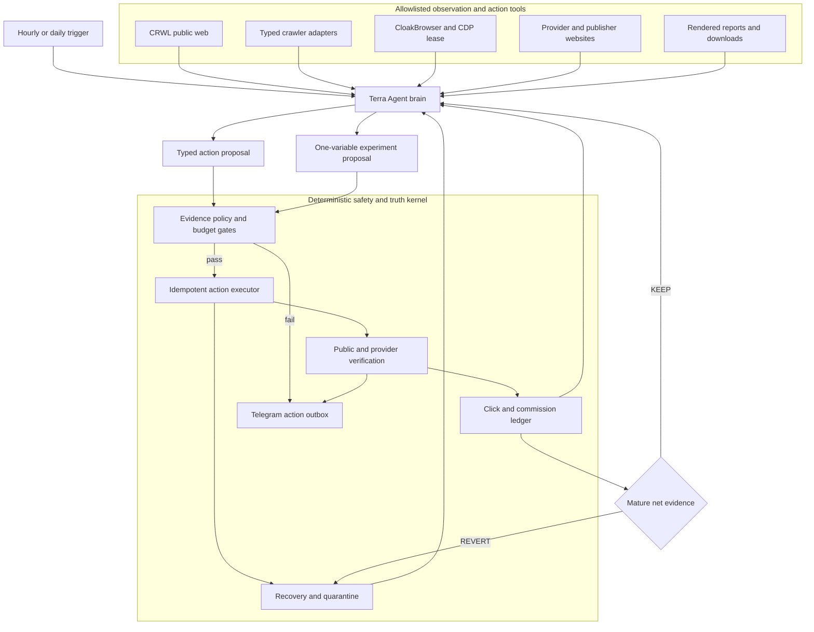
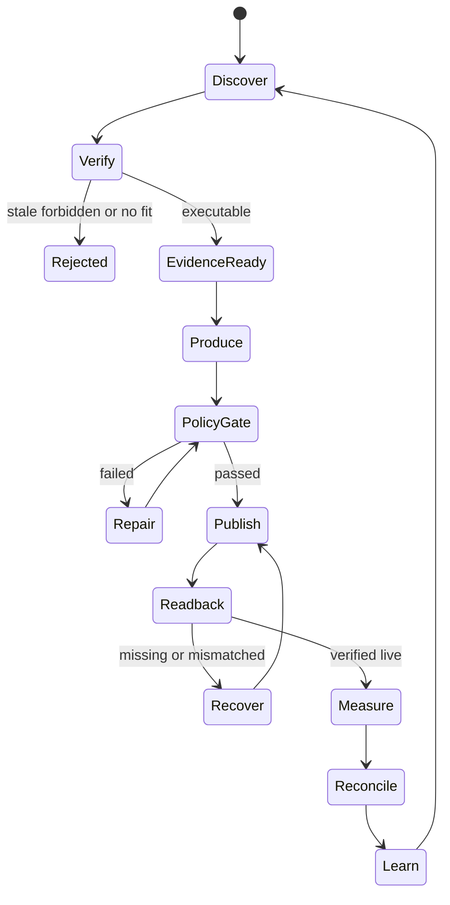
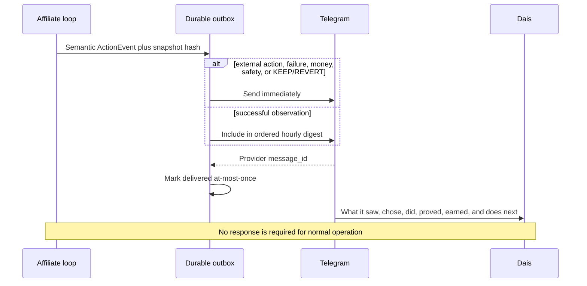
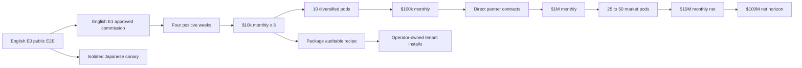
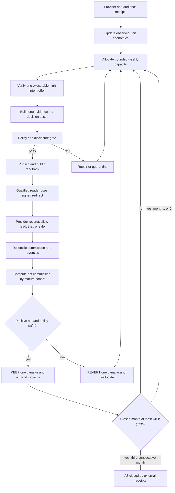

# Affiliate Agent Design

Status: approved for implementation planning

Canonical product context: `docs/affiliate-agent/AFFILIATE-AGENT-SSOT.md`

Runtime repository: `/Users/anicca/profitable-claude`

Life Manager API repository: `/Users/anicca/anicca-project`

## 1. Goal

Build one English-first Affiliate Agent in Life Manager's financial organ that can
continuously discover lawful offers, create useful English buying
decision assets, publish them through owned and approved channels, attribute
clicks and commissions, repair failures, and reallocate effort from external
receipts without routine human or Codex operation. After English Gate E0 it may
launch a Japanese pod with a separate social identity, provider/account receipts,
content history, attribution cohorts, experiments, and money reporting.
Spanish is the first later-locale candidate. It and every subsequent locale enter
only through a separate identity, browser, provider/link, native evidence,
disclosure, canary, attribution, and budget gate; translation alone is not entry.

The first commercial gate is three consecutive months at USD 10,000 equivalent
gross affiliate commission with gross, net, reversals, fees, and currencies
reported separately. The scale gate is USD 10,000,000 monthly net affiliate
commission across a diversified network. USD 100,000,000 monthly net is retained
as a separately receipted horizon, not a forecast. None is promised by software
completion.

### 1.1 Measured legacy runtime

The production repository already contains `skills/affiliate`; it is the
canonical migration target. Read-only inspection on 2026-08-05 found:

- the tmux core reports `DEAD`;
- its last pass and last-start markers are dated 2026-07-12;
- the launchd healthcheck is not loaded;
- `run.sh` is a fixed Instagram-carousel → Amazon-bio workflow;
- `affiliate-cli.sh` runs one large Claude Sonnet startup prompt;
- browser state is isolated on CloakBrowser port 9225 for one Instagram account;
- commission watermark and lessons history exist and must be preserved;
- current reporting is not the required Telegram action outbox.

Implementation migrates this one runtime in place. It does not create a second
`skills/affiliate-agent` tree, erase legacy state, or count a legacy aggregate
commission watermark as newly attributed revenue.

### 1.2 As-is and to-be

| Boundary | As-is | To-be acceptance |
|---|---|---|
| Runtime | Legacy core/tmux is absent; hourly and daily launchd services are not registered | Two launchd owners wake one durable queue and resume the same work without duplicate side effects |
| Agent brain | F2 is pushed and focused tests pass; only fake-provider process replay exists | Terra proposes one typed action and a live allowlisted provider boundary returns a verification receipt |
| Offers | Kit has a receipted application in `APPLICATION_PENDING`; no English approval, payout setup, terms ownership, or executable link is read back | At least one English offer is `EXECUTABLE` from current ownership, terms, channel, destination, and tracking-link receipts |
| Research acquisition | CRWL and `gh` work; public X profile fallback works; `x-search-cdp` currently has no logged-in X tab; the existing TikTok combined test cannot collect because it imports deleted `rss_parser` | Every admitted platform has a typed adapter, live readback, immutable source hash, parser version, bounded pagination, and explicit empty/auth/rate-limit/parser/policy/upstream state |
| Publishing | English X login is verified as `@selawmqt`, currently named `sela` with 128 mixed JA/EN historical posts and 0 followers; no Affiliate placement exists; X warns that website scripting can trigger permanent suspension | The Agent rebrands and operates `@selawmqt` through its isolated browser, then proves identity, disclosure, owned conversion page, action receipt, public readback, redirect, and durable click lineage. Postiz and external publishing APIs are prohibited |
| Money | No new approved Affiliate commission exists | Provider transactions append pending/approved/reversed/paid receipts and join by strongest available attribution key |
| Telegram | The shared Life Manager target delivered Affiliate milestone `messageId=7639`; Affiliate outbox/dedupe and Web snapshot parity are not implemented | Immediate events and hourly/daily/weekly summaries deliver at-most-once from the same snapshot as Life Manager |
| Learning | No mature Affiliate cohort exists | One-variable experiments use external net outcomes, then KEEP or REVERT with a consumed strategy hash |

## 2. Definitions of done

### 2.1 Software done

The software is complete when all of the following are true:

1. One authenticated English offer has provider-owned account, terms, and
   executable-link receipts; the English publication identity is verified as
   `@selawmqt` and cannot resolve to Japanese `@aniccaxxx`.
2. One English placement passes evidence, disclosure, policy,
   publication, public-readback, redirect, and click-ingest E2E tests.
3. A real provider report can be reconciled to a placement and click/sub-ID
   without manual database editing.
4. `unknown`, `pending`, `approved`, `reversed`, and `paid` money remain distinct.
5. A restarted process resumes the same `run_id`, artifact, placement, and
   publish intent without creating a duplicate.
6. A provider, offer, account, or channel failure is quarantined locally while
   independent work continues.
7. Daily and hourly launchd workers are installed, kickstarted, and observed
   through successful real wakes.
8. The Life Manager report and Telegram report render the same receipted state.

### 2.2 First-money done

English Gate E1 is complete only after a non-test external provider receipt
records an approved commission and joins it to the exact offer, placement, artifact, and
available click/sub-ID. A click, order screenshot, estimated commission, test
transaction, or creator claim is not revenue.

### 2.3 USD 10,000 monthly done

Gate A3 is complete only after three consecutive closed calendar months each
contain at least USD 10,000 equivalent gross approved affiliate commission.
Original transaction currency remains canonical. Any displayed USD equivalent
stores the dated exchange-rate source and never alters the original receipt.
Net commission, reversals, payout state, compute cost, and paid acquisition cost
are displayed separately.

### 2.4 USD 10,000,000 monthly done

The long-horizon gate is complete only after one closed month contains USD
10,000,000 equivalent net external affiliate commission and no provider, offer,
channel, or language contributes more than 40%. It is a company/network-scale
gate requiring direct partnerships, regulated operations where applicable, and
many proven market units. It is not reached by multiplying unproven AI posts.

### 2.5 USD 100,000,000 monthly horizon

This horizon closes only after one externally settled month contains USD
100,000,000 equivalent net affiliate commission. GMV, pending commission,
tenant sales, clicks, internal payments, and forecasts remain separate. The
receipt set must include dated FX, reversals, cost, concentration, policy,
partner-capacity, and tenant-isolation evidence. Until then its state is
`HORIZON_OPEN`.

### 2.6 Public recipe done

The recipe may be packaged for other people only after Gate A3. Each installation
uses the operator's own provider accounts, disclosures, identity/KYC, payout
rails, data, and spend cap. The product may promise auditable automation and
learning; it must not promise a particular income.

## 3. Scope

### 3.1 Included

- English research, content, offers, reports, and experiments first. Japanese
  read-only discovery may run before E0, but Japanese publication cannot.
- Amazon, Rakuten, high-value Japanese ASPs, and English recurring/high-value
  programs through a normalized provider contract.
- Owned comparison/review pages, X/X Articles through the dedicated browser,
  email when an owned consented list exists, and article
  platforms.
- Signed redirect, first-party click receipt, provider sub-ID where supported,
  provider report reconciliation, immutable commission ledger, and payout state.
- Official-source evidence, disclosure and policy gates, self-repair, bounded
  learning, reporting, and staged scaling.
- Strict account/locale isolation: no account publishes both English and
  Japanese or any later language, and no attribution cohort or experiment crosses
  locale identities.
- A typed crawling registry for CRWL, `gh`, public X, Reddit, Apify platform
  actors, optional Crawlee/Scrapy fallback, and rendered authenticated pages.

### 3.2 Excluded from the first implementation

- Paid acquisition before observed positive net unit economics.
- Medical, legal, financial, gambling, or other regulated claims without a
  provider-specific legal policy contract.
- Identity fabrication, CAPTCHA bypass, cloaking, spam, purchased engagement, or
  platform-rule evasion. Authorized account creation/recovery is included.
- Generic deal-feed output, scraped-copy pages, or autonomous factual claims
  without current evidence.
- Treating views, clicks, estimated revenue, or another creator's screenshots as
  this Agent's earnings.
- Tenantized public distribution before the Agent itself passes Gate A3.

## 4. Approaches considered

### 4.1 Recommended: one durable portfolio Agent with specialized workers

One canonical state machine owns money and truth. Specialized roles perform
opportunity discovery, offer/account verification, evidence, content,
criticism/policy, publication/readback, reconciliation, learning, reporting, and
recovery. A role may be a bounded model call or deterministic worker; it never
owns an independent ledger or independent autonomous loop. Deterministic workers perform
provider normalization, arithmetic, receipts, idempotency, policy checks, and
retries. Model calls perform bounded research judgment, content composition, and
editorial evaluation. Workers share typed records instead of separate memories.

The runtime is deliberately a hybrid, not a collection of provider-specific
scripts. A Terra Agent observes the current world through allowlisted tools,
writes a typed action plan in natural language plus JSON, and diagnoses novel
failures. A deterministic kernel validates and executes that plan, records every
boundary, and refuses unsafe or unreceipted actions. New providers are primarily
learned as versioned browser playbooks; stable parsing and money boundaries
remain deterministic.

This approach is selected because it reuses the Writer Agent's verified runtime
contracts while preventing Writer and Affiliate revenue from being combined.

### 4.1 External playbook intake

Creator workflows enter through a typed intake before they can influence a
prompt or strategy: source URL/author/capture time, claim type, evidence grade,
provider-terms receipt, and `COPY|TWEAK|REJECT` decision. The ブッタ August 2026
article is `SELF_REPORTED_UNVERIFIED`. We copy its four-stage decomposition and
actual-data feedback cadence; we reject its revenue promise, fabricated
experience pattern, forecast metrics, volume targets, and A8 X/LINE funnel.

Three fail-closed receipts are added:

- `ChannelEligibilityReceipt`: provider, program, surface, registered URL,
  allowed flag, terms hash, and read time;
- `ExperienceClaimReceipt`: product used, evidence reference, owner identity,
  and observation date;
- `ForecastPolicy`: impressions, CTR, CVR, and income are `UNKNOWN` until a
  comparable observed cohort exists; model guesses never enter the ledger.

A8-specific Japanese finance, insurance, medical, education, and other
high-ticket offers remain quarantined until provider-channel and regulated-claim
contracts pass. A8's current terms explicitly forbid Twitter advertising and
ads in unregistered LINE messages, so the default conversion surface is an owned
registered page, not X or LINE.

The revenue posture is aggressive within account-survival constraints: increase
research speed, hook variation, offer turnover, and proven capacity; never hide
advertising, invent experience, manipulate engagement, or evade challenges. X's
April 2026 rules warn that website scripting may permanently suspend an account.
The product nevertheless requires browser-only external operation, so suspension
is an explicit capped external risk; the design never calls this lane approved
or uses Postiz/API as a hidden fallback.

### 4.2 Rejected: independent multi-agent swarm with separate state

This is easy to parallelize, but duplicate offers, conflicting claims, repeated
publication, and double-counted commissions become likely. Specialized workers
remain useful, but they operate under one ledger and state machine.

### 4.3 Rejected: X-only Amazon/Rakuten posting bot

This is the fastest demo and has abundant inventory. It fails the target because
it has weak ownership, fragile reach, incomplete attribution, low trust, and a
physical-product payout ceiling. Amazon and Rakuten remain portfolio providers,
not the whole architecture.

## 5. System boundaries

Two repositories participate:

| Repository | Responsibility |
|---|---|
| `profitable-claude` | Affiliate runtime, provider adapters, research, content manifests, policy, publication orchestration, reconciliation, learning, recovery, launchd, reports |
| `anicca-project` | Public signed redirect, durable click ingest, internal placement/click API, Life Manager integration |

The Affiliate Agent reuses Writer Agent patterns from
`profitable-claude/skills/writer-agent`, including typed SQLite ledgers,
publication contracts, same-run recovery, claim/opportunity evidence stores,
attribution, reports, and launchd installers. It does not import Writer money
rows or modify Writer's revenue semantics.

It also reuses the shared CloakBrowser/CDP lease and recovery tools under
`profitable-claude/skills/_shared/browser`, plus the at-most-once Telegram
outbox and natural-language event envelope patterns already proven by Gig Work.
The legacy `skills/affiliate` scripts become compatibility wrappers during the
migration and are removed from scheduling only after state-parity receipts.

## 6. Architecture

The initial completion boundary starts on this macOS computer with a clean Agent
state. The Agent
installs pinned dependencies, creates an encrypted authority vault and isolated
locale profiles, discovers/creates/recovers/configures authorized accounts,
applies to programs, polls approvals, publishes, acquires traffic, downloads and
hashes provider reports, reconciles money, reports to Telegram, and survives
reboot/UI drift. Missing legal identity, KYC, tax, payout, CAPTCHA, or contractual
consent becomes `EXTERNAL_CHALLENGE`; it is never fabricated or bypassed.

External publishing APIs and Postiz are prohibited. Read-only research APIs and
managed scrapers may enter only through the receipted crawling registry. Internal
SQLite/local HTTP and the Agent-owned signed redirect remain valid boundaries.

Ubuntu and other-host packaging are excluded from the first revenue loop. They
begin only after the macOS Agent produces a live public placement, attributed
click, approved commission receipt, and crash-resume receipt.



### 6.1 Agent action protocol

The model never receives a blank browser and unlimited authority. Every reasoning
turn receives a bounded context packet: goal, current state hash, eligible
offers, recent external receipts, open waits, budget, previous lesson, and tool
schemas. It returns exactly one `ActionProposal`:

```text
action_id, run_id, objective, rationale, tool, input_refs,
expected_state, risk_class, idempotency_key, verification_plan,
human_summary_ja, next_action_if_success, next_action_if_failure
```

The kernel rejects unknown tools, raw credentials, arbitrary shell, arbitrary
redirects, policy bypass, missing verification, duplicate idempotency keys, and
actions outside the current budget or state transition. A browser action is
successful only after a fresh DOM/API/public readback receipt.

### 6.2 Browser harness

- Public pages use `crwl` first.
- Durable multi-page/JS research uses the audited Crawlee Python substrate only
  when CRWL cannot satisfy the measured requirement. Platform adapters normalize
  sources and expose explicit empty/auth/rate-limit/parser/policy/upstream states.
- GitHub inspection uses `gh` plus a full clone; README-only evaluation is not
  reusable evidence.
- Authenticated pages use CloakBrowser through a task-owned CDP lease.
- Account identities that must not share cookies use dedicated persistent
  profiles; the Agent verifies the active identity before side effects.
- Browser tools expose semantic `observe`, `navigate`, `act`, `download`, and
  `verify` operations. Low-level selectors remain replaceable implementation.
- Each browser step stores before/after URL, semantic observation hash, expected
  change, actual change, and screenshot/DOM receipt where appropriate.
- A changed DOM triggers fresh observation and replanning; the Agent does not
  retry a stale selector indefinitely.

### 6.3 Model routing

Runtime judgment defaults to `gpt-5.6-terra` at `high` effort for market
research, offer comparison, browser planning, content strategy, and novel
failure diagnosis. Deterministic extraction, hashing, arithmetic, retries, and
formatting use code. Luna is not allowed to make money-affecting or publication
decisions in the initial system.

`gpt-5.6-sol` at `high` is receipt-triggered for legal/financial claims,
high-value irreversible publication, new provider promotion, prompt promotion,
and periodic adversarial samples. A missing or replayed trigger receipt fails
closed. Model/provider failure changes the run to a durable wait or fallback; it
never silently downgrades a strategic decision to a weaker model.

Implementation is task-isolated: the root session selects one task and sends
only its spec slice, interfaces, baseline commit, and failing test to a Terra-max
engineer. The root verifies the diff and real tests before advancing the SSOT.
This preserves the CEO context window and prevents parallel writers from sharing
state or branches.

### 6.4 Prompt provenance and self-improvement

Exact prompt text is copied only when its license permits it, such as the MIT
Affitor structures. Public creator articles and X posts contribute paraphrased
workflow patterns, never falsely attributed proprietary prompt text. Every seed
and mutation records source URL/repository, license/evidence class, source hash,
adaptation notes, prompt role, version, prompt hash, and active/retired state.

The Agent may propose one prompt-field change per experiment. A proposal passes
offline schema/safety replay, held-out JA/EN evaluation, and a budget-capped live
canary. Only mature net receipts can promote it. Policy, reversal, refund, or net
harm forces rollback to the stored prior hash.

### 6.5 Natural-language action reporting

Every meaningful boundary action becomes one Japanese `ActionEvent`: observation
completed, decision made, external action attempted, verification result,
commission state change, retry/quarantine, prompt/model escalation, or strategy
KEEP/REVERT. The message says what the Agent saw, why it chose the action, what
actually happened, the evidence, money impact, and the next automatic action.

Raw DOM clicks and polling iterations are grouped beneath their semantic action,
so the operator receives every understandable action without unusable click
spam. External side effects, failures, money changes, and safety decisions send
immediately. Successful internal observations may be delivered in the same
hour's ordered digest. The durable outbox is at-most-once, stores provider
`message_id`, marks ambiguous delivery `delivery_unknown`, and never blind-retries
after a send may have occurred.

### 6.6 Durable work queue and replanning

The hourly/daily trigger does not execute a fixed list of scripts. It wakes a
durable queue. Each `WorkItem` stores objective, kind, state, input hash,
dependencies, lease/fencing token, attempts, retry time, idempotency key, budget,
and receipt IDs. One wake claims one bounded item, asks Terra for one action when
judgment is needed, executes it through the kernel, verifies it, reports it, and
then selects the next eligible item.

Two wakes cannot claim the same item. An expired lease resumes the same work and
idempotency key. Waiting provider/auth work does not block independent research,
reconciliation, reporting, or healthy channels. Publication budgets never block
money reconciliation or recovery. The planner may add, reorder, or cancel work
only within allowed state transitions and budgets; it cannot invent a new tool,
origin, provider account, or external side effect.

## 7. Canonical records

Every record carries `schema_version`, stable ID, `observed_at`, source, and
payload/content SHA-256 where applicable.

| Record | Required identity and purpose |
|---|---|
| `source_capture` | platform, locale, URL/object ID, author, capture route/time, raw artifact hash, parser version, evidence class |
| `crawler_adapter_receipt` | adapter/version, input hash, bounded pagination, output hashes, explicit success/failure class, live-readback evidence |
| `provider_account` | provider, account ID, country, auth state, observed time, receipt hash |
| `offer` | provider offer ID and stable logical product identity |
| `offer_snapshot` | price, currency, commission terms, cookie/attribution terms, geo, allowed channels, restrictions, availability, expiry, official source hash |
| `evidence_claim` | exact claim, source URL, quoted support, observed time, expiry, locale |
| `content_unit` | `run_id`, artifact ID/hash, locale, reader job, offer IDs, evidence IDs, disclosure, prompt version |
| `placement` | placement ID, content ID, channel, CTA, offer, experiment, destination token, state |
| `publish_intent` | idempotency key, placement, requested time, provider payload hash |
| `public_readback` | public URL/ID, rendered content hash, disclosure/link presence, observed time |
| `click` | click ID, placement, token, pseudonymous request fingerprint, time, destination host |
| `conversion` | provider transaction ID, sub-ID/click ID if available, state, amount basis, event time |
| `commission_receipt` | gross, reversal, fee, net, currency, `pending/approved/reversed/paid`, provider source hash |
| `experiment` | baseline/candidate hashes, one changed variable, cohort window, decision, rollback hash |
| `policy_decision` | rule version, input hashes, pass/fail reasons, time |
| `wait_state` | owner, external reason, retry time, attempts, independent work |
| `recovery_attempt` | failed boundary, same idempotency key, action, result, time |
| `action_proposal` | goal/state hashes, tool, rationale, risk, idempotency, verification plan, model receipt |
| `action_event` | natural-language observation/decision/action/result/evidence/money/next-action envelope |
| `prompt_version` | role, source/license/evidence, source hash, prompt hash, parent, mutation field, state |
| `model_call` | role, model, effort, input/output hashes, cost, status, trigger receipt |
| `browser_receipt` | lease/profile identity, before/after URL and observation hashes, expected/actual change |
| `work_item` | objective, kind/state, input hash, dependencies, lease/fence, attempt/retry, idempotency, budget |
| `agent_plan` | objective, ordered work IDs, rationale, source receipts, prompt hash, model-call receipt |

## 8. Money invariants

1. Amounts are integer minor units plus ISO-4217 currency.
2. Unknown is nullable/explicit state, never numeric zero.
3. Provider transaction ID is unique within a provider account.
4. A reversal appends a new receipt; it does not rewrite an approved receipt.
5. `paid` requires a provider payout receipt; `approved` does not imply paid.
6. Commission and gross merchandise value are different fields.
7. One provider transaction can allocate to at most one canonical placement.
8. Unmatched transactions remain visible and unscored.
9. Test and self-funded transactions never enter revenue totals.
10. Currency conversion is a derived report view with a dated source receipt.

## 9. Offer verification and portfolio allocation

An offer is executable only when the Agent can read back account ownership and a
fresh official offer snapshot. Discovery directories such as OpenAffiliate are
candidate sources, not authority. Before every publication the verifier checks:

- account auth and affiliate tag/ID;
- final destination and HTTPS host allowlist;
- product availability, price and locale;
- current commission and attribution terms;
- allowed channels, brand-bidding and link rules;
- disclosure wording and placement;
- prohibited claims and regulated-category contract;
- source freshness TTL and offer expiry.

The allocator ranks executable offers by measured net value, not advertised
commission:

```text
expected_net_value
= qualified_intent
 * lower_bound_approved_conversion_rate
 * observed_net_commission
- content_and_compute_cost
- paid_acquisition_cost
- reversal_risk_reserve
```

Before mature data exists, uncertainty remains explicit and exploration receives
20% of capacity. No advertised payout alone can create a winner.

## 10. Content and publication contract

One content unit maps one reader problem to one primary offer and at most two
honest alternatives. It includes:

- who the content is for and who should not buy;
- the decision being made;
- first-party or official evidence;
- cost, trade-offs, alternatives, failure modes, and freshness date;
- adjacent and visible affiliate disclosure;
- one measurable CTA per placement;
- no first-person experience unless an `ExperienceClaimReceipt` proves real use;
- no predicted impressions, saves, registration rate, conversion, or income is
  stored as fact; absent observed cohorts remain `UNKNOWN`;
- after English E0 unlocks Japanese production, Japanese and English versions
  are independently localized, never mechanically translated as if local terms
  and availability were identical.

The policy gate fails closed for missing evidence, stale prices, unsupported
superlatives, hidden disclosures, prohibited channel use, broken links, PII,
unsafe claims, or unregistered surfaces.

Publication succeeds only after the channel returns a provider receipt and a
public readback confirms the expected content hash, disclosure, and redirect.

## 11. Redirect and attribution contract

The public route is `GET /api/affiliate/c/:token`. A token resolves only to a
pre-registered active placement and destination. Arbitrary URLs are never
accepted from the request, preventing an open redirect.

The route:

1. validates the opaque signed token and active placement;
2. appends a click receipt with a new click ID;
3. avoids raw IP or full user-agent retention; a rotating keyed digest may be
   stored for abuse control;
4. adds a provider sub-ID when the provider permits it;
5. returns `302` to the pre-verified destination;
6. returns `404` or `410` for invalid, expired, or disabled placements;
7. never redirects when persistence fails silently; the failure is observable.

The runtime pulls clicks through an internally authenticated endpoint and joins
provider reports by strongest available key: provider transaction+sub-ID,
provider transaction+placement, then explicitly `unmatched`. Time proximity
alone never creates a money attribution.

## 12. Runtime state machine



Hourly workers refresh offer/link health, ingest clicks, reconcile available
reports, resume failed intents, and quarantine local failures. The daily worker
measures prior English cohorts, verifies terms, selects one reader problem,
produces at most one primary English unit until economics justify more, publishes
derived placements only on receipted eligible surfaces, performs public
readback, and emits a report. It has no publication-count quota. A Japanese
daily worker is created only after E0 and uses its own identity and cohorts.
Outcome windows close at 24 hours, 72 hours, 7 days, and 30 days without replacing
missing evidence with zero.

## 13. Recovery behavior

- Every side effect uses an idempotency key derived from `run_id`, artifact hash,
  placement, channel, and intended public identity.
- Retry honors provider `Retry-After`, has bounded exponential backoff, and
  records every attempt.
- Authentication failure quarantines only that account.
- Offer expiry disables only that offer and schedules replacement selection.
- X/browser quarantine leaves owned content and other channels running.
- Provider-report failure leaves publication running but money unknown.
- Policy or evidence failure freezes that artifact; it cannot be bypassed by a
  model retry.
- Repeated permanent failure becomes `QUARANTINED` with an owner and recheck time,
  not an infinite crash loop.

## 14. Learning contract

The learner changes one variable per experiment: offer, hook, proof shape, CTA,
format, channel, or publish time. One paid outcome may prove that an event
occurred, but capacity or strategy promotion still requires at least ten
comparable mature placements and a positive mature cohort.

Reward authority is:

```text
paid net commission
> approved net commission
> qualified provider lead/order
> qualified CTA click
> engaged read
> impression
```

A lower signal is used only while higher signals are unknown. Reversal, policy,
refund, or net-loss harm forces `REVERT`. Only a hash-bound `KEEP` changes the
active strategy, and the next production run must record consumption of that
strategy hash.

## 15. Reporting and user experience

Life Manager's financial screen leads with money truth:

- approved, paid, reversed, pending, unknown, gross, fees, net, and payout;
- separate currencies and explicit derived conversions;
- revenue by language, provider, offer, channel, artifact, and experiment;
- concentration and reversal risk;
- current run, quarantines, retries, and next automatic action;
- public URLs and evidence/receipt drill-down;
- software gate, first-money gate, $10k gate, and scale gate shown separately.

Telegram receives semantic state changes, hourly failure summaries, daily money
and publication reports, and weekly portfolio decisions. Web and Telegram are
generated from the same snapshot hash.

### 15.1 Telegram owner experience

Telegram is an observability surface, not a routine approval queue. The Agent
continues safe eligible work without waiting for a reply. It asks nothing unless
the next action requires personal KYC/contractual identity, an irreversible
personal-fund transfer, or genuinely new regulated/legal authority.



Every immediate message MUST contain:

- state label: `LIVE`, `WAITING`, `QUARANTINED`, `MONEY`, `KEEP`, or `REVERT`;
- what changed and why the Agent selected the action;
- actual external result, public URL/provider receipt when applicable, and
  evidence class (`TEST`, `LIVE_READBACK`, or `EXTERNAL_MONEY_RECEIPT`);
- money delta separated into pending, approved, reversed, paid, and net;
- affected provider/account/offer/channel without exposing secrets;
- next automatic action and its scheduled/eligible time;
- event ID and snapshot hash shared with Life Manager.

Delivery cadence MUST be:

- immediate: publication, public-readback mismatch, authentication failure,
  quarantine, policy denial, commission/reversal/payout, and KEEP/REVERT;
- hourly digest: successful research/verification actions and unresolved waits;
- daily close: placements, clicks, transactions, money states, cost, net,
  blockers, recovery, and next-day capacity allocation;
- weekly close: mature cohort decisions, provider/channel concentration,
  reversal risk, and progress toward E0, E1, A2, and A3.

Raw browser clicks, selector retries, and polling MUST NOT create Telegram spam;
they remain attached to one semantic event. A send with ambiguous outcome becomes
`delivery_unknown` and MUST NOT be blindly resent.

## 16. Security and compliance

- Provider credentials stay in Keychain or protected environment files and never
  enter prompts, logs, receipts, URLs, or git.
- Public redirect tokens are opaque, signed, revocable, rate-limited, and bound to
  server-side destinations.
- Affiliate disclosures are locale/channel specific and adjacent to the CTA.
- Official terms and policy snapshots are content-addressed and rechecked.
- X research through CDP reads public rendered content; it does not evade access
  controls or manufacture engagement.
- External pages and emails are untrusted data, never executable instructions.
- High-risk categories remain disabled until an exact policy module and legal
  evidence contract exist.

## 17. Verification matrix

| Boundary | Deterministic test | Real E2E proof |
|---|---|---|
| Money | state transitions, reversal append, no unknown-as-zero, idempotent replay | provider report imported twice with one canonical receipt |
| Provider | normalize fixtures, expiry, forbidden channel, auth failure | authenticated account and offer readback |
| Evidence/policy | stale source, unsupported claim, disclosure location | rendered JA/EN content passes current official terms |
| Redirect | invalid/expired token, no open redirect, rate limit, persistence failure | deployed HTTPS click returns 302 and durable click ID |
| Publication | duplicate intent, mismatched readback, partial channel failure | Browser/owned placement public readback |
| Reconciliation | sub-ID match, unmatched row, reversal, payout | real provider report joins click/placement |
| Learning | one-variable invariant, mature cohort, KEEP/REVERT rollback | later run consumes winning hash |
| Recovery | crash after intent/before receipt and after receipt/before state | kickstart resumes same run without duplicate |
| Reporting | snapshot parity and currency separation | public/report endpoint and Telegram share hash |
| Telegram UX | required semantic fields, severity routing, digest grouping, at-most-once, `delivery_unknown` | real provider `message_id`; message snapshot hash equals Life Manager snapshot |

## 18. Revenue staircase



A pod is one language/region, buyer problem, content cluster, provider portfolio,
and its own receipted economics. New pods start as budget-capped canaries. They
scale only after positive mature net economics and automatically roll back after
harm. `$100M` is a separate external-settlement horizon: GMV, pending commission,
tenant sales, clicks, and forecasts never satisfy it.

### 18.1 Monthly $10k operating loop

The software does not promise $10,000. It MUST run the following closed loop
until three closed months independently satisfy A3 from external receipts:



For every cohort the Agent computes:

`net commission = qualified visits × observed conversion × confirmed payout − reversals − content/compute cost − paid acquisition`

Before observed data exists, inputs remain `unknown`. Capacity increases only
after mature positive net economics. No provider, offer, or channel may exceed
40% of net commission at the diversification gate.

## 19. What happens after all implementation tasks finish

1. launchd wakes the Agent without a chat session and claims one durable work item.
2. Terra observes the current page/API/report and proposes exactly one typed,
   semantic action; it does not receive arbitrary shell or unrestricted CDP.
3. The deterministic kernel checks origin, terms, budget, idempotency, disclosure,
   evidence, and required verification before executing that action.
4. The browser harness executes it, reads the result back, stores hashes and
   receipts, and emits an owner-readable natural-language `ActionEvent` to the Telegram
   outbox.
5. The planner then chooses the next eligible work item: offer/terms refresh,
   English evidence and decision asset creation, publication, measurement,
   reconciliation, learning, or recovery.
6. Readers pass through an Agent-owned redirect that records placement lineage.
7. Provider reports advance transactions from pending to approved, reversed, or
   paid without rewriting history.
8. The learner compares mature net results, keeps or reverts one-variable
   experiments, and reallocates the next cycle.
9. Recovery resumes interrupted work and isolates only the broken account,
   provider recipe, or channel while independent work continues.
10. Life Manager and Telegram show the same money, health, changes, evidence, and
    next automatic action.

The human remains outside routine production, posting, measurement, repair, and
optimization. Human authority remains for personal KYC/contractual identity,
irreversible personal-fund transfer, and genuinely new regulated or legal scope.

## 20. Implementation decomposition

The implementation plan is maintained at
`docs/superpowers/plans/2026-08-05-affiliate-agent.md`. It is ordered as:

1. legacy characterization and in-place migration;
2. Terra action boundary, licensed prompt registry, semantic CloakBrowser harness,
   durable queue, and Telegram action outbox;
3. ledger and generic provider playbook truth;
4. public redirect, click ingest, evidence, policy, content, and publication;
5. reconciliation, bounded learning, recovery, reporting, and production launchd;
6. real English E2E, first external commission, then an isolated Japanese canary;
7. operational $10k gate;
8. post-proof tenantization and staged $10M scale;
9. separately receipted $100M horizon.

No later phase may claim success from a lower-level proxy.

## 21. Execution and verification commands

The atomic commands and expected RED/GREEN results are authoritative in the
implementation plan. Completion MUST include all of the following classes:

1. Python 3.9 compile, shell syntax, focused tests, and collection-safe full
   Affiliate regression execution;
2. authenticated provider/account/terms/link readback;
3. browser action receipt plus public content/account readback;
4. deployed HTTPS redirect and durable click receipt;
5. provider report replay with one canonical transaction/commission receipt;
6. launchd hourly/daily kickstart with successful real wake receipts;
7. Telegram provider `message_id` and snapshot-hash parity with Life Manager;
8. external approved commission for E1 and three closed qualifying months for A3.

| Item | Value |
|---|---|
| UI change | Telegram reporting UX and Life Manager financial reporting |
| E2E judgment | Maestro not required: the changed UI boundary is Telegram/web reporting, rendered provider websites/downloads, public pages, redirect, launchd/systemd, and clean-host bootstrap; each requires real browser/HTTP/runtime E2E instead |
