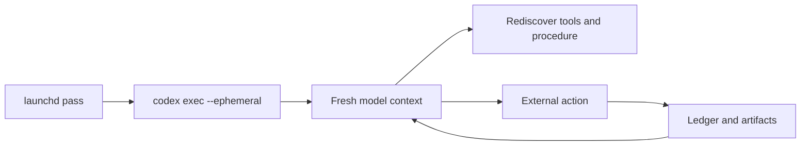
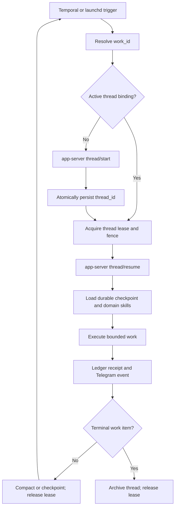

# Life Manager Persistent Agent Runtime — Fleet SSOT

**Status:** Accepted; implementation TODO is sequential and atomic.

**Supersedes:** The blanket fresh/ephemeral-agent rule in
`2026-07-19-anicca-one-repo-consolidation-spec.md` for judgment-bearing work that
continues across runs. Deterministic probes, extraction, validation, and isolated
repair evaluation remain ephemeral.

**Primary off-the-shelf runtime:** `codex app-server`. Do not build a custom
conversation server. Temporal owns durable workflow timing and retries; domain
Ledgers own business truth; Browser Harness owns learned browser procedures;
Keychain owns credentials; Symphony owns isolated repair orchestration.

## 1. Overview — What and Why

Life Manager currently launches several judgment-bearing loops through
`codex exec --ephemeral`. Job Hunter, Gig Work, and Writer therefore preserve
business artifacts but discard the model thread that explains the current goal,
prior tool results, successful procedures, and unfinished reasoning. Each pass can
re-read durable state, but repeatedly rediscovers commands and may contradict the
previous pass.

The fleet MUST persist one agent thread per continuing work item and resume that
thread after schedule boundaries, crashes, missing-information waits, and repair.
This is working memory, not business truth. Side-effect authority remains in the
existing Ledger, intent, idempotency key, browser fence, and provider receipt.

The runtime MUST reuse existing products instead of recreating them:

| Concern | Owner |
|---|---|
| Agent thread lifecycle, compaction, streamed events, MCP startup | Codex app-server |
| Durable timers, retries, signals, and workflow resumption | Temporal |
| Application/order/article/connector truth and idempotency | Domain Ledger |
| Browser connection and learned site procedures | Browser Harness domain skills |
| Passwords, tokens, and account credentials | macOS Keychain; tenant vault in cloud |
| Isolated diagnosis, patch, and canary repair | OpenAI Symphony + Terra |
| Phone-visible progress and results | Telegram outbox |

Official references:

- Codex app-server: https://github.com/openai/codex/blob/main/codex-rs/app-server/README.md
- Codex SDK thread persistence: https://github.com/openai/codex/tree/main/sdk/typescript
- Browser Harness: https://github.com/browser-use/browser-harness
- Temporal: https://docs.temporal.io/
- OpenAI Agents SDK sessions for the multi-tenant web runtime:
  https://openai.github.io/openai-agents-python/sessions/
- OpenAI Symphony repair plane: https://github.com/openai/symphony
- Hermes comparison pilot: https://github.com/NousResearch/hermes-agent

## 2. Acceptance Criteria

1. Every continuing work item has exactly one active `thread_id` for its current
   generation, stored beside its domain ID and never inferred from model prose.
2. A scheduled pass resumes the stored thread through `thread/resume`; it does not
   call `codex exec --ephemeral` for continuing judgment-bearing work.
3. A genuinely new work item starts one thread and atomically records the returned
   ID before the first external side effect.
4. Job application, gig order, article/publication, adaptive connector incident,
   interview, and repair case use distinct work-scoped threads.
5. Concurrent owners cannot resume the same active thread. A lease and monotonic
   fence identify the sole holder.
6. Thread loss or app-server restart does not lose business truth. The runtime can
   create a successor thread from a sanitized durable checkpoint and records the
   predecessor/successor relation.
7. Context pressure invokes app-server compaction and stores a checkpoint receipt;
   it does not discard the work item or silently start an unrelated thread.
8. Successful non-obvious browser procedures become content-addressed Browser
   Harness domain skills and are loaded before the next matching browser action.
9. Secrets never enter thread history, prompts, shell arguments, Telegram, traces,
   or committed files. Threads contain credential references only.
10. Every start, resume, compact, fork, archive, failure, and successor event joins
    `work_id`, `thread_id`, workflow/run ID, actor PID, release SHA, and fence.
11. Telegram reports meaningful start, wait, resume, repair, and terminal events and
    deduplicates identical state.
12. An executable fleet proof demonstrates Job Hunter and Gig Work each resuming the
    same thread after process exit without repeating a known question or procedure.

## 3. As-Is / To-Be

### As-Is

### To-Be

### Work identity contract

| Work type | Stable work ID | Thread terminal condition |
|---|---|---|
| Job application | `application_id` | confirmed submission, durable no-retry ambiguity, withdrawal, rejection, or role closure |
| Gig work | `order_id` or buyer conversation ID | paid/closed/cancelled dispute-terminal order |
| Writer | `article_id` plus publication ID | published/accepted/rejected/withdrawn terminal artifact |
| Adaptive connector | `connector_incident_id` | verified recovery or terminal credential revocation |
| Interview | `interview_id` | completed plus debrief, cancelled, or hiring process terminal |
| Repair | `repair_case_id` | promoted, rejected, rolled back, or duplicate case |

### Thread binding

Each binding MUST contain:

- `work_type`, `work_id`, `generation`
- `thread_id`, `status`, `predecessor_thread_id`
- `created_at`, `last_resumed_at`, `compacted_at`, `archived_at`
- `holder_id`, `lease_id`, `fence`, `lease_expires_at`
- `checkpoint_uri`, `checkpoint_sha256`
- `runtime_release_sha`, `last_run_id`, `last_workflow_id`

The unique active key is `(work_type, work_id, generation, status=active)`.

## 4. Test Matrix

| # | To-Be | Test / proof | Cover |
|---|---|---|---|
| 1 | Start and persist one thread | `test_thread_start_binding_atomic` | OK |
| 2 | Resume after process exit | `test_thread_resume_after_runner_exit` | OK |
| 3 | Sole-owner lease and fence | `test_thread_concurrent_resume_fenced` | OK |
| 4 | Business truth independent of thread | `test_missing_thread_preserves_domain_ledger` | OK |
| 5 | Successor from checkpoint | `test_thread_successor_records_lineage` | OK |
| 6 | Compaction receipt | `test_thread_compaction_checkpoint` | OK |
| 7 | Domain skill loaded before browser | `test_domain_skill_precedes_browser_action` | OK |
| 8 | Secret-reference-only boundary | `test_thread_artifacts_contain_no_secret_values` | OK |
| 9 | Joined observability | `test_thread_event_join_keys_complete` | OK |
| 10 | Telegram event dedupe | `test_thread_telegram_event_dedupe` | OK |
| 11 | Job Hunter live resume | real no-duplicate application resume receipt | OK |
| 12 | Gig Work live resume | real no-repeat order/conversation resume receipt | OK |

| Item | Value |
|---|---|
| UI変更 | なし。Telegram event wordingのみ変化 |
| 結論 | Maestro: 不要（macOS resident runtime、Ledger、browser、TelegramのE2Eで判定） |

## 5. Boundaries

- Thread history MUST NOT replace a domain Ledger or authorize side effects.
- This spec MUST NOT migrate the fleet to LangGraph, Mastra, OpenClaw, or Hermes.
- Hermes is an isolated comparison after the app-server baseline works; it cannot
  own production scheduling, Ledger truth, or Submit/payment/publish authority.
- Connector polling and deterministic transforms remain stateless when no continuing
  judgment exists.
- Raw browser cookies and passwords are not agent memory.
- Vector retrieval is not a substitute for a resumable work thread.
- One global user thread is forbidden; memory is scoped by work item and tenant.

## 6. Atomic Execution Steps — Todo SSOT

Only the first unchecked item is active.

1. [x] **PERSIST-01 — App-server spike.** Start one local app-server, initialize,
   start a thread, record its ID, stop the client, resume it, run a second turn, and
   capture structured events. No external side effect.
   - Receipt: installed `codex-cli 0.147.0` used the existing ChatGPT subscription
     Codex home `/Users/anicca/.codex`. Client process one started thread
     `019fda9e-5a3c-7083-9415-8d318c7cccfb`, completed a read-only Luna turn with
     exact output `PERSIST_ONE`, and exited. A separately started app-server process
     resumed that exact thread ID and completed a second turn that recovered the exact
     prior token `PERSIST_ONE`. Both `turn/completed` statuses were `completed` and
     structured thread, turn, item, token-usage, MCP-startup, hook, and status events
     were observed. The first protocol attempt was rejected before thread creation
     because the valid sandbox enum is `read-only`, not `readOnly`; the corrected
     request passed. No Job Hunter run, browser action, or external send occurred.
2. [x] **PERSIST-02 — Minimal work-thread registry.** Persist only the stable
   `work_type + work_id -> thread_id` binding, generation/lineage, status, and joined
   run/release identifiers. Delegate rollout history, resume, item paging, and archive
   to Codex app-server. Do not create a second conversation store or reimplement
   app-server session semantics. Keep the existing domain/browser/Submit fences as
   the authority for external side effects.
   - Receipt: `job_search_loop.thread_registry.ThreadRegistry` stores no conversation
     content. Its private SQLite binding is atomic under `BEGIN IMMEDIATE`, permits
     one idempotent active thread per work item, rejects a conflicting active thread,
     and records archived predecessor lineage for the next generation. Focused test
     `PYTHONPATH=. python3 -m unittest tests.test_thread_registry -v` passed 2/2.
3. [x] **PERSIST-03 — Thin runtime adapter.** Expose start, resume, compact, fork,
   read, archive, and event streaming without recreating app-server behavior.
   - Receipt: `job_search_loop.codex_app_server` implements only the official
     line-delimited app-server protocol over direct `codex app-server --stdio`.
     Focused tests passed 4/4. A subscription-authenticated Luna read-only E2E
     initialized the server, started thread
     `019fdaad-4870-76b2-94fc-8ee2a90ff09c`, completed turn
     `019fdaad-49cd-70b0-b94f-bccde07c7378`, streamed 54 structured events with
     terminal status `completed`, and read back the identical thread ID. The installed
     daemon was not restarted. Its `proxy` path accepted bytes but returned no
     initialize response in this environment, so the unproved proxy path is not part
     of the adapter. No browser, application, email, or external send occurred.
4. [x] **PERSIST-04 — Secret boundary.** Connect credential references to macOS
   Keychain and prove no secret appears in prompts, argv, artifacts, or traces.
   - Receipt: the adapter passes only non-secret core OS variables to the app-server
     process and sets Codex's official shell environment policy to `inherit=core`,
     enable default `*KEY*/*SECRET*/*TOKEN*` exclusion, and additionally exclude
     `*PASSWORD*/*COOKIE*`. Codex continues to read subscription authentication from
     its existing private `HOME/.codex/auth.json`; no credential is added to a thread
     request. Focused tests passed 4/4. A real Luna read-only probe started thread
     `019fdab1-daeb-76e0-b499-07006412adb4` with a fake parent-process token sentinel,
     completed 58 events, reported the sentinel environment variable `ABSENT`, and
     contained no sentinel value in the event stream. No real secret value was read,
     printed, moved, or rewritten.
5. [ ] **PERSIST-05 — Job Hunter canary**, closed in this fixed internal order:
   0. [x] give the resident thread Job Hunter capability parity with the primary Codex
      session: load the same applicable skill roots and expose browser, official ATS
      CLI, Ledger, profile, Gmail, Telegram, Calendar, shell, filesystem, and network
      capabilities with no interactive approval stop. Tool availability, permission,
      and credential exposure are separate controls: tools resolve credentials from
      existing private stores internally; raw tokens, passwords, and cookies never
      enter thread input, argv, event history, or general shell inheritance;
      - Receipt: official generated schema fixed Full Access to
        `sandbox=danger-full-access` with `approvalPolicy=never`; the adapter exposes
        it only through the explicit `job-hunter` profile while keeping probes
        read-only and retaining the core-only secret-filtered environment. Focused
        tests passed 5/5. A no-submit Luna canary thread
        `019fdab6-5058-74e2-a3b0-88548d2078fc` completed 76 events and returned
        `CAPABILITY_PARITY_OK` after verifying the shared Context7 skill, official
        Ashby CLI source, `crwl`, outbound HTTPS to the public Ashby board, and `/tmp`
        access. It did not open a form, fill a field, or click Submit.
   1. [x] canonicalize candidate URLs and Ledger aliases; exclude every terminal,
      `submitted`, `rejected`, and `submit_unknown` application;
      - Receipt: `filter_terminal_candidates` canonicalizes tracking-parameter URL
        variants and bridges only immutable `evidence://` company/title aliases, so a
        genuinely new requisition with the same title remains eligible. The browser
        worker writes and consumes one private filtered artifact for both route
        materialization and pre-submit. Focused candidate-route tests passed 3/3 and
        browser-worker tests passed 9/9. Against the latest available resident
        prefilter artifact, the production Ledger excluded 8 of 12 candidates
        (`submitted` 2, `rejected` 6) and retained 4. Resident remained idle at 92
        runs; no release activation, browser action, or Submit occurred.
   2. [x] inspect one genuinely new official Ashby form and generate its answers artifact
      deterministically from private profile facts, leaving only truly optional fields
      blank and asking Telegram only for an unknown required personal fact;
      - Receipt: the official OpenAI Ashby posting `Solutions Engineer, Pre-Sales -
        Tokyo` was absent from terminal Ledger matches and live inspection returned 12
        fields. The deterministic `ashby_apply answers` CLI mapped every non-upload
        required question by semantics rather than field ID, omitted optional
        Additional Information, and wrote a mode-0600 artifact with status `ready`,
        10 grounded answers, zero missing required facts, and SHA-256
        `18e5f4a4a753b962d9cb3b0401fbcff65ecf1b1457592598267d762257b17d09`.
        The 15 focused Ashby tests passed. No fill or Submit occurred.
   3. [x] before browser fill, materialize the application, canonical route, grounded
      posting/resume/answers artifacts, and exact hashes. Do not claim a submit intent
      yet: the existing Ledger correctly requires a verified no-submit fill receipt
      containing the live browser owner lease and fence. The canary acquires that
      browser fence, fills and verifies without Submit, then claims the submit intent
      from those exact hashes before any live click;
      - Receipt: `prefill_prepare` composes existing Ledger APIs without weakening
        their fences. For application
        `d129c4711ff8733a066137766df6f32cfa312cc544e37a9a8b603bea3e66c1c3`,
        the production Ledger independently reports `materials_ready`, one eligible
        canonical ATS route, three private artifacts (`posting`, `resume_draft`,
        `answers_draft`) with matching SHA-256 values, and zero submission attempts.
        The private receipt is mode 0600. Focused test passed 1/1. No form fill,
        submit intent, or Submit occurred.
   4. [x] replace only the Job Hunter application lane's `codex exec --ephemeral` with
      app-server resume while preserving Ledger, browser fence, exact Submit authority,
      Gmail, Telegram, and immutable release contracts;
      - Receipt: `run-daily.sh` now invokes the thin
        `persistent_application_runner`, which joins the existing app-server client
        and private SQLite thread registry and preserves the existing summary/result
        contract. Focused tests passed 40/40. Two real subscription-authenticated Luna
        turns ran in separate client processes for application
        `d129c4711ff8733a066137766df6f32cfa312cc544e37a9a8b603bea3e66c1c3`.
        Both used thread `019fdad8-6597-7f12-946e-f5ba73372fbe`, generation 1; the
        second binding updated `last_run_id` to `persist-05d-probe-two`. The private
        registry and both result artifacts are mode 0600. Result SHA-256 values are
        `1e9a94ed4a81646dc26e3ad98b8e237bb0ca156e503f51c06283d4d3e5a7af1b`
        and `4e1dccd49083c11b2b737165cbae88733cd35f0cd7b09f009cc1b84bb8ad8051`.
        Neither turn used a tool, opened a form, filled a field, or clicked Submit; and
   5. run the installed canary with Submit disabled. It MUST reach
      `pre_submit_ready`, verify every required field, show zero unresolved blockers,
      record zero Submit clicks, and emit joined application/material/intent/fence/
      thread receipts. No resident kickstart is permitted before this proof.
6. [ ] **PERSIST-06 — Job Hunter restart proof.** Exit between two non-side-effect
   form steps, resume the same thread/application, and prove no repeated question,
   command rediscovery, page-owner collision, or duplicate Submit.
7. [ ] **PERSIST-07 — Compaction and successor.** Prove compact/resume, then simulate
   missing thread storage and create one checkpoint-derived successor with lineage.
8. [ ] **PERSIST-08 — Gig Work canary.** Bind one real continuing order/conversation
   to a persistent thread and prove process-exit resume without repeated buyer work.
9. [ ] **PERSIST-09 — Writer canary.** Bind one article/publication and preserve
   research, editorial decisions, platform state, and terminal receipt across runs.
10. [ ] **PERSIST-10 — Adaptive Connector canary.** Persist only incident diagnosis;
    keep ordinary polling and synchronization deterministic and stateless.
11. [ ] **PERSIST-11 — Temporal ownership.** Move persistent work triggers and waits
    to restart-safe workflows while app-server remains the reasoning runtime.
12. [ ] **PERSIST-12 — Repair integration.** Bind each Symphony repair case to its
    own thread; Terra diagnoses and patches, deterministic gates verify, then the
    original work thread resumes.
13. [ ] **PERSIST-13 — Fleet migration.** Remove `codex exec --ephemeral` from every
    continuing judgment-bearing production lane; retain it only on an explicit
    allowlist of isolated probes and evaluations.
14. [ ] **PERSIST-14 — Hermes comparison.** Replay the same sanitized fixtures on
    Hermes and app-server; adopt only measured improvements in skill learning,
    memory retrieval, cost, or recovery. No production cutover without parity.
15. [ ] **PERSIST-15 — Freeze.** Publish the runtime contract, supported work types,
    observability query, rollback path, and executable fleet receipts.

### Execution and verification commands

Implementation tasks MUST use the repository's focused test for the touched adapter,
then the common runtime suite, then one isolated no-side-effect E2E before a live
canary. Exact commands are recorded by each task because the app-server adapter does
not exist before `PERSIST-03`.

Release order is Job Hunter → Gig Work → Writer → adaptive Connector. Each canary
MUST be independently reversible and MUST NOT change the domain side-effect fence.

### No broken-run gate

Do not activate or kickstart another Job Hunter resident release until
`PERSIST-01` through `PERSIST-05` pass. Re-running the known disposable resident to
reconfirm missing answers, missing intent/material/fence, or Workday account handling
is forbidden. The next live resident run occurs only after the subscription-authenticated
app-server thread resumes successfully and the installed no-submit Ashby canary is
`pre_submit_ready`.
