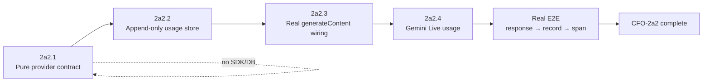
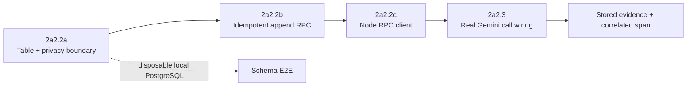
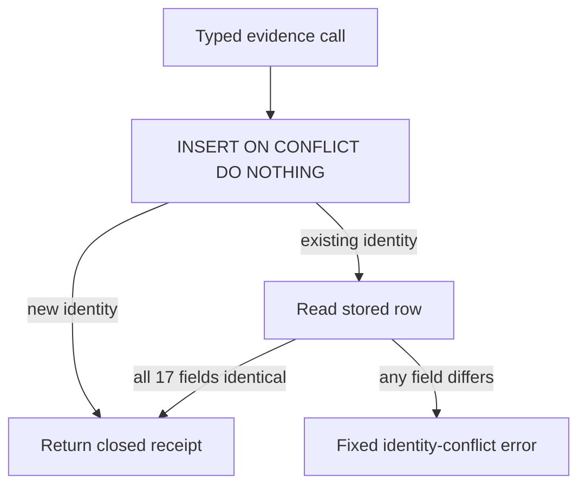
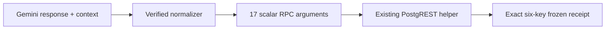
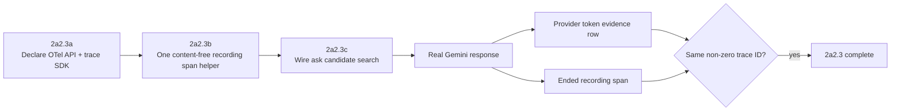
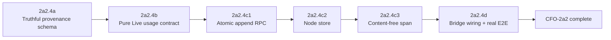
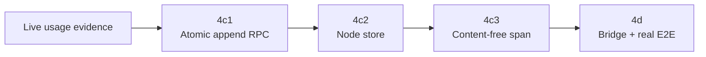

# Life Manager CFO-2a2 — Provider-Reported Usage and OpenTelemetry Contract

| Field | Value |
|---|---|
| Status | ACTIVE — CFO-2a2.1 through CFO-2a2.4d1 verified; CFO-2a2.4d2 real Live E2E is next |
| Parent | `docs/superpowers/specs/2026-08-06-life-manager-cfo-design.md` |
| Runtime | Existing `apps/life-call` package |
| First provider | Gemini `generateContent` response |
| Role split | Sol plans and verifies; Luna writes production code/tests and runs implementation commands |

## 1. Goal

Turn Gemini's own `GenerateContentResponse.usageMetadata` into one deterministic, content-free usage evidence
record and the matching OpenTelemetry GenAI attributes. OpenTelemetry transports and correlates the facts; Gemini's
response is the source of the token numbers.

This child spec does not call a local tokenizer, infer tokens from duration, price tokens, or relabel existing
`lm_api_cost` estimates as measured.

## 2. Ponytail decision

Three approaches were evaluated:

1. **Chosen — contract first in the existing ledger module.** Add one pure
   `normalizeGeminiUsageEvidence(response, context)` function and two focused tests to the existing
   `ledger.js` / `ledger.test.js`. No dependency, SDK, collector, migration, or call-site changes.
2. Add the full OpenTelemetry SDK, OTLP exporter, database table, and all Gemini wiring now. Rejected because four
   independently failing boundaries would be introduced before the meaning of one token field is proven.
3. Store local tokenizer or duration estimates as measured usage. Rejected because transport does not improve
   evidence quality and this would make the CFO lie.

CFO-2a2.1 changes exactly two existing files. Soft target: at most 45 production additions and 55 test additions,
100 total. Exceeding the target, adding a third file, or adding a dependency means the slice must be reduced.

## 3. Full CFO-2a2 sequence



CFO-2a2.1 through CFO-2a2.3 are complete. CFO-2a2.4 is the only active slice. Later slices cannot be pulled into it.

## 4. CFO-2a2.1 input

`normalizeGeminiUsageEvidence(response, context)` consumes:

- `response.responseId`: non-empty provider response identity.
- `response.modelVersion`: non-empty provider-reported model.
- `response.usageMetadata.promptTokenCount`: non-negative safe integer.
- `response.usageMetadata.candidatesTokenCount`: non-negative safe integer.
- `response.usageMetadata.totalTokenCount`: non-negative safe integer.
- Optional non-negative safe integers: `cachedContentTokenCount`, `thoughtsTokenCount`,
  `toolUsePromptTokenCount`.
- Context: non-empty `owner_id`, exact `financial_unit_id: "life_manager_saas"`, RFC3339 `occurred_at`, exact requested model,
  and a non-zero 32-lowercase-hex `trace_id`.

Unknown response/context keys and all prompt, candidate, tool argument, or output content are ignored.

## 5. Closed output

```json
{
  "schema_version": 1,
  "provider": "gcp.gemini",
  "provider_request_id": "provider-response-id",
  "usage_sequence": 0,
  "occurred_at": "2026-08-10T01:02:03.000Z",
  "owner_id": "u1",
  "financial_unit_id": "life_manager_saas",
  "trace_id": "11111111111111111111111111111111",
  "request_model": "gemini-2.5-flash",
  "response_model": "gemini-2.5-flash-001",
  "tokens": {
    "input": 100,
    "output": 40,
    "cached_input": 20,
    "reasoning_output": 5,
    "tool_input": 3,
    "total": 148
  },
  "evidence_status": "provider_reported",
  "otel_attributes": {
    "gen_ai.operation.name": "generate_content",
    "gen_ai.provider.name": "gcp.gemini",
    "gen_ai.request.model": "gemini-2.5-flash",
    "gen_ai.response.id": "provider-response-id",
    "gen_ai.response.model": "gemini-2.5-flash-001",
    "gen_ai.usage.input_tokens": 100,
    "gen_ai.usage.output_tokens": 45,
    "gen_ai.usage.cache_read.input_tokens": 20,
    "gen_ai.usage.reasoning.output_tokens": 5,
    "server.address": "generativelanguage.googleapis.com",
    "server.port": 443
  }
}
```

`tokens.output` preserves Gemini's `candidatesTokenCount`. OpenTelemetry `output_tokens` includes the separately
reported reasoning count because the pinned GenAI convention says reasoning output is included in output tokens.
The provider's `totalTokenCount` is preserved independently and is not replaced by a locally recomputed total.
Missing optional provider fields become `null` in `tokens` and are omitted from `otel_attributes`; an explicit
provider zero remains zero. Because `server.address` is emitted, the pinned OpenTelemetry convention also requires
`server.port: 443` for the HTTPS endpoint.

## 6. Evidence and privacy rules

- `provider_reported` describes token-count provenance and is allowed only when the exact provider response contains
  usage metadata. GenerateContent rows carry provider response ID/model. Gemini Live rows carry neither; their
  separate local correlation ID must never be emitted as `gen_ai.response.id` or stored in a provider field.
- Duration-derived `gemini_live` rows remain `locally_estimated`; CFO-2a2 never backfills them as measured.
- The adapter is pure, deterministic, does not mutate inputs, and performs no I/O.
- Invalid or unsafe values throw only `cfo_provider_usage_invalid:<reason>`. Errors contain no IDs, token values,
  prompt text, candidate text, metadata, or secrets.
- No content-bearing OpenTelemetry attributes are emitted: no `gen_ai.input.messages`,
  `gen_ai.output.messages`, `gen_ai.system_instructions`, or tool arguments/results.

## 7. Acceptance criteria for CFO-2a2.1

- [x] One literal Gemini response maps to the exact closed record and exact OpenTelemetry attributes.
- [x] The record preserves provider input, candidate output, cached, reasoning, tool, and total counts without
      converting an absent count to zero.
- [x] The OpenTelemetry output count includes reported reasoning and fails on unsafe integer addition.
- [x] Provider response ID, requested model, response model, owner, fixed Life Manager financial unit, timestamp, and trace ID are
      validated; failures are fixed and redacted.
- [x] Unknown keys and content-shaped fields never enter the result or errors.
- [x] Inputs remain unchanged; repeated calls return deep-equal results.
- [x] Focused ledger tests and the CFO suite pass.

## 8. Deferred completion gates

CFO-2a2 remains unchecked in the parent until later child slices prove:

1. append-only deduplicated storage keyed by provider identity
   `(provider, provider_request_id, usage_sequence)`, or for providers that emit no response ID, by the separate
   local correlation identity `(provider, local_correlation_id, usage_sequence)`;
2. a real Gemini `generateContent` response writes one evidence record and correlates one actual span;
3. Gemini Live terminal `usageMetadata` is captured without relabeling historic duration estimates;
4. real readback shows no prompt/output content and exact provider token counts.

Write-attempt coverage and durable failure accounting remain CFO-2a2b. Billing/pricing remains CFO-2a3.

## 9. Pinned primary evidence

- [Google Gemini GenerateContentResponse](https://ai.google.dev/api/generate-content?hl=ja#UsageMetadata) —
  `usageMetadata` is output-only token-usage metadata; `responseId` identifies each response; prompt, candidates,
  cached, tool, thoughts, and total token fields are separately defined.
- [OpenTelemetry GenAI spans at commit 46d43c8](https://github.com/open-telemetry/semantic-conventions-genai/blob/46d43c8949afb53765a202e89f4534eeb75ca3fa/docs/gen-ai/gen-ai-spans.md) —
  operation/provider are required; response ID/model and provider usage attributes are recommended; content
  attributes are opt-in and sensitive.
- [OpenTelemetry Google GenAI reference scenario at commit 46d43c8](https://github.com/open-telemetry/semantic-conventions-genai/blob/46d43c8949afb53765a202e89f4534eeb75ca3fa/reference/scenarios/google-genai/scenario.py) —
  provider usage metadata maps to `gen_ai.usage.input_tokens` and `gen_ai.usage.output_tokens`.

## 10. CFO-2a2.1 completion evidence

- Luna implementation commits: `97a04baef1dd4bbc647d64835e41ca8c8deda4c6` and review fix
  `105922f65ba372ee967ef8748019d14e4681dbbe`.
- Initial RED: existing 10 tests passed and the two new tests failed only because the export did not exist.
- Review-fix RED: 11/12 passed; the sole failure was the missing conditionally required `server.port: 443`.
- Fresh Sol verification on the final head: focused 12/12, CFO 254/254, full suite 892/892, zero failures; syntax and
  diff checks passed.
- Ponytail gate: exactly two existing files; 43 production additions and 50 test additions, 93 total.
- Fresh final re-review: Critical 0, Important 0, ship.
- No I/O, dependency, OpenTelemetry SDK, collector, exporter, database, pricing, Gemini call-site, or Live behavior
  was added. Those remain explicit later slices, so CFO-2a2 itself remains active.

## 11. CFO-2a2.2 — append-only usage storage

CFO-2a2.2 is split so a database, RPC client, and provider call-site are never introduced in one batch:



### CFO-2a2.2a — verified

At CFO-2a2.2a completion, add `public.lm_cfo_model_usage_evidence` as a structured provider-path table. Do not store
a raw response or duplicated `otel_attributes` JSON. Its original provider-path columns are:

- opaque `public_ref`, owner `uid`, canonical-registry `financial_unit_id` matching `^[a-z][a-z0-9_]*$`, and
  `attribution_status`;
- `provider`, required provider `provider_request_id`, `usage_sequence`, `occurred_at`, and 32-hex `trace_id`;
- required requested/response model;
- required input/output/total token counts and nullable cached/reasoning/tool counts;
- `evidence_status` and `created_at`.

The original provider-path dedupe identity is `(provider, provider_request_id, usage_sequence)`. Section 13 adds a
separate local-correlation path for Gemini Live while preserving this provider path. All counts are non-negative `bigint`;
optional absence is SQL `NULL`, not zero. Provider totals are stored as given and are not constrained to equal a
locally recomputed component sum. Attribution is closed: `attributed` requires a non-null financial unit;
`unattributed` requires null.

The table is append-only. `service_role` receives only SELECT/INSERT; anon/authenticated/public receive nothing;
RLS has service-role SELECT/INSERT policies; an UPDATE/DELETE trigger rejects mutation even by a privileged writer.
CFO-2a2.2a creates no RPC, client, scheduler, exporter, or call-site and is not applied to production. It is verified
against a disposable local PostgreSQL instance. The later append RPC owns identical-retry and conflicting-retry
behavior; the schema's unique constraint owns concurrent dedupe.

Soft target: one migration, one dedicated static test, and one `test:cfo` script entry; at most three files and
100 added LOC total. If the privacy/append-only boundary cannot fit, reduce formatting before adding abstraction.

### CFO-2a2.2a acceptance

- [x] At CFO-2a2.2a completion, the provider path has one non-null composite unique dedupe key and never stores raw
      content or generic metadata JSON. Section 13 evolves nullability only for the exclusive Live identity path.
- [x] Required counts reject null/negative values; optional counts preserve null and explicit zero.
- [x] Attribution state and financial-unit nullability cannot contradict each other.
- [x] Financial-unit IDs use the canonical registry grammar and reject a leading digit.
- [x] RLS, grants, and the trigger permit service SELECT/INSERT only and reject UPDATE/DELETE.
- [x] A disposable local PostgreSQL E2E proves valid insert, duplicate rejection, invalid-count rejection, and
      append-only rejection without touching production.
- [x] The focused migration test, CFO suite, and full suite pass.

### CFO-2a2.2a completion evidence

- Luna implementation commits: `33882cfd7`, `884f76638`, `0709344a5`, and canonical registry fix `f30a5d365`.
- RED gates independently failed for the absent migration, incomplete ACL reset, forbidden content/metadata columns,
  and the non-canonical financial-unit grammar before each minimal fix.
- Fresh Sol verification on the final head: focused 1/1 and full suite 893/893, with zero failures.
- Fresh disposable PostgreSQL 18 E2E started from intentionally broad default ACLs, then proved exact service-role
  SELECT/INSERT and sequence usage, RLS, two real inserts, nullable/zero preservation, dedupe, invalid-count and
  attribution rejection, canonical financial-unit rejection, and append-only behavior.
- Ponytail gate: exactly three implementation files and 67 additions, with no RPC, client, scheduler, provider
  call-site, SDK, exporter, pricing, content, generic metadata, or production apply.
- Fresh final review: Critical 0, Important 0, ship.

### CFO-2a2.2b — verified

Add one `SECURITY INVOKER` function, `public.lm_append_cfo_model_usage_evidence`, in a new forward migration. The
function accepts the table's 17 evidence fields as typed scalar arguments and `RETURNS jsonb`; it accepts or stores
no JSON/JSONB evidence input, content, metadata, price, span, or billing value. The JSON return is only the closed
six-key receipt. The function inserts with the named composite unique constraint as the conflict arbiter.



The closed receipt has exactly `public_ref`, `provider`, `provider_request_id`, `usage_sequence`, `trace_id`, and
`created_at`. It never returns owner, financial unit, token counts, models, or content. An identical retry returns
the original receipt without another row. A retry with the same `(provider, provider_request_id, usage_sequence)`
and any different stored field that independently satisfies the existing schema raises
`provider_usage_identity_conflict` with SQLSTATE `23505`; invalid values still fail at the schema boundary. It never
updates. Concurrent calls use the existing unique constraint and the insert-then-read path, not an application lock.

The function runs with caller privileges and fixed `search_path = public, pg_temp`. Function execute privileges
are reset for PUBLIC, anon, authenticated, and service_role before granting only service_role. Table grants remain
unchanged. This slice creates no client, call-site, write-attempt ledger, SDK, exporter, scheduler, or production
apply.

Soft target: one forward migration plus the existing migration test, two files and 95 additions. The local
PostgreSQL E2E must prove first insert, identical retry, conflicting retry, simultaneous duplicate dedupe, fixed
receipt keys, and anon/authenticated denial.

### CFO-2a2.2b acceptance

- [x] One typed RPC inserts a valid row and returns the exact closed six-key receipt.
- [x] An identical sequential or concurrent retry returns the same `public_ref` and leaves exactly one row.
- [x] A changed ownership, token, optional-null, or trace fact under the same identity returns only the fixed
      conflict and never mutates the stored row.
- [x] The function is invoker-security with fixed search path; only service_role can execute it.
- [x] A disposable local PostgreSQL E2E and the focused/CFO/full suites pass without production apply.

### CFO-2a2.2b completion evidence

- Luna implementation commit: `6d1a86ecc`; RED was schema test 1/1 plus RPC test 0/1 only for the absent migration.
- Fresh Sol verification: focused 2/2 and full aggregate 894/894 with zero failures; diff check passed.
- Fresh disposable PostgreSQL 18 E2E proved exact first/retry receipt, four schema-valid fixed conflicts, receipt and
  error privacy, anon/authenticated denial, service mutation denial, and named Session B lock-waiting behind
  uncommitted Session A before both returned one shared receipt and one row.
- Ponytail gate: exactly two files and 57 additions; no JSON evidence input, client, provider call-site, SDK,
  exporter, scheduler, pricing, billing, write-attempt ledger, production apply, or remote DB mutation.
- Task review and fresh final whole-plan review: Critical 0, Important 0, ship.

### CFO-2a2.2c — verified

Add one thin Node client, `appendGeminiUsageEvidence(response, context, options)`. It reuses the verified
`normalizeGeminiUsageEvidence` contract and shared `createCfoSupabaseRpc` transport; it adds no provider call,
tokenizer, retry loop, SDK, exporter, scheduler, or new validation framework.



The client maps `owner_id` to `p_uid`, the fixed non-null financial unit to `attributed`, and every provider count
without recomputing totals. Missing optional counts remain `null`; explicit zero remains zero. `schema_version` and
`otel_attributes` are not sent. The client makes exactly one POST to
`/rest/v1/rpc/lm_append_cfo_model_usage_evidence`, then accepts only the six-key receipt whose provider identity,
sequence, and trace ID exactly echo the normalized evidence. It clones and freezes the receipt.

All local failures use `cfo_provider_usage_store_failed:<fixed_reason>` and never contain response/context values,
provider bodies, credentials, content, IDs, model names, or token counts. A non-2xx response body is not read and
there is no client retry; the database RPC owns idempotency.

Soft target: one client, one focused test, and one `test:cfo` entry; three files and 100 additions. CFO-2a2.2c
does not call Gemini, emit a span, apply migrations, or touch production/remote services.

### CFO-2a2.2c acceptance

- [x] One literal Gemini response/context creates one exact 17-key scalar RPC body and one request.
- [x] Missing optional counts remain null, explicit zero remains zero, and provider total is not recomputed.
- [x] Content-shaped response fields and OpenTelemetry attributes never enter the request, receipt, or error.
- [x] Receipt identity is exact, cloned, deeply frozen, and limited to six keys.
- [x] Invalid input, hostile network/response, invalid receipt, and non-2xx paths are fixed, silent, and single-call.
- [x] Focused, CFO, and full suites pass without a real provider call or production mutation.

### CFO-2a2.2c completion evidence

- Luna implementation commit: `e73427079`; RED stopped only at the planned missing module before test registration.
- Fresh Sol verification: focused 3/3 and full aggregate 897/897 with zero failures; diff and syntax checks passed.
- One literal request proved exact headers and 17 scalar arguments, provider total `99` distinct from input+output,
  optional null/zero preservation, and exclusion of content, schema, and OTel fields.
- Receipt and failure tests proved exact cloned/frozen six-key output, identity mismatch, hostile extra-key response,
  network failure, non-2xx body non-read, one call, fixed errors, and zero console output.
- Ponytail gate: exactly three files and 57 additions; no provider call, database apply, SDK/exporter, scheduler,
  retry loop, pricing, billing, or production/remote request.
- Task review and fresh final whole-plan review: Critical 0, Important 0, ship.

### PostgreSQL evidence

- [Unique constraints](https://www.postgresql.org/docs/current/ddl-constraints.html#DDL-CONSTRAINTS-UNIQUE-CONSTRAINTS)
  — a multi-column unique constraint enforces uniqueness across the listed combination and creates a unique index.
- [Row security policies](https://www.postgresql.org/docs/current/ddl-rowsecurity.html) — after RLS is enabled,
  normal access requires an applicable policy; command- and role-specific policies separate SELECT from INSERT.
- [INSERT / ON CONFLICT](https://www.postgresql.org/docs/current/sql-insert.html) — later CFO-2a2.2b uses the unique
  key as its conflict arbiter; CFO-2a2.2a defines the invariant but adds no retry RPC.
- [CREATE FUNCTION](https://www.postgresql.org/docs/current/sql-createfunction.html) — invoker security uses the
  caller's privileges; PostgreSQL also documents fixed search paths and revoking default PUBLIC execute access.
- [PostgREST functions as RPC](https://docs.postgrest.org/en/stable/references/api/functions.html#calling-with-post)
  — a JSON object's keys become named PostgreSQL function arguments under the `/rpc` route.

## 12. CFO-2a2.3 — real Gemini response, stored evidence, and a real span

### 12.1 Verified facts and Ponytail decision

OpenTelemetry currently exists only as an undeclared Inngest dependency. A probe before and after requiring
`server.js` is non-recording with the all-zero trace ID, so API-only instrumentation would be fake. The first
owner-attributable production boundary is `askTick(uid) → agentSearchCandidate() → geminiRaw()`: grounded research
and candidate extraction make two calls, and both must be recorded. Ownerless preflight and eval-only calls are
rejected. Reuse the normalizer, append client, owner ID, Supabase options, and REST call; add no agent, collector,
queue, pricing, generic provider framework, or broad Gemini instrumentation.



Only the first unchecked sub-slice is active.

### 12.3 CFO-2a2.3a — direct dependency boundary

Declare the already-resolved compatible packages `@opentelemetry/api` and `@opentelemetry/sdk-trace-node` as direct
runtime dependencies and tighten Node from `>=20` to the SDK's `>=20.6.0`. Change only `package.json` and
`package-lock.json`; add no runtime behavior. Acceptance:

- [x] `npm ls` shows exact direct API `1.9.1` and SDK `2.8.0`; clean `npm ci` succeeds on Node >=20.6.0.
- [x] clean `npm ci` succeeds and the existing CFO/full suites remain green.

Completion evidence: Luna changed only both manifests (6 additions/2 deletions), with no dependency-graph churn or
runtime code. RED failed on the missing direct API. Fresh verification: clean install, CFO 259/259, full 897/897,
and diff check passed. Fresh Sol review: Critical 0, Important 0, ship.

### 12.4 CFO-2a2.3b — one real, content-free span helper

Add one CFO helper with a real `NodeTracerProvider` and synchronous console exporter. Start a `SpanKind.CLIENT` span
named `generate_content gemini-2.5-flash`, capture/validate its non-zero trace ID, then make the request. After the
response is fully received, normalize using that trace ID, set only section 5 attributes, and end the span **before**
the PostgREST append so DB latency never becomes model latency. Append with the same ID, then return the unchanged
response only after its receipt. Tests inspect an ended SDK span via the in-memory exporter, never a hand-made fake.

Errors may contain only fixed redacted CFO reasons. Response ID/model/counts are allowed only in the closed span
attributes and structured evidence; content, credentials, bodies, prompts, and outputs enter neither. Soft target:
helper, focused test, test-script entry; three files/100 additions. Acceptance:

- [x] a real SDK span is recording and has a non-zero 32-hex trace ID;
- [x] one call yields one ended CLIENT span, one receipt, exact attributes, and one shared trace ID;
- [x] request/normalize/tracing failures end an error span; append failure occurs after span end and stays fixed;
- [x] no prompt/output content is exported, stored, or exposed by errors.

Completion evidence: Luna's initial RED failed only on the missing module. A fresh review reproduced an unended real
zero-ID span; the same Luna added the bounded fix and a RED regression (`finished=0`) before GREEN. Final fresh Sol
verification: focused 4/4, CFO 263/263, full suite exit 0, syntax/diff clean; real no-op and zero-ID spans end exactly
once, and final review is Critical 0 / Important 0 / ship. Scope: three files and 64 additions.

### 12.5 CFO-2a2.3c — first production call-site

This gate has two bounded sub-slices. **CFO-2a2.3c1** wires only
`askTick(uid) → agentSearchCandidate()`, passing existing owner/Supabase facts to both default raw calls. Preserve
test injection; do not touch resolution, replies, preflight, eval, Live, pricing, or other providers. Soft target:
`ask.js` and `lm-p0.test.js`, two files/70 additions.

**CFO-2a2.3c2** adds one local E2E that starts disposable PostgreSQL plus pinned PostgREST, uses a real Gemini key,
and transparently captures both real provider responses before reading the two stored rows. It compares exact
response IDs/models/counts, proves distinct non-zero trace IDs, and rejects prompt/output sentinel leakage. It never
uses production DB or Telegram. Soft target: one E2E file/100 additions.

Ponytail chooses one executable shell test, existing Node assertions, and the existing migrations/functions. It
pins `postgres:18-alpine` and `postgrest/postgrest:v16.0` on one disposable Docker network. It adds no Compose file,
test framework, dependency, production adapter, retry framework, or reusable container abstraction. A test-only JWT
selects `service_role`; the real Gemini key is accepted only through the process environment and is never printed.
Because the existing Supabase client emits `/rest/v1`, one test-local `fetch` adapter removes that prefix only for
the disposable PostgREST host; no proxy or production branch is added. The script captures exporter output only
long enough to prove both database trace IDs occur while the private input sentinel, real provider output strings,
and Gemini key do not. Its only success output is one content-free PASS line.

Acceptance for the combined CFO-2a2.3c gate:

- [x] existing ask behavior and result are unchanged after two successful recorded calls;
- [x] two literal provider responses produce two append receipts and two distinct non-zero trace IDs;
- [x] real Gemini + local PostgREST/PostgreSQL readback proves exact provider counts and trace correlation;
- [x] the real readback and exported spans contain no prompt or output content;
- [x] focused, CFO, and full suites pass; no production database or Telegram mutation occurs.

**CFO-2a2.3c1 completion evidence:** Luna first ran the focused suite RED at 12/15: the two raw calls had no usage
context, no RPC append occurred, and the fixed store failure could not propagate. The minimal two-file change then
passed focused 15/15, CFO 263/263, the full suite, syntax, and diff checks. Two Gemini calls now yield two receipts
whose distinct non-zero trace IDs match their append bodies; literal owner, database URL, and credential sentinels
are absent from both Gemini request bodies. Fresh Sol review returned Critical 0 / Important 0 / ship. Scope is
exactly two files and 70 additions; no real provider, database, scheduler, or Telegram mutation occurred.

**CFO-2a2.3c2 completion evidence:** Luna added one executable 90-line E2E shell file and ran a clean dependency
installation. The first fresh Sol review found one Important ordering defect: raw Gemini responses were sorted before
projection. The same Luna changed one line to project before sorting. A later scoped Sol re-review returned ordering
ADDRESSED and no code breakage; it rejected the earlier premature claim of `ship`, which this subsequent evidence
update removes. Sol independently reran shell syntax, the env-isolated real gate, and diff checks. The gate returned exactly
`cfo-provider-usage-real-e2e: PASS rows=2 spans=2`: two real Gemini response IDs and provider counts matched two
disposable PostgREST/PostgreSQL rows, whose distinct non-zero trace IDs each occurred exactly once in the real
ConsoleSpanExporter output. The input sentinel, real provider output strings, and Gemini key were absent. Cleanup
removed only named disposable resources; no production database, scheduler, launchd, or Telegram mutation occurred.

CFO-2a2.3 is complete. CFO-2a2.4 is now the only active child slice.

Primary evidence: [OTel JS instrumentation](https://opentelemetry.io/docs/languages/js/instrumentation/) requires a
provider or tracing is no-op; [OTel GenAI spans](https://github.com/open-telemetry/semantic-conventions-genai/blob/46d43c8949afb53765a202e89f4534eeb75ca3fa/docs/gen-ai/gen-ai-spans.md)
end when the response is fully received; [Gemini usage metadata](https://ai.google.dev/api/generate-content#UsageMetadata)
is the provider source for prompt/candidate/cache/thought/tool/total counts.

## 13. CFO-2a2.4 — Gemini Live usage

### 13.1 Verified boundary and Ponytail decision

Gemini Live server messages may carry top-level `usageMetadata`. Its provider fields are `promptTokenCount`,
`responseTokenCount`, `totalTokenCount`, and optional cache/thought/tool counts. Unlike `GenerateContentResponse`,
a Live server message defines no `responseId` or `modelVersion`. The current bridge ignores this metadata and writes
only a duration-derived `gemini_live` estimate when a socket closes.

The first draft put a prefixed local session ID into `provider_request_id` and a prefixed requested model into
`response_model`. Review rejected that design: visible prefixes do not change provenance, so both values would still
be semantic lies inside provider-owned columns.

Three approaches were evaluated:

1. **Chosen — one additive provenance migration.** Keep the existing table and provider path, add one nullable local
   correlation field, and enforce exactly one identity path with database constraints.
2. Rename/redefine all identity columns globally. Rejected because the existing GenerateContent path is truthful and
   verified; changing its RPC/client/receipts adds risk without user value.
3. Add a separate Gemini Live table. Rejected because it duplicates the same token evidence schema, permissions,
   retention, and reporting queries.



CFO-2a2.4a is verified. CFO-2a2.4b is next and receives its own child plan. The completed schema slice contains no
normalizer, RPC, Node client, WebSocket, span, duration estimate, scheduler, launchd, or Telegram behavior.

### 13.2 CFO-2a2.4a — truthful provenance schema

Add one forward migration to `public.lm_cfo_model_usage_evidence`:

- add nullable `local_correlation_id text`, limited by the named format check when present to
  `^live-session:[0-9a-f]{32}$`;
- drop `NOT NULL` from `provider_request_id` and `response_model`; their existing non-empty checks continue to reject
  bad non-null values because PostgreSQL `CHECK` permits `NULL`;
- add a named identity-path check allowing exactly one of:
  - provider path: provider request ID and response model are non-null; local correlation ID is null;
  - local Live path: local correlation ID is non-null; provider request ID and response model are null;
- preserve the existing provider unique constraint on `(provider, provider_request_id, usage_sequence)`;
- add one partial unique index on `(provider, local_correlation_id, usage_sequence)` where local correlation ID is
  non-null.

Existing rows already satisfy the provider path, so there is no backfill. The existing provider append RPC and its
receipts remain unchanged. `request_model` remains the exact model sent in Live setup. No content, raw response,
metadata JSON, price, billing, or OpenTelemetry payload is stored.

Acceptance:

- [x] the forward migration is additive and contains no row update/delete/backfill;
- [x] one valid local Live-shaped row accepts null provider response ID/model and a prefixed local correlation ID;
- [x] a mixed provider/local identity row is rejected by the named database constraint;
- [x] a duplicate local provider/correlation/sequence identity is rejected by the partial unique index;
- [x] a malformed local correlation ID is rejected by the named format check in real PostgreSQL;
- [x] the existing real Gemini GenerateContent flow still stores two provider IDs/models with null local correlation;
- [x] focused migration tests, the existing real provider E2E, CFO tests, and the full suite pass;
- [x] implementation changes exactly three files and adds at most 70 lines.

Completion evidence: Luna recorded RED at 2/3 with only the missing forward migration failing, then GREEN at 3/3.
Sol independently verified the focused test at 3/3, CFO suite at 264/264, full `npm test` exit `0`, shell syntax,
and `git diff --check`. The env-isolated real gate returned exactly
`cfo-provider-usage-real-e2e: PASS rows=2 spans=2` against disposable PostgreSQL/PostgREST and two real Gemini
responses. The implementation changes exactly three files and adds 65 lines. Fresh Sol review returned `ship`.
No production database, runtime, scheduler, launchd job, or Telegram state was changed.

### 13.3 CFO-2a2.4b — pure Live usage contract

`normalizeGeminiLiveUsageEvidence(message, context)` consumes one plain Live server message plus caller-supplied
identity/context. The message must contain top-level provider `usageMetadata` with required non-negative safe-integer
`promptTokenCount`, `responseTokenCount`, and `totalTokenCount`; cache, thoughts, and tool counts are optional. Context
must contain the owner, fixed Life Manager financial unit, timestamp, non-zero trace ID, exact current Live wire
request model `models/gemini-2.5-flash-native-audio-preview-09-2025`, non-zero 32-hex local session ID, and
non-negative safe-integer observation sequence.

The result reuses the evidence record shape with truthful nullability:

- `provider_request_id: null`, `response_model: null`, and
  `local_correlation_id: "live-session:<local session ID>"`;
- provider counts preserved in `tokens`, including provider total without local recomputation;
- `evidence_status: "provider_reported"` for the token-count provenance;
- content-free OTel attributes with `generate_content`, `gcp.gemini`, exact request model, streaming `true`, output
  type `speech`, provider usage counts, `generativelanguage.googleapis.com`, and port `443`;
- no provider-response ID/model attribute, message content, audio, transcript, tool argument, unknown key, or secret.

`usage_sequence` is only the local order of provider usage observations within one Live session. It does not mean a
delta and must not be summed. Gemini's primary schema does not state whether repeated Live usage messages are
per-turn deltas or session-cumulative. CFO-2a2.4c may preserve observations, but no Live subtotal becomes available
until CFO-2a2.4d proves the rollup rule from real traffic or an explicit provider contract.

This pure two-file contract is verified. It performs no I/O and changes no migration, RPC/store, span lifecycle,
WebSocket, duration estimate, scheduler, launchd, or Telegram behavior.

Acceptance:

- [x] one literal Live message maps to the exact closed result without input mutation or content leakage;
- [x] explicit zero and missing optional provider counts remain distinguishable;
- [x] missing/invalid required counts, overflow, invalid local identity/sequence/model, and invalid shared context fail
  with fixed redacted errors; existing helper edge-case matrices are not duplicated;
- [x] the output and plan label sequence as observation order only and never define additive rollup semantics;
- [x] focused ledger, CFO, and full suites pass within two files and 70 additions.

Completion evidence: Luna recorded RED at 12/14 with only the missing export failing, then GREEN at 14/14, CFO
264/264, and full 906/906. Fresh Sol review found one Important missing regression for explicit optional zero; the
same Luna added three focused assertions without changing production. Re-review returned `ship`. Sol independently
reran focused 14/14, CFO 264/264, full `npm test` exit `0`, syntax, and diff gates. The implementation changes exactly
`ledger.js` and `ledger.test.js` with 54 additions. No I/O, migration, RPC/store, span lifecycle, WebSocket, runtime,
scheduler, launchd, or Telegram behavior changed.

### 13.4 Remaining Live slices

Ponytail splits the former recorder slice so each change closes one independently verifiable behavior:



#### CFO-2a2.4c1 — atomic Live append RPC (verified)

One forward migration replaces the existing seventeen-argument
`public.lm_append_cfo_model_usage_evidence` signature with an eighteen-argument signature whose final
`p_local_correlation_id text DEFAULT NULL` parameter preserves the existing provider caller. PostgreSQL does not
allow `CREATE OR REPLACE FUNCTION` to change argument types/signature, so the migration explicitly drops only the
old exact signature before creating the new one.

The function preserves the existing typed columns, `SECURITY INVOKER`, fixed `search_path`, private grants, and
append-only behavior. It adds `local_correlation_id` to the insert and equality comparison. `ON CONFLICT DO NOTHING`
has no conflict target so either the provider unique constraint or the local partial unique index can select the
idempotent retry path. That retry fetches by provider, usage sequence, and null-safe equality for both
`provider_request_id` and `local_correlation_id`. An identical retry returns the stored receipt; any changed field
raises the existing fixed `provider_usage_identity_conflict` with SQLSTATE `23505`.

The receipt uses `jsonb_strip_nulls(jsonb_build_object(...))`:

- the existing provider path remains the exact six keys: `public_ref`, `provider`, `provider_request_id`,
  `usage_sequence`, `trace_id`, `created_at`;
- the local Live path contains `local_correlation_id` and omits null `provider_request_id`;
- neither receipt contains content, raw metadata, prices, secrets, or OTel attributes.

Acceptance:

- [x] a disposable PostgreSQL transaction proves first local insert and byte-equivalent idempotent retry;
- [x] the same local identity with a changed trace ID raises the fixed conflict and SQLSTATE;
- [x] the existing real GenerateContent/PostgREST path omits the defaulted new argument and still returns its exact
  old receipt and final `PASS rows=2 spans=2`;
- [x] rollback leaves no local fixture row, and no production database/runtime/Telegram state changes;
- [x] focused migration tests, the real provider E2E, CFO tests, and full suite pass;
- [x] implementation changes exactly three files and adds at most 90 lines.

This slice does not add the Node store, span lifecycle, WebSocket wiring, aggregation rule, duration-estimate removal,
scheduler, launchd, or Telegram behavior. The forward migration is not applied to production until the 4c2 client is
ready.

Verification evidence: static RED passed the three historical tests and failed only the absent migration test; the
disposable RED stopped before PostgREST/Gemini. GREEN passed static 4/4, real `PASS rows=2 spans=2`, CFO 265/265, and
full 907/907. Fresh Sol review returned `ship`; Sol independently repeated the focused, real, CFO, full, syntax, and
diff gates. The implementation is exactly three files and 62 additions. No production database/runtime/Telegram state
changed.

#### Later slices

#### CFO-2a2.4c2 — existing Node store accepts one Live observation (verified)

Reuse `cfo-provider-usage-store.js`, `createCfoSupabaseRpc`, the 4b normalizer, and the 4c1 RPC. Add one exported
`appendGeminiLiveUsageEvidence(message, context, options)` function. It normalizes first, then makes one RPC call with
the same typed count fields plus `p_local_correlation_id`; `p_provider_request_id` and `p_response_model` remain null.
The Live request contains the full 18-parameter RPC contract exactly once. The existing GenerateContent function stays
on its exact 17-key body and does not send `p_local_correlation_id`.

Receipt validation has exactly two closed six-key shapes. Provider evidence contains `provider_request_id`; Live
evidence contains `local_correlation_id`. Both shapes contain `public_ref`, `provider`, `usage_sequence`, `trace_id`,
and `created_at`; neither may contain the other identity, content, raw metadata, OTel attributes, prices, or secrets.
Every invalid input, transport failure, or receipt mismatch stays fixed-prefix, redacted, one-call/no-retry, and silent.

Acceptance:

- [x] one Live message produces one exact typed RPC body and one isolated, frozen local receipt;
- [x] the message's content sentinel never appears in the request, receipt, or error;
- [x] a representative invalid Live input is rejected before network access;
- [x] wrong common trace, wrong/mixed identity, or an extra receipt key fails closed without retry or logging;
- [x] all existing provider-store behavior and exact provider request body remain unchanged;
- [x] focused store, CFO, and full suites pass within exactly two files and at most 65 additions.

This slice performs no migration, database deployment, span lifecycle, WebSocket/bridge wiring, aggregation, duration
estimate removal, scheduler, launchd, or Telegram change. It makes no real provider call.

Verification evidence: RED passed the three provider tests and failed only the two absent Live-export tests. GREEN
passed focused 5/5, CFO 267/267, and full 909/909. Fresh review returned `ship`; Sol independently repeated focused,
CFO, full, syntax, and diff gates. The implementation is exactly two files and 47 additions. No provider call,
database deployment, runtime, or Telegram state changed.

#### CFO-2a2.4c3 — content-free span for one stored Live observation (verified)

Extend the existing `cfo-provider-usage-span.js` with one exported
`captureGeminiLiveUsageObservation(message, context, options)` function. It starts one recording CLIENT span with the
exact Live model, creates the observation time and trace ID, normalizes the message, stores it through the verified
4c2 function, then ends one successful span with only the normalized OTel attributes. It returns the closed store
receipt. A store failure ends an error span and never produces a successful one.

The caller supplies only `owner_id`, `financial_unit_id`, `request_model`, `live_session_id`, and `usage_sequence`;
`occurred_at` comes from the injected/default clock and `trace_id` comes only from the recording span. The function
rejects any missing, extra, invalid, pre-supplied time, or pre-supplied trace field before starting a span. It never
sums observations, changes `usage_sequence`, or treats it as a token delta.

Every Live span starts with exactly these known request attributes: `gen_ai.operation.name=generate_content`,
`gen_ai.provider.name=gcp.gemini`, the exact Live request model, `gen_ai.request.stream=true`,
`gen_ai.output.type=speech`, server address, and port 443. A tracing, invalid-message, or store failure adds only the
fixed `error.type`; it never invents usage counts or response attributes. Usage attributes are added only after the
typed store succeeds.

Acceptance:

- [x] one valid Live message stores once with the span trace/time and returns the exact closed local receipt;
- [x] receipt, append context, and span contain the same generated trace ID;
- [x] the finished span is CLIENT, uses the exact Live name/attributes/counts, and contains no content/raw metadata;
- [x] the successful span ends only after storage succeeds;
- [x] invalid caller context creates no span and no append; invalid message, tracing failure, or store failure ends at
  most one exact base-only error span and never retries/logs;
- [x] existing GenerateContent capture behavior remains unchanged;
- [x] focused span, CFO, and full suites pass within exactly two files and at most 70 additions.

This slice performs no migration/database deployment, WebSocket/bridge wiring, aggregation, duration-estimate removal,
scheduler, launchd, Telegram change, or real provider call.

Verification evidence: initial RED passed four historical tests and failed only two absent Live-export tests. Review
then found missing exact context and Live base attributes; the focused fix RED was 6/7 and failed only the revised
failure contract. Final GREEN passed focused 7/7, CFO 270/270, and full 912/912. Re-review returned `ship`; Sol
independently repeated focused, CFO, full, syntax, and diff gates. The final truth-contract fix is exactly two files
and 26 additions over the first implementation. No
provider call, database deployment, bridge, runtime, or Telegram state changed.

#### CFO-2a2.4d1 — ordered Live bridge wiring (complete)

Add one small recorder closure to the existing `call-bridge.cjs` and wire it in `server.js`. Each Gemini WebSocket gets
one random 32-hex local session ID and a sequence starting at zero. A message without `usageMetadata` is ignored. Each
usage message is queued in arrival order and passed once to `captureGeminiLiveUsageObservation`; a failed write is
counted, never retried, never logged with provider data, and never interrupts audio routing.

On socket close, run the existing Gemini end handler synchronously so a pending database write can never delay reconnect
or carrier teardown, snapshot the close-time duration synchronously, and reject all later socket messages. Then settle
only the already-started usage queue asynchronously. The old duration estimate uses that fixed close-time duration; DB
latency never increases it. It remains
the fallback when no usage message was stored or any observed write failed. It is skipped only when at least one usage
message was observed and every observed message stored successfully.

The authenticated `/test-call` path includes `wakeUid: body.uid` in the signed stream URL so 4c3 receives a non-empty
owner. Each fallback return value is contained even when it is a rejecting thenable. The prior socket's pending queue
and a reconnect socket's new sequence-zero queue are independent; neither waits for or mutates the other.

The exact fallback matrix is `0/0/0 -> fallback`, `2/2/0 -> no fallback`, and `2/1/1 -> fallback`, where the tuple is
`seen/stored/failed`. In the partial-failure case the one stored provider row and the duration fallback coexist; this
slice does not claim that aggregation already prevents double counting. Aggregation policy remains a later CFO item.

Acceptance:

- [x] non-usage messages cause zero capture calls; usage messages receive exact ordered sequences `0..n-1` once;
- [x] settle reports exact seen/stored/failed counts and complete only for nonzero all-success observations;
- [x] one failure does not retry, log provider data, or stop later observations;
- [x] `/test-call` carries the verified UID into the exact five-key Live context;
- [x] `server.js` attaches the tested production usage seam once per Gemini socket with random session ID and exact
      CFO/store context;
- [x] close invokes the existing end handler synchronously, then asynchronously records duration fallback unless the
      recorder settles complete;
- [x] fallback uses close-time duration only, contains synchronous throws and rejected thenables, and post-close
      messages are ignored;
- [x] a deferred capture cannot delay reconnect/carrier teardown, and the exact fallback matrix is behaviorally tested;
- [x] a fake Gemini socket drives the same production seam and proves parsed usage observation plus isolated
      session/sequence state after reconnect while the old queue is still pending;
- [x] existing audio, reconnect, barge-in, and provider behavior remains unchanged;
- [x] focused bridge, CFO, and full suites pass within exactly three files and at most 100 additions.

This slice makes no real provider call, migration/database deployment, aggregation decision, scheduler, launchd, or
Telegram change.

Final evidence: isolated RED ran 14 revised contracts against the unfixed baseline and produced exactly 10 pass/4 fail
for owner propagation, close-time duration, post-close usage, and rejecting thenable; reconnect isolation already passed.
GREEN passed focused 14/14, CFO 270/270, full suite, syntax, diff, and exactly three files/67 additions. Fresh Sol review
returned `ship — Spec ✅` with no findings, and Sol independently repeated all gates. No provider, database, deployment,
scheduler, launchd, or Telegram runtime state changed.

#### CFO-2a2.4d2 — real Live message → row → span proof

Extend only the existing disposable provider E2E to open a real Gemini Live WebSocket, obtain a real provider
`usageMetadata` message, pass that unchanged message through the verified Live capture path, and prove its exact counts,
session/sequence, trace ID, private row, and content-free span. Only after this gate passes may CFO-2a2.4 be complete.

Acceptance:

- [ ] exactly the existing `cfo-provider-usage-real-e2e.sh` changes, with at most 75 additions;
- [ ] the existing two real `generateContent` observations remain and one real Live WebSocket observation is added;
- [ ] the WebSocket uses existing `ws` and `call-logic.js` builders, one text turn, one 30-second timeout, and no retry;
- [ ] error/timeout/early-close paths expose only fixed reasons and never log the API key, provider payload, audio, or text;
- [ ] the first real post-turn message carrying `usageMetadata` is passed unchanged to
      `captureGeminiLiveUsageObservation` with one random nonzero 32-hex session and sequence zero;
- [ ] the disposable Postgres/PostgREST readback proves three private rows, three distinct nonzero trace IDs, exact Live
      provider counts, null provider/response IDs, and exact `live-session:<id>` correlation;
- [ ] captured OpenTelemetry output proves exactly three spans and contains no prompt, transcript, audio, API key, or
      private sentinel;
- [ ] the only success line is `cfo-provider-usage-real-e2e: PASS rows=3 spans=3 live=1`;
- [ ] no production database, runtime, scheduler, launchd, Telegram, or deployment state changes.

Primary evidence: [Gemini Live server messages](https://ai.google.dev/api/live#BidiGenerateContentServerMessage) place
`usageMetadata` at the top level and define no response ID/model field; [Gemini Live UsageMetadata](https://ai.google.dev/api/live#UsageMetadata)
defines `responseTokenCount`; the official [`googleapis/js-genai` recording](https://github.com/googleapis/js-genai/blob/main/test/system/recordings/live_ML_Dev_should_send_text_in_async_session.websocket.log)
shows `usageMetadata` on a `turnComplete` message. The pinned [OpenTelemetry GenAI span convention](https://github.com/open-telemetry/semantic-conventions-genai/blob/46d43c8949afb53765a202e89f4534eeb75ca3fa/docs/gen-ai/gen-ai-spans.md)
defines `generate_content`, requires the stream flag for streaming, and lists `speech` as the requested output type.
The storage decision is an inference from those provider facts and the verified existing table contract.
The RPC replacement follows PostgreSQL's
[`CREATE FUNCTION`](https://www.postgresql.org/docs/18/sql-createfunction.html) rule that argument types cannot be
changed by `CREATE OR REPLACE FUNCTION`. The conflict behavior follows PostgreSQL
[`INSERT`](https://www.postgresql.org/docs/18/sql-insert.html): omitted `conflict_target` makes `DO NOTHING` handle
conflicts with all usable constraints and unique indexes. Receipt omission uses PostgreSQL
[`jsonb_strip_nulls`](https://www.postgresql.org/docs/18/functions-json.html).
