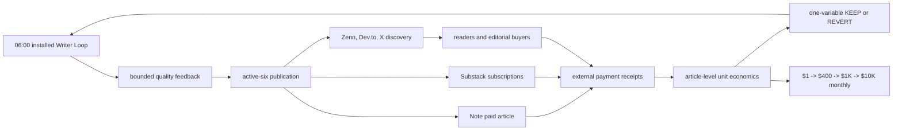

# Writer active-six recovery design

## Goal

Keep the installed Writer Loop scheduled and close SSOT Orders 1–5 without any
foreground publication. Active destinations are exactly Note JA, Zenn JA,
Dev.to EN, Substack JA, Substack EN, and X Article JA. X Article EN and X Post
JA remain dormant.

## Measured starting state

- Runtime upstream is `4ee4e4f4d7e2457b8f78a739cc52a32c486c4fab`; the shared checkout is dirty and is read-only for this work.
- The isolated runtime branch is `fix/writer-active-six` at the required base.
- `ai.anicca.article-daily` is idle, scheduled at 06:00, and last exited 0.
- `ai.anicca.article-resume` is idle, scheduled every 300 seconds, and last exited 2.
- Both installed jobs still execute `/Users/anicca/profitable-claude/skills/writer-agent`.
- `daily-2026-08-12` has six stable active targets. Note JA is publicly live but internally ambiguous; the other five are intents.
- `daily-2026-08-13` has the two correct dormant skips but zero active intents.
- The generated daily prompt runs Python `publication-guard.py` through `bash` once. The creator contains 78 compatibility-root literals; the recovery wrapper already resolves code through `ARTICLE_ROOT` and state through `ARTICLE_STATE_DIR` when those variables are supplied.

## Chosen design

Use the existing runtime-root/state-root seam rather than adding an installer,
release manager, abstraction, or monorepo migration.

1. Give the creator the same `ARTICLE_ROOT` and `ARTICLE_STATE_DIR` contract the recovery wrapper already uses.
2. Resolve wrapper-side code through `ARTICLE_ROOT` and mutable state through `ARTICLE_STATE_DIR`.
3. Materialize prompt code paths from an explicit runtime-root placeholder and prompt state paths from a separate explicit state-root placeholder.
4. Change the one invalid guard instruction to the Python executable.
5. Prove behavior by running the real wrapper in the existing isolated test harness with `HOME`, `ARTICLE_ROOT`, and `ARTICLE_STATE_DIR` deliberately pointing to different roots. Assert the generated prompt uses only the explicit code/state roots and invokes the guard with Python.
6. After GREEN, push the runtime branch, run one fresh Sol adversarial review on the exact commit, and fix only correctness/Done findings through the same Luna worker.
7. Deploy by editing the two installed local plists in one bounded idle window. ProgramArguments and `ARTICLE_ROOT` point to the tested immutable worktree; `ARTICLE_STATE_DIR` points to the existing live state. Preserve every other environment value and the 06:00/300-second schedules.
8. Kickstart the installed recovery owner and observe Orders 2–5. Never invoke a publisher from the primary session.

## Alternatives rejected

- Migrate to Life Manager now: it combines Order 6 with recovery and does not repair the currently installed jobs.
- Manually publish/recreate targets: it violates loop ownership and risks duplicate effects and changed stable IDs.
- Add a new deploy framework: the two local plists and existing launchctl contract are sufficient for this one bounded cutover.

## Safety and rollback

- Check both jobs and the shared publication lock are idle before mutation.
- Record the complete original local plist bytes and hashes before bootout.
- Never load old and new definitions simultaneously.
- Permit only one short measured zero-owner interval, then bootstrap both new definitions and verify exactly one creator plus one recovery owner.
- Rollback is the exact original two plist bytes and entry points.
- Preserve secrets, PII, identities, receipts, state, stable targets, and ledgers; no state tree is copied into Git.

## Revenue path and remaining queue

The binding order remains SSOT §9.0: recover active-six (Orders 1–5), migrate
without cutover (6), measured cutover (7), paid-demand publication (8), Money
Control (9), first external payment and canary (10), revenue gates through
$10,000 monthly and active MRR (11), then portable packaging and positive-net
scale (12).

## Acceptance

The user-supplied Done clauses are binding verbatim. Fixtures, dry runs, editor
URLs, inferred publication, dormant adapters, and partial six do not close an
Order.
