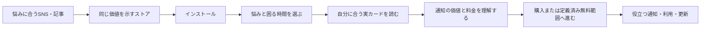

# ANICCA iOS 収益改善の設計

## 目的と依頼の境界

まず既に公開したANICCA iOSで、配信→ストア獲得→初回価値体験→有料購入→継続を改善する方法を確立する。その後、他の公開アプリへ展開する。$10K MRRは米ドルの目標であり、達成保証や期限の予測ではない。

現在の依頼は調査・設計・計画・引き継ぎ資料の保存まで。製品コード、ASC metadata、購読条件、広告出稿、配信loopの変更や実装開始は依頼されていない。文書のcommit/pushは計画の保存であり、製品リリースや実装完了ではない。

## 正本と再開情報

- リポジトリ: `Daisuke134/anicca-products`。Life Manager本体の`Daisuke134/life-manager`とは区別する。
- 文書worktree: `/Users/anicca/anicca-project/.worktrees/anicca-ios-growth-plan`
- 文書branch: `docs/anicca-ios-growth-plan-20261004`
- push先: `origin/docs/anicca-ios-growth-plan-20261004`
- 作成元main: `081eeb2e6fc9b44087eb4439e81951fa30c2cb9c`
- 実行計画: `../plans/2026-10-04-anicca-ios-growth-plan.md`
- 再開メモ: `../../../.claude/handovers/2026-10-04-anicca-ios-growth.md`
- 残作業とcursorの唯一の正本は実行計画の「タスク一覧」。このspecに第二のTODOを作らない。
- `/Users/anicca/anicca-project`は他者の変更がある共有checkout。切り替え、cleanup、変更の巻き戻しをしない。
- この文書worktreeはsparse checkoutで文書だけを展開する。製品ソースは`git show HEAD:<path>`で読める。将来の実装は新たに最新main由来の専用worktreeを作り、そこで対象ソースを展開する。

## 現状の証拠

### 前回の外部観測

以下は前セッションのASC CLI観測。保存したrawレポートは一時ファイルであり、このブランチには存在しない。現在の状態として扱う前にTask 1で再取得する。時点が違う数字を同一コホートと扱わない。

| 観測 | 前回の結果 |
|---|---|
| ASC登録 | 24件、うち6件にREADY_FOR_DISTRIBUTION版あり。地域別販売可否とは別 |
| ANICCA | app `6755129214`、bundle `ai.anicca.app.ios`、配布可能版1.9.4、1.9.5はREJECTED |
| 9月初回DL | 全体62、ANICCA30。type1/1Fを集計し更新/IAPを除外 |
| ANICCA国別DL | JP24、DE1、US1、CL1、IN2、GB1 |
| 9月ANICCA年額購入 | 1件、販売額JPY5,000、Appleレポート上Developer Proceeds JPY4,250 |
| 9月Honne年額購入 | 1件、販売額JPY6,000、Developer Proceeds JPY5,100 |
| 9/21〜9/27 ANICCA | DL8、Impression522、Page view47 |
| 同週Impression内訳 | Search516、Browse6。SNS全体の到達数ではない |
| 同週Page view内訳 | Search28、App referrer11、Browse8 |
| PPO | 実験7件、すべてSTOPPED |

ページ閲覧47とDL8は同一ユーザーの一本道ファネルではない。検索結果からの直接DLもあるため8/47をPPOの正式なCVRとしない。年額入金をそのままMRRへ入れず、MRR、売上、Developer Proceeds、入金確定、利益を分ける。

### mainの実コードで再確認した所見

- `aniccaios/aniccaios/Onboarding/OnboardingFlowView.swift`は10段階の`OnboardingStep`を表示し、`PaywallFlowContainer`へ進む。コメントの11段階表記は実列挙と違う。
- `Onboarding/OnboardingBibleViews.swift`の`PaywallFlowContainer`はprimer→`PaywallVariantBView`を表示し、閉じるボタンを常時出す。
- 別の`Onboarding/PlanSelectionStepView.swift`はPostHogの`hard_paywall`を読むが、この呼び出し経路で使われているとは言えない。公開1.9.4のbuildとソースの対応は未確定。
- `Onboarding/PaywallVariantBView.swift`のonAppearは`.paywallPlanSelectionViewed`を直接送信し、同じイベントを送る`AnalyticsManager.trackPaywallViewed()`も呼ぶ。
- `Services/SubscriptionManager.swift`の購読更新delegateには、取引IDによる新規購入の重複防止が見えない。実際の重複発生は未測定。
- `Onboarding/PersonalizedInsightStepView.swift`は回答を参照せず、固定のlocalized文字列を表示する。
- Mixpanel、PostHog、RevenueCatは既存導入済み。導入済みと受信・正しい集計を区別する。
- `aniccaios/aniccaiosTests/OnboardingV2Tests.swift`には現enumにない旧case名への参照がある。既存テストがそのまま有効だとは仮定しない。実行時にtarget inclusionとbaselineを確認する。

### 未確認事項

現在のMRR、匿名IDとRevenueCat IDの対応、段階別離脱、実験の割当、offeringsとトライアルの稼働設定、投稿別reach/クリック/購読帰属、無料/有料の実提供差分、81%改善主張とレビュー引用の根拠は未確認。未確認を0、未稼働、故障と断定しない。

## 理想のユーザー体験

オンボーディングの第一案は歓迎→主な悩み→困る時間→悩みに合う実カード→通知の価値説明→ペイウォール。回答が体験を変える質問を残し、体験を変えない質問や固定説明から見直す。既存カード描画を再利用し、新しいチャットや推薦基盤を作らない。

## 計測と改善方針

- ASC: ストア獲得の正本。Mixpanel: 初回起動以後の製品ファネル。RevenueCat: 実購読/更新/返金/MRR。PostHog: 必要な実験制御だけ。
- 既存イベントを再利用し、不足する表示/完了/CTA/失敗/割当だけ追加する。課金正本はサーバー取引であり、クライアントの推定価格を売上へ集計しない。
- 同じ匿名ユーザーのfirst-openコホート、app version、onboarding version、step、experiment/variant、offering/productを結べることを成果条件にする。
- 心理的な悩みの自由記述を分析イベントへ送らない。不要な個人情報を収集しない。
- 主要指標は実購入率とD35売上/インストール。初回価値到達、D1/D7利用、返金、解約、次回更新を保護指標にする。
- 配信を最優先にし、計測整備と並行する。日本を最初の市場候補とするが、最新の地域データと既存担当者の実績を先に確認する。
- SNS案は週10本の独立クリエイティブ、記事は勝った悩みの切り口を週1本。実行本数は既存担当の能力に合わせる。成功実績ではなく運用仮説である。
- スクショ最初の3枚は悩み/結果→届く場面→個別の実体験を第一案にする。現行対一案でPPOを設計する。
- 価格/トライアル/課金ゲート/スクショ/オンボを同時変更しない。低標本では未確定。Apple PPOは公式の標本見積りと信頼度を使う。
- 現行のhard/softを確認するまで切り替えを決めない。softは無料範囲と再課金のきっかけ、hardは読込/restore/既存購読者の復旧を含める。
- 新SDK、MMP、配信基盤、web課金、新規アプリ工場は今回の対象外。campaign/CPPの集計帰属と個人単位帰属は区別し、UTMの自動継承を仮定しない。

## $10K MRRの計算例

月換算ARPPU $6なら約1,667 active paid subscribersが必要。月次解約10%なら月約167人の補充、有料転換5%なら月約3,340 installs（約112/日）が維持の目安。いずれも仮定であり現状値ではない。到達には解約を上回る新規購読を積み上げる。利益ではApple手数料、広告/制作、AI/サーバー等の費用も差し引く。

## 完了の区別

今回の文書完了: spec/計画/再開メモが専用branchにcommit/pushされ、remote objectで存在を確認できる。

将来の製品タスク完了: 該当する実装許可を得た後、最小の関連検証と必要な外部反映を確認し、未確定の実験結果を完了扱いしない。$10Kの目標達成と、計測整備や実装完了を同一視しない。

## 一次資料

- https://www.revenuecat.com/state-of-subscription-apps-2026/
- https://www.revenuecat.com/blog/growth/hard-paywall-vs-freemium/
- https://developer.apple.com/app-store/product-page-optimization/
- https://developer.apple.com/app-store/custom-product-pages/
- https://www.revenuecat.com/docs/integrations/third-party-integrations/mixpanel
- https://github.com/rorkai/App-Store-Connect-CLI
- https://github.com/rorkai/app-store-connect-cli-skills

前回調査の要点: 初日の有料転換50.6%と「80%がオンボ中に課金」は同義ではない。hard10.7%/freemium2.1%のD35転換率は異なるアプリ群の観測であり、切り替えの因果効果を保証しない。soft化は他の価格/パッケージ変更も含む成功事例と悪化事例がある。
