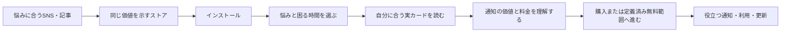

# ANICCA iOS 収益改善の設計

## 目的と依頼の境界

まず既に公開したANICCA iOSで、配信→ストア獲得→初回価値体験→有料購入→継続を改善する方法を確立する。その後、他の公開アプリへ展開する。$10K MRRは米ドルの目標であり、達成保証や期限の予測ではない。

現在の依頼は調査・設計・計画・引き継ぎ資料の保存まで。製品コード、ASC metadata、購読条件、広告出稿、配信loopの変更や実装開始は依頼されていない。文書のcommit/pushは計画の保存であり、製品リリースや実装完了ではない。

## 正本と再開情報

- リポジトリ: `Daisuke134/anicca-products`。Life Manager本体の`Daisuke134/life-manager`とは区別する。
- 文書worktree: `/Users/anicca/anicca-project/.worktrees/anicca-ios-growth-plan`
- 文書branch: `docs/anicca-ios-growth-plan-20261004`
- push先: `origin/docs/anicca-ios-growth-plan-20261004`
- 作成元main: `081eeb2e6fc9b44087eb4439e81951fa30c2cb9c`
- 実行計画: `../plans/2026-10-04-anicca-ios-growth-plan.md`
- 再開メモ: `../../../.claude/handovers/2026-10-04-anicca-ios-growth.md`
- 残作業とcursorの唯一の正本は実行計画の「タスク一覧」。このspecに第二のTODOを作らない。
- `/Users/anicca/anicca-project`は他者の変更がある共有checkout。切り替え、cleanup、変更の巻き戻しをしない。
- この文書worktreeはsparse checkoutで文書だけを展開する。製品ソースは`git show HEAD:<path>`で読める。将来の実装は新たに最新main由来の専用worktreeを作り、そこで対象ソースを展開する。

## 現在の担当と再利用境界

- 私のAGMSG名は `lm/lm-ios-growth-1004`。所有する書込対象はこのspec、対応する計画、再開メモのみ。現在はANICCAの成長基準表・配信実績・UXのread-only調査を進める。
- 既存 `lm-cfo-observability-1002` はLife Managerの `feat/lm-mobile-metrics-20261003` を所有する。collector、ASC/RevenueCat取得、Finance Detail producer、CFO consumerへの接続をこちらで重複実装しない。本人へ取得済みの公開build/offerings/source refs/hashを照会済みで、返信は未確認。
- `codex-money-printer` は全体primary。私のgrowth文書・CFO worktree・mobile producerを編集しないとの返信を確認する。全体TODO/orderはLife Manager統合SSOTのprimary管理§217/§340/§343に従い、この計画はgrowth内の細分手順であって全体順序を変更しない。
- 公式ASC/RC readbackは既存取得owner一人が生成し、両laneが同じrefs/hash/期間をread-onlyで消費する。今回はprovider再取得、認証/共有profile/state変更、投稿、本番操作を行わない。
- Task 1の基準表とTask 3の配信資料は別の読取束として並行できる。shared journalは読取だけ、全体SSOTはprimaryだけが統合する。本人の未返信を所有権解放と扱わない。

## 継続調査の基準表

以下は既存担当文書とlocal artifactの読取で更新する。担当の公式API観測と、私が独立に再取得した観測を混同しない。

| 対象 | 確認できること | 残る確認 | 既存の根拠 |
|---|---|---|---|
| 公開アプリ | 担当のpublished auditはAnicca/Honne/Dhamma Quotes/Sleep Reset/STUDIO CHERIE/Thankfulの6件。旧CFO rosterの未公開4件とは別 | 最新の公式refs/hash共有 | mobile設計のProvider observations |
| ASC acquisition | 既存feature branchはreport日付の交差と分母0/期間不一致を扱い、6公開アプリを対象にする。追加4件は担当観測でreport_pending | 自然本番反映と十分な日別観測 | 同設計のAcquisition/Acceptance |
| install→paid | 既存branchのD7はprivate/experimental endpointで、成熟日/同一app/date/整数payer/分母を検証する。小標本を効果としない | 十分なコホートと公開された計測経路 | 同設計のD7 contract |
| RevenueCat/Apple | 担当branchにはcurrency/roster/mobile freshness/Finance Detailの子ID→親app mapping修正がある。本番import完了とは別 | 現行offering、実購読イベント、production receipt接続 | 同設計のCFO source contract |
| アプリUX | anicca-products origin/main `081eeb2e6fc9b44087eb4439e81951fa30c2cb9c`で10-step→2-step paywall、個別画面の固定文、表示イベント二重送信を再確認 | 公開1.9.4 build/ソース対応、live画面 | 既存Swift source |
| product analytics | Anicca business_date 2026-10-03 / observed_at 2026-10-04T08:52:40.896770+00:00の保存行はproduct_analytics available、raw件数 app_opened5/onboarding_started1/paywall_primer_viewed4、rows10、PostHogは`missing_project_read_credential` | first-openのunique分母、順序/段階/時間、購入までのuser join | 既存business-outcomes.jsonl |
| PostHog | 同保存行はmissing_project_read_credential | 所有者経路で既存project readを解決 | 同保存行 |
| 配信実績 | 2026-09-06..2026-10-04の28日間に、local marketing receipt journalでAnicca-tagged published/provider_post_id記録567件（Instagram234、TikTok236、YouTube97）。receiptをplatformへ再照会していない。日次reach/click/投稿別獲得は同journalに記録なし | post ID→公開内容→reach/view/click→同じASC期間のacquisition refs。投稿量のみで配信成果と判定しない | `/Users/anicca/.local/state/life-manager/marketing/receipts.jsonl`、`/Users/anicca/.local/state/life-manager/marketing/jobs.jsonl` |
| Aniccaの現行獲得 | mobile担当の公式readbackでは共通ASC窓2026-10-01にfirst-time downloads 0、unique impressions 5、product page views 0。page-view→installは分母0、install→paid cohortはunavailable | 日次自然readbackと十分な標本 | mobile担当design §Provider observations |
| Aniccaの月額換算指標 | mobile担当のRevenueCat v2 chart readbackはcomplete period 2026-10-02、通貨USD、MRR chart $20.34。10/03保存JSONLではpointが20.34だがcurrencyとrevenue_definitionが欠落 | 異なるsource windowの差分、CFO同期間接続 | mobile担当design §Provider observations、local business-outcomes row |
| 配信後analytics | 最新Anicca行はbusiness_date 2026-10-03、observed_at 2026-10-04T08:01:26.805590+00:00、app_opened=5/onboarding_started=1/paywall_primer_viewed=4、PostHog `missing_project_read_credential` | user-level funnel IDと同じ新規install cohortへの結合 | local business-outcomes.jsonl |

rawイベント件数から離脱率を計算しない。primer4/started1のような値は再訪/再表示/取得windowを含みうるため、400%のconversionや3人の新規購入と解釈しない。具体的な離脱箇所は未確認のまま残す。

配信journal上の567件はowner側の投稿記録であり、reach/閲覧・再生完了・プロフィール遷移・store click・installへの寄与を証明しない。現在、投稿別成果が取れていない状態で投稿量をさらに積んでも、どのcreativeを再生産すべきか学習できない。次の配信判断は既存投稿の少数サンプルをofficial platform insightとASC windowへ結ぶところから始める。新しい投稿や追加publisherは作らない。

既存mobile設計の参照元は `/Users/anicca/Projects/life-manager-main/.worktrees/lm-mobile-metrics-20261003/docs/superpowers/specs/2026-10-03-mobile-app-metrics-funnel-design.md`、読取SHAは `1f045eff3d27cfec3945cd8d2dff64f06928c834`、文書SHA256は `1833426e22112a84b39c80dc3566c316353ced30f228980475cdebd6db87af26`。local sourceは `/Users/anicca/.local/state/life-manager/marketing-metrics-daily/state/business-outcomes.jsonl`、配信journalsは `/Users/anicca/.local/state/life-manager/marketing/{receipts,jobs}.jsonl`。原文payload、credential、個人IDはコピーしない。

前回のCFO監査で見つけた10対6 scope/hash/完全一致時刻の問題は旧handover/loaded sourceの所見である。既存mobile feature branchの修正を読まずに同じ修復を始めない。CFOのsettlement/actual cost/runwayと、このgrowth基準表を別成果として保持する。

## 現状の証拠

### 前回の外部観測

以下は前セッションのASC CLI観測。保存したrawレポートは一時ファイルであり、このブランチには存在しない。現在の状態として扱う前にTask 1で再取得する。時点が違う数字を同一コホートと扱わない。

| 観測 | 前回の結果 |
|---|---|
| ASC登録 | 24件、うち6件にREADY_FOR_DISTRIBUTION版あり。地域別販売可否とは別 |
| ANICCA | app `6755129214`、bundle `ai.anicca.app.ios`、配布可能版1.9.4、1.9.5はREJECTED |
| 9月初回DL | 全体62、ANICCA30。type1/1Fを集計し更新/IAPを除外 |
| ANICCA国別DL | JP24、DE1、US1、CL1、IN2、GB1 |
| 9月ANICCA年額購入 | 1件、販売額JPY5,000、Appleレポート上Developer Proceeds JPY4,250 |
| 9月Honne年額購入 | 1件、販売額JPY6,000、Developer Proceeds JPY5,100 |
| 9/21〜9/27 ANICCA | DL8、Impression522、Page view47 |
| 同週Impression内訳 | Search516、Browse6。SNS全体の到達数ではない |
| 同週Page view内訳 | Search28、App referrer11、Browse8 |
| PPO | 実験7件、すべてSTOPPED |

ページ閲覧47とDL8は同一ユーザーの一本道ファネルではない。検索結果からの直接DLもあるため8/47をPPOの正式なCVRとしない。年額入金をそのままMRRへ入れず、MRR、売上、Developer Proceeds、入金確定、利益を分ける。

### mainの実コードで再確認した所見

- `aniccaios/aniccaios/Onboarding/OnboardingFlowView.swift`は10段階の`OnboardingStep`を表示し、`PaywallFlowContainer`へ進む。コメントの11段階表記は実列挙と違う。
- `Onboarding/OnboardingBibleViews.swift`の`PaywallFlowContainer`はprimer→`PaywallVariantBView`を表示し、閉じるボタンを常時出す。
- 別の`Onboarding/PlanSelectionStepView.swift`はPostHogの`hard_paywall`を読むが、この呼び出し経路で使われているとは言えない。公開1.9.4のbuildとソースの対応は未確定。
- `Onboarding/PaywallVariantBView.swift`のonAppearは`.paywallPlanSelectionViewed`を直接送信し、同じイベントを送る`AnalyticsManager.trackPaywallViewed()`も呼ぶ。
- `Services/SubscriptionManager.swift`の購読更新delegateには、取引IDによる新規購入の重複防止が見えない。実際の重複発生は未測定。
- `Onboarding/PersonalizedInsightStepView.swift`は回答を参照せず、固定のlocalized文字列を表示する。
- Mixpanel、PostHog、RevenueCatは既存導入済み。導入済みと受信・正しい集計を区別する。
- `aniccaios/aniccaiosTests/OnboardingV2Tests.swift`には現enumにない旧case名への参照がある。既存テストがそのまま有効だとは仮定しない。実行時にtarget inclusionとbaselineを確認する。

### 未確認事項

現在のMRR、匿名IDとRevenueCat IDの対応、段階別離脱、実験の割当、offeringsとトライアルの稼働設定、投稿別reach/クリック/購読帰属、無料/有料の実提供差分、81%改善主張とレビュー引用の根拠は未確認。未確認を0、未稼働、故障と断定しない。

## 理想のユーザー体験

オンボーディングの第一案は歓迎→主な悩み→困る時間→悩みに合う実カード→通知の価値説明→ペイウォール。回答が体験を変える質問を残し、体験を変えない質問や固定説明から見直す。既存カード描画を再利用し、新しいチャットや推薦基盤を作らない。

## 計測と改善方針

- ASC: ストア獲得の正本。Mixpanel: 初回起動以後の製品ファネル。RevenueCat: 実購読/更新/返金/MRR。PostHog: 必要な実験制御だけ。
- 既存イベントを再利用し、不足する表示/完了/CTA/失敗/割当だけ追加する。課金正本はサーバー取引であり、クライアントの推定価格を売上へ集計しない。
- 同じ匿名ユーザーのfirst-openコホート、app version、onboarding version、step、experiment/variant、offering/productを結べることを成果条件にする。
- 心理的な悩みの自由記述を分析イベントへ送らない。不要な個人情報を収集しない。
- 主要指標は実購入率とD35売上/インストール。初回価値到達、D1/D7利用、返金、解約、次回更新を保護指標にする。
- 配信を最優先にし、計測整備と並行する。日本を最初の市場候補とするが、最新の地域データと既存担当者の実績を先に確認する。
- SNS案は週10本の独立クリエイティブ、記事は勝った悩みの切り口を週1本。実行本数は既存担当の能力に合わせる。成功実績ではなく運用仮説である。
- スクショ最初の3枚は悩み/結果→届く場面→個別の実体験を第一案にする。現行対一案でPPOを設計する。
- 価格/トライアル/課金ゲート/スクショ/オンボを同時変更しない。低標本では未確定。Apple PPOは公式の標本見積りと信頼度を使う。
- 現行のhard/softを確認するまで切り替えを決めない。softは無料範囲と再課金のきっかけ、hardは読込/restore/既存購読者の復旧を含める。
- 新SDK、MMP、配信基盤、web課金、新規アプリ工場は今回の対象外。campaign/CPPの集計帰属と個人単位帰属は区別し、UTMの自動継承を仮定しない。

## $10K MRRの計算例

目標の解釈は二つある。第一段はポートフォリオ合算$10K MRR、長期の野心目標は選ばれた各winner appが$10K MRR。すべてのアプリが$10Kに届く保証は置かない。

ポートフォリオ目標は、たとえば1本$10K、2本×$5K、5本×$2Kで作れる。これは配分シナリオで、アプリが均等に売れるという予測ではない。

MRRを**月額へ正規化した売上**とすると必要な有料会員数は次の通り。ここで月換算額は仮定で、現行priceまたはCFOが確定したnet proceedsではない。

| 月換算MRR/active paid subscriber | $10Kに必要なactive paid subscribers |
|---:|---:|
| $5 | 2,000 |
| $10 | 1,000 |
| $20 | 500 |

月換算$10/人で1,000人を維持する例では、月次解約10%なら月100人の補充が必要。有料転換率別の必要新規DLは次の通り。

| D35 download-to-paid仮定 | 月100人を新規有料化するDL/月 | 平均DL/日 |
|---:|---:|---:|
| 2.1% (RevenueCatのfreemium app群のmedian) | 4,762 | 159 |
| 5% (planning scenario) | 2,000 | 67 |
| 10.7% (hard-paywall app群のmedian) | 935 | 31 |

算式は `active paid = monthly MRR goal / monthly-normalized revenue per payer`、`new paid needed = target active paid × monthly churn`、`install needed = new paid needed / mature-cohort D35 conversion`。RevenueCatの2.1%/10.7%はアプリ群の中央値であり、Aniccaに適用した結果ではない。installとRevenueCat customer cohortが同一userで結べない場合、この式の実測係数へ混ぜず、別シナリオとして扱う。継続率や単価を良く見せるための外挿をしない。

Ownerのreadback上、AniccaはRevenueCat MRR chartで$20.34/complete period 2026-10-02、CFOにはまだ精算収益としてjoinされていない。月換算$10/人の目標例に対して単純比では約492倍に相当するが、MRR定義・10/03保存値のcurrencyが欠け、基準periodも異なるため正式な成長倍率や現行net MRRとは呼ばない。

### アプリ工場の投資ゲート

1. **獲得仮説:** 一つの対象者/課題について、既存担当の投稿ID→reach/click→同一ASC期間のstore acquisition refsを結ぶ。日付不一致やcampaign不在はunavailable。
2. **ストア転換:** Impression→product page view→first-time downloadを同じwindowで測り、Apple PPOは取得可能標本/期間の見積りが実験可能な場合だけ行う。
3. **初回価値と購入:** 同じ新規ユーザーのstep表示/完了→実カード価値→paywall→初回購入を測る。raw event totalsからconversionを作らず、hard/softと価格を同時に変更しない。
4. **継続とunit economics:** renewal/refund、月換算MRR、Apple proceeds、AI/infra variable cost、paid CACを別sourceで同期間比較する。買い切り・年額gross・未精算をMRR/profitにしない。paid scalingは実測net LTVがCACを上回る根拠ができるまで拡大案としてのみ残す。
5. **横展開/停止:** winnerの人員を増やし、同じ再現可能手順を顧客課題が重なる次アプリへ移す。計測が揃わない、価値体験が弱い、unit economicsが負の候補へアプリ数だけを増やさない。

RevenueCat 2026 reportでは、subscription appsのMRR YoY median growthは5.3%、top decileは306%超、公開subscription revenueの69%は2020年より前に出たappsから生じる。アプリ作成本数ではなくwinnerのdistribution/retention/monetizationがportfolio目標を左右すべきだという参考証拠であり、Anicca達成の予測ではない。

## 完了の区別

今回の文書完了: spec/計画/再開メモが専用branchにcommit/pushされ、remote objectで存在を確認できる。

将来の製品タスク完了: 該当する実装許可を得た後、最小の関連検証と必要な外部反映を確認し、未確定の実験結果を完了扱いしない。$10Kの目標達成と、計測整備や実装完了を同一視しない。

## 一次資料

- https://www.revenuecat.com/state-of-subscription-apps-2026/
- https://www.revenuecat.com/blog/growth/hard-paywall-vs-freemium/
- https://developer.apple.com/app-store/product-page-optimization/
- https://developer.apple.com/app-store/custom-product-pages/
- https://www.revenuecat.com/docs/integrations/third-party-integrations/mixpanel
- https://github.com/rorkai/App-Store-Connect-CLI
- https://github.com/rorkai/app-store-connect-cli-skills

前回調査の要点: 初日の有料転換50.6%と「80%がオンボ中に課金」は同義ではない。hard10.7%/freemium2.1%のD35転換率は異なるアプリ群の観測であり、切り替えの因果効果を保証しない。soft化は他の価格/パッケージ変更も含む成功事例と悪化事例がある。
