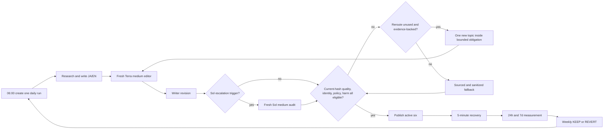
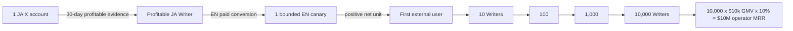
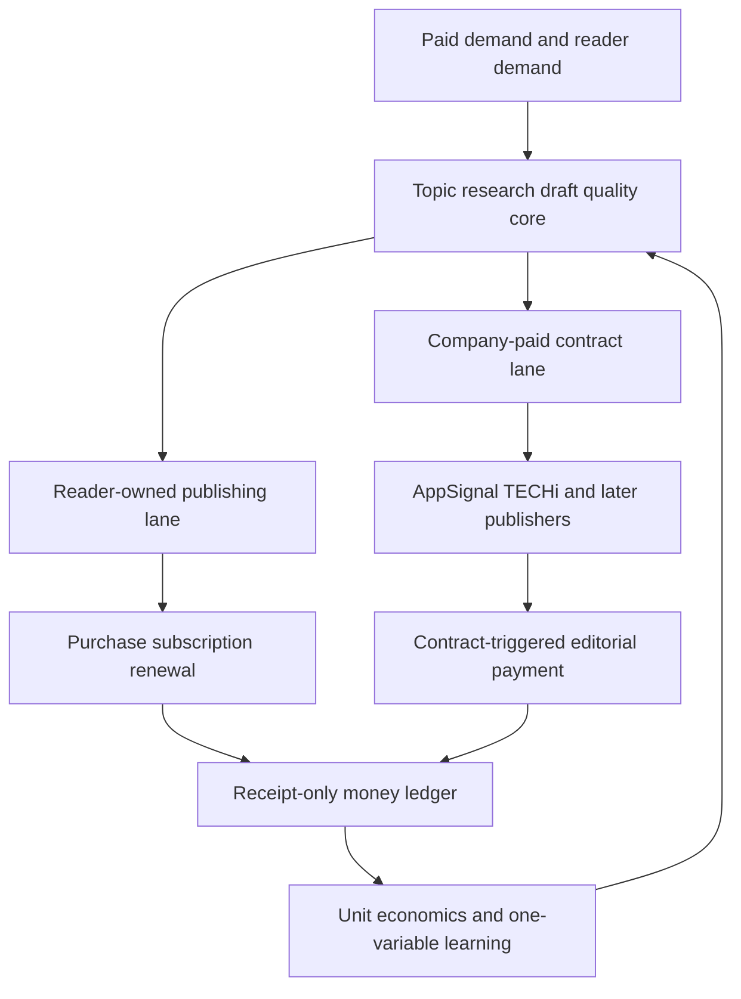

# Writer Agent — Revenue, UX, Runtime, and Roadmap SSOT

Last updated: 2026-08-06 JST

This file is the only current source of truth for the Writer Agent's objective,
user experience, revenue model, execution order, and remaining work. Historical
investigation and incident evidence remains in
`docs/loop-engineering/47-writer-loop-quality-and-self-improvement.md`, but that
file no longer defines current priorities or completion.

### 0.0 Reading authority and freshness

This file contains both current contracts and immutable historical receipts.
They MUST be read with this precedence, so old evidence can never become a
second instruction source:

1. §2 defines the current runtime invariants and active/dormant destination
   contract.
2. §9.0 defines the only current execution order and next atomic work item.
3. The §9 task table defines current DONE/PARTIAL/TODO acceptance status, but
   cannot reorder §9.0.
4. Sections explicitly labelled historical receipt, implementation slice,
   measured baseline, or dated production receipt are evidence only. Their
   commands named `Next`, old destination counts, test totals, commits, model
   routing, and terminal outcomes describe that point in time and MUST NOT be
   executed as current instructions.

When a historical receipt differs from §2 or §9.0, preserve the receipt and
apply the current contract. A paragraph may use `current` only for state that
was freshly verified in the same update; otherwise it MUST carry an explicit
as-of date or be labelled historical. Revenue/publication truth always comes
from the external receipt/readback ledgers, never from prose freshness.

## 0. Objective

Build one Writer Agent that continuously discovers valuable subjects, writes,
publishes, earns directly from its writing, measures verified payments, repairs
its own interrupted runs, and reports money without ongoing human operation.

### 0.1 Canonical name and subject scope

The product and agent name is **Writer Agent**. **Writer Loop** means its
persistent execution loop. `AI Entity Article Writer`,
`ai-entity-article-writer`, and similar names are legacy runtime identifiers,
not the current product name.

The Writer has no AI-entity subject restriction. It may write about any lawful
subject when the model finds evidence of reader value, editorial demand,
product relevance, or profitable conversion. Topic selection is model judgment
from current claims, audience evidence, opportunity terms, product state, and
past economics; it is not a hard-coded subject allowlist or keyword router.

Legacy names in historical incident reports or in Anicca's separate brand
description are historical/brand facts and need not be rewritten. Active
Writer skill metadata, aliases, prompts, scheduler descriptions, state paths,
tests, and UI labels must migrate to `writer-agent` without creating a second
pipeline or breaking existing durable runs. Temporary compatibility aliases
must point to the one canonical Writer tree and be removed only after a live
resume/publish parity receipt.

The order is:

1. Prove the loop for Dais locally.
2. Reach verified $10,000 monthly revenue with one or more profitable writing
   units.
3. Package the same contract as open source and cloud software.
4. Let anyone start without supplying Google, Gmail, note, Substack, or social
   credentials by using an agent-owned identity, publication surface, and
   device-generated payment identity.
5. Scale proven units and protocol revenue toward $10,000,000 MRR.

The machine cannot guarantee demand or revenue. It must guarantee continuous
measurable attempts, honest receipts, bounded improvement, and automatic
recovery.

## 1. Product boundary

### 1.1 Article-first revenue

The initial product is the writing itself. The Writer does **not** need to turn
every article into a template, API, course, or unrelated digital product.

Before $10,000 monthly revenue, the primary money paths are:

1. A publisher pays an editorial fee for an accepted article.
2. A reader buys one paid article.
3. A reader pays a recurring subscription for continuing writing or an archive.
4. A reader pays to unlock an article on the Writer's self-owned publication.

The same Writer is also Life Manager's writing-led marketing engine. It reads
the verified state of apps, agents, skills, and other products; discovers the
reader problem each solves; publishes useful evidence-led articles; and
attributes article -> product visit -> activation -> purchase/subscription.
Product revenue is reported separately from direct writing revenue so the same
payment is never counted twice. Promotional copy without a reader job or
verified product claim is not a successful article.

Derived products are deferred. They may be proposed only after direct writing
revenue has been measured long enough to show that the target cannot be reached
efficiently, or when readers explicitly demand a reusable artifact. They are
not a prerequisite for the first payment.

### 1.2 Economic truth

"The user supplies no customers" is a valid UX requirement: the Agent must find
readers and payers itself. "No payer exists" is not a revenue model. Every
payment has an economic counterparty: a reader, publisher, advertiser,
business, marketplace, protocol, or another agent.

"The user supplies no credentials" means the system generates and safeguards
the required identity on the user's device. Ownership still requires a signing
key, passkey, wallet, or regulated payout identity. A fiat payout through
Stripe, PayPal, or a bank can require account creation and KYC. A no-account OSS
mode therefore cannot depend on note, Substack, Google, Gmail, or Stripe.

## 2. Non-negotiable runtime rules

### 2.1 No passive waiting

If safe work can run now, the Agent runs it now. A missed or incomplete daily
run is kickstarted immediately; it does not wait for the next schedule.

If one platform enforces a future publication window, only that destination is
`PENDING`. All other publication, measurement, research, and reporting work
continues.

Every wait state must record:

- exact blocked target;
- external reason;
- earliest retry time;
- durable resume owner;
- work continuing in parallel;
- Telegram event UUID.

Allowed wait reasons are limited to an externally enforced publication window,
an explicit `Retry-After`, an external editorial/payment response, or a human
legal/KYC action that cannot be delegated. "Wait for the next schedule" is not a
valid terminal state for unfinished work.

### 2.2 Same-run recovery

Failure resumes the same `run_id`, `artifact_id`, content hash, destination, and
publication intent. A new article must not hide a failed article. The Writer
MUST NOT abandon the daily obligation after bounded editorial attempts. It may
perform at most one evidence-backed topic reroute; after exhaustion it creates
a sourced, claim-stripped, safely sanitized fallback under the same durable
obligation and continues repair/publication until readback succeeds. A new JST
run may start independently, but it never releases or hides the unfinished
prior work-item.

### 2.3 Honest evidence

- A generated draft is not published.
- A URL is not live until public readback passes.
- A checkout view is not a sale.
- A test payment is not revenue.
- A view, like, or impression is not revenue.
- Missing measurement is `unknown`, never zero.
- Revenue requires a processor, platform, publisher, or public-ledger receipt.
- MRR includes active recurring contracts only; editorial fees and paid articles
  remain one-time monthly revenue.

### 2.4 Daily shipment contract

`ai.anicca.article-daily` is the sole creator of a new daily Writer run and
runs with `ARTICLE_AUTOPUBLISH=1`. `ai.anicca.article-resume` owns same-run,
per-destination recovery; claim, opportunity, money, report, and learning
workers continue on their own intervals.

The Writer improves the **same article** from reader/editorial feedback. It may
revise at most twice and may use at most one evidence-backed topic reroute
before entering the sourced, claim-stripped, safely sanitized fallback path.
An artifact with unresolved factual, citation-integrity, identity,
platform-policy, PII/secret, or harm defects MUST NOT cross the provider write
boundary unchanged; the defect creates a durable repair transition, not a
terminal no-publication receipt. Editorial taste is improvement input and
never cancels the daily publication obligation.

The service-level objective is **real daily autonomous shipment**, never a
fabricated success. A day cannot complete with zero public URLs: bounded model
attempt exhaustion changes the repair/fallback strategy, while the work-item
remains owned until authenticated public readback succeeds.

Every active daily work-item has one observable publication service-level
objective: each active destination receives a verified public URL. A
destination-specific platform
failure starts immediate, bounded recovery for that destination while all other
destinations continue; it never cancels the others. A destination without
a public readback is displayed as an SLO breach with its real platform error
and recovery receipt, never as "published" or a silent pending state. Only a
verified public readback counts as published, and only an external receipt
counts as earned.

Live runtime commits `a30bfd66` and `60a7f223` close the prior poison path. Live
run `20260804-214206` produced a current-hash terminal rejection with no
publication state, no delivery ledger row, no extra provider call, and a
next-day-eligible start-control state. That receipt is historical evidence, not
the current terminal contract. Task 1 owns proof of three consecutive verified
active-six shipments. Unsafe bytes are repaired or sanitized before
publication; they are never published unchanged and never release the
obligation unfinished.

### 2.5 Active-six distribution and dormant-adapter contract

One daily Writer run freezes one Japanese article and one independently
localized English article, then derives exactly these six active destination
intents. Translation does not create a second topic or daily run.

| Destination | Language | Revenue role | Required receipt |
|---|---|---|---|
| note paid article | JA | One-time direct writing revenue | Authenticated price/paywall readback, public URL, later purchase/fee/payout receipt |
| Substack article | JA | Recurring direct writing revenue | Authenticated paid-audience/paywall readback, public URL, later contract/charge/churn receipt |
| Substack article | EN | Recurring direct writing revenue | Authenticated paid-audience/paywall readback, public URL, later contract/charge/churn receipt |
| Dev.to article | EN | Free discovery | Public title/body/media readback |
| Zenn article | JA | Free discovery | Public title/body/media readback |
| X Article | JA | Long-form acquisition | Public Article URL and rendered-body readback |

`X Article JA` is a mandatory daily destination, not a dormant experiment.
The existing authenticated browser adapter is reused and repaired when needed;
successful historical runs are evidence to preserve the path, not a reason to
replace it. Only `X Article EN` and `X Post JA` are dormant below.

The following adapters, code, historical receipts, and state are retained but
must not create a daily publication intent while marked `DORMANT_EXPERIMENT`:

| Dormant destination | State | Reactivation gate |
|---|---|---|
| X Article EN | `DORMANT_EXPERIMENT` | Substack EN has a real attributed paid conversion, a distinct English audience/account can be measured, and 30 days of nonduplicate English topic supply exists |
| X Post JA | `DORMANT_EXPERIMENT` | X Article JA has a 30-day standalone baseline, incremental teaser-to-paid conversion can be measured, and the added cadence does not bury the Article |

X Article JA publishes at most once per JST day. English distribution remains
Substack EN and Dev.to EN until the English X gate passes. Dormant means skipped
without an SLO breach; it does not mean deleted. More posts or accounts are not
scale when they reduce reach, reader trust, or causal attribution.

This follows X's own guidance to revise for the reader, use a specific hook,
promote and pin an Article during its first 24–72 hours, and avoid platform
manipulation/spam. X Creator Revenue Sharing is an optional bonus, not the
Writer's `$10k` foundation: eligibility currently requires Premium, 5M organic
impressions in three months, 500 verified followers, a supported country,
identity verification, and a payout account; payout weighting may vary by
format. Sources: https://help.x.com/en/using-x/articles,
https://help.x.com/en/using-x/creator-revenue-sharing, and
https://help.x.com/en/rules-and-policies/content-monetization-standards.

### 2.6 Historical live snapshot — 2026-08-06 JST

The live Writer runtime, remote checkout, and installed marker all resolve to
`06141970` after the reviewed Civo series. The Civo evidence is separate from
the demand-card evidence: the authoritative full rendered Civo body and the
fixed structural-window evidence both received a `SHIP` review on feature
`4295cf8f`, and the live equivalent is included in the installed receipt. This
was the runtime/remote/marker truth at this snapshot; older lock receipts did not describe
the installed owner.

The installed `ai.anicca.writer-claim-loop` launchd run `309` exited `0` with
`READY / FILLED`; its demand queue moved `0 -> 1` and created the paid-demand
topic `paid-demand:7c43...`. X body capture was `2/2 valid`. The claim receipt
proves a paid-demand topic exists; it does not prove publication or revenue.

The installed `ai.anicca.article-daily` run `daily-2026-08-06` generated the
Japanese and English drafts, research bundle, images, and diagram. Its initial
editorial evaluation failed; self-heal rerouted the article from `how-to` to
`comparison`. The current JA/EN hashes pass identity and CTA checks, but
`editorial-gate` refused the new hashes with exit `77`
(`high-escalation-exhausted`) because the prior high editorial FAIL was keyed
without the new language/hash boundary. There is no publication state, public
URL, payment receipt, or received revenue for this run. The corresponding
Telegram state delta is message ID `7398`.

Accounting truth at this receipt is received revenue `$0` and verified MRR
`$0`; paid-state configuration, views, and generated drafts are not receipts.

At this snapshot, the next slice was deterministic editorial-exhaustion keying
by `(language, current_article_sha256)`. B1-B4 later completed that work. This
paragraph is not the current queue; §9.0 now starts at H11c.2 after the completed
H11c.1 Zenn audit. A URL or payment remains unreported until its external
receipt and public readback are observed.

## 3. Revenue streams

### 3.1 Current stream ledger

| Stream | What is sold | Revenue type | Current state | Account/KYC dependency | Verified amount now |
|---|---|---|---|---|---:|
| AppSignal | Accepted technical article | One-time editorial fee | Recovered immutable Google Form confirmation advances the application to `SUBMITTED`; the correlated 15-minute watcher currently observes `NO_RESPONSE`. Acceptance, rate, publication, and payment remain absent | Author agreement and publisher payment details | $0 |
| TECHi Author | No current earned-writing route | None under the received offer; the only available route was a `$999` sponsored placement paid by Writer | Provider application ID `4` is durably `DECLINED` from the authenticated official reply; no article, publication, payout, expense, or revenue exists | Do not pay or reapply under the current offer | $0 |
| DigitalOcean Write for DOnations | Accepted and published tutorial | One-time editorial fee | Intake is not currently usable: the official page still says submissions are paused, and `do.co/w4do` redirects to that page instead of an application form | PayPal receive capability and DO credit exist; contract/contact details still apply. Never store the PayPal address in this SSOT | $0 |
| note | Paid Japanese article | One-time reader payment | Paid publication capability exists; attributed sales receipt absent | note creator and payout account | ¥0 verified |
| Substack | Paid subscription/archive | Recurring reader payment | $8/month tier was enabled; paid subscriber receipt absent | Substack creator plus Stripe | $0 MRR verified |
| Self-owned publication | Paid article or recurring archive | One-time or recurring reader payment | Production JA/EN paid pages, Stripe Products/Prices, Checkout, webhook coverage, and private-content denial are live; restricted read-key collection, first external purchase, renewal, fees, and payout remain open under Task 13 | Current production uses Stripe; default OSS device-generated identity/payment rail remains a later portability gate | $0 verified |
| Dev.to / Zenn / X | Free distribution | Distribution only by default | Publishing adapters exist or are under repair | Platform account | Excluded from money reward |
| Book | Reconstructed long-form writing | One-time royalty | Deferred until direct daily writing works | Store-specific | $0 |

### 3.2 Publisher fee facts

DigitalOcean's official page currently states $400 for a newly published
tutorial and $100 for an update, while a FAQ on the same page describes a
"typical" $300 payout. Payment occurs after acceptance, editing, and
publication; it is not an automatic $400 monthly subscription. The contract or
acceptance message is the final amount authority. The page also says payment is
through PayPal or DigitalOcean credit.

Source: https://www.digitalocean.com/community/pages/write-for-digitalocean

The dated DigitalOcean copy says "paused until 2025," but that stale wording is
still the live state observed on 2026-08-01 and the advertised application URL
does not open an intake form. Therefore the Writer must report it as
`CLOSED_OR_STALE`, not infer that a past date means open, and must monitor for a
real form reopening. Available PayPal and DigitalOcean-credit payout rails make
the opportunity executable after reopening; they do not make intake open now.

AppSignal publicly promises a base article rate but does not publish the amount.
Its documented process includes an author agreement, topic approval, editing,
approval, payment, and publication. Until the first acceptance states a rate,
the target contribution is `unknown`, not $400.

Source: https://blog.appsignal.com/write-for-us.html

### 3.3 Paid-writing opportunity watch

The Writer continuously discovers and re-verifies paid editorial opportunities
instead of hard-coding DigitalOcean as the only $400 path. The model evaluates
fit and expected value from official evidence; deterministic code stores and
rechecks receipts.

Each opportunity record contains:

- publisher, official program URL, application URL, and last verified time;
- intake state: `OPEN`, `CLOSED`, `PAUSED`, `STALE`, or `UNKNOWN`;
- stated fee/range, currency, whether it is per accepted article or recurring;
- topics, originality/exclusivity terms, editorial steps, and expected delay;
- payout rail, account/KYC/tax/contract requirements, and geographic limits;
- proposed article, evidence of fit, next executable action, and submission ID;
- acceptance, publication, invoice/payment, fee, and payout receipts.

The Agent checks official publisher pages first, then reputable discovery
sources, and never calls an opportunity open from a search snippet. Closed
programs remain on a low-frequency recheck list while the Agent continues
finding alternatives. A human-readable Telegram delta is sent only for a real
state change or a high-fit newly open opportunity.

Current verified opportunity matrix:

| Publisher | State | Public compensation | Writer decision |
|---|---|---|---|
| AppSignal | `SUBMITTED`; watcher `NO_RESPONSE` | Base rate promised; amount not public | Poll the unique submitted address and trusted official sender; next state is evidence-backed acceptance/decline, never duplicate submission |
| TECHi Author | `DECLINED`; authenticated official reply says no open/free contributor programme | No receivable contract; `$999` sponsored placement is Writer-paid advertising | Terminal under the current offer; do not pay, reapply, or count the quoted price as revenue |
| Hygraph Creator Program | `OPEN_POLICY_UNKNOWN` | Rewards/compensation stated; amount and payout rail not public | Highest-fit new lead because AI agents, MCP, GraphQL, and structured content are named topics; clarify AI-authorship policy and compensation before submission |
| Civo | `REJECTED_POLICY` | Fee agreed on acceptance; PayPal or Civo credits | Do not submit: the official call explicitly rejects AI-generated content and requires a Google Doc |
| Oracle Technical Articles | `OPEN_VALUE_UNKNOWN` | Stipend only occasionally available | Low priority; confirm commission, amount, identity requirements, and AI-authorship policy before work |
| DigitalOcean | `CLOSED_OR_STALE` | Historical page advertises $400/new article | Watch for an actual intake form; do not count or submit now |
| Better Stack | `CLOSED` | Historical $300/article | Recheck on the closed-program cadence |
| Honeybadger | `CLOSED` | Historical $500/post | Recheck on the closed-program cadence |
| Earthly | `CLOSED` | Historical $350/article | Recheck on the closed-program cadence |
| Baeldung | `CLOSED` | Historical contributor budgets shown | Recheck on the closed-program cadence |

Sources:

- https://hygraph.com/write-for-hygraph
- https://www.civo.com/write-for-us
- https://www.oracle.com/technical-resources/articles/otn-submit.html
- https://betterstack.com/community/write-for-us/
- https://www.honeybadger.io/blog/write-for-us/
- https://earthly.dev/blog/write-for-us/
- https://www.baeldung.com/contribution-guidelines
- https://github.com/rohitg00/technical-writing-websites

Runtime commit `83afe1b` turns replacement discovery into a bounded durable
loop. The index is discovery input only: its publisher names and claimed fees
are never treated as official evidence. One 2026-08-02 JST manual wake parsed
127 canonical candidates, then verified the five highest claimed-value unseen
URLs from their full official pages. Corellium and Airbyte became
`REJECTED_POLICY`; Retool, Fauna, and Argot became `VALUE_UNKNOWN`. The live
`ai.anicca.writer-opportunity-discovery` LaunchAgent is `RunAtLoad`, runs every
86,400 seconds, was kicked immediately, and exited `0` after verifying the next
five candidates: CircleCI, Neptune.ai, Clubhouse.io, Draft.dev, and Architect,
all honestly parked at `VALUE_UNKNOWN`. It never fabricated an open compatible
program or a pitch. Candidate URL and DNS boundaries reject localhost, private,
link-local, internal-suffix, and nonstandard-port direct-fetch targets; one
unavailable candidate cannot stop the remaining budget. The latest discovery
receipt contains the index SHA-256, candidate IDs, official URLs, durable
opportunity IDs, outcome, reason, and exact attempted/verified/unavailable
totals.

Runtime commit `8572122` makes the same daily wake advance existing supply
before adding more. State-specific deterministic cadences recheck at most five
due programs per wake (`VALUE_UNKNOWN` after seven days;
`CLOSED`/`REJECTED_POLICY`/`EXPIRED` after thirty; newly actionable states
daily), isolate a failed publisher, and persist a separate recheck receipt.
After discovery, each `POLICY_CLEAR` program may receive one model-proposed
pitch only when deterministic code binds it to an unused durable claim ID, the
claim's exact canonical source URL and reader job, and a structured title and
angle. A database uniqueness boundary prevents that claim from entering a
second pitch. Only then may the state become `PITCH_READY`; no submission state
is allowed without external submission evidence. The first live aggregate
wake exited `0` with zero due rechecks, five of five official candidates
verified, and zero eligible pitches. The zero is evidence of correct refusal,
not simulated progress: all five were `VALUE_UNKNOWN`, so the Agent generated
nothing and advanced nothing.

Runtime commit `912074b` prevents unavailable high-value index entries from
starving unseen programs. A failed candidate waits at least twenty-four hours,
is attempted at most three times, and then becomes `EXHAUSTED` with its reason
preserved. The immediate live wake therefore skipped the same-day unavailable
rows, verified five unseen official pages, and exited `0`: Okta and Algolia
became `VALUE_UNKNOWN`; Bugsnag, Honeycomb, and Teleport became `CLOSED`.

Runtime commit `80eb909` adds the first live compatible replacement program.
The TECHi Author Program is verified from its official application, editorial
standards, and publication-principles pages as open, paid by a flat rate per
accepted piece plus traffic revenue share, and paid monthly through Stripe.
Its official rules permit writers to use workflow software, require material
automation disclosure, and require human editorial review before publication.
The exact flat rate is set in later payment terms, so the Writer may spend one
bounded pitch to obtain those terms but may not begin the article without an
acceptance receipt. The live state advanced through `POLICY_CLEAR` to a
deduplicated `PITCH_READY` bound to GitHub's official stacked-Copilot-sessions
claim. The Agent generated a free TECHi account credential in its local auth
vault and reached the official email-verification screen; the Gmail read-only
check currently has no delivered message, so the opportunity remains
`PITCH_READY` and is not falsely marked `SUBMITTED`.

Runtime commit `4490e49` persists the supporting official policy URLs with the
opportunity and passes them back into every due recheck. A live re-verification
read the same three TECHi pages, retained `PITCH_READY`, returned
`UNCHANGED_ACTIVE_APPLICATION`, and stored both canonical supporting URLs;
future wakes therefore cannot silently forget the AI/payment evidence by
reading only the application page.

The opportunity subsystem is a stateful loop, not a periodic search report:

```text
DISCOVER official calls, RSS, GitHub, and reputable indexes
  -> VERIFY live form, fee, terms, payout rail, identity/KYC, AI policy
  -> DECIDE fit and expected value with the model
  -> STORE evidence and deduplicate publisher + proposal
  -> CLARIFY unknown policy/rate before producing speculative work
  -> PITCH only when policy-compatible
  -> TRACK response and deadlines
  -> WRITE only after the call's required acceptance point
  -> SUBMIT / PUBLISH / PUBLIC READBACK
  -> RECEIVE publisher or payment-processor receipt
  -> LEARN from acceptance, rejection, time, cost, and received money
  -> DISCOVER again
```

The durable states are `DISCOVERED`, `VERIFIED_OPEN`, `POLICY_CLEAR`,
`PITCH_READY`, `SUBMITTED`, `ACCEPTED`, `DRAFTING`, `ARTICLE_SUBMITTED`,
`PUBLISHED`, and `RECEIVED`. Terminal or parked states are `CLOSED`,
`REJECTED_POLICY`, `DECLINED`, `EXPIRED`, and `VALUE_UNKNOWN`. Every wake first
advances due records, then discovers enough new candidates to restore the
verified-open opportunity floor. Code schedules, fetches, deduplicates, and
stores receipts; the model judges topic fit, originality, policy meaning, and
proposal quality from the full official evidence. No keyword allowlist decides
market fit.

### 3.4 Reader payment facts

note officially supports paid individual articles, memberships, paid magazines,
and recurring magazines. The first Writer target is the paid individual article;
subscriptions are measured separately.

Source: https://note.com/monetization-guide

Substack publishing is free, but paid subscriptions incur a 10% Substack fee in
addition to Stripe processing and Billing fees. Gross MRR and net MRR must both
be reported.

Source: https://support.substack.com/hc/en-us/articles/360037607131-How-much-does-Substack-cost

### 3.5 Revenue-demand topic supply

`claim-watch.json` is an evidence adapter, not the topic authority. A small list
of vendor feeds can prove a claim after selection, but it cannot decide what
people will pay to read. The active topic supply must begin with observed reader
demand and paid-market evidence, then retrieve fresh claims needed to answer the
selected problem.

The current implementation violates that boundary at
`skills/writer-agent/config/claim-watch.json:4-34`: its only inputs are OpenAI X,
OpenAI Python releases, Cloudflare RSS, and GitHub Blog RSS. The selector at
`skills/writer-agent/scripts/claim_supply.py:48-78` scores reader usefulness,
evidence, freshness, and non-paraphrase value, but receives no observed paid
demand, price, conversion, or purchase evidence. Removing the old subject
allowlist therefore broadens policy without broadening supply; the resulting
queue remains structurally biased toward vendor development news.

The Writer adopts proven public structures instead of inventing another feed
scraper:

- **RSSHub pattern:** source-specific routes feed one normalized observation
  contract. RSSHub provides thousands of routes and global instances; the
  Writer uses compatible adapters or the architecture, subject to its AGPL-3.0
  license, rather than hand-writing every publisher fetcher.
- **TrendRadar pattern:** aggregate multiple platforms, canonicalize URLs,
  deduplicate the same event, preserve rank/time history, compare periods, and
  cap source-family concentration. Its GPL-3.0 code is not copied into the
  proprietary runtime without license compliance; the public architecture is
  reused.
- **GPT Researcher / Open Deep Research pattern:** separate research planning,
  parallel multi-source retrieval, source compression, and cited final writing.
  Their Apache-2.0/MIT implementations are preferred copy-and-tweak candidates.
- **PostHog / GrowthBook pattern:** store a reader funnel as events and change
  one variable per experiment; keep, revert, or declare the result
  inconclusive from measured cohorts rather than prose judgment.

OSS references:

- https://github.com/DIYgod/RSSHub
- https://github.com/Sansan0/TrendRadar
- https://github.com/assafelovic/gpt-researcher
- https://github.com/langchain-ai/open_deep_research
- https://github.com/PostHog/posthog
- https://github.com/growthbook/growthbook

The normalized demand observation contains the source URL, market and language,
observation time, audience, reader problem, promised transformation, usable
deliverable, public price/paywall evidence when visible, popularity trajectory,
evidence confidence, and whether the evidence is a platform aggregate, creator
claim, or the Writer's own verified receipt. Another creator's sales claim is a
demand signal, never Writer revenue.

The live collectors cover independent evidence families rather than four
preselected technology vendors:

1. paid-market evidence from public note, newsletter, publication, and article
   offer surfaces;
2. reader pain and search/social demand from X, web search, communities, RSS,
   and public trend sources;
3. publisher briefs and paid-writing opportunities;
4. the Writer's own impressions, reads, qualified CTA clicks, purchases,
   subscriptions, refunds, churn, fees, payouts, and reader questions.

The model selects one buyer, one costly problem, one observable transformation,
one article deliverable, one price hypothesis, and one distribution path from
that evidence. Subject judgment is not a keyword allowlist. Deterministic code
only fetches, validates, normalizes, deduplicates, limits source concentration,
stores receipts, computes economics, and schedules retries.

Each selected topic receives a research plan and evidence bundle before
writing. The Writer queries multiple independent sources, tracks every claim to
its origin, separates fact from inference, and rejects a proposal that merely
paraphrases one announcement. The public section must independently help the
reader and prove the promised outcome; the paid section may deliver the exact
procedure, worked example, checklist, decision aid, or deeper evidence needed
to complete the job. This remains sale of the article itself, not a requirement
to manufacture a separate product.

Public evidence supports this contract:

- Google states that helpful content is created primarily for people, should
  add original information or analysis rather than rewrite sources, and should
  leave the intended audience able to achieve its goal. It explicitly warns
  against extensive automation across many topics and says adding content only
  to make a site appear fresh does not improve overall ranking.
  Core source language: "Are you using extensive automation to produce content
  on many topics?"
  Source: https://developers.google.com/search/docs/fundamentals/creating-helpful-content
- X's official Article guide starts with the intended reader and desired
  reader action, requires evidence after claims, recommends ruthless second-
  and third-draft editing, and treats teasers, pinning, replies, and evergreen
  resharing as distribution around the Article rather than substitutes for it.
  Core source language: "Start with a clear purpose."
  Source: https://help.x.com/en/using-x/articles
- Substack states that subscribers pay for ongoing access to a writer's
  worldview, expertise, and style rather than one isolated fact, and that
  regular writing plus promotion compounds readership. Its planning guide says
  5-10% free-to-paid conversion is commonly observed, with 10% an aim rather
  than a guarantee.
  Core source language: "Subscribers don’t pay for a single post."
  Source: https://substack.com/going-paid-guide
- note's analysis of roughly 300,000 paid articles reports that top-selling
  practical know-how averages ¥1,842 versus ¥983 for reading-oriented work;
  length has almost no sales correlation, while the free section establishes
  the concrete outcome and why the buyer can recover the price.
  Source: https://note.jp/n/n8522197d1ced
- Lenny Rachitsky reports 15,000 free and 500 paid subscribers and $65,000
  annualized revenue in his first year; recurring weekly value, guest access to
  the target audience, occasional deep flagship work, and strong free posts
  drive acquisition.
  Source: https://on.substack.com/p/how-lenny-rachitsky-earned-65000
- Emily Atkin reports that paid conversion follows an original, consistent free
  publication and a deliberate launch; she reports over 20,000 free signups and
  over 2,000 paid-list entries, while explicitly testing price, appeals, and
  reader feedback.
  Source: https://on.substack.com/p/how-emily-atkin-turned-her-climate

These examples are evidence about mechanisms, not guaranteed conversion rates
for this Writer. Only the Writer's external receipts can promote a topic,
price, prompt, or channel into the active playbook.

### 3.6 Full-page market-reading and prompt evidence

Search snippets, titles, screenshots, and public logged-out summaries are
discovery inputs only. When a selected source is an X post or X Article, the
Writer must open the actual source in the existing CloakBrowser daily-driver
through CDP `127.0.0.1:9222`, read the rendered DOM, and persist the canonical
URL, author, observation time, body hash, extracted offer, free/paid boundary,
CTA, prompt structure, claimed metrics, and evidence class. A login banner does
not prove the Article body is unavailable; the rendered DOM is checked before
declaring an access failure. If CDP genuinely cannot supply the body, the
Writer tries the other approved acquisition paths and records the exact
failure rather than inventing the missing text.

The 2026-08-05 measured exemplars establish the first prompt-pattern evidence:

- MuchoAI's rendered X Article contains seven prompt contracts: topic mining
  from experience, experience interviewing, free/paid boundary design,
  experience-preserving drafting, article-to-X repurposing, buyer artifact
  generation, and a durable editorial workspace. Its central offer is reduced
  reader trial-and-error, not word count. Core quote: "売れているのは文章量
  ではなく『読者の試行錯誤をどれだけ飛ばせるか』".
  Source: https://x.com/MuchoAi/status/2079105435056107721
- Maron's rendered X Article contains four prompt contracts: bilingual X
  Article trend research, outline-only generation, session-grounded drafting,
  and evidence-image planning. It explicitly orders theme -> outline -> body ->
  images and says topic choice determines most of the outcome. Core quote:
  "テーマ選びの段階で、記事が伸びるかどうかの8割が決まります".
  Source: https://x.com/rimuruafi/status/2069458256238612785

These are market exemplars, not truth authorities. Their revenue and impression
claims remain creator claims until independently receipted. The Writer may
reuse the observed structures and short prompt patterns, but only the Writer's
own matched external receipts may promote a prompt version. The active prompt
registry stores `prompt_id`, version, content hash, source URL, permitted use,
article/run consumption, baseline/candidate relationship, and KEEP/REVERT/
INCONCLUSIVE outcome.

The reusable paid-writing shape is:

```text
specific costly problem or desired result
  -> evidence and concrete numbers
  -> why prior attempts fail
  -> reproducible procedure
  -> copyable prompt/template/checklist/decision aid
  -> failure modes and correction path
  -> next reader action
  -> purchase or recurring subscription
```

Prompts and templates embedded in the paid section remain writing content. They
do not create a separate derived-product business. Writer revenue is payment
for the article/archive or commissioned writing. Affiliate commission belongs
to the separate Affiliator ledger even when both Agents observe the same market
source or use the same editorial technique.

## 4. First $10,000 monthly revenue model

The following is a planning allocation, not a forecast. Actual allocation must
be replaced by measured receipts. Planning conversion uses ¥150/$ and displays
gross and net separately.

| Stream | Example monthly target | Required event | Why it exists |
|---|---:|---|---|
| Paid publisher articles | $1,000 | Accepted articles totaling $1,000; opportunity-dependent, never assumed | Useful one-time cash, but current compatible open supply is too weak to be the foundation |
| note paid articles | ¥300,000 gross (~$2,000) | 600 purchases at ¥500, or an equivalent price/volume mix | Direct sale of the Japanese article itself |
| Substack subscription | $2,000 gross MRR | 250 active paid readers at $8/month | Recurring English/overseas writing revenue; AI disclosure and churn must be measured |
| Self-owned paid writing | $5,000 gross monthly | For example, 600 $5 unlocks plus 250 $8 active subscriptions | Core reader-payment surface without dependency on a creator platform |
| Total | ~$10,000 gross monthly | Verified receipts only | Initial target mix |

This mix is not a quota imposed on the Agent. Each stream begins at zero. The
Agent reallocates effort only after real conversion, acceptance, churn, fees,
and capacity are measured.

### 4.1 Stage gates

| Stage | Target | Gate |
|---|---|---|
| S-1 | Publishing alive | Three consecutive daily obligations publish all active destinations with authenticated readback; duplicate zero; errors and quality exhaustion remain owned until repaired/fallback publication succeeds |
| S0 | First money | One verified non-test payment joined to an article or publisher submission |
| S1 | $400 monthly | $400 verified monthly writing revenue from any receipted mix; one publisher article may satisfy it, but it is not recurring |
| S2 | $1,000 monthly | Three consecutive revenue-positive weeks with zero manual execution |
| S3 | $10,000 monthly | Three consecutive months at or above $10,000 gross, net positive after compute/platform fees, with every dollar attributed |
| S4 | $10,000 MRR | Active recurring writing contracts total $10,000: reader subscriptions plus externally contracted recurring writing retainers; one-time editorial/article revenue remains separate |

### 4.2 $10,000 MRR composition and replacement rule

The first `$10,000 monthly revenue` gate and `$10,000 MRR` gate are different.
Paid articles and one-time publisher fees accelerate learning and cash flow but
never satisfy recurring revenue. A publisher/client contract counts as MRR only
while an external recurring retainer contract is active.

The initial planning composition is deliberately concrete, not a forecast:

| Recurring unit | Planning quantity | Gross MRR contribution |
|---|---:|---:|
| Reader subscriptions | 334 active readers at $15/month | $5,010 |
| Recurring commissioned-writing retainers | Five active external contracts at $1,000/month | $5,000 |
| Total | 334 reader contracts plus five retainers | $10,010 |

This is an internal arithmetic scenario, not a conversion forecast. `$15` is
the observed Lenny case price reused only as an unvalidated Writer hypothesis;
the source itself says its correctness was unknown. Applying
Substack's general 5-10% free-to-paid planning heuristic mechanically implies
3,340-6,680 free subscribers for 334 paid contracts, but that range is not a
prediction for this Writer and does not establish an engaged-reader count. The
retainer price and count are also unvalidated hypotheses and cannot enter MRR
until external recurring contracts are active.

Displayed MRR uses transaction currency and receipted period values; planning
FX is never silently applied to accounting. The Agent replaces this mix from
measured acquisition, conversion, renewal, churn, fees, compute cost, capacity,
and net margin. The desired steady state may reduce retainer concentration by
growing reader subscriptions, but recurring commissioned writing is a
legitimate early MRR unit rather than affiliate or unrelated product revenue.

The repeatable path for Dais and later local/cloud users is:

```text
publishing alive
  -> first verified writing payment
  -> $400 monthly writing revenue
  -> $1,000 monthly with three autonomous positive weeks
  -> one recurring reader cohort with renewal and churn receipts
  -> $3,000 MRR
  -> $10,000 monthly revenue for three months
  -> $10,000 active recurring MRR for three months, net positive
  -> package the same identity/publication/payment/measurement contract
  -> fresh local/cloud user earns without daily human operation
```

## 5. Daily Agent loop

```text
WATCH
  Observe paid-market offers, reader problems, search/social demand, publisher
  calls, prior payments, churn, publication failures, and unanswered questions.
    |
DECIDE
  The model selects one buyer, one costly problem, one promised transformation,
  one article deliverable, one price/revenue path, and at most one experimental
  variable. It then requests the claims needed to answer that job. Code does not
  classify market judgment with keyword rules.
    |
WRITE
  Write the article for the selected reader and direct writing revenue mode.
  Do not manufacture a separate product by default.
    |
VERIFY
  Citation, editorial, reader, identity, PII, policy, and destination checks.
  Finite model revisions produce a current-hash eligible draft or enter a
  sourced, claim-stripped, safely sanitized fallback; no failure releases the
  publication obligation.
    |
PUBLISH / SUBMIT (only after current-hash safety/integrity eligibility)
  Publish available destinations immediately. Submit publisher-paid original
  work only to the selected publisher. Platform-specific waits stay isolated.
    |
READBACK
  Persist public URL, platform ID, content hash, account identity, timestamp,
  price/paywall state, and public readback receipt.
    |
MEASURE
  Join impression -> read -> paid boundary -> purchase/subscription/editorial
  acceptance -> payment -> payout. Unknown remains unknown.
    |
LEARN
  Attribute the outcome to the one changed variable. Use held-out evaluation
  and a bounded canary. KEEP or REVERT.
    |
REPORT
  Money first, then funnel, publication state, change, next action, and blocker.
```

Deterministic code owns arithmetic, receipts, idempotency, deduplication,
scheduling, and bookkeeping. The Agent owns topic, reader, article form,
revenue-stream selection, experiment choice, and interpretation.

The loop is continuously awake. Each JST daily obligation receives bounded
research/model review followed by durable ownership through repair, fallback,
publication, readback, measurement, and learning. The next day's run may begin
without deleting the prior obligation, but neither run completes without its
verified active-six receipts.



| Cadence | Durable owner | Required action |
|---|---|---|
| 06:00 JST daily | daily creator | Create exactly one new run; catch up immediately if missed |
| Every 5 minutes | same-run reconciler | Resume incomplete review/publication/readback without making a new article |
| Every 15 minutes | demand and opportunity workers | Read actual source bodies, publisher state, questions, and failures |
| Hourly and on material delta | measure/report workers | Refresh funnel, received money, cost, recovery, and next action |
| 24 hours and 7 days after publish | outcome closer | Close matched outcome windows without replacing unknown with zero |
| Weekly | strategy controller | Promote only an evidence-backed KEEP; otherwise REVERT/INCONCLUSIVE |

Every article receives one fresh Terra editorial pass. Sol is not a daily
second editor. It is invoked only for an escalation trigger: medical, legal, or
financial claims; an irreversible/high-value publisher submission; a new topic
class without prior receipts; the stratified quality sample; or a weekly
strategy promotion. The first 30 articles sample exactly six Sol audits spread
across topic and language classes, in addition to mandatory risk triggers.
After calibration, the sample rate is promoted, retained, or reduced only by a
matched defect-detection and net-cost receipt. The Writer may revise at most
twice. Review is reduced to four decision dimensions: factual/citation
integrity, completion of the declared reader job, original value beyond source
rewriting, and fit between article value and the paid or contractual offer.
Deterministic identity, PII, platform-policy, and harm checks remain hard
write-boundary blockers. A blocked artifact may use its one evidence-backed
reroute; after that it enters deterministic sanitization and sourced fallback
until eligible publication bytes exist. The Agent never reviews its own strategy
promotion in the context that proposed it.

### 5.1 Model, effort, and cost contract

Use the lowest effort that closes the measured quality contract. The default
production matrix is executable configuration, not a human suggestion:

| Work | Model | Effort | Call boundary |
|---|---|---|---|
| Topic selection, research synthesis, JA/EN drafting, revision | `gpt-5.6-terra` | `medium` | One resumable context per daily run; compact between phases instead of replaying the full source bundle |
| Fresh editorial review | `gpt-5.6-terra` | `medium` | One review per article; output only defect IDs, evidence, and bounded edits |
| Complex multi-source ambiguity that fails the medium rubric once | `gpt-5.6-terra` | `high` | At most one escalation for the same artifact; never automatic `xhigh` |
| Risk/high-value/sample/strategy audit | `gpt-5.6-sol` | `medium` | Zero on an ordinary article; at most one when a declared trigger is receipted |
| Safety-critical ambiguity still unresolved after Sol medium | `gpt-5.6-sol` | `high` | At most one escalation; otherwise safe reroute, not more retries |
| Deterministic extraction, normalization, formatting, receipt summaries | code first; `gpt-5.6-luna` only when judgment is genuinely required | `low` | Batched and schema-bounded; never use `xhigh` for repeatable transformation |

`max`, `xhigh`, and `ultra` are outside the daily Writer contract. Any future
use requires a versioned canary proving that its incremental received-money or
defect reduction exceeds incremental model cost. Every call records model,
effort, input/cached/output/reasoning tokens, latency, phase, artifact, retry,
and attributable cost. Cost per published article and Sol-escalation rate are
visible in Money Control and participate in KEEP/REVERT.

**Latest recorded Task 3 contract state:** the model runner defaults to `gpt-5.6-terra`
with `medium`; the editorial gate permits one hash-bound Terra-high evaluation;
and the later implementation slices below completed receipted, one-use Sol
routing, deterministic quality-sample production, and unattended daily wiring.
Claude Sonnet is historical fallback evidence, not the current Writer model
contract. Per-run tokens, latency, phase, retry, and compute-cost receipts plus
bounded-escalation proof remain open under D13-D17.

Implementation slice `docs/writer-agent/plans/2026-08-05-terra-medium-runtime.md`
starts with only the executable Terra-medium default. Its isolated runtime
worktree is `profitable-claude/.worktrees/writer-terra-medium`. The measured
pre-change repository baseline was `336/368 passed`; all 32 failures were
outside Writer (Gig/CEO/clip/agent-runner/video families). Runtime commit
`fe894b31` was promoted to live checkout commit `9baf58e5` and both are pushed.
The command-contract test first failed on captured `gpt-5.6-luna`, then passed
`1/1` after the two-default change. Two isolated real Codex judge E2Es—feature
worktree and live path—returned exactly `TERRAMEDIUM`, exit `0`, provider log
`status=success`, and health `healthy`, without publication. The post-change
suite is `337/369 passed`: the new Writer test passes and the same 32 unrelated
  files fail, so the failure set did not grow. At that historical slice, Terra-high, Sol routing, cost
receipts, `block_freeze`, and active-six remain later slices.

The second one-at-a-time slice is
`docs/writer-agent/plans/2026-08-05-terra-high-editorial-escalation.md`.
Runtime commit `1d0f7f66` was promoted to live checkout commit `bb6c2193`; both
are pushed. RED stopped on the missing medium effort receipt. Focused GREEN
proves medium first, high only after changed bytes following FAIL, same-byte
exit `76`, and third changed-draft exit `77` with provider calls unchanged at
two. Adjacent CTA, citation, persistent-control, and shell syntax contracts
pass. A real isolated editorial E2E produced medium FAIL then high FAIL with two
Codex `status=success` receipts; the real third call exited `77` without a
provider call. The full suite remains `337/369` with the same 32 unrelated
  failure files. At that historical slice, Sol remained out of scope and was
  the next model-routing slice; later slices below completed it.

The third slice is
`docs/writer-agent/plans/2026-08-05-sol-trigger-execution-boundary.md`.
Runtime commit `0fdade7f` was promoted to live checkout commit `309d670c`; both
are pushed. RED proved the old runner ignored the Sol role: it used Terra for a
valid receipt and called a provider for missing, invalid, and wrong-run
receipts. GREEN has three command-contract tests: ordinary calls remain Terra;
only an allowed schema-v1 receipt with matching run, artifact, hash, and
medium/high effort selects Sol; the receipt is atomically claimed before the
call; replay exits `78` with call count unchanged. A real isolated
`quality_sample` Sol-medium judge returned `SOLAUDIT`, logged one Codex success,
stored the exact receipt SHA-256, and replay kept the success count `1 -> 1`.
The live path passes the same three contracts. The full suite was `336/369`
with 33 non-Writer failures; the one delta, Gig silence alert, also fails alone
on the pre-Sol live parent `bb6c2193`, proving it is a time-dependent unrelated
baseline change rather than a Writer regression. Deterministic trigger
producers remain the following slice.

The fourth slice is
`docs/writer-agent/plans/2026-08-05-sol-quality-sample-producer.md`. Its
calibration contract counts distinct runs when they first reach review and
selects only ordinals `5, 10, 15, 20, 25, 30`. Those six slots alternate
`ja, en, ja, en, ja, en`; retries do not advance the counter, a wrong-language
attempt cannot spend or transfer its run's slot, and ordinals above 30 create
no sample receipt. The producer must emit the exact hash-bound schema accepted
by the already-live one-use Sol boundary. Runtime commit `0b05ba24` was
promoted to live checkout commit `d6a7e212`; both are pushed. RED had three
failures because no producer existed. GREEN has four contracts covering the
six exact alternating receipts, ordinary and post-calibration runs, pending
wrong-language correction without slot transfer, replay idempotency, and 16
concurrent observations of one run producing one ordinal. The generated fifth
JA receipt crossed the real provider boundary as `gpt-5.6-sol` at `medium`,
returned exactly `SOLSAMPLE4`, logged one success, and stored its atomic claim.
The live checkout passes all four producer contracts and all three model-runner
contracts. The full suite is `337/370`; the new Writer file passes and the same
33 non-Writer failure files remain from the measured `336/369` baseline. The
next slice wires this producer into the daily review owner; producer existence
alone does not claim that unattended daily review invokes it.

The fifth slice is
`docs/writer-agent/plans/2026-08-05-sol-quality-sample-daily-wiring.md`.
`editorial-gate.sh` is the canonical integration owner because every initial
and recovery path already calls it. It registers eligibility only after a
current-hash Terra PASS, invokes the selected-language Sol audit once, reuses a
same-hash audit verdict without another call, and fails closed when a receipt
was bound or claimed without a matching audit verdict. A recorded Sol FAIL may
be repaired and rechecked by Terra, but it cannot purchase another Sol sample.
Runtime commit `4c3cae40` was promoted to live checkout commit `f93f3589`;
both are pushed. RED proved the fifth JA Terra PASS made zero Sol calls. GREEN
proves ordinary runs and the non-selected language make zero Sol calls, the
fifth selected language calls Sol once, a same-hash replay reuses the durable
audit, a recorded Sol FAIL blocks that attempt while its changed repair returns
to Terra without a second Sol purchase, and a claimed trigger without a
matching audit fails closed. The complete suite is `339/371`; the new wiring
test passes and all 32 failures are outside Writer. Live checkout verification
passes the wiring contract, all four producer contracts, and all three
model-runner contracts. The next eligible daily editorial calls now advance
the durable sample ledger without a human command; no historical runs are
retroactively counted.

The sixth slice is
`docs/writer-agent/plans/2026-08-05-quality-terminal-partial-language-recovery.md`.
Live run `daily-2026-08-05` proves the concrete poison path: JA has a
current-hash editorial FAIL, EN has a full current-hash PASS, generation
returned successfully, publication state is absent, and the terminal action is
`block_freeze`; nevertheless the start controller returns
`same-jst-day-unclassified-run`. Its classifier incorrectly requires both
languages to be failed. This slice changes the classifier—not the quality
gate—so declared failed languages must be current FAIL while all other
languages must be current PASS. Runtime commit `8667728a` was promoted to live
checkout commit `eda54769`; both are pushed. RED reproduced
`block-incomplete`; GREEN passes all 30 start-control tests and requires a
current FAIL only for declared failed languages while requiring current PASS
for the rest. The full suite remains `339/371` with the same 32 non-Writer
failure files. Before promotion, the fixed classifier read the real live state
as `new-quality-replacement` with three JA feedback items; after promotion the
same result passed from the live path. The existing `ai.anicca.article-daily`
owner was kickstarted, created replacement run `20260804-214206`, persisted the
exact source run, forbidden topic/form, receipt hashes, and three JA fixes, and
entered generation attempt 1. This proves the poison exit is repaired; it does
not yet claim the replacement article is published while that real run remains
`invoking`.

The seventh slice is
`docs/writer-agent/plans/2026-08-05-reader-terminal-hash-contract.md`.
Live replacement run `20260804-214206` reached its one allowed reroute and
executed both reader judges, but autonomous output handling replaced the
canonical terminal wrappers with raw verdict JSON lacking `status`,
`article_sha256`, and canonical `payload`. `quality_self_heal` correctly stayed
at `evaluate_reroute`, with no publication state or public side effect. RED
proved reader stdout lacked those fields and the live quality-repair plan was
`REFUSED`. Runtime commits `03b744e9` and `347a9243` were promoted to live
commits `e9c68de9` and `53e16c57`; all are pushed. GREEN preserves the old
top-level reader JSON while adding the evaluated hash and compatible terminal
shape, then admits only the exact tracked source-defect constellation into the
bounded repair owner. Reader/repair/self-heal focused verification passes 34
tests. On live state, the plan changed from `REFUSED` to
`READY / tracked-reader-terminal-source-defect`; `ai.anicca.article-resume`
created a hash-manifest archive and entered attempt 1 with source defect
`reader-terminal-hash` under owner PID `28630`. Publication remains unclaimed
while that real repair is `invoking`.

The eighth slice is
`docs/writer-agent/plans/2026-08-05-terminal-quality-blocked-transition.md`.
Live repair attempt 1 fixed the reader receipt defect: JA now has a current-hash
reader PASS and EN a current-hash reader FAIL at attempt 3. It still cannot
close quality because both editorial high FAIL receipts predate later draft
changes, and `editorial-gate.sh` exits `77` before another provider call.
Repair ended `retryable-incomplete`, start control remains
`same-jst-day-unclassified-run`, and publication state is absent. A fresh GPT
adversarial review rejected publishing with quality debt because the failures
include unsupported quantitative and Unicode claims. Its single recommendation
is a hash-bound `terminal_quality_blocked` rejection: stop model spend, never
publish this artifact, permit only the existing bounded replacement policy,
and ensure tomorrow is not poisoned by today's terminal miss. That is a
historical decision receipt. The current binding liveness contract supersedes
abandonment after it: unsupported claims remain blocked from the write
boundary, but the work-item proceeds through sanitizing repair/fallback until
verified publication.

Implementation evidence is now complete. Runtime commits `a30bfd66` and
`60a7f223` add a hash-bound terminal rejection plus a provider-free
terminalization path for repairs that already ended. Focused control regression
is `62/62` and the post-terminalize focused suite is `41/41`. The stale
model-runner expectation was then corrected without changing production code:
its focused suite passes `29/29`, and the full Writer suite passes `685/685`
with seven pre-existing multiprocessing deprecation warnings. Real
launchd run `761` exited `0` and wrote `terminal_quality_blocked` for live run
`20260804-214206`, bound to current JA/EN draft hashes and the EN three-attempt
reader cap. `publication-state.json` remains absent, destination ledger rows are
zero, and start control now returns `skip-quality-miss` instead of
`same-jst-day-unclassified-run`. No provider invocation occurred during this
terminalization. This closes today's bounded replacement safely and leaves the
next JST day eligible for a new run.

The next-day release is independently verified: the exact behavior-test file
passes `31/31`; live start control returns `skip-quality-miss` for
`2026-08-05` and `new` for `2026-08-06`; publication state is absent,
destination ledger rows are zero, and provider attempts remain unchanged at
one. A fresh Terra task review approved this receipt with no findings. The
receipt proves eligibility on the next JST day and does not claim that a
future scheduled launch has already run.

Active-six isolation is implemented and verified. New eligible runs own exactly
note JA, Substack JA/EN, Dev.to EN, Zenn JA, and X Article JA; X Post JA and X
Article EN receive durable `SKIP` receipts with `slo=not-applicable`. A changed
current-hash artifact creates no publication intent, a failed active destination
leaves the other five recoverable, and dormant destinations cannot transition
to intent, unavailable, guard, or live state. Historical exact-eight runs use a
shared trusted resolver across scheduling, completion, notification, learning,
and audit, retaining X Article EN's JA-plus-six-hour rule and X Post's JST slot
ownership. Runtime feature tip `2a332475` and live tip `493b185f` pass the full
Writer suite `706/706`; the installed pending owner has last exit `0`, and three
real unmarked historical states resolve as `legacy-exact8`. Fresh Terra review
approved with no findings. Verification did not trigger an external post.

Decision evidence:

- OpenAI describes Terra as the everyday workhorse and Sol as the model for
  complex, open-ended, difficult, or high-value work. It says: "Use the lowest
  reasoning effort that produces the result you need." Source:
  https://developers.openai.com/codex/models
- The same official guide says higher effort takes longer and uses more tokens,
  and that most tasks do not need Max or Ultra. Source:
  https://developers.openai.com/codex/models
- OpenAI cost guidance says to reduce requests, minimize tokens, and select a
  smaller model that maintains accuracy. Source:
  https://developers.openai.com/api/docs/guides/cost-optimization

### 5.2 Metric provenance matrix

Every metric joins through `run_id -> topic_id -> artifact_id`; prompt-led
experiments additionally bind `prompt_id` and immutable prompt hash. Platform
account totals may be retained as observations but cannot be attributed to an
article without an exact join.

Every active destination records its available engagement observations, not
only destinations that can pay. At minimum this means the platform's
view/read/impression measure and its like/reaction measure when that platform
exposes one, plus comments/replies, reposts/shares, saves/bookmarks, qualified
link clicks, and follower/subscriber delta when available. An unavailable or
unsupported metric is stored as `unknown` with authority and reason, never as
zero. These observations are learning inputs; none is revenue, profit, or a
payment proxy. Revenue, fees, refunds, payout, and net are recorded separately
only from external transaction receipts and joined to the same artifact.

| Stage | Required measures | Authority |
|---|---|---|
| Demand | observation count, source-family diversity, JA/EN market, problem, transformation, visible price/paywall, trajectory, evidence class | Full rendered source pages through approved crawler/CDP paths; official publisher pages; community/search source URLs |
| Topic | buyer, costly problem, observable transformation, article deliverable, price hypothesis, distribution path, source bundle | Immutable topic card and selector receipt |
| Research | primary-source count, independent-source count, fact/inference boundary, unsupported claims | Research plan, fetched-body hashes, citation manifest |
| Prompt | prompt ID/version/hash, source pattern, changed field, consuming run/article | Prompt registry and experiment ledger |
| Draft/quality | reader-job completion, citation support, editorial usefulness, identity/PII/safety, quality debt | Current-draft-hash gate receipts |
| Publication | URL, platform ID, content hash, account identity, language, price/paywall, title/body/media render | Authenticated platform response plus public browser readback |
| X acquisition | Article impressions/opens, Post impressions/engagement, qualified link click | X authenticated analytics/CDP observation joined to exact public IDs |
| note funnel | views/reads, likes/reactions, comments, saves when exposed, paid-boundary visits, purchases, refunds, fees, payout | note authenticated creator/API observation plus external transaction/payout receipt |
| Substack funnel | views/opens, likes/reactions, comments, shares when exposed, free/paid subscriber, conversion, active/canceled/past-due contract, renewal, churn, fee, payout | Substack authenticated observation plus Stripe contract/charge/payout receipts |
| Dev.to discovery | views/reads, reactions, comments, saves and follower delta when exposed | Authenticated Dev.to dashboard/API observation joined to exact public article ID |
| Zenn discovery | views/reads, likes/reactions, comments, saves and follower delta when exposed | Authenticated Zenn dashboard/browser observation joined to exact public article ID |
| Self-owned funnel | visit, read, checkout, paid event, unlock, renewal, churn, fee, payout | First-party event ledger plus payment webhook and payout receipt |
| Publisher | opportunity, pitch, acceptance, contracted rate, article submission, publication, payment, payout | Official provider endpoint/form/email correlated to submission ID plus payment receipt |
| Economics | gross, refund, platform fee, compute, net, time-to-payment, margin | Canonical money/cost ledger; currencies remain separate unless an explicit receipted conversion exists |
| Learning | baseline/candidate, one changed variable, same-age outcome, sample/uncertainty, net-revenue delta, decision, later consumption | Immutable experiment ledger and matched production receipts |

Authority order is external payment/provider receipt, authenticated platform
API/dashboard, public readback, browser-observed metric, then creator claim.
Creator claims may inform demand but never become Writer revenue. Unknown is
visible and cannot be converted to zero.

### 5.3 Self-improvement loop and visible diff

Self-improvement is not "the Agent rewrote something" and not a higher judge
score on one draft. It exists only when an immutable baseline and candidate are
compared, a decision is recorded, and the winning lesson changes a later run.

The Writer reuses the established pattern from Self-Refine, Reflexion,
PromptWizard/DSPy, and experiment-comparison systems:

```text
OBSERVE
  Collect yesterday/previous-run traces, article receipts, funnel, money,
  reader questions, failures, cost, and opportunity outcomes.
    |
SCORE
  Compare against the active baseline on frozen examples and real production
  cohorts. Quality, money, cost, safety, and variance remain separate metrics.
    |
DIAGNOSE
  The Agent explains the weakest link from evidence: discovery, opening,
  usefulness, trust, CTA, paywall, price, channel, or offer. Code does not
  diagnose writing with keyword rules.
    |
PROPOSE ONE CHANGE
  Create a candidate strategy/prompt/example set with exactly one declared
  variable changed and an expected measurable effect.
    |
OFFLINE REPLAY
  Run baseline and candidate on the same held-out article briefs and reader
  questions, with repeated/randomized pairwise evaluation to expose judge
  variance. Reject safety/citation regressions.
    |
BOUNDED CANARY
  Apply the candidate to a small matched production cohort. Keep price,
  platform, reader job, measurement window, and all non-tested variables fixed
  where possible.
    |
COMPARE
  Persist output diff, per-case improvements/regressions, funnel delta,
  received-money delta, compute/fee delta, sample size, and uncertainty.
    |
DECIDE
  KEEP only with sufficient comparable evidence and no guardrail regression;
  REVERT on harm; INCONCLUSIVE when the window/sample is insufficient.
    |
LEARN
  Promote only a validated lesson into the active strategy hash and show where
  the next run consumed it. Failed reflections remain evidence, not policy.
```

The UI always shows a descriptive day-over-day diff, but it must not confuse
that with causal evidence. Two unrelated topics published on consecutive days
are not an A/B test. Conversion is compared at the same article age (for
example, first 24 hours versus first 24 hours, then seven days versus seven
days), on the same destination and attribution contract. Editorial acceptance
and payout may take weeks, so their experiment remains `INCONCLUSIVE` until the
matched outcome window closes.

The active comparison unit contains:

- baseline/candidate IDs and immutable strategy/prompt/example hashes;
- the single changed field and a human-readable before/after text diff;
- identical held-out inputs, model/provider/version, evaluator versions, and
  randomized repeated trial receipts;
- quality dimensions: reader-job completion, factual/citation support,
  editorial usefulness, trust/authenticity, and render correctness;
- business dimensions: qualified views, reads, CTA clicks, paid-boundary
  visits, purchases, active subscriptions, refunds/churn, gross received,
  fees, net received, compute cost, and time-to-payment;
- improvement/regression counts per case, sample size, uncertainty, decision,
  reason, rollback target, and the next run that consumed the lesson.

External patterns reused rather than reinvented:

- Self-Refine: feedback and refinement over iterative outputs —
  https://github.com/madaan/self-refine
- Reflexion: retain prior attempt/reflection as episodic memory —
  https://github.com/noahshinn/reflexion
- PromptWizard: generate, critique, and refine prompts/examples —
  https://github.com/microsoft/PromptWizard
- DSPy/GEPA: evaluate candidates and advance improved candidates through a
  validation/Pareto process —
  https://github.com/stanfordnlp/dspy
- LangSmith and Braintrust: immutable experiments, explicit baseline,
  side-by-side output diff, improvements, regressions, cost, and shared result —
  https://docs.langchain.com/langsmith/compare-experiment-results and
  https://www.braintrust.dev/docs/evaluate/compare-experiments

## 6. User experience

### 6.1 Money screen

The first screen shows:

```text
Verified revenue today
Verified revenue this month
Verified MRR
Available balance
Pending payout

By stream:
  AppSignal editorial fees
  DigitalOcean editorial fees
  note one-time paid articles
  Substack recurring subscriptions
  self-owned one-time article payments
  self-owned recurring subscriptions
```

Each amount opens the exact article, payment/publisher receipt, fee, net amount,
and payout state. Dry-run and test data are visually separated and never added
to revenue.

### 6.2 Live screen

The user sees current action and durable ownership:

```text
14:03 claim selected
14:18 article ready
14:21 note public readback PASS
14:22 Zenn PENDING until external window; owner=zenn-resume-worker
14:23 Substack publishing continues
```

The interface never displays an unqualified `WAITING` state.

### 6.3 Telegram

Hourly messages are event/delta based, not a noisy empty heartbeat. Publication,
sale, payout, failure, automatic recovery, and opportunity-state changes are
sent immediately. Daily and weekly reports are mandatory even when revenue is
zero.

```text
Writer — 8月1日 14:00

お金: 今日 ¥500 / $0、今月 ¥3,000 / $400、MRR $16
入金元: note ¥500（1件）／Substack $16 MRR（2人）／
AppSignalから$400受取済み／DigitalOceanからの受取 $0（受付停止中）
手数料後: ¥455 / $394.28。未入金: ¥500。計測不明: なし。

今日の記事: 5媒体で公開、2媒体は復旧中
• note: 「AIエージェントの…」 1,240表示 → 42購入ページ → 1購入
  https://note.com/.../n/...
• Substack EN: 680表示 → 21 subscribe → 2有料
  https://example.substack.com/p/...
• Zenn: 公開済み、売上対象外
  https://zenn.dev/.../articles/...

機会: DigitalOceanは公式フォームなし。新規3件を確認し、1件を高適合
として次の記事候補にしました。
解釈: 閲覧数ではなくnote購入率が今週の収益増に寄与しています。
次: 同じ価格で導入文だけを変える1変数テストを自動実行します。
あなたの操作: なし。
```

Every improvement event adds a separate diff block:

```text
自己改善 #exp-042 — KEEP

変えたのは1つだけ:
導入文「一般的な説明」→「読者の失敗を最初に提示」

比較条件:
同じ媒体、同じ価格、同じ読者job、公開後24時間、各3 trial。

結果（baseline → candidate）:
読者job達成 72% → 84%（+12pt）
CTA click率 1.8% → 3.1%（+1.3pt）
購入 0/812 → 2/805
当社の受取額 ¥0 → ¥1,000
compute cost ¥180 → ¥205
退行 1件: 英語版が長文化

判断:
純受取額と読者jobが改善し、安全・引用の退行なし。KEEP。
英語の長文化は次の候補にせず、失敗例として保存。

次回:
active strategy hash abc123… をrun daily-2026-08-02が使用します。
```

Money wording is always receiver-oriented. Use `当社が受取済み`,
`読者から受取済み`, `出版社から入金予定`, or `未入金`. Never use the
ambiguous standalone phrase `支払済み`, which can sound as if the user paid
someone else.

Required fields by cadence:

| Cadence | Trigger | Natural-language contents |
|---|---|---|
| Immediate/hourly delta | New publication, money, payout, failure/recovery, or opportunity change | What happened, exact amount or `unknown`, article/publisher link, whether the Agent recovered, and next owner/action |
| Daily, after the operating day | Always | Today/MTD/MRR, gross/net/pending, revenue by source, complete article URL list, views/reads/paywall visits/purchases/subscribers/refunds, failures and recoveries, opportunity watch, plain-language interpretation |
| Weekly | Always | Each stream versus prior week, one-time versus recurring, winning/losing article/topic, conversion and churn, fees/compute/net margin, opportunity pipeline, KEEP/REVERT decisions, and next week's single experiment |

The renderer receives structured ledger data but speaks in ordinary language.
It must never expose a raw stack trace or unexplained status code as the user
message. It translates the failure, says what was attempted, identifies the
durable retry owner, and links an optional technical receipt for experts. Every
article entry includes all available public platform URLs, while drafts and
failed readbacks are visibly labeled and never presented as public.
The Writer sends this natural-language delta only; SSOT/spec files, raw logs,
and generated artifacts are not sent to the user as Telegram attachments or
handoff documents.

### 6.4 Visual contract

The Web/Local UI has four visual layers, all backed by the same ledger used for
Telegram:

1. money cards for verified today, month-to-date, one-time revenue, MRR, net,
   available balance, and pending payout;
2. a stacked revenue chart by source, with one-time and recurring separated;
3. a per-article funnel from view/read to paywall/checkout and paid receipt;
4. an article table with headline image, title, every public platform link,
   publication/recovery state, gross/net revenue, and latest Agent explanation.

Verified money uses the primary visual treatment. Pending payout, unknown
measurement, test money, and simulated data use visibly different treatments
and are never stacked into earned revenue. Empty states say what is missing and
what the Agent is doing next; they do not show fake demo income.

Each published article receives one platform-safe headline visual and, when the
claim benefits from it, one evidence-bearing diagram or chart. The same frozen
media hashes travel with the article to each destination. A platform is shown
as visually complete only after public render/readback confirms the expected
title, body, image, and diagram; decorative image generation alone is not a
success metric.

## 7. Zero-account open-source mode

An OSS user must be able to start without Google, Gmail, note, Substack, X, or
Stripe. Therefore these platforms are optional adapters, not the foundation.

On first start, the local runtime generates:

- agent identity and signing key;
- device-bound recovery/passkey policy;
- public author profile;
- self-owned publication endpoint and RSS/feed;
- payment identity capable of receiving without a third-party creator account;
- local encrypted state;
- public receipts and Telegram/Web UI if configured.

The user does not provide an audience or customer list. The Agent discovers
distribution surfaces and potential payers. The user does not approve daily
topics, articles, publication, or experiments.

Creating note, Substack, Gmail, or other third-party accounts autonomously is
not a universal OSS contract: platforms may require email verification,
CAPTCHA, phone verification, terms acceptance, payout identity, or KYC. The
system must not claim credentialless support by silently automating around those
requirements.

Fiat connectors remain optional. A user who wants bank/Stripe/PayPal payouts may
complete the legally required one-time onboarding; the no-account mode continues
to work without them.

### 7.1 `aniccaai.com/blog` hosting

The current public `/blog` is served by Netlify and the domain uses Netlify's
NS1 nameservers. Cloudflare Pages/Workers static-asset requests are free and
unlimited, so the static blog is a valid $0-hosting migration target. Cloudflare
Pages Functions share Workers quotas; the current repository also contains
Netlify Functions, so "move the whole site for free" is not yet proven.

Migration order:

1. inventory `/blog` static output, redirects, analytics, canonical URLs, RSS,
   images, and current monthly Netlify invoice;
2. deploy the unchanged static blog to a preview Pages URL and compare every
   route, response, canonical, feed, and screenshot;
3. attach `aniccaai.com`/the chosen blog hostname, change DNS only after parity,
   and retain instant rollback;
4. port and test dynamic Netlify Functions separately before considering the
   rest of the site moved;
5. report actual before/after hosting cost, never an assumed $6 saving.

Sources:
https://developers.cloudflare.com/pages/functions/pricing/ and
https://developers.cloudflare.com/pages/configuration/custom-domains/

## 8. $10,000 to $10,000,000 MRR

One publication is not expected to reach $10M MRR. Scale comes from proven
Writer units and a transparent protocol/service fee.

Example network arithmetic:

```text
100,000 active Writer units
× $1,000 monthly paid-writing GMV per unit
= $100,000,000 monthly network GMV

$100,000,000 GMV
× 10% protocol/service fee
= $10,000,000 MRR to the network operator
```

Alternative:

```text
10,000 units × $10,000 GMV × 10% = $10,000,000 MRR
```

The fee is revenue only when a real payer purchases writing or access. Token
issuance, estimated value, impressions, and internal transfers do not count.

There are two independent multiplication axes:

```text
Axis A — one Writer becomes economically real
$0 -> first $1 -> $400/month -> $1,000/month -> $10,000/month -> $10,000 MRR

Axis B — repeat only the proven unit
1 profitable Writer -> 100 -> 1,000 -> 10,000 -> 100,000 Writers
```

The first $10,000 belongs to Dais's Writer unit and proves that readers and
publishers pay for its writing. The first $10,000,000 operator MRR cannot come
from one Writer writing 1,000 times more. It requires many independently
profitable Writer units and an explicit fee users knowingly accept. At a 10%
fee, $10M MRR requires $100M monthly network GMV. The same arithmetic gives
$100M MRR at $1B monthly GMV and $1B MRR at $10B monthly GMV. These are scale
conditions, not forecasts or promises.

Scale order:

1. Dais's local unit reaches verified first payment.
2. It reaches $400, $1,000, and $10,000 monthly gates.
3. The unit runs for three months with positive net margin and no manual work.
4. The exact runtime is released as OSS zero-account mode.
5. Cloud hosting adds durable operation without changing Agent judgment.
6. Independent users retain their revenue; an explicit network fee funds the
   shared operator.
7. Only profitable units are cloned across niches and languages.
8. Losing units are stopped automatically.

Account count is not a growth metric. The initial X unit is one Japanese
account publishing at most one X Article per day. A new account/language unit
is permitted only when the current unit has 30 days of public and payment
receipts, attributable paid conversion, positive net contribution after review
and compute cost, 30 days of distinct topic supply, no policy strike, and a
distinct audience/job that cannot be measured cleanly in the current unit. The
second X unit is an English canary only after Substack EN conversion passes its
gate. Duplicate content, multi-account spam, and automated cross-account
engagement are prohibited.



### 8.1 Autonomous scale controller

Reaching $10M must not require a person to choose daily topics, repair runs,
approve every article, discover each publisher, or manually clone each proven
unit. After initial legal/payment setup, the Agent operates this promotion
loop:

```text
OBSERVE unit economics and unmet reader demand
  -> PROPOSE one new subject/language/distribution unit
  -> REPLAY against held-out safety, quality, and conversion evidence
  -> DEPLOY one budget-capped canary
  -> VERIFY public output, received money, cost, churn, and complaints
  -> PROMOTE 1 -> 3 -> 10 -> 100 only while gates remain positive
  -> PAUSE or ROLLBACK losing/unsafe units automatically
  -> REPORT the exact unit diff and receipts
  -> REPEAT
```

The model judges market opportunity, positioning, writing, and the next
experiment. Deterministic systems enforce spending caps, tenant isolation,
deduplication, accounting, receipt verification, rollout size, rollback, and
legal/policy blocks. No unit may self-replicate without a verified positive-net
canary, and no projected or internally transferred money can unlock promotion.

No ongoing human operation does not erase external law or platform authority.
A regulated payout/KYC event, contract signature that legally requires a
person, material increase in authorized spending, or disputed harmful output
may require the owner. These are exception gates, not routine babysitting.

### 8.2 Bounded refactor: one editorial-contract pipeline

The Writer does not need a ground-up rewrite. Discovery, official-page
verification, pitch preparation, evidence-backed submission, and 15-minute
response polling already exist. The remaining architectural fault is that
publisher-specific handling is not yet joined to one complete commercial
contract from opportunity through received money. Refactor that seam before
adding another paid publisher.

The design decision is frozen from these primary-source observations so normal
implementation does not reopen market research. Official state is still
rechecked immediately before any external submission, delivery, or contract
transition; a changed source creates a new observation rather than silently
rewriting this one. Observed `2026-08-06T00:00Z`:

- AppSignal, `https://blog.appsignal.com/write-for-us.html`: the official
  process is author agreement, topic agreement, outline review, GitHub draft,
  edits, approval/payment, then publication/promotion. It requires original,
  deep, approximately 1,500-word technical work with code examples. It says a
  base rate exists but does not publish the amount. Rate, AI policy, payout
  rail, and tax/KYC therefore remain contract-time unknowns. Normalized body
  SHA-256 `1c9bf9c50586e0e2fc07ba26872a2ab5aaa59f50cb7903de7aadcb8a615131ec`
  after replacing dynamic `dpl_*` asset deployment IDs with `dpl_DYNAMIC`;
  core quote: “once approved, we pay you.”
- TECHi Author, `https://www.techi.com/authors/apply/`: accepted work earns a
  flat per-publish rate plus traffic-threshold revenue share, paid monthly by
  Stripe. Application ID `4` remains durably submitted; its last confirmed
  provider state is `pending`, while the latest live poll is honestly
  `UNAVAILABLE`. No revenue exists before acceptance, publication, and an
  external payout. Body SHA-256
  `1141d703fefe27748535f47ce6382525515f7b63dd10fb78528ba665f70930a0`;
  core quote: “Paid monthly via Stripe.”
- TECHi Editorial Standards,
  `https://www.techi.com/editorial-standards/`: software-assisted research,
  checks, summaries, and edits are permitted, but they do not replace
  reporting, human editing, source review, disclosure, or a recorded editorial
  decision for market and finance coverage. Numeric/name/price claims bind to
  primary sources; market-moving claims require the stated source rule. Other
  beats do not inherit market-only requirements without their own publisher
  rule. Body SHA-256
  `8c6e2a3b0de2cdb88b66ac09e85f2c51c680319775f7a1e80b61e70ecbfcef77`;
  core quote: “That does not replace reporting.”

```mermaid
flowchart LR
  D[Discover official program] --> V[Verify open route and terms]
  V --> P[Prepare evidence-bound pitch]
  P --> S[Submit and store provider receipt]
  S --> R{Publisher decision}
  R -->|declined| X[Close honestly]
  R -->|accepted| C[Contract: rate rights payout AI policy]
  C --> O[Outline approval]
  O --> W[Research and bilingual-capable draft core]
  W --> E[Fresh editorial and factual review]
  E --> L[Deliver exact revision]
  L --> A[Publisher accepts exact work]
  A --> T{Contract payment trigger}
  T -->|approval| M[External payment and payout receipt]
  A --> U[Publisher publishes]
  U -->|publication or later trigger| T
  M --> G[Gross fee net and attribution ledger]
```



The shared domain records are `Opportunity`, `Application`, `Contract`,
`Assignment`, `Delivery`, and `Publication`. Payment is not a second store: the
existing canonical money ledger joins the contract-defined payment trigger,
external receipt, assignment, publication when applicable, and artifact.
AppSignal and TECHi
become thin adapters for their official page, submission channel, status/email
correlation, delivery channel, and payout receipt. They do not own separate
topic, research, editorial, reporting, or money logic. The reader-owned lane
(note, Substack, self-owned) and company-paid lane share the same research,
quality, learning, and ledger cores but retain different sales states.



Refactor acceptance criteria:

1. Every opportunity advances through legal transitions without skipping a
   required external receipt; a duplicate application is refused.
2. `ACCEPTED` cannot create an Assignment or enter drafting until
   rate/currency, rights/exclusivity, AI/disclosure policy, delivery channel,
   payout rail, and payment trigger are known. `publisher-pending` is visible
   but blocking, never permission to draft.
3. Company revenue is zero until a positive, non-test external payment receipt
   joins the exact publisher, contract, assignment, artifact, and the trigger
   evidence. Publication is required only when that contract's trigger requires
   publication; AppSignal's documented default trigger is approval.
4. One-time article fees never enter MRR. Only active renewable reader
   subscriptions or recurring commissioned-writing retainers enter MRR.
5. AppSignal's recovered form receipt remains `SUBMITTED`; TECHi application
   ID `4` remains `SUBMITTED` with last-known `pending` kept separate from
   current poll availability. The migration is replay-safe and does not
   duplicate either application.
6. A declined, closed, policy-incompatible, unreachable, or silent publisher
   cannot block the daily reader-owned article or another publisher.
7. Telegram reports every commercial state change in natural language with the
   observed evidence, money truth, remaining fault, and next owned action.

Test matrix:

| Case | Required proof |
|---|---|
| AppSignal replay | Existing recovered receipt imports once; no second form submission |
| TECHi replay | Terminal Application is excluded from polling; replay preserves one `DECLINED` transition, one authenticated reply receipt, and zero money events |
| Accepted contract | Missing commercial term blocks assignment creation and identifies the missing term |
| Delivery | Exact draft hash and revision bind to the assignment and publisher receipt |
| Payment | Test/self/internal/zero/estimated payments are rejected; positive external payment reconciles gross, fee, payout, net |
| Isolation | One publisher outage leaves daily publication and other publisher polling runnable |
| Recovery | Crash at each transition resumes idempotently without duplicate submission, delivery, publication, or payment |
| Reporting | Web snapshot and Telegram state delta equal the canonical ledger |

This requires real E2E verification: replay tests alone cannot prove provider
status, public publication, or received money. AppSignal and TECHi must be read
through their real official/status channels; later acceptance, delivery,
publication, and payout each require their own external receipt when that event
occurs. Payment follows the recorded contract trigger and is not universally
blocked on publication.

## 9. Remaining work — only active TODO

The order is binding. Work that can be performed now must not wait for natural
schedules or future data.

### 9.0 Active execution order

The atomic end-to-end order is frozen here. Each item closes only with its
listed receipt; implementation does not introduce a new publisher or reopen
market research until item C13 permits it.

**Infrastructure-first override (current binding order):** Do not repair the
current publisher incidents by hand before the repair Agent exists. The
development job is to build and verify the repair system; the Writer Agent's
first production acceptance job is to diagnose and repair the captured live
incident corpus itself. The binding order is:

1. Finish O0.3-O0.5: redacted evidence index, equal Web/Telegram incident
   timeline, missing-receipt SLO detection, and immutable historical replay.
2. Build H3-H13 as one bounded repair runtime: durable incident queue,
   fingerprint/classification, known runbooks, unknown-incident investigation,
   isolated RED characterization, minimal candidate patch, focused/full/security
   verification, budget-capped canary, promotion, and automatic rollback.
3. Add H14-H15 recurrence memory and `RECOVERED` reporting. The Agent must
   resume the same durable run/destination after repair and verify the external
   effect; source changes without a public readback are not recovery.
4. Hand live run `20260806-084924` to that repair runtime as its first real
   acceptance corpus. It must repair, without a human-authored production fix:
   note body-image S3 `403`, Substack JA/EN and Dev.to stale-quality rejection,
   X Article JA editor/anchor DOM failure, and Zenn dispatch timeout. It must
   preserve Identity/Safety/PII/secret/duplicate/payload boundaries.
5. Require the Writer Agent itself to publish the active destinations, capture
   authenticated and public readback URLs, and resume every independently
   failed pair until live. An owner-only external boundary may be reported and
   escalated, but the work-item remains durably pending and does not satisfy
   daily completion until publication resumes and readback succeeds.
6. Complete M1-M8 only after live artifact IDs exist, then feed engagement,
   funnel, verified money, refunds, churn, and compute cost into the existing
   matched learning contract.
7. Complete H16 and B6 with three consecutive unattended shipments followed by
   the 30-day publication/measurement/money/learning/repair proof. Only this
   removes Dais and the development Agent from routine operation.

Current acceptance truth: runtime `01d6afda`/`56410db1` made prose-quality
findings advisory under continuous publication while retaining current-hash
Identity PASS and Safety ALLOW as blocking boundaries. Agent-owned launchd run
`20260806-084924` then selected the topic, produced JA/EN drafts and media,
recorded Editorial/Reader advisory receipts, created publication state, and
attempted all destinations without a human draft edit. It produced zero public
live receipts: note failed on image S3 `403`; Substack JA/EN and Dev.to rejected
an advisory receipt as stale; X Article JA could not find the editor after its
anchor; and Zenn timed out after draft staging. These receipts are the repair
Agent's acceptance fixtures, not permission for the development Agent to keep
patching each incident manually.

**A — refactor the company-paid contract seam first:**

- A1 DONE APPSIGNAL: runtime feature `e6b566b0`, live `f3856d59`. Existing
  transition/recovery/correlation fixtures plus two observed RED failures prove
  illegal skips, duplicate submission refusal, exact recovered receipt replay,
  unique-recipient response correlation, new `.html` alias duplication, and
  nondeterministic winner selection when historical aliases coexist. GREEN
  recognizes only the explicit AppSignal `/write-for-us(.html)` alias, prefers
  the receipted submitted row deterministically, preserves protected commercial
  next action, and negative fixtures keep unrelated `.html` and case-sensitive
  paths distinct. Focused opportunity regression passes `36/36`; full Writer
  regression passes `814/814`; fresh review is `ship`. An isolated copy of the
  live database selected `opp_890b4de2db49a236f20750ee`, `inserted:false`,
  `SUBMITTED`, and the exact recovered submission ID while retaining two
  historical rows for A11 migration. Real response-worker run `341` exited `0`:
  AppSignal is `NO_RESPONSE`, received amount/currency remain null, and no
  submission, acceptance, or money side effect occurred.
- A2 DONE TECHI: runtime feature `a6fdec7f`, live `17836bc4`. Existing exact-ID
  pending/approval, illegal-transition, and duplicate-submit fixtures remain
  green. New RED proved that a provider poll failure discarded durable
  last-known `pending`; adversarial REDs also proved generic Gmail outages could
  be mislabeled as provider outages and a newer wrong-ID evidence row could hide
  an older valid status. GREEN adds provider fields only at the provider-fetch
  exception boundary, scans newest-to-oldest for the latest valid evidence bound
  to submission ID `4`, and mutates no evidence, transition, commercial state,
  or money. Focused regression passes `31/31`; full Writer regression passes
  `817/817`; fresh review is `ship`. Real worker run `342` exited `0` with
  `current_availability=UNAVAILABLE`, `last_known_provider_status=pending`, and
  `submission_id=4`; durable state stayed `SUBMITTED` and received amount/
  currency stayed null before and after.
- A3 DONE SCHEMA INTAKE: runtime feature `c430be46`, live `5e27fe6b`.
  `Opportunity` remains backward-compatible while `Application` is now a
  separately versioned durable record bound to the exact provider submission
  ID, submission evidence, transition-time pitch, recipient, and submitted
  time. Migration v1 is transactional and replay-safe: invalid evidence,
  mismatched/empty IDs, cross-opportunity pitch binding, or an existing-row
  collision aborts without writing a success receipt. Normal submission,
  historical recovery, and recovery replay dual-write idempotently. Focused
  opportunity/response regression passes `31/31`; full Writer regression passes
  `823/823`; fresh review is `ship`. Real response-worker runs `347` and `348`
  exited `0`. The live migration recorded exactly one receipt
  `df8a2b07acc986567e21ef6c6fb3e9fe0386658449421a4b5de4faa96d00a334`
  with `source_rows=2` and `migrated_rows=2`, producing exactly the AppSignal
  and TECHi applications; replay left two applications and one receipt. Both
  opportunities stayed `SUBMITTED`, and received amount/currency stayed null.
- A4 DONE SCHEMA CONTRACT: runtime feature `f44ba384`, live `b0609c2c`.
  `Contract` is a one-to-one record for an `Application` and is bound by
  composite foreign keys to the same opportunity's application and terms
  evidence. `PUBLISHER_PENDING` requires a valid, unique blocker array that
  exactly matches every unknown required term. `TERMS_COMPLETE` requires a
  positive numeric rate, uppercase three-letter currency, rights/exclusivity,
  AI disclosure policy, delivery channel, payout rail, payment trigger, exact
  terms evidence, and an empty blocker array. Insert and update both fail closed
  on null/type gaps, malformed/duplicate/unknown/mismatched blockers, or
  cross-opportunity evidence. Focused regression passes `32/32`; full Writer
  regression passes `824/824`; fresh review is `ship`. Real response-worker run
  `349` exited `0`; the live database has the 16-column Contract schema, both
  composite foreign keys, and all four validation triggers. It has zero
  contracts because no acceptance/terms receipt exists yet, while two
  applications, one intake migration receipt, two `SUBMITTED` opportunities,
  and zero received-money rows remain unchanged.
- A5 DONE SCHEMA ASSIGNMENT: runtime feature `6cfdec61`, live `8640953b`.
  `Assignment` requires a `TERMS_COMPLETE` Contract, the same opportunity's
  accepted pitch, and the same opportunity's `acceptance` evidence through
  three composite foreign keys. Topic, nonempty text-only approved outline,
  format, and language are required; assignment ID is explicitly non-null.
  One accepted pitch or acceptance receipt cannot authorize two assignments.
  Pending contracts, cross-opportunity records, wrong evidence kind, empty or
  malformed outline items, and duplicate assignments fail closed on insert;
  outline validation also applies on update. Focused regression passes `33/33`;
  full Writer regression passes `825/825`; fresh review is `ship`. Real
  response-worker run `350` exited `0`; the live database has the 15-column
  Assignment schema, all three composite foreign keys, and both outline
  triggers. It has zero assignments and zero contracts because neither live
  application has acceptance/complete-term evidence. Two applications, two
  `SUBMITTED` opportunities, and zero received-money rows remain unchanged.
- A6 DONE SCHEMA DELIVERY: runtime feature `f1cafa65`, live `707e6f54`.
  `Delivery` binds a positive integer revision, exact artifact URI and lowercase
  text SHA-256, delivery channel, provider delivery ID, and immutable
  `article_submission` evidence to the same opportunity's Assignment. Insert
  and update triggers require the evidence payload's revision, artifact hash,
  and provider delivery ID to match the Delivery row exactly. Assignment/
  revision, Assignment/artifact, opportunity/provider ID, and delivery evidence
  are each non-reusable, so retries cannot create duplicate effects. Null IDs,
  non-text or malformed hashes, cross-opportunity receipts, wrong evidence
  kinds, and receipt payload mismatches fail closed. Focused regression passes
  `34/34`; full Writer regression passes `826/826`; fresh review is `ship`.
  Real response-worker run `351` exited `0`; the live database has the
  14-column Delivery schema, both composite foreign keys, and both exact-receipt
  triggers. It has zero deliveries, assignments, and contracts because no live
  acceptance/terms/delivery receipt exists. Two applications, two `SUBMITTED`
  opportunities, and zero received-money rows remain unchanged.
- A7 DONE SCHEMA PUBLICATION: runtime feature `49c248aa`, live `811abc53`.
  `Publication` binds the same opportunity's Delivery and exact artifact hash
  to a hostname-bearing HTTPS public URL, public readback SHA-256, timezone-
  explicit publication time, and immutable `publication` evidence. Insert and
  update triggers require both canonical evidence URL/readback digest and the
  payload's delivery, artifact, URL, readback, and timestamp to match exactly.
  Invalid authority/DNS label boundaries, ASCII whitespace, timezone-less or
  malformed timestamps, non-text hashes, cross-opportunity records, evidence
  mismatch, duplicate Delivery, public URL, or evidence fail closed. No Payment
  columns or second Payment store were added; the canonical money ledger remains
  the only money store. Focused regression passes `35/35`; full Writer
  regression passes `827/827`; fresh review is `ship`. Real response-worker run
  `352` exited `0`; the live database has the 12-column Publication schema,
  both composite foreign keys, and both exact public-readback triggers. It has
  zero publications, deliveries, assignments, and contracts because no live
  external receipt establishes those events. Two applications, two `SUBMITTED`
  opportunities, and zero received-money rows remain unchanged.
- A8 DONE STATE: runtime feature `6edb90c5`, live `5fea2f65`.
  One `transition_commercial` service now owns legal status movement and one
  immutable transition ledger across Application, Contract, Assignment,
  Delivery, and Publication. Application acceptance/rejection binds the exact
  application and provider submission receipt. Contract completion binds all
  eight commercial terms to the acceptance payload and permits only a fixed
  field whitelist. Assignment delivery requires the exact persisted Delivery;
  Delivery acceptance/rejection binds delivery ID, artifact, and provider ID;
  Publication removal binds the exact closure receipt. Evidence-free movement
  accepts no evidence ID, and all evidence-bearing movement verifies kind and
  opportunity ownership. Illegal skips, unrelated receipts, incomplete or
  altered terms, arbitrary fields, duplicate transitions, and partial writes
  fail in one transaction. Focused regression passes `36/36`; full Writer
  regression passes `828/828`; fresh review is `ship`. Real response-worker run
  `353` exited `0`; the live database has the nine-column commercial transition
  ledger with zero rows. Both live applications remain `SUBMITTED`; contracts,
  assignments, deliveries, publications, and received-money rows remain zero,
  and both legacy opportunities remain `SUBMITTED`.
- A9 DONE APPSIGNAL ADAPTER: runtime feature `d789526d`, live `ab783253`.
  AppSignal-specific behavior is isolated in a pure adapter that recognizes
  only the explicit AppSignal program, builds the unique-recipient Gmail query,
  correlates the exact recipient, and emits the shared Application transition
  payload (`application_id`, provider submission ID, Gmail message/thread IDs).
  The response worker joins the durable Application and routes only
  opportunity `SUBMITTED` acceptance/decline through the A8 common service;
  accepted Applications leave the watch set, so replay cannot duplicate the
  transition. `ARTICLE_SUBMITTED` decisions remain article-level legacy
  transitions and cannot corrupt Application state. Generic email and TECHi
  provider paths retain their existing behavior. Focused regression passes
  `37/37`; full Writer regression passes `829/829`; fresh review is `ship`.
  Real response-worker run `354` exited `0`: AppSignal returned `NO_RESPONSE`,
  its Application and legacy Opportunity stayed `SUBMITTED`, commercial
  transition count stayed zero, and received money stayed null. The same run
  preserved TECHi's separate current `UNAVAILABLE` and last-known `pending`.
- A10 DONE TECHI ADAPTER: runtime feature `6edee54b`, live `bfe287db`.
  TECHi-specific authenticated CDP polling, exact program/API URL checks,
  provider-ID validation, status normalization, and common Application payload
  creation now live in a thin adapter. Approval/decline advances the durable
  Application through the A8 transition service while the legacy Opportunity
  remains a compatibility record. Pending, current provider availability, and
  last-known provider status stay separate. A provider-ID mismatch on an
  existing Application fails closed and cannot fall back to a legacy advance;
  the fallback JOIN is TECHi-only, so AppSignal keeps its exact-ID contract.
  Replay excludes a terminal Application. Focused regression passes `15/15`,
  full Writer regression passes `831/831`, Python compilation and diff checks
  pass, and fresh adversarial review is `ship`. Real response-worker run `356`
  exited `0`: TECHi reported current `UNAVAILABLE` with last-known `pending`
  for provider ID `4`, AppSignal reported `NO_RESPONSE`, both Applications and
  legacy Opportunities remained `SUBMITTED`, and commercial transitions stayed
  zero. No response, acceptance, publication, payment, or revenue was invented.
- A11 DONE MIGRATE APPSIGNAL: the recovered AppSignal confirmation was replayed
  through the live durable recovery API on runtime `bfe287db`. The API returned
  `replayed=true` and the original transition `tr_0b7897f6abbf23021ed74eca`,
  evidence `ev_6150e3272dfc77648f74e592`, and pitch
  `pitch_72d107d0fe7763fd72f2f536`. Post-replay readback proves exactly one
  Application, one submission transition, and one submission evidence row;
  the Opportunity and Application remain `SUBMITTED`, commercial transitions
  remain zero, and no external send, acceptance, publication, payment, or
  revenue effect was created.
- A12 DONE MIGRATE TECHI: live schema initialization was replayed twice with
  provider ID `4`. Migration receipt hash `df8a2b07acc986567e21ef6c6fb3e9fe0386658449421a4b5de4faa96d00a334`
  stayed unchanged and still names exactly the two migrated Applications.
  TECHi readback remains exactly one Application, one `SUBMITTED` transition,
  one submission evidence row, and zero commercial transitions. Its durable
  Opportunity and Application remain `SUBMITTED`; the immutable submission
  evidence retains last-known provider status `pending`; live run `356`
  reports current availability `UNAVAILABLE` separately. Replay created no
  submission, acceptance, publication, payment, or revenue effect.
- A13 DONE MONEY: runtime feature `01c93cbf`, live `847c8073`. The canonical
  MoneyLedger now atomically binds an external settled publisher receipt to the
  exact Opportunity, completed Contract, Assignment, Delivery artifact hash,
  contract trigger evidence, and Publication only when the trigger is
  `PUBLICATION`. `APPROVAL` and `DELIVERY` do not invent a publication gate.
  The same transaction records gross revenue, a distinct verified fee receipt,
  a distinct paid payout receipt, net (`gross - fee`), and guarded payout
  allocation. Test, internal, self, estimated, unknown, zero, mismatched
  currency/rate/counterparty, cross-type receipt reuse, and over-allocation all
  fail closed. `ONE_TIME` editorial fees never enter MRR; a
  `RECURRING_RETAINER` must match an active external `editorial_retainer`
  contract by ID, amount, and currency. Focused money regression passes
  `37/37`; full Writer regression passes `838/838`; compile, JSON, and diff
  checks pass; fresh adversarial review is `ship`. Real money-sync run `1077`
  exited `0`, created the binding schema, and truthfully retained zero
  commercial bindings, verified money events, active subscriptions, paid
  payouts, gross, net, and MRR because no external payment receipt exists.
- A14 DONE RECOVERY: runtime feature `aaa93477`, live `96098653`. After a
  commercial transaction commits but the caller loses its receipt, retrying
  the same entity, target state, and exact evidence returns the original
  transition ID with `replayed=true` and inserts no second transition.
  Application, Contract, Assignment drafting/delivery, Delivery acceptance,
  Publication removal, and A13 payment replay are covered. Evidence-free
  drafting resumes only from its existing evidence-free transition; different
  evidence is rejected. Contract replay additionally revalidates the original
  acceptance evidence ownership/kind, contract/application IDs, all eight
  commercial terms, terms evidence ID, empty blockers, supplied fields, and
  current row, so post-completion mutation cannot be blessed by an old receipt.
  Focused regression passes `46/46`; full Writer regression passes `838/838`;
  compile and diff checks pass; fresh review is `ship`. Real response-worker
  run `358` exited `0` with AppSignal `NO_RESPONSE`, TECHi current
  `UNAVAILABLE`/last-known `pending`, zero advances, both Applications and
  Opportunities still `SUBMITTED`, and zero commercial transitions.
- A15 DONE ISOLATION: a real TECHi provider outage does not own or block the
  reader-owned daily publication loop. Response-worker run `358` recorded
  TECHi current `UNAVAILABLE` while preserving last-known `pending`; the
  independently kickstarted `ai.anicca.article-resume` then ran as launchd run
  `1050` and reached its own current JA/EN reader, identity, editorial, and
  self-heal gates. It exited `2` for the already recorded EN-reader unanswered
  item and current-hash `high-escalation-exhausted` quality state, not for any
  publisher watcher or provider status. No publication state, staging, or
  public side effect was created. This proves fault isolation and honest
  quality blocking; B1-B6 still own repairing the daily article to publication.
- A16 DONE ISOLATION: runtime test feature `ae703d1b`, live `fa79381b`.
  A real-component response-loop characterization places the unavailable TECHi
  provider first and a second publisher after it. The run records TECHi
  `UNAVAILABLE`, continues rather than aborting, invokes the later publisher's
  fetch, and records its independent `NO_RESPONSE`; totals remain watched `2`,
  advanced `0`, unavailable `1`. The response suite passes `16/16` and the full
  Writer suite passes `839/839`. Live run `358` independently confirms the same
  per-publisher receipt boundary with TECHi current `UNAVAILABLE`/last-known
  `pending` and AppSignal `NO_RESPONSE` in one successful worker run.
- A17 DONE REPORT: runtime feature `71ef1335` + `ac1f1556`, live
  `55b83ce4` + `e5887c17`. One canonical `commercial` snapshot now feeds both
  Web and natural-language Telegram with the exact Opportunity, Application,
  Contract, Assignment, Delivery, and Publication states; blocking unknown
  terms; submission/terms/assignment/delivery/publication/payment evidence
  IDs; receipt-backed gross/fees/net/MRR; and next action. Parent IDs preserve
  one coherent commercial chain, delivery revisions and equal timestamps have
  deterministic ordering, `RECEIVED` stays visible, one recurring contract is
  counted once, ONE_TIME stays outside MRR, and missing contract/payment/MRR is
  explicitly unknown rather than zero. Focused report regression passes
  `22/22`; full Writer regression passes `847/847`; fresh review is `ship`.
  Real `ai.anicca.writer-report` run `1086` exited `0`, migrated semantic schema
  `3`, and generated verified JSON/HTML with exactly two active commercial
  rows: TECHi and AppSignal, both `SUBMITTED`, exact submission evidence IDs,
  contract/payment/MRR unknown, and their next response-monitoring action.
  Migration correctly suppressed a duplicate immediate Telegram delivery;
  durable Telegram transport retains real provider message-ID receipts and the
  next daily or semantic-change delivery uses this canonical format.
- A18 DONE LIVE APPSIGNAL: real `ai.anicca.writer-opportunity-response` run
  `360` exited `0` and recorded AppSignal `NO_RESPONSE`, not a fabricated
  acceptance or rejection. The adapter queried the submission's unique
  response recipient and accepts a message only when its parsed To-address
  contains that exact recipient. The canonical AppSignal Opportunity and
  Application remain `SUBMITTED`; provider submission
  `google-form-response:045f099d8e797414ee75ae0a` and submission evidence
  `ev_6150e3272dfc77648f74e592` remain bound; advanced is `0`; no AppSignal
  commercial transition or inbound-message evidence was inserted. A future
  correlated official result can advance the same Application idempotently.
- A19 DONE LIVE TECHI: runtime feature `67956dc7`, live `4b1bd66a`. The official
  reply did not offer Writer any payment: TECHi stated that it has no open/free
  contributor programme and offered only a `$999` sponsored placement paid by
  Writer. This is an advertising expense, not a `$999` editorial fee, so the
  Agent correctly declined to pay, did not reapply, and created no money event.
  The provider's authenticated endpoint returned explicit `application:null`,
  so the adapter fell through to the exact submitted Application's Gmail
  evidence. It requires one authoritative Google Authentication-Results header,
  same-clause DKIM/SPF/DMARC pass with exact `techi.com` alignment, Gmail
  internalDate after submission, exact selected submission evidence/Gmail ID,
  and either the exact RFC reply chain or the bound recipient/subject fallback.
  Mixed fail/pass headers, suffix domains, forged From/Date, missing auth,
  unrelated evidence, and noise messages fail closed. Response tests pass
  `20/20`, full Writer regression passes `851/851`, fresh review is `ship`, and
  the real candidate `19fc04a94adf0547` passed auth/trust/correlation. Existing
  launchd run `363` exited `0` and moved only Application
  `app_204b04ca52b5d739a30cfe51` from `SUBMITTED` to `DECLINED` with rejection
  evidence `ev_7d732b9f11edbe12e5da6640`; AppSignal independently remained
  `NO_RESPONSE`. Replay run `364` watched only AppSignal, left exactly one TECHi
  decline transition and one inbound reply row, and money events remained zero.
  With the commercial seam closed, B1-B6 are now the binding top priority; no
  additional company-contract refactor may delay restoring daily publication.

**B — restore the current daily article immediately after the seam is safe:**

- B1 DONE RED: runtime worktree `fix/writer-editorial-hash-scope-b1` adds a
  real-script regression proving that a version-2 `evaluate_reroute` receipt
  binds the newly authorized JA hash while the previous Editorial receipt is a
  different-hash Terra-high FAIL. The expected behavior is one high evaluation
  for the authorized current hash followed by same-hash exit `76`; unchanged
  runtime instead invokes the model zero times and exits `77`
  `high-escalation-exhausted`. The existing unapproved third-revision boundary
  remains the negative control and must still exit `77`. Baseline before the
  test is Editorial/repair `25/25` and full Writer `851/851`; the isolated RED
  fails exactly on `expected 1, got 77`.
- B2 DONE GREEN: runtime feature `4a81b0bd` keys Terra-high exhaustion by
  `(language,current_article_sha256)` and atomically creates the durable claim
  directory before invoking the model. The claim remains consumed across
  PASS, FAIL, no-JSON, process restart, and concurrent callers. A current-hash
  FAIL repeats as exit `76`; a current-hash PASS replays its receipt without a
  second Editorial model call; an unapproved third hash and a competing caller
  exit `77`. The original authorized-reroute regression plus no-JSON, PASS/
  third-hash, and deterministic concurrent real-script tests pass `4/4`; the
  existing unapproved revision boundary remains green; related quality tests
  pass `29/29`; full Writer regression passes `855/855`; shell syntax and diff
  checks pass. No live branch or publication state changes in B2.
- B3 DONE VERIFY: runtime test commit `64e22790` adds exact wrong-language,
  wrong-hash, malformed-authorization, and JA/EN independence boundaries.
  Invalid receipts all exit `77` with zero Editorial model calls; authorized JA
  and EN each receive one high call and independently repeat as `76`. The
  no-JSON separate-process test proves the durable claim survives restart; the
  original revision boundary proves an unapproved new hash remains exhausted.
  Related quality tests pass `33/33`, full Writer regression passes `859/859`,
  and shell syntax/diff checks pass. No live branch or publication state changes
  in B3.
- B4 DONE LIVE: runtime commits `d3340e1f` and `62b24343` deploy the
  hash-scoped Editorial implementation and its expanded boundaries. Launchd
  kickstart run `1073` exited `2` before reaching the current run: both quality
  recovery controllers refused current `evaluate_reroute`, so the generic
  planner selected legacy `daily-2026-07-24` and its dormant-now X Post repair.
  The resulting `X Post slot is missing or ambiguous` is an entry-selection
  failure, not a current article verdict. A RED then proved the controller
  refused the exact current blocker. The bounded fix recognizes only an
  unpublished version-2 reroute whose `editorial-reroute-blocker` hashes equal
  both current drafts and whose installed Editorial source contains the atomic
  hash claim. Controller tests pass `11/11`, controller-plus-wrapper tests pass
  `14/14`, bash syntax passes, and read-only planning against the live state now
  returns `READY / tracked-editorial-hash-scope-source-defect` for
  `daily-2026-08-06`. Runtime `d09eadfe` deployed that repair. Launchd run
  `1075` then entered the current bounded repair, kept one durable attempt, and
  exited `0` with `terminal-blocked`: current JA/EN Identity and Reader PASS,
  current JA/EN Editorial Terra-high FAIL, no staging, no publication, and no
  revenue claim. The controller now returns `new-quality-replacement` with the
  failed topic/form forbidden and exact hash-bound Editorial feedback carried
  forward. This closes B4 without weakening the quality gate.
- B5 IN PROGRESS SHIP: trigger the controller-owned same-JST-day quality
  replacement, then dispatch/read back active six or record each isolated owned
  SLO breach; run money sync. Launchd run `1076` created replacement
  `20260805-162010`, selected a new paid-demand topic and `how-to` form, produced
  JA/EN drafts and immutable media, then correctly returned attempt-1 `reroute`
  after current Editorial/Reader FAIL. Run `1077` exposed a second entry gap:
  a provider-returned attempt-1 reroute was unclassified and fell through to
  legacy X Post. The TDD repair permits attempt 2 only when there is no
  publication state or published ledger row, quality is version-2 attempt-1
  `reroute`, and both recorded draft hashes equal current regular files. Start
  and generation-begin independently enforce the boundary; hash tampering or a
  published row remains blocked. All 32 start-control tests, Python compilation,
  and diff checks pass. Runtime `999a80d5` deployed the repair; launchd run
  `1078` executed generation attempt 2 for the same replacement run. The loop
  itself changed the topic but retained forbidden `how-to`; the quality
  controller correctly returned attempt-2 `block_freeze` with reason
  `editorial_form_not_changed`. No publication state or public effect exists,
  so the article is not publishable yet. Root cause: the attempt-2 CLI read the
  original replacement constraints but ignored the same-run attempt-1 reroute
  receipt, allowing normal topic selection to overwrite the route. RED
  reproduced a different topic plus the forbidden form being accepted with
  exit `0`. The router fix now binds reroute to the existing topic ID, requires
  a different editorial form, validates the exact required changes, and leaves
  the existing route untouched on refusal. Router tests pass `10/10`, related
  routing/quality/start tests pass `65/65`, and the full Writer suite passes
  `925` tests plus `30` subtests. Runtime `82e62842` deploys that prevention.
  The already-blocked unpublished run then exposed the expected historical
  source-defect boundary: its two real per-language `quality-blocked` audit
  rows were non-public evidence, but the repair controller recognized only the
  older aggregate audit shape. A RED first returned `ledger-row-exists`; the
  strict fix accepts only JA/EN rows with null platform/URLs, false publication
  and login verification, exact `quality-blocked:block_freeze`, paid-demand
  topic identity, and a nonempty editorial form. The dedicated recovery then
  requires the installed same-run router fix, exact attempt-1 reroute contract,
  exact attempt-2 `editorial_form_not_changed`, two successful provider
  attempts, unchanged current hashes, no publication state, and no delivery
  ledger row. It archives attempt-2 evidence, restores attempt-1 reroute, and
  instructs the real loop to preserve the current topic ID while selecting a
  different form through `topic_router.py`; direct route editing and any
  publication before current-hash PASS remain forbidden. Focused tests pass
  `16/16`; full Writer regression passes `927` tests, `30` subtests, and only
  seven pre-existing Python 3.14 fork warnings. Runtime `f33c2cc4` deploys the
  recovery. Launchd run `1083` executed the real bounded recovery: the Agent
  preserved the topic ID, changed `how-to` to `report`, rewrote both drafts,
  ran current-hash gates, discovered a replacement-vs-reroute constraint in
  `topic_router.py`, added its own regression test, committed and pushed
  runtime `33b4956e`, and reported the block. This is direct self-healing
  evidence, not a manual edit. Attempt 1 remained `evaluate_reroute`; its
  changed route hash then exposed a resume invariant that treated the required
  route transition as tampering. Runtime `3aa2fe96` permits the second attempt
  only when the current topic matches both strict non-public audit rows and the
  new form differs from the archived forbidden form. Launchd run `1084`
  consumed attempt 2 and ended `terminal-blocked`: JA/EN Editorial, Identity,
  and Reader are current-hash FAIL, publication-state is absent, public effects
  are zero, and verified revenue remains zero. The daily start controller then
  misclassified these current audit rows and the terminal model return code as
  an incomplete run. Runtime `f532ad96` recognizes only the strict two-row
  non-public audit shape plus a bounded terminal repair receipt. Start-control
  tests pass `32/32`, the focused recovery set passes `48/48`, and the full
  Writer regression again passes `927` tests plus `30` subtests. Live planning
  now returns `skip-quality-miss / same-jst-day-quality-replacement-limit` for
  the exhausted JST day and `new` for the next day; real `article-daily` run 9
  exits `0` on that classification. No low-quality article was forced public.
  The first next-run prevention slice isolates a deterministic Identity gate
  contradiction from run `1084`: both articles were marked FAIL only because
  the judge saw the required standalone `canonical-media` and `mermaid-source`
  transport comments and classified them as internal context. A RED proves
  those exact markers reached the judge. Runtime `2828ebc2` removes only the
  three allowlisted transport marker lines from the judge projection; arbitrary
  comments and reader-visible prose remain visible. The unchanged rejected JA
  and EN article hashes both PASS the real Identity judge after the fix.
  Projection/quality tests pass `31/31`, live projection tests pass `8/8`, and
  the full Writer regression passes `929` tests plus `30` subtests. Remaining:
  the Reader slice compares the runtime to Anthropic's primary doc-coauthoring
  Reader Testing workflow, which requires refinement after a fresh reader
  exposes a gap. Run `1084` instead bought three identical evaluations for each
  unchanged JA/EN hash and exhausted the budget without revising either draft.
  A controller RED reproduces the repeat spend; an end-to-end shell RED proves
  the wrapper did not understand `skip-revision-required`. Runtime `bc9b8db7`
  persists the first hash-bound Reader FAIL as `revision-required`, returns its
  exact questions without another model call on the same bytes, and opens a new
  attempt only after the article hash changes. The questions cache remains
  stable across revisions, so the next fresh reader tests the same gaps rather
  than moving the target. Focused tests pass `39/39`; the full Writer regression
  passes `931` tests plus `30` subtests. Remaining: address the independently
  evidenced Editorial/content failure, then have the next new daily run obtain
  current-hash PASS, complete active-six remote readback, and run receipt-backed
  money sync.

**O0 — install the minimum observability backbone before the next live publish attempt:**

- O0.1 DONE: Define one versioned event envelope over the receipts that already exist:
  `run_id`, phase, artifact/language/destination, article hash, strategy and
  release commit, attempt, start/end/latency, outcome, reason, cost, and the
  authoritative receipt path. Do not replace or reinterpret the source receipt.
  Runtime `1eec6c96` ships `writer.observability.event` version 1. It accepts
  only regular JSON receipts inside the matching run directory, rejects
  cross-run identity and external paths, preserves unknown values as null,
  binds every event to the source relative path and SHA-256, reads the final
  generation attempt without flattening the source, and reads the harness
  release from its existing receipt. TDD covers quality, generation, and
  cross-run/path refusal. A read-only replay over live run `20260805-162010`
  records generation attempt 2 as `provider-returned`, 412,695 ms, release
  `d09eadfe009237087d5683b937ea6152376c3ace`, then records the final quality
  `block_freeze`; both source receipt hashes are unchanged. Focused tests pass
  `3/3`; the full Writer regression passes `934` tests plus `30` subtests.
- O0.2a DONE: Emit the first real local OpenTelemetry trace per `run_id` across
  generation, final quality, and publication. Runtime `e847e199` binds every
  observed span to its O0.1 source event. `ready_to_freeze` without a publication
  receipt is `error:expected_receipt_missing`; `block_freeze` without one is
  deliberately `not_expected:quality_block_freeze`, so a correct safety stop is
  never reported as a broken publisher. Publication keeps every pair's durable
  `live`/`intent` outcome rather than inventing one aggregate claim. TDD passes
  `6/6` focused tests and the Python Writer regression passes `872/872`. The
  existing shell suite separately returns `11/13`: two external-judge cases
  return no JSON verdict and do not exercise this trace path. Read-only replay
  classifies live blocked run `20260805-162010` as `blocked_by_quality`, and
  historical success `20260731-213927` as `observed` with all eight publication
  pair states; before/after trees remain byte-identical.
- O0.2b DONE: Runtime `a3baa63b` extends that same trace, without a second
  tracing system, across research, every discovered top-level gate,
  destination readback, metrics, money, learning, and reporting. Every valid
  observed span retains its O0.1 source event ID. Missing required receipts are
  `error:expected_receipt_missing`; malformed optional receipts are isolated as
  `error:invalid_receipt` without stopping the rest of the trace; downstream
  transitions made ineligible by `block_freeze` are `not_expected`, not false
  publisher failures. TDD passes `9/9`; the final Python Writer regression
  passes `875/875`. Read-only replay leaves both trees byte-identical and finds:
  current run `daily-2026-08-06` has 39 spans, missing research receipt, invalid
  EN/JA language-purity receipts, and six quality-blocked downstream spans;
  historical publication `20260731-213927` has 63 spans and correctly exposes
  absent metrics, money, learning, and reporting receipts instead of silently
  calling the end-to-end run complete.
- O0.3 DONE: Runtime `6dce56f2` generates
  `writer.observability.evidence-index` version 1 for every failed span. It binds
  valid and malformed source receipts by relative path and SHA-256, includes the
  source release and last observed sibling span, extracts only the matching
  destination dispatch record, redacts labelled secrets, and omits an excerpt
  entirely when the shared PII scanner finds personal data. Browser screenshot,
  DOM, network, accessibility, and trace files are indexed by safe relative path
  and hash when they exist; their bodies are never copied. Missing receipts and
  missing evidence remain visible rather than fabricated. Focused verification
  passes `12/12`; the complete Writer regression passes `880/880`. Read-only
  replay over `20260806-084924` leaves historical evidence unchanged and emits
  12 incidents, including six destination incidents each bound to
  `gates/publication-state.json` and its matching dispatch evidence. The durable
  live index is `observability/evidence-index.json`; secret scan passes. Browser
  evidence count is honestly zero for all six because the failed run captured
  none, which is an input gap H2 must close rather than evidence to invent.
- O0.4 DONE: Runtime `fe8e2df3` projects the newest durable O0.3 evidence index
  into the single snapshot consumed by both Writer Money Control Web and the
  natural-language Telegram reporter. Every incident exposes failed phase,
  observed reason, deterministic cause class, `writer-self-heal` owner,
  `classify_and_enqueue_repair` as the next automatic action, and the honest
  `not_implemented` status until H exists. Incident changes participate in the
  Telegram semantic hash. Direct production-state rendering for
  `20260806-084924` exposes 12 incidents, six destination failures, zero public
  URLs, zero externally receipted gross revenue, and MRR as unknown rather than
  zero because no external contract receipt exists. The generated Web and
  Telegram text contain the same run ID, X Article DOM failure, publication
  count, revenue truth, owner, and next-action status.
- O0.5 DONE: Runtime `b4969a56` ships an immutable replay bridge with five
  checkpoint-bound cases: recorded launchd `1078`, `1083`, and `1084`, live
  publisher incident `20260806-084924`, and successful publication
  `20260731-213927`. It fingerprints each complete source run tree before and
  after replay and fails if any receipt changes. Each failed or missing span is
  converted into durable `open` SLO work with trace/span IDs, observed reason,
  cause class, `writer-self-heal` owner, source receipt, and
  `enqueue_repair` next action. Live replay leaves all source trees unchanged,
  processes five cases, and emits 40 SLO work items: 8 each for the three
  checkpointed executions, 12 for the current publisher incident, and 4
  missing post-publication receipts for the historical successful publication.
  The required H input is
  `state/observability/slo-replay-latest.json`, SHA-256 `8d1238a67df3c2c911d663f111d198fe07984c032917b6d38a3c4418aabc3c1d`.
  No Editorial or publisher incident was manually repaired.
- O0.6 O0 observes and detects only. It does not gain code-edit, deployment, or
  production-write authority and does not count as completed self-healing.
  Full evidence-driven repair, canary, rollback, recurrence learning, and
  unattended proof remain H and B6.

**M — complete per-platform engagement measurement after the H repair runtime
has produced live artifact IDs:**

- M1 Define one versioned metric-name/authority/unit contract for every active
  destination; a missing platform capability is `unknown:unsupported`, not `0`.
- M2 Collect X Article JA impressions/opens and every exposed reaction, reply,
  repost/share, bookmark/save, qualified click, and follower delta for the exact
  public Article ID.
- M3 Collect note JA views/reads, likes/reactions, comments, saves and paid-
  boundary visits for the exact article; keep purchase/refund/fee/payout in the
  separate receipt-backed money ledger.
- M4 Collect Substack JA/EN views/opens, likes/reactions, comments, shares and
  subscriber deltas for each exact post; keep contract/charge/churn/fee/payout
  in the separate receipt-backed money ledger.
- M5 Collect Dev.to EN views/reads, reactions, comments, saves and follower
  delta when exposed for the exact article.
- M6 Collect Zenn JA views/reads, likes/reactions, comments, saves and follower
  delta when exposed for the exact article.
- M7 Snapshot metrics at comparable article ages, retain the platform's own
  observation time, deduplicate replay, show raw/cumulative/delta values, and
  prove Web/Telegram equality without treating an account total as article data.
- M8 Feed engagement, funnel, verified money, refund, churn, compute cost,
  quality and complaint metrics into matched experiments as separate dimensions;
  no weighted vanity score may override verified net-revenue or safety regressions.

**H — build the Agent-owned repair loop before manually fixing the current
publisher incidents:**

The repair architecture reuses proven OSS boundaries instead of inventing one
monolithic autonomous agent. HolmesGPT's read-only investigation/toolset split
and parsed command allow/deny gate define evidence authority; mini-SWE-agent's
step, cost, wall-time, process, and trajectory limits define the candidate
worker; SWE-agent's separate trajectory and evaluation artifacts define the
candidate/verifier boundary; Robusta's fingerprint-to-bounded-action playbooks
define promoted known repairs; and Argo Rollouts' `Successful`, `Failed`,
`Inconclusive`, and `Error` analysis states define canary promotion, pause, and
rollback. OpenHands' isolated branch/draft-PR exit reinforces that a repair
agent produces a candidate, never a production deployment. Writer retains its
own incident queue and receipt schemas because article identity, public
readback, duplicate external effects, and received-money truth are domain
invariants those projects do not provide. Tests alone never authorize a
promotion: captured RED, generated regression cases, historical browser/API
replay, a one-work-item canary, and real effect readback are all required to
reduce automated-repair patch overfitting.

Primary implementation references:

- mini-SWE-agent runner (`step_limit`, `cost_limit`, wall time, trajectory):
  https://github.com/SWE-agent/mini-swe-agent/blob/main/src/minisweagent/agents/default.py
- HolmesGPT parsed command authority and read-only investigation toolsets:
  https://github.com/HolmesGPT/holmesgpt/blob/master/holmes/plugins/toolsets/bash/validation.py
- SWE-agent trajectory/evaluation separation (evaluation is a separate step):
  https://github.com/SWE-agent/SWE-agent/blob/main/docs/usage/trajectories.md
- Robusta bounded remediation playbook with a maximum resource cap:
  https://github.com/robusta-dev/robusta/blob/master/playbooks/robusta_playbooks/job_restart_on_oomkilled_community.py
- Argo Rollouts analysis semantics: completed analysis is Successful, Failed,
  or Inconclusive and controls continue, abort, or pause:
  https://argo-rollouts.readthedocs.io/en/stable/features/analysis/
- OpenHands issue resolver candidate boundary (branch or draft PR):
  https://github.com/All-Hands-AI/OpenHands/blob/main/openhands/resolver/README.md
- Automated repair overfitting evidence: incomplete tests can admit plausible
  but incorrect patches:
  https://doi.org/10.1109/ICST49551.2021.00033

- H0 DONE: Runtime `e32c4e21` ingests O0.5 SLO work into an atomic,
  lock-protected incident queue. Stable phase/reason/source fingerprints
  deduplicate replay while retaining every trace/span occurrence. Queue states
  are `OPEN`, `CLAIMED`, `RETRY`, and `RESOLVED`; claim requires a lease, and
  resolve requires a real effect receipt and its SHA-256. A repeated resolved
  fingerprint reopens as a regression. The live queue contains 40 occurrences
  grouped into 19 OPEN fingerprints across process, credential, DOM/selector,
  state-corruption, publication-readback, measurement, and money-invariant.
  Its durable path is `state/observability/incident-queue.json`, SHA-256
  `e2b8ec2b93a35197455f85525ff211acb2b66508232baec4cfb50d6f40ed2d00`.
  Runtime `69db38ae` adds the versioned known/unknown router and runtime
  `8c71f009` adds bounded execution receipts plus CLAIMED-to-RETRY handling.
  The first real Zenn timeout claim executed `zenn-timeout-plan-v1`; the command
  exited zero but returned `resumable:false / all-complete` while the public
  effect remained absent. The Agent correctly did not mark it RESOLVED, stored
  receipt SHA-256 `255a3356bfc316de96edb034e1647b198af8e30506c2d3efab93300ef09c28ee`,
  returned it to RETRY, and removed the ineffective mapping in runtime
  `668c8271` so it now routes UNKNOWN. Unknown evidence collector `8f6bc2da`
  was cherry-picked and pushed to live as `d3b008f6`. The Zenn fingerprint was
  claimed for its second attempt and proved `route:UNKNOWN`; its investigation
  receipt binds first-bad release `01d6afda`, the failed dispatch log, last-good
  run `daily-2026-07-28` and public URL, while leaving cause `UNDETERMINED`.
  Its explicit gaps are missing browser evidence and required official-primary-
  documentation research, so it remains `CLAIMED`, not falsely `RESOLVED`.
  The installed `article-resume` launchd log and the run receipt both end at
  2026-08-06 16:42 JST: run `20260805-162010` exhausted two bounded attempts and
  returned `terminal-blocked` / exit `2` after current-hash Editorial, Identity,
  and Reader failures; it created no publication state or platform dispatch.
  Launchd now displays run count `1109`, but the log has no later distinct
  execution receipt, so no separate cause is assigned to that counter value.
  Read-only CDP evidence records the failed Zenn target returning HTTP `403`
  with the rendered denial page, while the canonical Zenn GitHub branch
  contains commit `098b55e` with the same slug and `published:false`. The
  authoritative timeline is now ordered: durable draft commit at 18:05:11 JST,
  initial Zenn dispatch `status:ok` at 18:05:13, a later empty Zenn-only result,
  then the `unavailable` classification at 18:07:14. The evidence-backed cause
  hypothesis is therefore not a late child effect; it is that a pre-existing
  draft effect was not reconciled before the later timeout classification.
  Neither the draft nor HTTP `403` is a public publication.

  Feature `7adda91b` / live `f65be934` binds official primary research to the
  investigation. Feature `c8752456` / live `4e67da78` binds the pre-existing
  non-public effect and advances cause from `UNDETERMINED` to
  `EVIDENCE_BACKED_HYPOTHESIS`. Feature `3e53d063` / live `bed3fc8b` registers
  that investigation against the claimed lease. The refreshed investigation
  has zero evidence gaps, three official Zenn sources, screenshot/DOM/network/
  accessibility evidence, receipt SHA-256
  `72cb787fc0a7d05f9b6dbb9567b22c272d0876ffdfce502e737d4012f34d518d`,
  and queue next action
  `CHARACTERIZE_PREEXISTING_EFFECT_RECONCILIATION`. The incident remains
  `CLAIMED`, not `RESOLVED`; queue SHA-256 is
  `066ce67d6cfe00dd50a8c217fe387fdb293e7d0892dd677215bfbc9cb5e62cad`.
  The available Writer pytest suite passes `68` tests plus `30` subtests;
  focused tests, Python compile, and PII gates pass. H9 is now the first open
  item.

- H1 Instrument one OpenTelemetry trace per `run_id`, with spans for research,
  generation, every quality gate, every destination, readback, measurement,
  money sync, learning, and reporting; correlate structured logs and metrics by
  `run_id`, `artifact_id`, language, destination, article hash, strategy hash,
  release commit, retry, latency, token use, and cost.
- H2 Persist a redacted browser evidence bundle on every destination failure:
  before/after screenshot, DOM snapshot, accessibility tree, URL, title,
  selector result, console, network request/response metadata, HTTP status, and
  trace archive. Never persist cookies, tokens, article-paywall secrets, or PII.
- H3 Send unhandled exceptions, failed invariants, stale heartbeats, SLO misses,
  and regressions to Sentry with release/commit, breadcrumbs, trace ID, exact
  failed receipt, and safe evidence attachments; Sentry observes and groups but
  does not receive autonomous production-write authority.
- H4 Define machine-checkable SLOs: daily run started, current-hash quality
  terminal, each active-six public readback, metrics freshness, money-sync
  freshness, learning decision freshness, and Telegram delivery receipt.
- H5 Detect absence as an error: a missing expected span/receipt by its deadline
  is a failure even when no exception was thrown.
- H6 Classify each incident into process, dependency, credential, provider,
  rate-limit, API-contract, DOM/selector, model-output, content-quality,
  state-corruption, publication-readback, measurement, or money-invariant.
- H7 Execute a bounded, versioned runbook for known incident fingerprints;
  verify the real recovered effect and resume the same durable work item.
- H8 DONE for the first production UNKNOWN acceptance incident: collect the
  evidence bundle, compare last-good and first-bad trace/release/DOM/API state,
  search official primary documentation, bind pre-existing effects, and advance
  the claimed queue lease to a receipt-backed characterization action without
  falsely resolving the incident.
- H9 DONE: Generate a minimal failing characterization test in an isolated
  worktree; no repair candidate exists until the test is RED against the
  captured failure. H9a feature `a9e54931` / live `05f0a963` prepares a real
  linked worktree at an exact base commit, assigns a fingerprint-scoped branch,
  emits a content-addressed sub-agent prompt and plan, and restricts the agent
  to `skills/writer-agent/tests/` with no production edits, deploy, publish, or
  credential use. H9b feature `dd75e02e` plus formatting follow-up `43122a3f`
  executes the scoped sub-agent, then independently distrusts and re-runs its
  exact test command. It accepts only a non-zero failure containing the claimed
  captured signature, rejects collection/import/syntax/infrastructure errors,
  re-checks that every changed file remains under the test-only scope, hashes
  the resulting test artifacts, and emits `RED_VERIFIED` with next action
  `GENERATE_CANDIDATE_FIX`. It does not commit, repair, deploy, publish, or use
  credentials. Security follow-up feature `b34c2738` closes two pre-production
  authority gaps: an agent receipt can invoke only the exact direct
  `python3 -m pytest -q <generated-test>` argv, and the controller re-checks the
  complete Git change set after pytest so a failing test cannot mutate a
  production path or create a second test artifact. Pytest bytecode/cache
  writes are disabled for that verification subprocess. The positive real-Git
  path and both rejection paths pass; the available Writer pytest suite passes
  `72` tests plus `30` subtests; Python compile, diff, and PII gates pass.
  The external registry owner cleared its tracked update without Writer
  overwrite. H9b was then deployed through live commits `25178a26`, `129246ca`,
  and `073a50bf`; queue-registration feature `194c63e7` was deployed as
  `0b7b8f65`. The production Terra sub-agent ran only in exact-base worktree
  `repair/writer-e717150d6a6a-characterization` and generated
  `test_preexisting_draft_reconciliation_characterization.py`. The independent
  controller reran that exact test and observed exit `1` with signature
  `captured-preexisting-draft-not-reconciled`; characterization receipt SHA-256
  is `4f2174160c314ea46f7c13dad5923e0ad93367124a88b9b6b1a4c5b58d61eee8`
  and test SHA-256 is
  `c4b07b25ff44f314e5acd2402eba3854f507a74c8311350708720f8dfbde8724`.
  The durable queue remains honestly `CLAIMED` on attempt `2`, binds that
  `RED_VERIFIED` receipt, and advances only to `GENERATE_CANDIDATE_FIX`; queue
  SHA-256 is
  `2644d3a8ff477a7c318b97c7b7f387846093016bc215eba9c9515d844960fd3f`.
  No repair, publication, credential use, or false resolution occurred.
- H10 DONE: Generate the smallest candidate fix, pass focused tests, the full
  Writer suite, static secret/PII checks, and an isolated browser/API replay.
  The captured primary Zenn dispatch had already exited `0` with explicit
  durable output `zenn drafted (not published)`; a later empty narrow result
  incorrectly allowed the controller to record `zenn-stage-timeout-no-dispatch-result`.
  The production Terra repair sub-agent generated the candidate only in the
  fingerprint-scoped repair worktree. The primary agent retained its frozen
  RED characterization, transferred only the minimal production change into
  the mandatory feature worktree, and rejected a hard-coded account identity
  by adding a non-default-identity fixture. Feature `ee04ede7` now reconciles
  the exact target-matched primary dispatch and reports
  `state=error`, `reason=zenn-draft-staged-not-public`; a draft remains
  non-public and the incident remains unresolved. Focused tests, the complete
  available suite (`75` tests plus `30` subtests after queue registration),
  Python compile, diff, secret/PII gates, isolated replay, and the captured
  historical-run replay pass. Candidate-registration feature `7de8c2dc` was
  deployed independently as live `150f2297`, without deploying the candidate.
  Candidate verification receipt SHA-256 is
  `6f92fa8cff1ec0f25089a349ea667bf9d70cec9735135014a3930cb9609ae13b`;
  the durable queue remains `CLAIMED` on attempt `2`, binds candidate commit
  `ee04ede73d1c364cf37a9fd5cb0c9fac9e2989e0`, advances only to
  `VERIFY_SENSITIVE_REPAIR_IN_ISOLATED_FIXTURE`, and has SHA-256
  `a7224763a11e79255a6ac72293f3d478d4c3e0d1ac7de6eb51679ee4a6cfb786`.
  H11 is now the first open item.
- H11a DONE: audit whether a canary can isolate every publisher external side
  effect to one durable work item. Writer already freezes immutable run/topic/
  artifact bytes, registers one stable destination target per pair, rejects a
  conflicting target, requires authenticated remote readback before a live
  receipt, and deduplicates verified run/pair ledger rows. This is necessary
  but insufficient. In a clean existing publication fixture, two consecutive
  `guard()` preflights for the same `substack/ja` run/pair/target both returned
  `action=publish`, while persisted status remained `intent`. The local file
  lock ends before the provider write and no durable in-flight effect owner is
  claimed. Therefore two workers can both cross the live boundary before either
  records readback. Provider APIs are addressed by stable note key, Zenn slug,
  Dev.to article ID, Substack draft ID, or X draft URL, but no uniform
  provider-native idempotency key is sent. The highest-risk hypothesis is
  verified: current publication intent/receipt storage does not yet prove
  work-item-exclusive external effects.
- H11b Implement the missing effect-attempt boundary before any repair canary.
  Derive one immutable `effect_key` from run ID, pair, stable target, artifact
  SHA-256, and candidate release; atomically claim it before returning a live
  action; persist owner/lease, attempt, deadline, provider request identity,
  pre-write readback, and state `CLAIMED`. Exact repeats by the same lease reuse
  the claim; another live lease receives no write authority. After a write,
  persist `EFFECT_UNKNOWN` before reconciliation, then only authenticated
  public readback may advance it to `VERIFIED`; timeout/crash must reconcile the
  stable target and can never blindly issue another create/publish. Use a
  provider-native idempotency header when the provider supports one; otherwise
  the stable target plus the Writer effect ledger is the idempotency boundary.
  Add crash-between-write-and-receipt, concurrent-worker, stale-lease,
  conflicting-release, and exact-retry tests for every active-six adapter.
  IN PROGRESS: feature `96b28677` adds a content-addressed atomic claim inside
  the publication store. Its effect key binds run, pair, stable target,
  immutable artifact SHA-256, and full release commit; a second live lease
  receives `effect-claimed` instead of write authority. Feature `c2514886`
  threads an explicitly paired `ARTICLE_EFFECT_LEASE_ID` and
  `ARTICLE_RELEASE_COMMIT` through the shared preflight CLI, adds a fifteen-
  minute pre-write deadline and attempt-preserving stale-claim takeover, and
  persists `EFFECT_UNKNOWN` with provider request identity. Once unknown, even
  the owning lease receives `reconcile-effect`, never another publish action.
  Focused RED/GREEN tests and the complete publication boundary suite pass
  (`119` tests); Python compile and diff checks pass. This remains feature-only
  and is not live: active-six adapters must still mark the successful provider
  write immediately, their behavior tests must pass, and the full Writer suite
  plus an isolated crash replay are required before H11b is DONE.
  Note adapter slice `812ea9e8` extends that same claim boundary to
  `repair-live`, then records `EFFECT_UNKNOWN` immediately after the protected
  note key is republished and before its local journal or remote receipt is
  advanced. A missing marker therefore cannot silently authorize another
  publish. Focused RED/GREEN and the combined note plus publication boundary
  suite pass (`124` tests); compile and diff checks pass. Zenn adapter slice
  `60135530` records `EFFECT_UNKNOWN` immediately after a successful Git push
  and before remote verification/reconciliation in both the Python publisher
  and the managed daily shell path. Behavior tests execute the real shell and
  prove `push -> marker -> reconcile` ordering with the stable Zenn slug as the
  provider request identity. The combined Zenn, note, and publication boundary
  suite passes (`130` tests); shell/Python syntax, compile, and diff checks pass.
  Dev.to adapter slice `2420cc6f` covers both the normal publish PUT and the
  protected same-ID `repair-live` PUT. Each records `EFFECT_UNKNOWN` immediately
  after the provider call returns and before public polling, response-based
  success assumptions, or reconciliation, using the stable numeric article ID
  as provider request identity. Focused RED/GREEN tests and the combined Dev.to,
  Zenn, note, and publication boundary suite pass (`150` tests); compile and
  diff checks pass. Substack adapter slice `b369a459` covers JA and EN in both
  the managed shell's normal publish POST and the Python protected same-ID
  repair republish POST. Each records `EFFECT_UNKNOWN` before response-based
  slug/ID success assumptions, public self-verification, or reconciliation,
  using the stable draft ID as provider request identity. Real shell behavior
  tests and Python repair behavior tests prove the ordering for both languages.
  The combined active adapter and publication boundary suite passes (`158`
  tests); shell/Python syntax, compile, and diff checks pass. X Article active
  adapter slice `e58cc8d1` records `EFFECT_UNKNOWN` immediately after the
  browser publish returns and before browser-evidence validation, local journal
  advancement, or reconciliation, using the exact saved draft URL as provider
  request identity. Focused RED/GREEN and the combined active-adapter plus
  publication-boundary suite pass (`182` tests); compile and diff checks pass.
  All active-six adapter write markers are now implemented on the feature
  branch. H11b remains feature-only until H11c proves crash-between-effect-and-
  receipt behavior, audits every remaining publish call, runs the full Writer
  suite and secret/PII checks, and completes isolated browser/API replay.
  H11c's first crash-window audit proves the post-return marker is necessary
  but not sufficient: a provider may commit the effect and the worker may die
  before the call returns or before `mark-effect-unknown` runs. The durable row
  then remains indistinguishable from a pre-write `CLAIMED` crash, and the
  current fifteen-minute stale takeover can grant a second publish authority.
  Therefore H11b is reopened at the boundary: add a durable write-ahead
  `EFFECT_STARTED` transition immediately before every provider write/click;
  once started, expiry may only grant reconciliation authority, never another
  write. A pre-start expired `CLAIMED` lease may still be reclaimed. Keep the
  post-return `EFFECT_UNKNOWN` marker as confirmation that the call returned,
  and use provider-native idempotency keys wherever available. Add executable
  crash-before-start, crash-after-start-before-call, crash-after-provider-
  effect-before-return, and crash-after-return-before-receipt fixtures for all
  active adapter families before canary.
  Core slice `a46e4ed9` implements the first write-ahead boundary. A claimed
  owner can durably transition its exact effect key and stable provider request
  identity to `EFFECT_STARTED`; from that state both the owning lease and any
  later lease receive reconciliation authority only, including after the
  original deadline. Only an expired pre-start `CLAIMED` row remains eligible
  for bounded takeover. A returned provider call may advance the same identity
  from `EFFECT_STARTED` to `EFFECT_UNKNOWN`; changing identity is refused.
  Focused RED/GREEN covers the previously duplicating post-effect/pre-return
  crash window, while the full publication boundary suite passes (`122` tests)
  with compile and diff checks. Historical next step at that point: expose the start
  transition through the guard CLI, then wire it immediately before each
  active-six provider write/click; no adapter has write-ahead protection until
  that wiring is complete.
  CLI slice `bb64143f` exposes the exact Store transition as
  `publication-guard.py mark-effect-started`, requiring the current
  `ARTICLE_EFFECT_LEASE_ID`, effect key, pair, and stable provider request
  identity. A real CLI behavior test proves the durable row becomes
  `EFFECT_STARTED`; the full publication boundary suite passes (`123` tests)
  with compile and diff checks. Historical next step at that point: wire note immediately before its
  protected provider write, prove both crash sides, then continue Zenn,
  Dev.to, Substack, and X in that order.
  Note write-ahead slice `f0175a21` now persists `EFFECT_STARTED` with the
  stable `note-key` immediately before the protected republish call, then
  advances the same identity to `EFFECT_UNKNOWN` only after the provider call
  returns and before local completion or reconciliation. The ordering behavior
  test failed against the old implementation and now passes; note plus shared
  publication-boundary regression passes (`128` tests), with Python compile and
  diff checks. The design follows AWS's recommendation that the same
  caller-provided request identifier denote duplicate intent
  (https://aws.amazon.com/builders-library/making-retries-safe-with-idempotent-APIs/),
  Stripe's contract that retries reuse one idempotency key
  (https://docs.stripe.com/api/idempotent_requests), and Microsoft's guidance
  to persist outbox state before delivery
  (https://learn.microsoft.com/en-us/azure/architecture/databases/guide/transactional-outbox-cosmos).
  Note's body/media preparation remains bound to the same protected note key;
  orphaned media-resource leakage is tracked separately from duplicate public
  article creation and remains part of H11c's full external-call audit. Historical next step at that point:
  wire Zenn's Git push boundary before the push begins.
  Zenn write-ahead slice `43038b08` covers both the Python publisher and the
  managed daily shell. Each persists `EFFECT_STARTED` with the immutable Zenn
  slug immediately before `git push`, advances the same identity to
  `EFFECT_UNKNOWN` immediately after push returns, and only then performs
  public verification/reconciliation. Both behavior tests failed against the
  prior ordering and now pass, including a test that executes the real shell.
  Zenn, note, and shared publication-boundary regression passes (`134` tests),
  with shell/Python syntax, compile, and diff checks. Historical next step at that point: wire Dev.to's normal
  publish and same-ID repair PUT boundaries.
  Dev.to write-ahead slice `63810dd9` covers both the normal publish PUT and
  protected same-ID repair PUT. Each writes `EFFECT_STARTED` with the stable
  numeric article ID before the provider request, then writes
  `EFFECT_UNKNOWN` after return and before public polling, response-derived
  success, or reconciliation. Both old-order behavior tests failed first and
  now pass. Dev.to, Zenn, note, and shared publication-boundary regression
  passes (`154` tests), with compile and diff checks. Historical next step at that point: wire Substack JA/EN
  normal publish and protected republish POST boundaries.
  Substack write-ahead slice `2c43d844` covers JA/EN in both the managed
  shell's normal publish POST and Python's protected same-ID republish POST.
  Each persists `EFFECT_STARTED` with the stable draft ID before the request,
  writes `EFFECT_UNKNOWN` after return, and only then evaluates slug/ID,
  public self-verification, or reconciliation. All four old-order cases failed
  first and now pass, including the real-shell fixture. The combined active
  adapter and shared publication-boundary regression passes (`162` tests),
  with shell/Python syntax, compile, and diff checks. Historical next step at that point: wire X Article's
  browser publish click boundary.
  X Article write-ahead slice `fc7feead` persists `EFFECT_STARTED` with the
  exact saved draft URL immediately before the browser publish operation,
  advances the same identity to `EFFECT_UNKNOWN` after the browser call
  returns, and only then validates browser evidence, advances the local
  journal, or reconciles. The old-order behavior test failed first and now
  passes. The complete active-adapter plus shared publication-boundary suite
  passes (`186` tests), with compile and diff checks. All active-six public
  publish boundaries now have write-ahead and post-return markers on the
  feature branch. H11b remains non-deployable until the four crash-window
  matrix, concurrent authority replay, and complete external-call audit pass.
  H11c crash-window matrix is now verified without duplicating the shared
  state-machine test for every adapter. Five fresh Store fixtures prove: an
  expired pre-start `CLAIMED` lease permits one bounded takeover; an expired
  `EFFECT_STARTED` lease never regains publish authority; a returned call
  advances STARTED to UNKNOWN; UNKNOWN remains reconciliation-only before a
  receipt; and two concurrent leases receive exactly one write authority.
  Ten fresh adapter-boundary cases then prove note, Zenn Python and real shell,
  Dev.to normal/repair, Substack JA/EN normal/repair, and X browser publication
  all bracket the real provider boundary as `STARTED -> effect -> UNKNOWN`.
  Results: shared crash/concurrency `5 passed`; adapter boundaries `10 passed`.
  Historical next step at that point: enumerate every external mutation call in the active runtime and prove
  each public create/publish effect is either bracketed or explicitly excluded
  as a stable-target preparation/resource-leak class.
  The first complete-mutation audit found that X protected repair changed the
  public article to an unpublished draft before persisting `EFFECT_STARTED`.
  A strengthened behavior test failed with the measured old order
  `unpublish -> STARTED`. The repair saga now persists STARTED before its first
  public-state mutation, producing `STARTED -> unpublish -> same-ID publish ->
  UNKNOWN -> reconcile`; all `24` X in-place repair tests pass. This closes the
  discovered unpublish crash window but does not complete the audit: note,
  Zenn, Dev.to, Substack, X, and self-owned preparation/update/delete calls
  still require an explicit mutation inventory and classification.
  The note audit then proved `update_raw` mutates the already-published stable
  note key before the former publish-only STARTED marker. Its strengthened
  order test failed first. STARTED now follows the journaled body-asset upload
  but precedes `update_raw`, eyecatch mutation, and same-key publish; all `5`
  note repair tests pass. The preceding content-addressed asset upload is
  explicitly a preparation/resource-leak class: a crash may orphan an asset,
  but cannot duplicate or replace the public article identity.
  H11c.1 Zenn mutation audit is complete on the feature branch. The inventory
  separates five boundaries: deterministic `published:false` draft Git push;
  content-addressed `images/<run_id>` media push; normal Python/managed-shell
  `published:true` push; deferred same-slug retrigger push; and Zenn API plus
  SSR public readback. Draft/media writes are preparation/resource effects:
  they are PII-gated, hash/path bounded, never count as a live article, and
  exact replay sends the same Git commit identity. Normal public pushes retain
  `STARTED -> push -> UNKNOWN`. The audit found the deferred worker could push
  a new empty retry commit after an earlier push reached origin but returned an
  error. The real-Git RED produced two push calls on the second scan. The worker
  now fsyncs `EFFECT_STARTED` with `zenn-retry-commit:<sha>` before push, reuses
  that exact commit after a crash, fetches origin to reconcile ambiguous
  success, advances to `EFFECT_UNKNOWN` when returned/remote-confirmed, and
  consumes the scan's one-effect budget during reconciliation. GREEN proves
  one remote commit and one push call across replay. Fresh verification passes
  `9` Zenn Python tests, all `9` deferred shell fixtures, Python compile, shell
  syntax, and diff checks. Only Zenn API plus SSR and the canonical publication
  ledger may establish `VERIFIED_PUBLISHED`; Git submission alone cannot.
  Next: H11c.2 Dev.to draft/update/publish/repair HTTP mutation audit.

  **Daily publication liveness invariant (binding):** every active daily
  article work-item MUST eventually reach `VERIFIED_PUBLISHED`, backed by a
  provider receipt, canonical public URL, and authenticated/readable readback.
  `QUALITY_BLOCKED`, `ERROR`, timeout, exhausted model attempts, adapter
  failure, and provider outage are non-terminal durable states; none may become
  `SKIPPED`, success, or end-of-day abandonment. The owning loop MUST continue
  through bounded retry, same-artifact repair, claim-stripped sourced fallback,
  last-known-good rendering, adapter self-fix, and finally the self-owned
  publisher when a third-party destination remains unavailable. Secret, PII,
  unsupported claims, and malformed output MUST be removed or regenerated;
  they MUST NOT be published unchanged and MUST NOT terminate the work-item.
  The system MUST keep one publish authority, preserve idempotency/effect
  receipts, and never fabricate publication. A day is complete only after all
  required active work-items have real readback receipts; elapsed wall-clock
  time changes urgency and fallback level, never the terminal requirement.

  Acceptance tests MUST cover low-quality exhaustion, malformed/hallucinated
  draft sanitization, model outage, credential expiry, third-party 5xx/timeout,
  crash at every effect boundary, duplicate lease contention, and self-owned
  fallback. Every case MUST end in one verified public artifact without secret
  leakage or duplicate publication. E2E judgment: no UI change; Maestro is not
  required because validation is provider API/browser readback plus durable
  publication receipts.

  H11c.1 Zenn is DONE above. The three remaining H11c external-mutation audit
  subitems—not the whole Writer TODO list—in binding order are: (2) Dev.to
  draft/update/publish/repair HTTP mutations; (3) Substack media/draft/update/
  publish repair mutations; (4) self-owned git publish, deploy readback, and
  fallback ownership. Each closes only after RED/GREEN boundary tests, full
  focused regression, SSOT update, commit, and push.

  After those three remaining H11c subitems, the current atomic queue continues without
  renumbering or omission:

  1. H11c full verification: complete the mutation inventory; run focused and
     full Writer suites, static secret/PII checks, concurrent-authority replay,
     and isolated captured browser/API crash replay.
  2. H11d daily-liveness implementation, in this exact order: replace terminal
     quality/error/timeout exits with durable repair states; generate one
     source-bound, claim-stripped, PII/secret-clean fallback artifact per
     language; preserve every active destination obligation; schedule bounded
     adapter repair/retry without losing ownership; publish the self-owned
     fallback when third-party publication is unavailable while leaving each
     failed third-party destination pending; and pass the complete failure
     matrix with exactly one public artifact per identity and no duplicate.
  3. H12: deploy one content-addressed, budget-capped canary and require real
     provider/public readback before promotion.
  4. H13: prove automatic rollback to the last-known-good release without a
     duplicate external effect, preserving the failed evidence.
  5. H14-H15: promote the fingerprint/test/fix/verification/rollback recipe,
     prove recurrence repair without source editing, report `RECOVERED`, and
     resume the same durable work-item to verified publication.
  6. Live repair acceptance: the repair Agent—not a human-authored production
     patch—repairs the captured note S3, stale-quality, X DOM, and Zenn timeout
     incidents and produces active-six public readbacks.
  7. M1-M8: bind per-platform engagement, funnel, verified money, refunds,
     churn, cost, quality, and complaint observations to those exact artifacts.
  8. H16 and B6: prove three consecutive unattended active-six shipments,
     then the 30-day publication/measurement/money/learning/repair window with
     known-fault repair, unknown-fault RED/GREEN/canary, and automatic rollback.
  9. Only then continue the already-atomic commercial path: public Money
     Control (Task 8), C1-C13 company-paid work, D1-D17 reader money/learning,
     E1-E10 revenue gates, and F1-F12 OSS/cloud/external-user/scale gates.
- H11c Verify the sensitive repair with Superpowers in a clean isolated
  fixture: reproduce RED, pass focused and full tests, run secret/PII checks,
  replay the captured browser/API failure, prove the H11b concurrent preflight
  now grants exactly one write authority, then require content-addressed canary
  and rollback receipts. Do not add a separate adversary/reviewer dependency;
  completion is based on executable evidence and the primary agent's direct
  readback.
- H11d Implement the daily-publication liveness contract before canary. Every
  active work-item must retain a durable owner through quality exhaustion,
  malformed model output, credential/provider failure, and elapsed-day
  rollover. The fallback must be derived only from the work-item's verified
  source bundle, remove unsupported claims and unsafe/private material, retain
  immutable language/artifact identity, and enter the same effect ledger as a
  normal artifact. Self-owned publication guarantees a real public copy while
  unavailable third-party destinations remain pending for later same-identity
  repair. Done requires executable fixtures for every failure class listed in
  the liveness acceptance matrix, authenticated readback, duplicate zero, and
  no terminal `SKIPPED`, `QUALITY_BLOCKED`, unexplained `ERROR`, or false
  success.

  | H11d | To-Be | Required test | Cover |
  |---:|---|---|---|
  | 1 | Quality/model exhaustion remains durably owned | `test_quality_exhaustion_enters_repair_not_terminal` | MUST pass |
  | 2 | Fallback uses only verified sources and removes unsupported/private bytes | `test_sanitized_fallback_is_source_bound_and_secret_free` | MUST pass |
  | 3 | JST rollover never deletes an unfinished obligation | `test_next_day_preserves_prior_unpublished_work_item` | MUST pass |
  | 4 | Third-party outage produces self-owned readback and keeps that destination pending | `test_provider_outage_publishes_self_owned_and_retains_destination` | MUST pass |
  | 5 | Concurrent/crashed workers produce one effect authority and no duplicate | `test_liveness_replay_keeps_single_public_effect` | MUST pass |
  | 6 | Recovery closes only on real authenticated/public readback | `test_liveness_cannot_fabricate_verified_publication` | MUST pass |

  Boundaries: H11d does not lower secret, PII, factual-integrity, policy, harm,
  idempotency, receipt, or money-truth requirements. It changes those failures
  from terminal abandonment into owned repair transitions. Verification runs
  the six named fixtures, the complete Writer suite, static secret/PII scans,
  isolated provider/browser replay, then one real canary readback. UI change:
  none. Maestro: not required; the E2E boundary is provider/browser readback
  plus the durable effect and publication ledgers.
- H12 Deploy a budget-capped canary bound to one release and one work item;
  verify real public/readback receipts before promotion.
- H13 Automatically roll back to the last known-good release on regression,
  preserve the failed evidence, and continue diagnosis without duplicate side
  effects.
- H14 Promote a successful incident fingerprint, test, fix, verification, and
  rollback recipe into the versioned runbook; prove the next recurrence is
  repaired without source-editing or a person.
- H15 Report `RECOVERED` with cause/fix/evidence/downtime and continue the loop;
  never emit a terminal unexplained `ERROR/PENDING`. Escalate only owner-only
  KYC, CAPTCHA, legal consent, credential reauthorization, personal-fund spend,
  or a repeatedly failed bounded repair budget.
- H16 Exit routine operation only after 30 consecutive days with daily active-
  six receipts, at least one injected known fault auto-repaired, one captured
  unknown fault repaired through RED/GREEN/canary, one automatic rollback, no
  duplicate external effect, and no human topic/run/repair action.

**B6 — prove humans are out of the loop only after B5, M, and H are complete:**

- B6.1 Close three consecutive verified active-six shipments, including any
  safely sanitized fallback required by the liveness invariant, without a
  human topic choice, draft edit, manual retry, or duplicate public effect.
- B6.2 Complete the H16 30-day window with daily publication, measurement,
  money sync, learning, and Telegram receipts.
- B6.3 Prove one known injected fault auto-repairs, one previously unknown fault
  completes evidence → RED → fix → canary, and one regression automatically
  rolls back.
- B6.4 Declare Dais and the development agent out of routine operation only
  after those executable receipts exist. Until then, unattended operation is a
  target under test, not a completed capability.

The observability backbone is OpenTelemetry rather than a proprietary Agent
memory. Browser evidence follows Playwright trace semantics (action timeline,
DOM snapshots, network, console, source) while the existing authenticated CDP
browser remains the live executor. Sentry is the issue grouping/alert and
release-correlation surface. Durable Writer receipts remain the business truth;
telemetry never proves publication or money by itself. Primary sources:
https://opentelemetry.io/docs/concepts/observability-primer/,
https://playwright.dev/docs/trace-viewer,
https://docs.sentry.io/product/issues/issue-details/.

**C — convert explicit company demand into money:**

- C1 On an external acceptance, capture agreement, exact rate/currency,
  rights/exclusivity, AI/disclosure policy, delivery path, payout rail, tax/KYC,
  revision rule, and payment trigger before drafting.
- C2 Obtain publisher topic/outline approval and bind it to one Assignment.
- C3 Research primary sources and produce the contracted draft under that
  publisher's stated format and language; do not force the daily JA/EN template
  onto a client deliverable.
- C4 Run factual/editorial Superpowers verification and record the exact draft
  hash; do not introduce a separate adversary/reviewer dependency.
- C5 Deliver through the official channel and store provider delivery receipt.
- C6 Process bounded revisions as new hashes under the same Assignment.
- C7 Capture publisher acceptance and its exact trigger evidence.
- C8 If payment trigger is approval, capture positive external payment, fee,
  payout, and net before publication.
- C9 Capture public URL/readback when the publisher publishes.
- C10 If payment trigger is publication or later, capture positive external
  payment, fee, payout, and net after that trigger.
- C11 Advance an honest decline/expiry without blocking other work.
- C12 Continue bounded discovery and official rechecks while AppSignal/TECHi are
  pending, but never duplicate-submit or treat silence as progress.
- C13 Add a new publisher adapter only when the common contract cannot express a
  verified open opportunity; otherwise add configuration, not code.

**D — close reader-owned revenue and learning:**

- D1 Deploy Writer Money Control at a public Writer URL and prove Web/Telegram
  snapshot equality.
- D2 Attribute the first real note paid purchase to its exact article.
- D3 Capture the first real Substack paid contract.
- D4 Capture the first Substack renewal.
- D5 Verify one Substack cancellation transition.
- D6 Verify one Substack past-due transition.
- D7 Reconcile Substack platform/processor fees.
- D8 Reconcile churn and gross MRR.
- D9 Reconcile payout and net receipts.
- D10 Complete the self-owned one-time unlock with real external payment and
  access receipts.
- D11 Complete one self-owned recurring renewal with payment/access receipts.
- D12 Close one matched 24-hour learning canary with
  KEEP/REVERT/INCONCLUSIVE; if KEEP, prove a later production run consumes it.
- D13 Store per-run tokens and latency.
- D14 Store phase and retry receipts.
- D15 Store compute cost receipts.
- D16 Prove normal runs create no Sol call/receipt.
- D17 Prove escalation remains bounded.

**E — pass business gates without mixing revenue classes:**

- E1 S0: first verified external dollar joined to exact writing work.
- E2 S1: `$400` verified monthly writing revenue.
- E3 S2: `$1,000` monthly for three positive weeks with no manual execution.
- E4 Measure attributable conversion.
- E5 Measure churn and LTV.
- E6 Reconcile compute and platform fees.
- E7 Reconcile refunds and payout.
- E8 Compute net margin; missing data remains unknown.
- E9 S3: `$10,000` monthly writing revenue for three consecutive months.
- E10 S4: `$10,000 active MRR`, target composition `334 x $15 = $5,010`
  reader subscriptions plus `5 x $1,000 = $5,000` recurring writing retainers;
  one-time AppSignal/TECHi fees accelerate cash but do not count as MRR.

**F — make the profitable unit repeatable, then scale:**

- F1 Package zero-account local OSS and prove a fresh machine reaches public
  writing and a real payment without Dais's platform credentials.
- F2 Prove local/cloud judgment and public-route parity.
- F3 Add encrypted tenant isolation and durable cloud workers.
- F4 Prove cloud rollback and measured local/cloud cost.
- F5 Prove one external user earns writing revenue and receives reports without
  daily intervention.
- F6 Add a second niche/language only after the first unit's 30-day positive-net
  and policy gates pass; automatically stop losing units.
- F7 Promote one proven unit to three through held-out replay and canary.
- F8 Promote three units to ten only with positive-net receipts and rollback.
- F9 Promote ten units to 100 only under the same gates.
- F10 Pass the `$100K` monthly revenue gate.
- F11 Pass the `$1M active MRR` gate.
- F12 Pass the `$10M operator MRR` gate; at a 10% fee this
  gate requires `$100M` monthly network GMV or an equally receipted recurring
  model. These are proof gates, not forecasts.

The current evidence-based correction contract is
`docs/writer-agent/plans/2026-08-05-evidence-based-writer-loop.md`. It
supersedes any interpretation that permits unsafe, secret-bearing, PII-bearing,
unsupported, or fabricated publication. It does not supersede the binding
daily liveness invariant: quality exhaustion requires repair or a sourced,
claim-stripped, safely sanitized fallback and can never become abandonment.

The table number is a stable task identity, not a command to repeat completed
work. Tasks 5, 6, and 7 are not skipped: their runtime, live verification, and
push receipts are recorded as `DONE` in their rows. Task 8's report generator
is complete, but its public Web route is absent and is therefore reopened.

The company-contract refactor and TECHi terminal response are complete. The
immediate foreground slice is infrastructure-first: finish O0, build the H
repair runtime through canary and rollback, and give it the immutable
`20260806-084924` publisher-failure corpus. The development Agent does not
manually close those individual incidents first. The Writer repair Agent must
produce the fix and then execute the same-run active-destination readbacks; the
active destinations explicitly include the daily Japanese X Article. M1-M8
follow once public artifact IDs exist. Only after repair, live publication, M,
and H16 close does B6 prove three-day and 30-day unattended operation. This
ordering does not permit passive waiting: the existing daily
loop and read-only opportunity watchers remain running. Task 4's demand supply
receipt is now live (claim run 309, paid-demand topic), but its acceptance still
requires the bilingual article and active-six readbacks.

Task 4 is not complete when another feed has been added. It is complete only
when one live selected topic begins with paid-market/reader-demand evidence,
the actual source bodies (including rendered X Article DOM when applicable)
are hash-bound, the topic card contains buyer/problem/transformation/
deliverable/price/distribution/source bundle, its prompt version is registered,
the resulting JA/EN article is researched from multiple independent sources,
and the active-six run supplies public receipts. Later conversion may
change the strategy, but missing conversion does not erase this supply receipt.

There are three execution lanes:

1. **Foreground development:** implement Task 4 revenue-demand supply while
   Task 1 accumulates its next-day and three-run live receipts. Both must pass
   before Task 8.
2. **Always-running recovery:** Task 1 continues per-destination publication
   recovery whenever a verified public URL is missing. It does not cancel other
   destinations or create a second daily article.
3. **External-state monitoring:** Tasks 9 and 10 continue polling AppSignal,
   TECHi, and other verified opportunities while Task 4 is implemented. An
   external acceptance immediately advances its own contracted article path;
   silence is not a reason to pause Task 4.

After Task 1 and Task 4 pass their live acceptance receipts, the remaining
foreground order is binding:

1. Task 8: deploy the existing Writer Money Control UI at a public Writer route,
   serve the same snapshot JSON, and prove the public Web and Telegram UX show
   identical verified money, unknown, pending, publication, and next-action
   values (including the active-six/dormant URL matrix).
2. Tasks 9 and 10: turn compatible publisher opportunities into accepted,
   published, paid articles while discovery continues.
3. Task 11: obtain and attribute the first real note paid-article purchase.
4. Task 12: obtain and reconcile the first real Substack paid contract.
5. Task 13: close the self-owned one-time unlock and recurring-renewal path.
6. Task 14: close one real matched self-improvement canary and prove a later run
   consumes a winning strategy.
7. Tasks 15 through 20: pass first-dollar, $400, $1,000, unit-economics,
   $10,000-monthly, and $10,000-MRR gates in that order.
8. Tasks 21 through 23: package OSS, establish cloud parity, and prove one
   external user receives real writing revenue without daily intervention.
9. Tasks 24 through 28: expand only positive-net units through the portfolio,
   self-extension, $100K, $1M, and $10M gates.

Read as one end-to-end completion route, the remaining work is:

```text
O0   DONE: event, evidence, equal reporting, and immutable SLO replay are live
  -> H  now: build incident queue -> classify -> runbook/investigate -> repair
     -> minimal fix -> verify -> canary -> promote/rollback -> recurrence memory
  -> H acceptance: Writer itself repairs note S3, stale quality, X DOM, and Zenn
     timeout incidents, resumes the same durable work, and proves public URLs
  -> 1/3  collect three consecutive unattended active-destination shipments
     and finish cost receipts
  + 4  paid-demand claim/topic receipt is live; finish bilingual article,
     source-diversity, active-six readback, and money-sync acceptance
  -> M  collect artifact-bound engagement/funnel/money/cost observations
  -> H16/B6  complete injected-fault, rollback, and 30-day unattended proof
  -> 8  expose the receipt-backed Money Control publicly
  -> 9/10  advance publisher opportunities to real payment or honest rejection
  -> 11  first attributed note purchase
  -> 12  first Substack contract, renewal/churn, fee and payout
  -> 13  first self-owned unlock and recurring renewal
  -> 14  real matched prompt/strategy canary and later-run consumption
  -> 15/16/17/18  first dollar, $400, $1K, scorable unit economics
  -> 19  three $10K monthly-revenue months
  -> 20  three $10K active-MRR months with positive net margin
  -> 21/22/23  local OSS, cloud parity, first autonomous external earner
  -> 24/25  add only positive-net subject/language units and self-extension
  -> 26/27/28  $100K, $1M and $10M operator revenue with receipts
```

Tasks 9 through 14 may collect external observations concurrently, but a later
revenue gate cannot be marked complete without all of its own receipts. Task
numbers are never renumbered when work is reopened or completed; status and
this section define what runs next.

Execution-order correction: §9.0 is the only current order authority. Any
historical row below that says “Next exact task” or lists
publication-before-payment is a past receipt, not an instruction. New work
starts with §9.0 A1, and every editorial payment follows the recorded contract
trigger (`approval`, `publication`, or later) with publication required only
when that trigger requires it.

| # | Phase | Work | Done receipt | Status |
|---:|---|---|---|---|
| 0 | Boundary | Create this dedicated Writer SSOT; point AGENTS and historical spec here | File exists, links resolve, committed and pushed | DONE |
| 1 | Availability | Recover today's and yesterday's missed publication immediately | Same-run receipts, all active destinations live, dormant destinations skipped, no duplicate | IN PROGRESS, not complete. Historical run `20260802-000152` used the superseded eight-target contract and produced six authenticated live receipts; its X Article EN and X Post JA history remains immutable but neither is required by the current contract. The `block_freeze` poison path is closed by live commits `a30bfd66` and `60a7f223`. The current `daily-2026-08-06` run generated JA/EN research, images, and diagram, then failed the new-hash editorial gate with exit `77` (`high-escalation-exhausted`); no publication state, public URL, payment, or revenue exists. Completion still requires the hash-keyed editorial repair, current-hash reader/editorial gates, next-JST-day clean-start proof, three consecutive active-six runs with verified publication receipts, active-six completion notification, dormant-skip receipts, and a final no-duplicate/readback audit. A quality miss is no longer terminal: it MUST enter repair/sanitized fallback and remain owned until verified publication. Received revenue and verified MRR remain `$0`; paid state is not a purchase receipt. |
| 2 | Availability | Install no-passive-wait catch-up and per-platform pending/resume | Missed schedule and platform-window fixtures plus live recovery | DONE: the armed 06:00 daily creator, five-minute same-run reconciler, and five-minute Zenn deferred worker are enabled on the live host. Runtime commit `670ae86` makes the reconciler hand `new` to the daily wrapper immediately after a missed 06:00 event, while refusing an early pre-06:00 run; a date-bound expectation prevents a race from creating a duplicate. The same commit restores `ai.anicca.article-daily` to `enabled` in the launchd registry and adds a PID-bearing, install-scoped shared lock so manual relative invocation, launchd, Zenn, and media repair cannot steal one another's publication ownership. Platform-window fixtures prove X EN remains pending until six hours after the verified JA timestamp and Zenn remains delegated until its measured interval; current run `20260731-213927` supplies live recovery receipts for six independent destinations while those two waits do not block any other work. Verification: 101 schedule/start/full-pass/launchd tests plus the shell daily contract pass |
| 3 | Quality/cost | Repair attempt exhaustion, contradictory advisory/blocking contract, log path crash, language mismatch, and model-effort overspend | Repaired or sanitized fallback content reaches verified publication; no permanent poison; model/effort/cost receipts; focused tests | REOPENED / PARTIAL: attempt reset, log-path/language repairs, Terra-`medium`, hash-bound Terra-`high`, fail-closed one-use Sol execution, deterministic first-30 quality sampling, unattended editorial wiring, partial-language classification, reader hash repair, and `(language,current_article_sha256)` exhaustion keying are complete. Historical `terminal_quality_blocked` receipts remain evidence only and no longer authorize abandonment. Current execution follows §9.0: finish H11c mutation safety, implement H11d sourced/sanitized fallback and durable liveness, then prove active-six readback. D13-D17 still require per-run tokens, latency, phase, retry, compute cost, zero ordinary Sol calls, and bounded escalation. Every fallback must reach authenticated public readback without duplicate or secret leakage. Received revenue and verified MRR remain `$0`. |
| 4 | Revenue-demand supply | Replace the static four-vendor claim watch as topic authority with the §3.5 paid-market and reader-demand loop while preserving the one canonical `writer-agent` tree and existing publication matrix | Live JA/EN observations from independent demand families; source-family diversity; one buyer/problem/transformation/deliverable/price/distribution contract per queue card; multi-source cited research; first live topic selected from paid-demand evidence | REOPENED / PARTIAL: the canonical tree and demand loop are installed at live runtime/remote/marker `06141970`. Claim launchd run `309` exited `0` with `READY / FILLED`, queue `0 -> 1`, paid-demand topic `paid-demand:7c43...`, and X captures `2/2 valid`; separate Civo full-body and fixed structural-window evidence was reviewed `SHIP` at feature `4295cf8f` and the live equivalent is included. This proves a live paid-demand card and source-body evidence, but the `daily-2026-08-06` article still has no publication state, public URL, payment, or revenue after editorial exit `77`; keep Task 4 open until current-hash editorial/reader gates pass and active-six public readback plus money sync are observed. |
| 5 | Supply | Reject proposals that do not cite a new claim useful to a reader | Negative and positive fixtures | DONE: `f4e6b33` and `1fad26c` require an unconsumed durable claim ID, exact durable `reader_job`, exact canonical source URL in the browse evidence plan, a valid reader/outcome/form route, and an immutable topic-card hash before consumption. Missing-source, partial-model-JSON, changed-card, already-consumed, and model-unavailable fixtures create no card and consume no claim. Positive fixtures and the two live OpenAI release cards prove the accepted path; the model judges usefulness without a subject allowlist and deterministic code enforces evidence/newness |
| 6 | Measurement | Add metrics, sales, subscription, editorial, payout, fee, and attribution schema | Status-bearing rows join through `artifact_id` | DONE: runtime commit `d00a8ff` adds the canonical typed SQLite money ledger for immutable published artifacts, metric observations, direct-writing/product-derived/network-fee money events, subscription contracts, fees, payouts, payout allocations, and one-lineage artifact attribution. A verified received sale or editorial fee requires a positive non-test external receipt; the same receipt cannot move between streams or be counted as both direct and product revenue; refunds reduce net; fees reconcile to their event; payouts reconcile gross minus fee to net and remain cash movement rather than new revenue; one event cannot be over-allocated across payouts; currencies never get silently converted or combined; active non-test contracts alone produce MRR; unknown observations stay null with a reason. The compatibility importer registers only full public publication receipts and imports legacy sales-dashboard, funnel, and own-metric rows as observations—never as received money—and refuses to guess unmatched old metrics onto an article. `ai.anicca.writer-money-sync` is installed on the live host with `RunAtLoad=true`, immediate kickstart, and a five-minute interval. Its first two live runs exited `0`, registered 59 verified artifacts and 156 typed observations, reported 141 unmatched historical rows instead of fabricating joins, and truthfully returned empty verified gross, net, fees, payouts, and MRR because no external transaction receipt exists. Sixteen focused ledger/sync tests plus 24 existing attribution, sales-measurement, and opportunity-payment tests pass |
| 7 | Measurement | Mark destinations `revenue_capable`; exclude Dev.to/Zenn/X views from money reward; attribute article -> Life Manager product visit -> activation -> purchase without double counting | Reward uses verified money surfaces only; direct writing and product-derived revenue reconcile separately | DONE: runtime commit `8d63b71` makes `revenue_capable` an executable, versioned contract rather than prose. note, Substack, verified editorial work, and the future self-owned publication can accept direct-writing receipts; Dev.to, Zenn, X Article, and X Post are explicitly non-money surfaces until an external payout receipt is wired, so views/likes cannot be promoted into revenue. A real product purchase may still originate from any registered public article: the canonical ledger now fixes one `product_id/run_id/artifact_id/variant_id/click_id` lineage, requires visit before activation and activation before purchase, rejects a click that moves to another publication, rejects late/out-of-order or duplicate target evidence, and creates `product_derived` money only from a positive non-test external purchase receipt. Direct-writing and product-derived gross are reported in separate stream/class maps without currency conversion or receipt reuse. The recurring five-minute live sync imports append-only `product-funnel.jsonl`; its current truthful result is zero rows and zero product revenue, not a synthetic conversion. Self-improvement no longer reads note/Substack dashboard totals as money; only canonical verified net receipt money can become its revenue score, and a multi-currency window remains unscored rather than guessed through FX. The complete article suite passes: 575 tests, including direct-vs-product reconciliation, non-money destination rejection, visit/activation/purchase ordering, idempotent replay, and missing-receipt fixtures |
| 8 | Reporting/UX | Build the money-first visual UI and send natural-language immediate/hourly deltas, daily report, and weekly stream report with every public article URL | UI and Telegram equal the ledger; verified/test/unknown visually separated; nontechnical fixture is understandable without logs | REOPENED / PARTIAL: the receipt-backed `WRITER MONEY CONTROL` generator and Telegram reporter are implemented and live locally. Its current artifacts are `skills/writer-agent/state/reporting/index.html` and `latest.json`; it has no public Writer route. `https://aniccaai.com/dashboard` is a different USDC dashboard and must not be represented as this Writer UI. Remaining: deploy the existing report at a public Writer URL, serve the same snapshot JSON, add the active-six plus dormant-adapter daily URL/SLO matrix, and prove public Web and Telegram render the same values. The existing generator's money/stream/publication/delta behaviors and test receipts remain valid. |
| 9 | Editorial fee | Continue AppSignal state machine from submitted to response, article, publication, payment | Contracted rate and payment receipt | PARTIAL: the prior submission is now restored from external evidence rather than prose. The immutable original Claude session contains the exact AppSignal Google Form `formResponse` URL, provider confirmation text, confirmation PNG bytes, pre-submit field readback, submission timestamp, and a second parent-agent visual read. Runtime commit `5f345c1` adds a replay-safe historical recovery boundary that does not pretend the unknown AI policy/rate gate passed and does not relax the normal `POLICY_CLEAR -> PITCH_READY -> SUBMITTED` path. The recovered confirmation PNG has SHA-256 `045f099d8e797414ee75ae0a9e066ca127a4152dca90a95d9e7e45dcf3dce5b4`; durable evidence `ev_6150e3272dfc77648f74e592` and transition `tr_0b7897f6abbf23021ed74eca` moved AppSignal `VALUE_UNKNOWN -> SUBMITTED` with derived receipt identifier `google-form-response:045f099d8e797414ee75ae0a`, explicitly recording that Google supplied no provider submission ID. Runtime commits `0bba0d2`, `5f9ef00`, and `e1cc020` correlate replies through the unique submitted plus-address plus trusted official sender, supply launchd's missing HOME, and pass only the two required GOG values from the protected env file to the Gmail child process. The live 15-minute worker exits `0` and AppSignal remains `NO_RESPONSE`. TECHi is independently terminal `DECLINED` from its authenticated official reply and cannot block AppSignal or daily publication. Remaining before DONE: receive AppSignal's external response, record the contracted rate/policy/payout terms if accepted, draft and submit the article, obtain public publication evidence, and reconcile a real payment, fee, and payout receipt |
| 10 | Editorial fee | Advance AppSignal; clarify Hygraph policy/rate; monitor DigitalOcean, Better Stack, Honeybadger, Earthly, and Baeldung; reject Civo under its current AI-content policy; continuously discover replacements | Current official-state receipts; policy/rate clarification; only compatible submission receipts; later contract, publication, payment | PARTIAL: `2ac1bdf` implements the durable state/evidence contract and the live 2026-08-02 JST wake verified all nine configured official pages. Civo is automatically rejected under its current AI prohibition; five closed/stale programs cannot be submitted; Hygraph and Oracle remain parked until missing value/policy facts are clarified; AppSignal is evidence-backed `SUBMITTED` from its recovered provider confirmation without claiming unknown terms are resolved. `83afe1b` completes automatic replacement discovery: 127 canonical candidates are durable, a bounded daily worker continuously verifies official pages, rejects incompatible policies, and parks unknown terms without pretending they are safe. `8572122` prepares an exact-claim-bound pitch whenever official evidence reaches `POLICY_CLEAR`; `93c3b02` accepts only exact official application routes/contact addresses; `af608cb` monitors verified submitted work every 15 minutes and advances only from correlated publisher evidence. None can mark `SUBMITTED` without an external receipt. TECHi application ID `4` is now honestly terminal `DECLINED`: its authenticated reply offered no open/free contributor programme and only a Writer-paid `$999` sponsored placement. Runtime commits `67956dc7`/`4b1bd66a` recorded exactly one rejection transition and no money event; replay excludes it. Remaining: advance AppSignal and other compatible submissions through acceptance or honest decline, contracted drafting, article submission, publication, external payment, fee, and payout reconciliation while discovery continues. Daily publication repair B1-B6 has binding priority over further contract refactoring |
| 11 | Paid article | Make every selected note article's price/paywall state explicit and measurable | Public paid state plus first attributed purchase | PARTIAL: runtime commit `0515555` removes the stale `forms.json` ¥1,000 description and makes the executable one-time ¥500 policy consistent across the form registry, publisher, tests, and report. The five-minute money sync now reads each durable live note publication receipt, requires matching run/public URL/public ID plus `verified=true`, `monetization_verified=true`, and positive price, then stores article-scoped `price` and `paywall_active` observations without creating a sale. The current article `20260731-213927__note__ja` is live at `https://note.com/anicca123/n/n84aed983c96c`; canonical metrics now show `price=500 JPY verified` and `paywall_active=1 verified` from its 2026-08-01 public/API receipt. Web and Telegram display `¥500買い切り・有料状態確認済み` while still reporting received revenue as zero; the semantic delta was delivered with Telegram receipt `5139`. The full Writer suite passes 587 tests and the 390px UI was visually inspected. Remaining before DONE: observe the first real external note purchase/fee/payout receipt, join it to this exact artifact without using an account-total proxy, and show gross/net/payout in the same report |
| 12 | Subscription | Measure Substack active paid, new, churn, gross MRR, fees, and net MRR | Stripe/Substack receipts join to article | PARTIAL: runtime commit `0e7d5d2` closes the paid-publication and recurring-measurement boundaries. A Substack article is now live only when authenticated post-publish readback still proves `audience=only_paid`, free preview enabled, and exactly one paywall; a lost paid contract returns unknown instead of minting a live receipt. Both current JA/EN articles passed that live API readback and canonical article metrics now show `paid_post_active=1 verified`; the Web/Telegram report labels them `有料購読者限定・paywall確認済み`, with semantic-delta Telegram receipt `5141`. `ai.anicca.writer-sales-measure` is installed with `RunAtLoad=true`, immediate kickstart, and a 3,600-second interval; its first live run exited `0`, collected external note/Substack dashboard observations, and synchronized the canonical ledger. The same run measured explicit note month sales `¥0` and purchase count `0`; Substack currently renders a dash/no numeric MRR or paid-subscriber count, so those values remain `unknown`, not fabricated zero. The canonical sync now accepts append-only external `subscription-receipts.jsonl`, orders updates by observation time, maps Substack/self-owned contracts and an exact acquisition article when available, and counts only active non-test external contract IDs in gross MRR; fixture replay is idempotent. The full Writer suite passes 594 tests. Remaining before DONE: the first real Substack/Stripe contract and charge receipts; explicit new/canceled/past-due transitions; actual platform/Stripe fee receipts; gross MRR, period net receipts, churn, and payout reconciliation. Net MRR must remain unknown rather than using an estimated fee percentage |
| 13 | Self-owned | Implement paid article and recurring archive on an Agent-owned publication | Public unlock/payment/renewal receipts without creator-platform account | IN PROGRESS: Tasks 1-6 are complete. Task 7 now has live Stripe Products/Prices, production Checkout, deployed JA/EN paid pages, webhook coverage, explicit prices, private-content denial, and future-contract bundling; exact receipts are in §9.1. Remaining before DONE: a non-expired restricted live read key in the exact Keychain item, the installed live collector's first successful receipt, one real external one-time payment with public unlock/return access, and one real recurring renewal with fee/payout reconciliation. Received revenue remains zero until those external receipts exist |
| 14 | Learning | Implement the full observable self-improvement contract: yesterday/today descriptive diff; immutable baseline/candidate; one changed variable; held-out repeated replay; matched canary; per-case/output/funnel/received-money/cost diff; KEEP/REVERT/INCONCLUSIVE; validated lesson consumption | Telegram/Web improvement card links baseline, candidate, evidence, rollback, and the later run consuming the winning strategy hash | PARTIAL: runtime commit `3a23fe6` adds the schema-v2 comparison boundary and report surface. Baseline and candidate strategies are content-addressed and immutable; creation rejects any candidate changing more than its one declared field. Held-out receipts bind JA/EN case input hashes, baseline/candidate output hashes, randomized order, evaluator version, per-dimension scores, and at least three trials per case. Missing repeats or an open/absent matched canary returns `INCONCLUSIVE`; safety/citation regression and verified received-money/refund harm force `REVERT` before a model can override them. Only an evidence-citing `KEEP` can promote the candidate hash with an exact rollback hash, and the next run must record both frozen article hashes against that active strategy. Telegram/Web render consecutive-run quality changes explicitly as `説明差分・因果ではない`, separately from the causal experiment card, one-field text diff, canary deltas, decision reason, rollback, and consuming run. Runtime commit `ca6f65f` removes the unsafe production path: the 22:30 wrapper no longer runs the legacy controller that appended a proposal before evaluation and could keep `0 -> 0`. It asks the model for one writing-only change, freezes the latest bilingual reader-bound run, generates one frozen JA and EN candidate output, randomizes baseline/candidate display order across three judge trials per language, stores content-addressed output artifacts and six replay receipts, and only then creates one canary assignment. Runtime commits `6a8ca2f`, `a007748`, `25fa520`, `a707481`, `e205e69`, and `ca2c6ce` make selection use frozen evidence time, exclude unfinished runs, resume the same journaled experiment after interruption, bound learning reasoning independently, reuse each frozen candidate across repeated judges, and expose the assignment before topic selection. The daily Writer can consume that assignment once only when the new topic preserves the exact reader job; software verifies a 12+ character candidate excerpt in both frozen drafts, binds both artifact hashes to the candidate strategy, and refuses a different reader job. Runtime commit `6d72259` closes an applied canary only after its real 24-hour window, resolves baseline and candidate to exact note artifact hashes, requires same-age verified views, qualified CTA clicks, purchases, contract price, live paywall, currency-specific net received money, and compute cost, and returns `MEASUREMENT_INSUFFICIENT` instead of inventing zero for missing evidence. A different price is rejected; lower currency-specific net receipts or higher refunds force deterministic `REVERT`; only an evidence-citing `KEEP` promotes. The 22:30 wrapper now closes an applied canary first and starts another replay only when there is no applied canary. The active playbook remains unchanged until an evidence-citing KEEP. Learning state is included in the report semantic hash, so a new experiment/decision triggers the immediate Telegram delta as well as Web rendering. A real-provider experiment `learning-2026-08-02` is durably journaled from frozen run `20260731-213927`. Runtime commit `57bd62d` fixes the nested evaluator JSON parser against the exact captured `scores`/`guardrails` output. The repaired worker then resumed the same experiment without replacing its artifacts, generated one frozen JA and one frozen EN candidate, and stored all six required real-provider replay receipts (three randomized trials per language). The resulting assignment is `READY` with candidate strategy SHA-256 `4e3e33957d741276c24ff67c53d56de5e51057594e58c263f64fc2067c4ca68d`; the offline receipt truthfully reports `AWAITING_MATCHED_CANARY`, so no promotion or revenue result is claimed. During that resume a dead broker retained a fresh heartbeat and would have caused a blind 900-second wait. Runtime commit `55138f3` now requires both a fresh heartbeat and the broker's live PID, cleans its own PID receipt on exit, and makes a nested run without a live broker fail immediately instead of waiting. Runtime commit `9980f7c` also repairs the pre-run self-improvement verifier under the installed launchd runtime: macOS `/usr/bin/python3` is 3.9 and does not implement `int.bit_count()`, so the shared media dHash distance now uses an equivalent Python-3.9-safe population count. The exact system-Python regression, 54 media/publication tests, and the complete Writer suite pass (`649 passed`); the real verifier now reports three old `daily-2026-07-29` evidence gaps instead of crashing. Remaining before DONE: publish one genuinely matched candidate canary preserving the exact reader job, close its real same-age 24-hour measurement window with funnel/received-money/cost receipts, produce a real KEEP/REVERT/INCONCLUSIVE decision, and—if KEEP—prove a later production run consumed the promoted strategy hash |
| 15 | Gate S0 | Earn the first verified dollar from writing | Non-test receipt joined to article/submission | TODO |
| 16 | Gate S1 | Reach $400 monthly writing revenue | Verified monthly ledger | TODO |
| 17 | Gate S2 | Reach $1,000 monthly with three positive weeks and no manual execution | Ledger plus run receipts | TODO |
| 18 | Economics | Make conversion, churn, LTV, compute cost, platform fees, and net margin scorable | No invented values; unknown/insufficient explicit | TODO |
| 19 | Gate S3 | Reach $10,000 monthly for three consecutive months | Gross/net ledger and attribution completeness | TODO |
| 20 | Recurring | Reach $10,000 MRR; keep one-time revenue separate | Active paid contracts and churn receipts | TODO |
| 21 | OSS | Package local zero-account install, generated identity, publication, payment, and UI | Fresh machine reaches public article and real payment without third-party account input | TODO |
| 22 | Cloud | Migrate the static `aniccaai.com/blog` surface to Cloudflare after parity/cost proof; then run the same Writer contract in cloud with durable workers and encrypted tenant isolation | Route/feed/canonical/screenshot parity, rollback receipt, actual cost delta, local/cloud Writer parity suite and real E2E | TODO |
| 23 | Productization | External user receives writing revenue and reports without daily intervention | One external user E2E | TODO |
| 24 | Portfolio | Add only profitable niches/languages; stop losing units | Second unit matches first-unit economics | TODO |
| 25 | Self-extension | Implement §8.1: add publisher/collector and propose new subject/language units through sandbox, held-out replay, budget-capped canary, staged promotion, and automatic rollback | Regression zero; real side-effect receipt; losing and unsafe canary fixtures stop automatically | TODO |
| 26 | $100K | Autonomously operate enough proven units for $100K monthly net-positive revenue | Three-month receipts; no daily topic/repair/clone operation by a person | TODO |
| 27 | $1M | Autonomously scale cloud/network distribution and retention to $1M MRR | Active recurring receipts, staged-promotion receipts, bounded spend, rollback proof | TODO |
| 28 | $10M | Reach $100M network GMV at 10% fee, or another fully receipted equivalent, through the autonomous scale controller | $10M active recurring receipts; no internal/self payments; no routine human operation; legal/KYC exceptions explicit | TODO |

### Historical runtime / demand / article snapshot — 2026-08-06 JST

The former CDP-lock receipt is superseded by the installed owner
receipt in §2.6. Live runtime, remote checkout, and marker are all
`06141970` after the reviewed Civo series. The authoritative Civo full-body
capture and fixed structural-window evidence are separate receipts; feature
`4295cf8f` and its live equivalent both reviewed `SHIP`.

Claim launchd run `309` exited `0` with `READY / FILLED`, queue `0 -> 1`, paid-
demand topic `paid-demand:7c43...`, and X captures `2/2 valid`. Article-daily
run `daily-2026-08-06` generated JA/EN research, images, and diagram; its
how-to→comparison self-heal left current identity+CTA hashes `PASS`, but the
editorial gate refused the new hashes with exit `77`
(`high-escalation-exhausted`) because the prior high FAIL was not keyed by
language and current article hash. No publication state, public URL, payment,
or revenue exists; Telegram state delta is message ID `7398`, and received
revenue/MRR are `$0`.

Hash-scoped Editorial exhaustion and its bounded entry repair are deployed.
Launchd run `1075` proved the agent-owned current-run recovery end to end: it
archived exact receipts, revised both drafts, obtained current-hash Identity and
Reader PASS, preserved current-hash Editorial Terra-high FAIL, published
nothing, and terminalized cleanly. The start controller subsequently returned
`new-quality-replacement`, forbidding the failed topic/form and carrying three
hash-bound Editorial fixes into replacement run `20260805-162010`. At that
snapshot the next step was to kickstart that existing controller-owned replacement, then require active-six
publication/readback and money sync.

Current-contract note: historical Task rows describe receipts under the former
eight-target matrix. Wherever a historical sentence says X destinations remain
unchanged, §2.5 supersedes it for new runs: active six, dormant two.

Task 1 handoff correction (`bb4779a`, superseding the reporting text introduced
by `68550b9`): `article-resume-pending.sh` is the installed same-run reconciler,
not merely a publication-state worker. When a hash-bound `block_freeze` has no
publication state, its bounded quality-feedback phase owns the run, researches
the exact failed feedback against primary evidence, rewrites the same JA/EN
artifacts, reruns the gates, and may continue to publication only after
`ready_to_freeze`. A run with publication state instead enters its publication
resume phase. The daily log and natural-language Telegram message now state the
actual owner, current zero-publication truth, and bounded recovery action; they
no longer claim that the worker cannot recover the run. The resumable fixture
also creates real create-once media receipts, canonical JA/EN drafts, distinct
measurable CTAs, a publication state, and all eight stable intents before
proving the publication handoff. The complete Writer suite passes `662 passed`.

Task 1 live continuation (`16800ac`, `a42e9cb`, 2026-08-02 JST): the bounded
replacement `20260802-000152` did not remain frozen. Its same-run feedback
recovery passed the current JA/EN identity, editorial, and reader-question
gates, retained the frozen article and two image hashes, and registered all
eight stable publication targets. The installed resume LaunchAgent initially
lost `ARTICLE_AUTOPUBLISH=1` because launchd jobs do not inherit another job's
environment; `16800ac` installs and tests the armed value on the resume job.
The same commit makes the managed Substack publisher consume the real dispatch
manifest shape (`platform=substack`, separate `lang`) instead of the obsolete
`substack-{lang}` fixture shape.

The run now has these six authenticated live receipts, with no replacement
identity:

- note JA, ¥500 paid state:
  `https://note.com/anicca123/n/n7a0eac82f085`
- Substack JA, `only_paid`, free preview and one paywall:
  `https://aniccabuddha.substack.com/p/sdkfast-mode`
- Substack EN, `only_paid`, free preview and one paywall:
  `https://aniccabuddha.substack.com/p/sdk-2510-does-not-opt-you-into-fast`
- Dev.to EN, article ID `4290584`:
  `https://dev.to/anicca_301094325e/sdk-2510-does-not-opt-you-into-fast-mode-log-both-tiers-219p`
- X Article JA, preserved edit ID `2083734123722743808`, public ID
  `2083746767065997454`:
  `https://x.com/diceai0/article/2083746767065997454`
- X Post JA, one assigned JST slot, status ID `2083749784066912326`:
  `https://x.com/diceai0/status/2083749784066912326`

The X Post side effect was initially frozen after X returned the exact status
ID but the first timeline matcher classified the readback as unknown. The
planner also omitted X Post from its bounded recovery selection, and the URL
matcher treated a Markdown link's closing `)` as URL bytes. `a42e9cb` adds the
missing recovery selection, reuses the durable effect fence, calls only
`recover-ambiguous` without reopening the composer, and fixes the Markdown URL
comparison. The same status ID then produced content, timeline, emoji,
identity, and published-time receipts. Focused schedule/publisher/remote
verification passes `86 passed`. Telegram semantic-delta receipt `5547`
reported the first five live URLs and truthful zero received revenue; the
X Post delta remains owned by the installed report worker.

The remaining two current-run pairs are externally time-bound, not idle work:
X Article EN is ineligible until the verified JA timestamp plus six hours
(`2026-08-02T17:48:38+09:00`), and Zenn JA is delegated behind the older run's
measured interval (`2026-08-02T18:10:43+09:00`). The workers remain installed;
all independent work continues meanwhile. Neither paid-state receipt nor a
public URL is revenue: verified received revenue is still zero.

Task 14 cumulative implementation update (`fe215fc`): promotion now publishes
the content-addressed candidate into the existing daily `strategy_runtime`
active manifest. The next wrapper verifies and records that hash before
generation; the Writer reads the immutable strategy and applies it to both
languages; and a separate worker requires the exact experiment, strategy hash,
changed field, byte-present JA/EN excerpts, and both frozen article hashes
before creating a production-consumption receipt. Repeated recording is
idempotent. A completed assignment rolls into the next experiment without
deleting evidence, the next baseline accumulates prior active rules, and a
later KEEP may supersede the previous strategy only after production-consumption
proof while retaining rollback history. The complete Writer suite now passes
`636 passed`. This proves the executable contract, not a real KEEP result; the
real-provider replay, matched published canary, same-age external measurements,
decision, and later production consumption remain required for Task 14 DONE.

Runtime correction `8b4b5f1` separates a byte-verified candidate draft from a
published canary. `record-application` now reserves the one-use assignment as
`PREPARED`; the close worker reports `AWAITING_CANARY_PUBLICATION` until the
canonical money ledger contains the exact note run/artifact hash, and only that
external publication receipt advances it to `APPLIED` and starts the 24-hour
window. Focused learning/strategy verification passes (`19 passed`); this
correction does not claim that the real canary has been published.

Runtime correction `8e09ee4` also rejects a canary comparison when baseline
and candidate compute-cost observations use different currencies/units. Such a
window remains `MEASUREMENT_INSUFFICIENT`; it cannot silently omit cost from a
KEEP decision.

Runtime commit `1755b87` wires the previously missing production measurement
path instead of satisfying Task 14 with fixtures. The installed hourly sales
collector now reads note's authenticated, paginated first-party endpoint
`/api/v1/stats/pv?filter=all&page=N&sort=pv`, joins an article by exact note key
and owner, requires the terminal page and a dashboard calculation later than
publication, and hashes the complete page set. An absent key becomes zero only
when every returned row has a positive `read_count`, which is the observed API
contract; otherwise it remains unknown. The live baseline artifact
`20260731-213927__note__ja` produced an artifact-scoped `views=0` receipt at
note's stated calculation time `2026-08-02 05:42 JST` with receipt SHA-256
`069a7d99ee462cba580a9dcfacbc62a68c2234b0abd59f1e670c943fee069a6c`.
The five-minute money sync now derives only from canonical rows: verified CTA
visits, positive external purchase receipts, currency-matched refunds and fees,
nonnegative net received money, and the sum of real generation-attempt wall
seconds. Its live baseline snapshot contains `qualified_cta_clicks=0`,
`purchases=0`, `refunds_JPY=0`, `net_received_JPY=0`, and
`compute_cost_wall_seconds=2741.860675`; price and paywall receipts were already
present. Refund evidence is now mandatory and stale dynamic observations are
rejected rather than treated as a completed 24-hour window. The complete Writer
suite passes `641 passed`. This closes the production metric wiring, not the
experiment: zero views cannot form a positive canary sample, and the real
provider replay, matched publication, externally refreshed same-age window,
decision, and later KEEP consumption remain required.

Runtime correction `1372c85` prevents a second timing error in those receipts.
Because note exposes its own `last_calculate_at` instead of real-time views, the
money sync now reconstructs CTA visits, purchases, refunds, net received money,
and generation wall time at that exact first-party view timestamp. The canary
reader anchors every dynamic metric and compute cost to the same timestamp,
records `measurement_age_seconds` from publication, and refuses baseline and
candidate snapshots whose ages differ by more than 3,900 seconds. The live
baseline is now byte-for-byte aligned at `2026-08-01T20:42:00Z`: views `0`, CTA
visits `0`, purchases `0`, refunds `JPY 0`, net received `JPY 0`, and generation
cost `2741.860675 wall_seconds`; the reader resolves eight receipt IDs and
truthfully remains insufficient only because a zero-view sample cannot define a
CTA rate. The complete Writer suite passes `643 passed`. This is a real unknown,
not a request to wait idly: the daily collector continues taking first-party
snapshots while the remaining replay/canary work proceeds.

### 9.1 Task 13 production receipt — 2026-08-02 JST

The writing itself is the product. No template, course, checklist, or separate
auto-generated product was introduced.

- Live Stripe Product: `prod_Uzi1v7FLGvWKsd`.
- One-time Prices: JA `price_1TzibREeDsUAcaLSnpg7wrSb` = JPY 500; EN
  `price_1TzibREeDsUAcaLSDpjHEFYZ` = USD 5.00.
- Recurring archive Prices: JA `price_1TSpDMEeDsUAcaLSdJC8G6CZ` = JPY
  980/month; EN `price_1TSpDMEeDsUAcaLSJLVPqFZU` = USD 9.99/month.
- The existing live webhook `we_1TSDgIEeDsUAcaLSRmEDibCC` was extended rather
  than duplicated. Its exact enabled union is `charge.refunded`,
  `checkout.session.completed`, `customer.subscription.created`,
  `customer.subscription.deleted`, `customer.subscription.updated`,
  `invoice.paid`, `invoice.payment_failed`, `payout.canceled`,
  `payout.created`, `payout.failed`, `payout.paid`, and `payout.updated`.
- JA is live at `https://aniccaai.com/blog/aipass5`; EN is live at
  `https://aniccaai.com/blog/a-green-check-is-not-learning-until-the-next-run-reads-it`.
  Both public readbacks retain exact canonical URLs and `index, follow`.
- Product PRs `#386`, `#387`, and `#388` delivered the private boundary,
  production path correction, and static Lambda contract registry. PR `#389`
  (`928eea1150b3404403b314a131bf42929be3b50a`) adds explicit pre-Checkout
  prices to all four JA/EN one-time/archive CTAs.
- Netlify production deploy `6a6e589c9f15e8d1139eebdb` is live. Desktop and
  390px screenshots prove `$5`, `$9.99/month`, `¥500`, and `¥980/month` are
  visible without layout collapse. Unpaid GET returns generic `401`; a fake
  session POST returns generic `403`; neither response exposes Stripe IDs or
  paid bytes.
- Live Checkout creation was verified without payment. The JA one-time Session
  was `livemode=true`, `mode=payment`, `status=open`, `payment_status=unpaid`,
  exact JPY 500 Price, receipt hash
  `516dc3fc14cb2644e15cfee3d34147206363e0e188e541168226a5c7d52f4bd9`.
  The EN archive Session was `livemode=true`, `mode=subscription`,
  `status=open`, `payment_status=unpaid`, exact USD 9.99 Price, receipt hash
  `eebe52fa62e7f6a6f9b385df275837d584684ac88b3fd1098a4b72819ac82ab7`.
  Both correctly count as zero revenue.
- Runtime commit `02591a0` makes every future immutable contract regenerate a
  sorted static `require` registry in the same exact Git transaction, retains
  earlier articles, validates crash resume, and refuses unrelated JavaScript.
  This follows Netlify's documented bundling contract: statically referenced
  files are included automatically, while `included_files` supports dynamic
  references (`https://docs.netlify.com/build/configure-builds/file-based-configuration/`).
- Runtime commit `9656810` closes the macOS no-`timeout` path with a bounded
  process group. The prior hung-runner regression failed at the outer 60-second
  limit; it now passes in 3.53 seconds with no `sleep 300` child left behind.
  Python documents that `start_new_session=True` calls `setsid()` and that
  `os.killpg` signals the whole process group
  (`https://docs.python.org/ja/3/library/subprocess.html`,
  `https://docs.python.org/ja/3/library/os.html#os.killpg`).
- Verification after both runtime fixes: 16/16 focused self-owned tests and
  617/617 complete Writer tests. Product verification: production build and
  319/319 Netlify tests.
- The exact Keychain service `ai.anicca.writer-stripe-read` remains absent. The
  only local Stripe CLI `rk_live_` expired on 2026-07-30; all seven required
  list endpoints returned `401`. A new official CLI browser flow reused the
  existing Google session but reached Stripe's authenticator-app 2FA boundary,
  so it did not mint or store a key. Stripe's key contract keeps restricted
  keys limited by resource and permission and provisions them through the
  Dashboard (`https://docs.stripe.com/keys`). No `sk_` fallback was accepted,
  and no failing collector was installed.
- Current accounting truth: self-owned received gross = 0; net = 0; MRR = 0
  external receipts. An open/unpaid Checkout Session is not a sale.

### 9.2 Task 4/10 TECHi submission receipt — 2026-08-02 JST

- The live opportunity is `opp_f6d01cac5a1189a68190cee4`, publisher `TECHi
  Author Program`, with AI policy `ALLOWED_WITH_DISCLOSURE` and monthly Stripe
  payout terms on the official page.
- The frozen proposal is `pitch_c9a96119079295f84efe3c60`, bound to official
  GitHub claim `clm_6a67da2307f6130d0d88b02c`: “When Stacked Copilot
  Sessions and Pull Requests Make Legacy-Code Modernization Easier.” TECHi's
  own search returned no existing result for that exact workflow.
- The Agent created the free account through the already-authenticated
  `keiodaisuke@gmail.com` Google session. TECHi populated the public account
  name as `Daisuke Narita`; no password, cookie, or token was written to a
  receipt.
- The official Author form received the exact pitch, `AI` and `Tech / product`
  beats, four verified profile URLs, three public samples, and an explicit
  disclosure that the autonomous Writer Agent assists with source discovery,
  drafting, and testing while the bylined author remains accountable.
- The form rendered `Application received.` The authenticated provider endpoint
  `https://www.techi.com/api/account/author-application` returned HTTP 200 with
  exact application ID `4`, status `pending`, and submitted timestamp
  `2026-08-01T22:55:54.393Z`; canonical receipt SHA-256 is
  `cb7e79fe00fe480f8f61f93fa137ae704cd142dc2afe8b55dd05b85686d045f2`.
- Evidence `ev_6b84adaa3dd7302bfbabd3a3` and transition
  `tr_5dc89eb7427ee6a621856350` moved the live row from `PITCH_READY` to
  `SUBMITTED`. This is an application receipt, not acceptance or revenue.
- TECHi's email template said “analyst application” even though the submitted
  page, title, POST route, and authenticated GET route are all Author-specific.
  The provider-native endpoint is therefore authoritative. Runtime commit
  `57bd62d` makes the installed 15-minute response worker poll that exact
  endpoint and ID instead of searching Gmail for the ambiguous bare ID `4`.
  Its first live poll returned `PENDING`, `watched:1`, `unavailable:0`.
- Current accounting truth remains received gross = 0; net = 0; MRR = 0. The
  next external transition is acceptance or rejection; only later published
  work and a positive non-test Stripe receipt can become revenue.

## 10. Explicitly deferred

These do not block first article revenue:

- automatic template/course/checklist product generation;
- books assembled from article inventory;
- hundreds of platform accounts;
- source-level self-modification in production;
- speculative token revenue;
- dashboards that display estimated money without receipts.

They return only after the preceding stage gate supplies evidence that they are
the smallest next step.

## 11. Completion definition

The Writer is complete only when:

- selected market sources are read from their actual full rendered bodies, not
  inferred from titles or snippets, and every extracted prompt/offer/claim has
  a source URL, body hash, evidence class, and observation receipt;
- missed runs recover without being told;
- platform-specific waits never stall the whole loop;
- each daily article contract produces the active JA/EN six-destination matrix
  in §2.5, exposes each missing active public readback as an owned SLO breach,
  and skips dormant adapters without deleting their code or history;
- articles remain useful to external readers rather than describing the loop;
- every reported dollar has a verifiable origin and owner;
- one-time revenue and MRR are never mixed;
- `$10,000 monthly revenue` and `$10,000 MRR` pass their separate three-month
  gates with positive net margin, renewal/churn receipts, and complete
  attribution;
- prompt/topic/channel improvements use one changed variable, matched evidence,
  KEEP/REVERT/INCONCLUSIVE, rollback, and a later consuming run;
- the Agent finds readers and payers without receiving a customer list;
- the OSS default starts without Google/Gmail/note/Substack credentials;
- optional fiat/platform connectors state their account and KYC requirements;
- local and cloud use the same Agent judgment contract;
- a fresh external local/cloud user receives real writing revenue without daily
  human topic choice, execution, repair, measurement, or reporting;
- users see money, work in progress, failures, recovery, and next action;
- no dry-run, test, or estimated value is represented as earnings.
