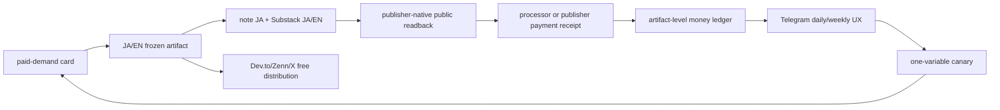
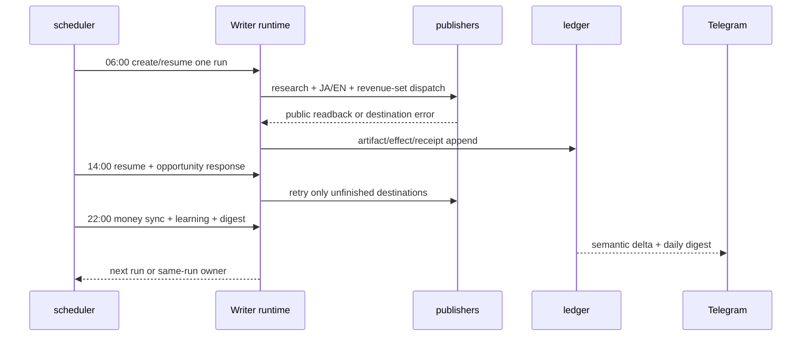

# Writer Agent: 毎日出荷・8時間オーケストレーション・Telegram UX 仕様

**作成日**: 2026-08-20 JST
**状態**: Draft（この仕様を次の実装順序とする）
**正本**: `docs/writer-agent/WRITER-AGENT-SSOT.md`
**対象ランタイム**: Mac Mini `/Users/anicca/.openclaw/`
**対象コード**: `/Users/anicca/profitable-claude` と versioned release tree

## 1. Overview（何を、なぜ直すか）

### 1.1 結論

Writerは「書けない」のではなく、**供給・実行・計測・報告が別々の古いパスに分裂しているため、出版前の安全ゲートで止まり、止まった事実を検出・回復・収益計測できていない**。

8時間ごとに長文記事を3本作ることは現時点の解決策ではない。先に、1本のJA/EN記事を収益面へ確実に出し、同じ`run_id`を復旧し、外部readbackと受取receiptをTelegramへ届ける。8時間 cadence は新規記事の頻度ではなく、**供給・復旧・計測・報告を回す制御面**にする。

### 1.2 実測証拠（Evidence）

| 観測 | 実測値 | 含意 |
|---|---|---|
| 日次run | `daily-2026-08-18`〜`20` は各2ファイルのみ（`git-hash.txt` と `strategy-consumption.json`）、`article-ja.md`/`article-en.md`なし | 6:00の起動後、生成前に終了 |
| 最新日次ログ | `demand topic queue is empty` → `pending claim-loop supply` | モデル呼び出し・公開は実行されていない |
| claim loop | 初回は mutable path `/Users/anicca/profitable-claude/skills/writer-agent/scripts/claim_loop.py` が存在せずENOENT。loaded plistを release `e9ab21ea`へ切り替え、手動wakeは需要集約まで到達 | 実行入口の分裂は修正済み。ただし供給はモデルゲートで停止中 |
| claim loop live rerun | `2026-08-20T18:25:00Z` の receipt は `demand_observations=301`、4 family（`owned_funnel`/`paid_market`/`publisher_opportunity`/`reader_demand`）、`supply=MODEL_UNAVAILABLE`、`queue_after=0` | 需要は見えるが、topic/cardを捏造せず出荷前で停止 |
| Civo demand source | 公式本文の取得が外部DNS/ネットワーク障害で失敗。既存本文receipt（URL・SHA-256・evidence 5 units・2 windows、観測から7日以内）だけを期限付きで再利用 | 需要供給は継続できるが、7日を超えたcacheはhard stop |
| publication lock | adversarial checkで、6時間超でもownerのPIDとprocess-startが生きているlockはquarantineせずretryへ変更 | 生きた記事公開とclaim loopの同時操作を防止 |
| launchd proof | plistはrelease rootと同じだが、環境の`launchctl`操作は全てrc=141（`Reentrancy avoided`） | launchdからの実行receiptは未取得。手動bounded wakeの証拠と分離して扱う |
| money sync | `scripts/money_sync.py` が存在せずENOENT | 収益台帳が更新されない |
| report worker | `scripts/writer_report_worker.py` が存在せずENOENT | Telegramの新しい日次reportが生成されない |
| healthcheck | `article-healthcheck.sh` が存在せずENOENT | 未出荷runを検出できない |
| self-improve | `scripts/self-improve.sh` が存在せずENOENT | canary/KEEP/REVERTが進まない |
| branch/tree | mutable repo HEAD=`889473ce`（`docs/global-gig-market-expansion`）に`skills/writer-agent` treeがない。完全なWriter treeはrelease `e9ab21ea`にある | sourceと実行中release/stateが不一致 |
| scheduler設定 | `.openclaw/cron/jobs.json`のWriter/article系9件は全て`enabled:false` | cron側は実行主体ではない |
| plists | `article-daily`/`article-resume`だけrelease tree、他のworkerはmutable treeを参照。missing executableを含むplistが複数 | 一つのWriterではなく壊れた複数pipeline |
| 直近の報告 | 8/16の最後のWriter Telegram report出力は「受取`¥0/$0`」。8/17以降はreport workerがENOENTで、外部payment receiptの新しい観測はない | 現在の金額は`unknown/stale`で、0と断定不可 |

### 1.3 推論（Inference）

1. **主因はcadence不足ではなく、canonical rootの不在と依存workerのENOENT**。
2. publication gateを厳格にしているため、judge/model-runnerが無いrunは正しく安全停止する。しかし停止後のsame-run resume、healthcheck、money/reportが壊れているため、停止が「毎日何も起きない」に見える。
3. Zennのように直近24時間の新規投稿数で制限されるdestinationがあるため、全platformへ8時間ごとに同じ長文を出す設計は不適切。distributionはdestination別SLOで動かす。

### 1.4 収益の理想状態

Writerは次の順で外部receiptを積む。閲覧、like、paywall表示、checkout開始、予測額は売上にしない。



収益面は現在のSSOT §2.5に従い、最初の必須setを`note/ja`、`substack/ja`、`substack/en`とする。`self-owned`とeditorial feeはreceipt collectorが実装された時点で同じ契約へ追加する。Dev.to、Zenn、X Article/Post、TikTokは発見・信頼・送客面であり、受取receiptが無い限り収益setをブロックしない。

### 1.5 現在の実行境界（実測）

今回の `daily-2026-08-20` は、需要カード、JA/EN本文、不変メディア、品質証跡まで作成した。20:44 JSTの実tickでNote JAが `ne6da5b602b4a` のまま公開され、`https://note.com/anicca123/n/ne6da5b602b4a` の公開後読み戻し（価格¥500、所有者、本文・画像）を記録した。active-fourは `1/4` で、Substack日英の下書きID `211988979` / `211988987` とX記事の編集URL `https://x.com/compose/articles/edit/2090392988765605888` はまだintentである。Noteの最初の依存復旧では `files.pythonhosted.org` のDNS解決に失敗し、20:36 JSTの公開回路保存も空き容量不足で失敗した。

これはNoteだけの公開成功であり、run全体の成功ではない。`publication-state.json` は4件中1件のlive receiptで、`article-run-complete.py` は成功条件を満たさない。収益receiptも存在しないため、売上は0円と断定せず未確認として扱う。初期化報告はTelegram message ID `26065`、未完了報告は `26075` と `26087` で送信済みで、deterministic rendererは自然文だけを送る。現在は同じNoteの再試行を防ぐ pause file を置き、Substackの言語別identityとXの実行可否を確認するまで外部公開を止めている。

pause gateはresume workerとdaily creatorの両方で直接実行し、ロック・planner・publisherより前に終了コード0となることを確認した。変更対象の構文確認と、固定一時領域でのスケジュール／完了通知テスト `37 passed` も確認済み。これは安全停止と回帰契約の確認であり、Substack/Xの新規公開を意味しない。

Substack managed publisherのsource／active release契約fixtureも、JAのpublication identityをstateと環境へ明示したうえでPASSした。これはローカル呼び出し契約の確認であり、外部Substack公開receiptではない。

fresh adversarial reviewでは、空き容量が最新約382MiB（直前は約704MiB）で5GiBの公開下限を下回ることを確認した。resumeにも同じ下限のfail-closed判定を追加し、pause fileが無くても外部作用前に停止する。Substackの言語identity比較は正規化し、source circuitにもreleaseと同じ300秒timeoutを揃えた。EN/Xのidentity・media readbackが未確認のため、pauseは解除しない。

launchdの実測は別の失敗である。`ai.anicca.article-daily` と `ai.anicca.article-resume` のplistは存在するが、`launchctl bootstrap`/`kickstart`/`print` はいずれも `141: Reentrancy avoided` で終了し、初期化tickが終わった後にWriterプロセスは残っていない。したがって現在のloopは「公開処理までON」とは言えず、定期的に公開しているとは言えない。

実行コードはまだLife Managerに統合されていない。releaseは `/Users/anicca/profitable-claude-releases/writer/e9ab21ea/writer-agent`、状態は `/Users/anicca/profitable-claude/skills/writer-agent/state`、Life Managerのcheckoutは `/Users/anicca/Projects/life-manager-main` で、後者にWriter runtime treeはない。旧rootと新rootを同時に動かすと現在のstate lockだけでは重複公開を防げないため、移行前にrepository非依存のshared owner fenceを置く。`/Users/anicca/.openclaw` と `/Users/anicca/profitable-claude` 全体は削除しない。後者はWriter以外の稼働loopも含むため、最後に可能なのはWriter専用releaseの復元試験付きアーカイブだけである。

### 1.6 一件ずつ閉じる順序

| 順序 | 一件の完了条件 | 今の状態 |
|---:|---|---|
| 1 | schedulerが実際に起動し、run/recoveryのPIDと終了receiptを返す | 一部完了。20:44 JSTのresume logは取得済みだが、launchctl readbackはrc=141 |
| 2 | DNSまたは承認済みの代替transportを復旧し、Note/Substackを同じrunから公開する | 一部完了。Noteは公開・読み戻し済み、Substackはidentity待ち |
| 3 | X既存targetをsame-IDで修復し、active-four全件のpublisher-native readbackを記録する | 未完了。live receipt 1/4件 |
| 4 | payment/publisherの実受取receiptをartifactへjoinし、自然文Telegramへ送る | 未完了。revenue receipt 0件 |
| 5 | Life Managerのmanifestへsource/release/state/全19 workerを移し、shared fenceで旧ownerをdrainしてから無効化する | 未着手。削除も未実施 |

## 2. Acceptance Criteria（完了条件）

### 2.1 P0: canonical runtime

| # | MUST | 完了receipt |
|---:|---|---|
| A1 | Writerのsourceは一つのmanifestで固定する。`source_repo=/Users/anicca/profitable-claude`、`release_root=/Users/anicca/profitable-claude-releases/writer/<commit>/writer-agent`、`state_root=/Users/anicca/profitable-claude/skills/writer-agent/state`を同じmanifestに記録する | `writer-runtime-manifest.json`とSHA-256 |
| A2 | loaded plistの全ProgramArguments、worker script、model-runner、healthcheck、report、money、claim、opportunity、learningがmanifestから解決でき、missing pathが0 | path census receipt |
| A3 | 新規記事creatorは1つ、same-run resume ownerは1つ。旧`writer-*` engineとdisabled cronのarticle creatorは実行主体から除外する | label census receipt |
| A4 | mutable stateはrelease codeと同じschema/versionを持つ。run開始時にrelease commit、prompt hash、state schemaを保存する | run preflight receipt |
| A5 | source/release/stateの不一致は生成前に止め、Telegramへ`blocked: runtime drift`を1回だけ送る | drift fixture |

### 2.2 P0: 供給・日次出荷・復旧

| # | MUST | 完了receipt |
|---:|---|---|
| A6 | claim loopが24時間先まで最低1枚、最大7枚のpaid-demand cardを`ready`で供給する。queue空は成功扱いにせず、供給workerのincidentを作る | `demand-card` receipt |
| A7 | 06:00 JSTに1つの`run_id`を作り、JA/EN artifactを凍結する。未完runがある場合は新topicを作らず同じrunをresumeする | run/artifact hash |
| A8 | revenue set 3件すべてをpublisher-native public readbackまで進める。1件の失敗は他destinationを止めない | note/Substack readback receipts |
| A9 | 失敗は`run_id + artifact_id + destination + failure_class`で一意化し、`OBSERVE → DIAGNOSE → ACT → VERIFY → RESUME`を同じrunで行う | incident + same-run resume receipt |
| A10 | free distributionは独立SLOで記録し、Zennの24時間windowなど外部制限は対象destinationだけ`PENDING`にする | per-destination receipt |
| A11 | 連続3日、06:00 triggerがarticle artifactまたは明示的blocker receiptを作る。無言終了、空run、URLなしの`published`を許可しない | 3日連続 live receipt |

### 2.3 P0: money truth

| # | MUST | 完了receipt |
|---:|---|---|
| A12 | note/Substack/self-owned/editorialの各collectorが存在し、`artifact_id`へ厳密joinする | collector health receipt |
| A13 | gross、refund、platform fee、compute cost、net、payoutを通貨別に保存する。外部証拠が無い値は`unknown`で、0へ変換しない | balanced ledger row |
| A14 | 最初の非test外部paymentまたはpublisher fee receiptを記事artifact、URL、契約/注文IDへjoinする | S0 receipt |
| A15 | MRRとone-time revenueを分離する。views/likes/paywall/checkoutはrevenue ledgerへ入れない | ledger invariant test |

### 2.4 Telegram UX

| # | MUST | 完了receipt |
|---:|---|---|
| A16 | immediateは公開、売上、payout、failure、recovery、opportunity state changeだけ送る。同一semantic hashは再送しない | delivery receipt with message id |
| A17 | 日次digestは売上0でも必ず1回送る。週次digestも必ず1回送る | daily/weekly message IDs |
| A18 | owner向け本文は利用者の設定言語による自然文で始め、起きたこと・理由・実際の受取・次の自動行動・公開リンクを説明する。`Codex:::`、`Claude:::`、`exact8 COMPLETE`、生のstatus enum、内部run IDを本文の先頭や主文に出さない。技術詳細は任意の詳細リンクの先に置く | natural-language renderer contract test |
| A19 | `PENDING`には対象、外部理由、最短retry時刻、durable owner、並行作業を自然文で含める。Telegram event UUIDはledgerと詳細リンクに保存し、主文へ出さない。裸の`WAITING`と生stack traceを送らない | pending fixture |
| A20 | TelegramとWeb/Local UIは同じledger snapshotと`semantic_hash`を使う | snapshot parity receipt |

### 2.5 8時間 cadence gate

| # | MUST | 完了receipt |
|---:|---|---|
| A21 | 最初は新規長文を1日1本だけ作る。8時間ごとは`control beat`として供給・復旧・計測・報告を実行する | scheduler matrix |
| A22 | 14日連続でA1〜A20がPASS、重複外部作用0、revenue-set readback成功率100%、budget超過0を満たすまで、3本/日の長文publishを開始しない | 14-day gate |
| A23 | A22後に8時間publishを7日間canaryする場合でも最大3本/日、destination別rate-limit、net revenue/compute、failure率、品質退行を測る。悪化・unknown・policy違反で即REVERT | cadence canary + rollback receipt |

### 2.6 Global reach と $10K gate

| # | MUST | 完了receipt |
|---:|---|---|
| A24 | 各artifactを`discovery`、`owned subscription`、`transactional product`、`high-ticket writing`の一つ以上へ割り当て、同じ全文の無差別重複投稿をしない | platform-role matrix |
| A25 | 英語・日本語・Tagalogは言語別artifact、native QA、対象国のpayout/税務/利用規約を持つ。KDPの対応言語外（現行リストではTagalog等）はKDPへ送らない | locale/platform receipt |
| A26 | 「最大市場」をMAU、登録会員、paid subscription、実受取の別指標で保存し、異なる指標を一つのランキングに混ぜない | market-metric provenance |
| A27 | $10Kは`paid customers × net ARPU + verified one-time sales + verified commissions − refunds − fees − compute`で計算し、シナリオの仮定と実receiptを分離する | $10K ledger scenario |

### 2.7 Language/account allocation gate

| # | MUST | 完了receipt |
|---:|---|---|
| A28 | `account_key`ごとに、所有者、言語、platform role、記事種別、月間上限、収益stream、学習指標、payout scopeをregistryへ保存する。実アカウント名やcredentialはsecret storeから参照し、specやTelegramへ書かない | account allocation registry |
| A29 | 現在の`aniccabuddha.substack.com`は既存のJA/EN混在記事を削除・移動せず`substack_ja_legacy`として扱い、新規EN記事を停止する。ENは別publication identity・別`SUBSTACK_PUBLICATION_EN`・別購読/売上台帳で開始する | Substack language isolation receipt |
| A30 | `substack/ja`と`substack/en`のpublish adapterはpublication identityをpair単位で解決し、単一の`SUBSTACK_PUBLICATION` fallbackへ戻らない。既存混在記事は履歴として保持し、新規記事の言語・読者・receiptを混ぜない | pair-to-publication contract test |
| A31 | $10Kのbase design targetは、EN Substack 500人、JA Substack 250人、note JA有料購入300件、KDP 100冊という単位とnet計算を保存する。これは予測ではなく、実receiptで置き換える学習目標である | target-vs-actual ledger test |
| A32 | 記事種別を`pillar_research`、`conversion_article`、`discovery_derivative`、`product_chapter`、`high_ticket_brief`に分類し、platformごとの月間上限と学習指標を守る。同じ全文を別言語・別アカウントへ自動複製しない | article allocation and duplicate test |
| A33 | 許可済みaccount registryとowner-controlled mailboxが揃った後は、topic選定・執筆・公開・receipt回収・報告を無人で継続する。未承認account作成、第三者メール収集、使い捨てaliasによる制限回避、CAPTCHA/KYC回避は拒否する | autonomous-run fixture accepts approved account and rejects unapproved identity/evasion |

## 3. As-Is / To-Be

| 領域 | As-Is（実測） | To-Be（MUST） |
|---|---|---|
| source | current branchにWriter treeなし。releaseだけが完全tree | release manifestから全workerを同一versionで解決 |
| schedule | article-dailyは6:00で起動するがdemand空でprovider前にexit。cron 9件はdisabled | 6:00 creator、5分 resume/health、15分 opportunity、1時間 money、22:00 learning/reportを一つのregistryで管理 |
| demand | claim loopのENOENTは解消。Civo cache fallbackで301 observations/4 familiesまで復旧したが、CodexはDNS失敗、Claudeは未ログインで`MODEL_UNAVAILABLE`、queue=0 | 24h先までpaid-demand cardを供給し、provider unavailableはincident化。topic/cardを空欄や推測で埋めない |
| publication | note/Substack/X/Zenn等が混在し、draft/intent/readbackが長期滞留 | revenue-setとfree-distributionを分離し、同じrunをdestination単位で再開 |
| healing | healthcheck、repair、self-improveの入口が欠損 | 失敗signatureを保存し、同一artifactを修復・検証・resume |
| money | money sync欠損。最後のreportは8/16で受取¥0/$0 | receipt-only ledger。未計測はunknown。MRR/one-timeを分離 |
| Telegram | 旧live pair通知は`✅ substack/ja live`、completionは機械的なevent名で、未完了のdeterministic tickは報告を送らない経路があった | pending/live/completionを一つの自然文rendererに通し、公開後readbackのURLだけをリンクとして出す。未確認の公開・入金は完了や0円に変換しない |
| account | `run.sh`の`substack-ja`と`substack-en`が同じ`SUBSTACK_PUBLICATION`を既定値にする | JA legacyとEN dedicated publicationをpair単位で分離し、言語別receiptを学習 |
| cadence | “毎日”はtriggerの存在であり、shipの証拠ではない | ship = public readback + artifact hash + payment observation（未入金は正直にunknown） |

### 3.1 理想の運用UX

Telegramは一つのDMを「操作画面」ではなく、**お金と未完了workのtruth surface**として使う。

```text
今朝の実行は、記事を作る前に止まりました。

需要カードの供給が空だったためです。自動復旧担当が供給を直し、同じ記事の作業を再開します。
今回確認できた入金はありません。未確認の金額は0円とは扱っていません。
公開リンク: https://example.invalid/status/daily-2026-08-20
次の行動: 供給が戻り次第、次の予定時刻を待たずに続けます。あなたの操作は不要です。
```

メッセージ種別は次の4つに固定する。内部の状態名はledgerに保存するが、Telegramの本文には表示しない。

1. **公開・販売の変化**: 何が公開されたか、公開リンク、読者に見える状態、確認済みの受取。
2. **日次報告（22:30 JST）**: 今日と月累計、継続購読と単発売上、確認済み・未確認・保留の金額、記事リンク、失敗、復旧、次の一件。
3. **週次の振り返り（月曜）**: どの記事・言語・platformが読まれ、購読・購入につながったか、手数料と計算資源を引いた結果、次に試す一つの変更。
4. **固定メッセージ**: 最新の公開記事、未完了の作業、次の自動行動、入金の真実を自然文でまとめる。変化がない限り新しいメッセージを作らない。

UI上の色・語彙は次に固定する。

| 状態 | 表示 | 意味 |
|---|---|---|
| `LIVE` | 緑 | 「公開されました」 |
| `EARNED` | 金 | 「入金を確認しました」 |
| `PENDING` | 黄 | 「外部サービスの返答待ちです」 |
| `UNKNOWN` | 灰 | 「まだ確認できていません」 |
| `BLOCKED` | 赤 | 「自動復旧が必要です」 |
| `TEST` | 紫 | 「試験結果です。売上には含めません」 |

### 3.2 8時間のcontrol beat



`14:00`と`22:00`は前runが未完なら必ず同じrunを優先する。新しい長文を作って未完runを隠すことを禁止する。8時間publish canaryはA22合格後だけ別の実験として起動する。

### 3.3 Global distribution と $10K/月の算数

「最大市場」は一つのランキングではない。MAU、登録会員、paid subscription、
実際の受取は別の指標なので、Writerはそれぞれを別欄で保存する。大きい
discovery面へ出すことは必要だが、収益はconversionとreceiptが発生した
面でだけ計上する。

| 面 | 一次情報で確認できる規模・条件 | Writerでの役割 |
|---|---|---|
| note（日本） | 公式membership pageの最新表示は、MAU 9,123万人（2025年12月〜2026年5月平均）、会員1,248万人（2026年5月末）、収益を得た人20万人（2025年3月末）。membershipのplatform feeは10%（通常の定期購読マガジンは20%）で、別途決済・振込手数料。海外から購入できても、売上の受取には日本国内銀行口座が必要。<https://note.com/lp/membership> <https://www.help-note.com/hc/ja/articles/23948492341785-> | 日本語の有料記事、メンバーシップ、定期購読。revenue surface |
| Substack（global） | 公式Aboutはpaid subscriptions 500万超、週次読者は数千万人、paid subscriptionの30%以上がnetwork内発見と説明。paid時はSubstack 10%＋Stripe費用。<https://substack.com/about> <https://support.substack.com/hc/en-us/articles/360037607131-How-much-does-Substack-cost> | 第一のowned subscription面。英語・日本語・Tagalogの別publicationを作れるが、receiptはpublication単位 |
| Medium（global） | 公式Aboutは月間1億人超。Partner Programはpaid memberのread time/interaction等で分配し、現在のeligibility listに日本・フィリピンを含む。<https://medium.com/about> <https://medium.com/partner-program> <https://help.medium.com/hc/en-us/articles/39121627791639-Medium-Partner-Program-eligibility> | discovery＋revenue-share。固定単価ではないため主収益の予算根拠にしない |
| Patreon（global） | 2025-08-04以後に公開した新規creator pageは標準platform fee 10%＋processing等。membershipとone-time digital saleに対応し、日本・フィリピンのpayout経路も確認できる。<https://support.patreon.com/hc/en-us/articles/11111747095181-Creator-fees-overview> <https://support.patreon.com/hc/en-us/articles/39694936541965-Payouts-guide-for-creators-outside-of-the-US> | owned membership／one-time productの第二経路 |
| Amazon KDP（global/JP） | eBookは35%または70% royalty。70%は地域・価格・delivery条件があり、日本語は対応言語。現行の対応言語リストにTagalog/Filipinoはない。<https://kdp.amazon.com/en_US/help/topic/G200634500> <https://kdp.amazon.com/en_US/help/topic/G200673300> | まとまった知識をbook化するtransactional面。Tagalog版はKDPへ送らない |
| Zenn（日本・技術） | 2026年7月の公式法人向け表示は月間PV1,600万、登録20万人、月間UU330万人。本は0〜5,000円、badgeでも分配金。手数料は決済3.6%＋決済後価格のplatform 10%。英語は日本語→英語翻訳betaのみで、Tagalog経路は確認できない。<https://zenn.dev/biz-lp> <https://zenn.dev/about> <https://zenn.dev/terms/transaction-law> | 技術記事のdiscoveryと日本語book販売。24時間投稿制限を守る |
| Gumroad（global） | 自社導線の販売は10%＋$0.50＋カード処理、Gumroad marketplace discoveryは30%。現行のbank payout表にはJapan/JPYとPhilippines/PHPが載るが、KYC・最低残高$100・国別条件がある。<https://gumroad.com/help/article/66-gumroads-fees.html> <https://gumroad.com/help/article/13-getting-paid.html> | PDF・book・bundleのowned checkout。marketplace売上は手数料差を別管理 |
| LinkedIn Newsletter（global） | LinkedInは1 billion members到達を公式投稿で発表。Newsletterは記事のsubscribe、in-app/email通知を提供するが、ここで確認できる直接writer payoutはない。<https://www.linkedin.com/help/linkedin/answer/a517914/newsletters-on-linkedin-faq?lang=en> | B2B discovery、editorial/consulting lead。直接売上面と誤認しない |

#### $10Kのシナリオ算数（仮定であり予測ではない）

計算は`net revenue = paid customers × net ARPU + verified one-time sales +
verified commissions − refunds − fees − compute`で行う。例えば、税・返金・通貨
換算・computeをまだ除いた単純感度は次の通り。

| 仮定 | 1件あたり概算net | $10,000/月に必要な件数 |
|---|---:|---:|
| Substack $15/月：10%＋Stripe 2.9%＋recurring billing 0.7%＋$0.30を控除 | $12.66 | 約790 paid subscribers |
| Patreon $15/月：新規creatorの10%＋標準processing 2.9%＋$0.30を仮定 | $12.77 | 約783 paid members |
| KDP $9.99 eBook：70%−公式例の平均delivery $0.06を仮定 | $6.93 | 約1,443 sales |
| note membership 1,500円/月：カード事務5%を引いた残額にplatform 10%を適用 | ¥1,282.5 | $1≈¥150を仮定した$10K相当で約1,170 members |
| Zenn 5,000円 book：`5,000 × (1−0.036) × (1−0.10)` | ¥4,338 | 為替を固定せず、円台帳で別計算 |

したがって、最初の$10Kは「全platformへ同じ記事を大量投下」ではなく、次の
ような複線で作る。

1. **Owned subscription**：SubstackまたはPatreonで、英語・日本語・Tagalogを別publication/segmentとして運営する。
2. **Product**：長文を月次でbook/bundle化し、KDP、Zenn、Gumroad、noteへ対象言語・対象市場だけ出す。
3. **Discovery**：LinkedIn、X、Dev.to、Zenn無料記事など、現在のprovider policyで許可された面からowned listまたはproductへ送る。Mediumは自動生成記事をAPIで投稿できないため、この無人laneには含めない。
4. **High-ticket**：editorial fee、企業向け調査記事、ghostwritingを別streamで受注する。これはplatform viewではなく契約receiptで計上する。

例として、`600 Substack paid × $12.66 = $7,596` と `350 KDP sales ×
$6.93 = $2,426`で約$10,022になるが、これは必要販売量を示す感度分析で
あって、達成確率やconversion rateの証明ではない。到達するまでは、各面の
実receiptを積み上げて仮定を実測値に置き換える。

#### 言語展開のルール

- **英語**はglobal discoveryとSubstack/KDPの基準言語。高単価の専門テーマを優先する。
- **日本語**はnote、Zenn、KDP Japanのnative audienceへ出す。英語記事の機械翻訳をそのまま有料化しない。
- **Tagalog**は、現行のpayout・native QA・provider policyを確認できた面だけを使う。Medium APIの自動生成記事投稿は対象外で、KDPの現行supported-language listにもないため、KDP販売は行わない。
- 1つのtopicから言語ごとに別artifactを作り、native QA、タイトル、価格、CTA、法務・税務・payoutのreadbackを通す。全文同一の無差別cross-postは、品質低下・重複・platform policy違反のリスクがある。

Mediumは公式更新でcontent mill、AI-generated article、attention baitを積極的に抑制すると説明している。したがって、投稿量を増やすこと自体が収益を増やすのではなく、各言語で人間に読まれる品質とmember readbackを増やすことが必要になる。<https://medium.com/blog/partner-program-changes-are-rolling-out-now-456306d16cb9>

### 3.4 Account・記事種別・$10K base allocation

記事種別・本文形・account・platformの正本はWriter SSOT §2.6である。この表は、その配分を実行するための月間上限と学習指標を定義する。

この表の金額は、税・返金・為替・computeを除く**設計目標**であり、予測では
ない。実際の収益欄は必ずpublisherまたはpayment processorのreceiptで置き換える。
`月間上限`は作成許可数で、未完runや品質・policy gateを無視して満たすノルマではない。

| account_key | 現在／開始条件 | 言語・主な記事種別 | 月間上限 | $10K baseへの計上 | 学ぶこと |
|---|---|---|---:|---:|---|
| `substack_ja` | 現在の`aniccabuddha.substack.com`をJA legacy/currentとして維持。新規ENは禁止 | JA `pillar_research`、`conversion_article`、member letter | 長文8＋member letter4 | 250 paid × ¥1,500、net約¥320,625（約$2,138） | 無料→有料、継続、解約、テーマ別net ARPU |
| `substack_en` | 別publication identityと`SUBSTACK_PUBLICATION_EN`を作成し、readback後に有効化 | EN `pillar_research`、case study、how-to、member letter | 長文8＋member letter4 | 500 paid × $15、net約$6,330 | topic別paid conversion、churn、英語読者の継続 |
| `note_ja` | 既存`anicca123` | JA `conversion_article`（Substack版と同じ全文ではなく実用追加部分を持つ） | 有料記事8 | 300購入 × ¥500、net約¥128,250（約$855） | 記事ごとの閲覧→購入率、返金、net/article |
| `kdp_publisher` | 既存publisher accountを一つだけ使用。言語別book IDを分ける | EN/JA `product_chapter`、evergreen book | book 1冊/四半期、販売100冊/月を観測目標 | 100冊 × 約$6.93、約$693 | 言語別販売、ページ読了、net/book |
| `medium_en` / `medium_ja` | provider-policy gate専用。公式APIは自動生成コンテンツ投稿を禁止するため、無人API公開を行わない | EN/JA `discovery_derivative`（明示的に許可された経路だけ） | 0（許可が証明されるまで） | $0（receiptができるまで） | 読了→owned購読クリック、topic別流入 |
| `devto_en` | 既存EN account | EN technical `discovery_derivative` | 4 | $0 | 技術読者→Substack/KDP導線 |
| `zenn_ja` | 既存JA account | JA technical `discovery_derivative`、`product_chapter` | 記事4＋book 1冊/四半期 | $0（book receiptのみ別計上） | 技術テーマの読了→book購入 |
| `linkedin_en` | 既存B2B profile/newsletter | EN `high_ticket_brief` | 8 | $0 | 問い合わせ、提案、契約化率 |
| `x_ja` / `x_en` | discovery account。言語別artifactを別々に記録 | JA/EN short `discovery_derivative` | 各20 | $0 | 拡散→owned面へのクリック |
| `patreon_locale_tier` / `gumroad_locale_store` | Substack/noteのconversionが確認できた後に有効化 | JA/EN/TL member post、bundle | 各4 member post／bundle1 | base外のupside | checkout、継続、返金、payout |
| `tagalog_pilot` | payout・native QA・policy確認後のみ | TL `pillar_research`、`conversion_article` | 2 | base外。最初のreceiptまで予算0 | TL読者の実conversion。KDPへは送らない |

#### 1つのテーマをどう配分するか

1. まず一つの調査から、英語と日本語の別の`pillar_research`を作る。Tagalogはnative QAが通るテーマだけ別に書く。
2. `substack_en`と`substack_ja`には、それぞれの読者に合わせた完全版を出す。英語と日本語を同じSubstack publicationへ新規投稿しない。
3. `note_ja`には日本語の実用的な追加部分を持つ有料版を出す。同じ全文の単純コピーは禁止する。
4. Dev.to、Zenn、LinkedIn、Xには目的別の短縮・技術・B2B派生版を出し、owned面へリンクする。Mediumは公式に許可された非自動経路が確認できた場合だけ別gateで扱う。
5. KDP、Gumroad、Zenn bookは、反応の良かった複数記事をまとめて商品化する。日々の投稿数を増やすための商品化はしない。

Substackの実装は、`substack/ja → SUBSTACK_PUBLICATION_JA`、`substack/en →
SUBSTACK_PUBLICATION_EN`を必須とする。platformが同じloginで複数publicationを
許す場合でも、publication identity、読者、購読、価格、payout、ledgerは分離する。
既存混在記事を削除・移動して整合させることはしない。

## 4. Test Matrix

| # | To-Be | Test name | Cover |
|---:|---|---|---|
| 1 | canonical manifest | `test_all_loaded_writer_paths_exist()` | missing path / release drift |
| 2 | one creator/resume | `test_writer_label_census_has_one_creator_and_one_resume()` | duplicate daily creator |
| 3 | demand supply | `test_empty_paid_demand_creates_incident_and_no_provider_call()` | queue empty |
| 4 | daily artifact | `test_daily_run_freezes_ja_en_artifacts_once()` | duplicate run / hash drift |
| 5 | revenue-set | `test_revenue_set_readback_is_required_but_free_destinations_are_nonblocking()` | note/Substack vs Dev.to/Zenn/X |
| 6 | same-run heal | `test_failure_resumes_same_run_artifact_and_effect_once()` | retry / duplicate side effect |
| 7 | honest money | `test_unknown_is_not_zero_and_views_are_not_revenue()` | fake revenue / currency mix |
| 8 | Telegram delta | `test_same_semantic_hash_is_deduped_and_message_id_is_recorded()` | notification spam |
| 9 | Telegram daily | `test_zero_revenue_daily_digest_still_delivers()` | silent day |
| 10 | Telegram pending | `test_pending_includes_owner_reason_retry_and_event_uuid()` | ownerless wait |
| 11 | snapshot parity | `test_telegram_and_web_share_ledger_semantic_hash()` | divergent UX |
| 12 | cadence gate | `test_eight_hour_canary_reverts_on_net_or_policy_regression()` | over-publishing |
| 13 | live E2E | `test_live_trigger_to_public_readback_to_telegram_receipt()` | installed loop truth |
| 14 | natural-language report | `test_owner_message_has_plain_sentence_and_public_link_without_harness_prefix()` | machine-only report / `Codex:::` leakage |
| 15 | Substack separation | `test_substack_language_pair_resolves_distinct_publications_and_ledgers()` | JA/EN audience mixing |
| 16 | allocation target | `test_base_target_is_scenario_only_and_actuals_require_receipts()` | forecast counted as money |
| 17 | article allocation | `test_one_topic_yields_language_native_role_bound_artifacts_without_duplicate_fulltext()` | blind cross-post |
| 18 | autonomous boundary | `test_approved_account_run_is_autonomous_and_unapproved_identity_or_mail_harvest_is_rejected()` | account/policy evasion |

| Item | Value |
|---|---|
| UI変更 | あり（Telegram message contract、pinned status、daily/weekly digest） |
| E2E結論 | Maestro: 不要。Telegram実機E2Eとpublisher-native readbackが必要（iOS UIではないため） |

## 5. Boundaries（今回やらないこと）

- 8時間ごとの長文3本publishを、A22の実績前に開始しない。
- 「市場が大きい」という理由だけで全platformへ全文を同時cross-postしない。各面のrole、言語、rate-limit、payout、readbackを満たしたものだけ有効化する。
- Writer loopのTelegram本文に`Codex:::`、`Claude:::`、内部run ID、機械enumだけを置かない。利用者の設定言語による自然文と公開リンクを必須にする。
- 日本語と英語の新規記事を一つのSubstack publicationへ混在させない。既存混在記事の削除・移動・改変はしない。
- 月間上限や$10K base allocationを売上実績として表示しない。実receiptがないstreamは未確認またはbase外として表示する。
- primary sessionが記事を手動公開して成功扱いにしない。
- views、likes、impressions、paywall、checkout、推定収益を受取額にしない。
- Zennの24時間投稿制限、各platformのpolicy、外部KYC・契約・決済承認を回避しない。
- 新しいplatform adapter、派生商品、$10M scale controllerをP0に混ぜない。
- 既存の`~/.cloak`、`~/.openclaw/state/*.jsonl`、credential、memoryを削除・上書きしない。
- 旧SSOT履歴（`docs/loop-engineering/47-*`）を現行TODOとして復活させない。
- account作成・KYC・CAPTCHA・電話確認・payout identityを自動で迂回しない。認証メールはownerが管理する専用mailboxまたは許可済みOAuth経路だけを読む。第三者のメールアドレスを収集して読者・登録・送信に流用しない。

## 5.1 One-by-one execution ledger（2026-08-20実測）

一度に一つの故障クラスだけを閉じる。今回のsliceはコードを直接直し、既存の実行入口をboundedにwakeし、receiptを読み戻した。記事生成・外部公開はprovider gateが戻るまで起動しない。

| Slice | 状態 | 実測 | 残り |
|---|---|---|---|
| 実行rootとstate | 修正済み（live） | claim plistとdaily plistがrelease `e9ab21ea`を指し、release `state`とmutable stateが同じdevice/inode。manifestへの永続化は未完了 | source/release manifestと全workerのpath census |
| 需要source outage | 修正済み（bounded） | Civoの7日以内・hash/evidence検証済み本文だけを再利用し、4つの需要familyを集約 | cache期限切れ時の新規公式取得 |
| provider gate | 正しく停止 | CodexはDNS解決失敗、Claudeは認証不足。receiptは`MODEL_UNAVAILABLE`、queue=0、生成物なし | 承認済みproviderを1つ復旧して再wake |
| publication lock | 修正済み（live） | owner PID + process-startを保存し、生存ownerの古いlockをquarantineしない。`py_compile`、`bash -n`、isolated fixtureを通過 | launchd上で同じ挙動をreadback |
| launchd | 未検証（環境blocker） | `launchctl`はrc=141で再入を拒否 | launchdを再読込できる環境でkickstart receipt |

## 6. Execution Steps（残TODOの順序）

### P0-1 Canonical runtimeを復旧（進行中）

初回のclaim plistが指していたmissing mutable pathは、live plistをrelease `e9ab21ea`へ修正し、release codeとmutable stateを同一inodeへ接続した。まだ`writer-runtime-manifest.json`、全worker path census、launchdからの再起動receiptが無いため完了ではない。`/Users/anicca/profitable-claude`のWriter sourceをreleaseの完全treeと同じ契約へ戻し、manifestを作り、旧`writer-daily` engineとdisabled article cronを実行主体から外す。完了条件はA1〜A5。

### P0-2 Demand supplyを復旧（provider gateで停止中）

`claim_loop.py`、`claim_store.py`、`claim_supply.py`、`demand_authority.py`は同一releaseから実行される。Civo公式本文が取得できない場合は、7日以内でSHA-256/evidence一致の既存receiptだけを再利用し、期限切れはhard stopする。`2026-08-20T18:25:00Z`のmanual wakeは301 observations/4 familyを集約したが、Codex DNS失敗とClaude未認証のため`MODEL_UNAVAILABLE`、queue=0で終了した。完了条件A6には、承認済みproviderを復旧し`ready` cardを最低1枚作るreceiptが残る。

### P0-3 1日1本のrevenue-set E2E

実際のlaunchd `ai.anicca.article-daily`をkickstartし、`note/ja`と`substack/ja`を
同一runでreadbackする。`substack/en`は専用publication identityのreadbackが通る
まで明示的に保留し、混在中のJA publicationへ逃がさない。未完は
`article-resume`が同じrunを所有する。完了条件はA7〜A11。

### P0-4 監視・収益・機会・学習workerを同じreleaseに戻す

`article-healthcheck.sh`、`money_sync.py`、`writer_report_worker.py`、`writer-sales-measure-worker.sh`、`opportunity_discovery.py`、`opportunity_response.py`、`self-improve.sh`をmanifestから解決する。実行後に、失敗・受取・MRR・canaryがledgerへ入ることを確認する。完了条件はA12〜A15。

### P0-5 Telegram UXを実装・実機確認

既存の`✅ substack/ja live`、`[event] exact8 COMPLETE`、`status=PASS runs=...`の短文を、利用者の設定言語による自然文へ変換するrendererへ統合する。本文は「何が起きたか」「なぜ起きたか」「公開リンク」「確認済みの入金または未確認」「次の自動行動」を含み、harness名・内部enum・内部run IDを主文に出さない。semantic-hash dedupe、message id、固定メッセージ、売上0の日次報告、週次経済報告、owner付き外部待ちを実装する。`openclaw message send --channel telegram --target 8547730585 --json`の実receiptを取得し、同じsnapshotのWeb/Local表示とhash一致を確認する。完了条件はA16〜A20。

### P0-6 Account registryとSubstack言語分離

`account_key`、言語、role、記事種別、月間上限、payout scope、学習指標を
registryへ作る。`substack/ja`は`SUBSTACK_PUBLICATION_JA`、`substack/en`は
`SUBSTACK_PUBLICATION_EN`からのみ解決し、単一publication fallbackを削除する。
既存の混在記事を削除・移動せず、専用EN publicationの作成・ログイン・公開URL・
購読対象・receipt collectorを実測する。完了条件はA28〜A30。

### P1-1 8時間control beatを有効化

06:00 creator、14:00 recovery/opportunity、22:00 money/learning/report、5分health/resumeを同じregistryへ登録する。14日間、毎beatにreceiptがあることを観測する。完了条件はA21〜A22。

### P1-2 8時間publish canary（条件付き）

A22を満たした後だけ、1変数・最大3本/日・7日間のcanaryを実行する。net revenue/compute、品質、policy、duplicate、rate-limitを比較し、悪化またはunknownなら自動REVERTする。完了条件はA23。

### P1-3 Global platform lane（条件付き）

A22の安定性とA27のledgerが確認できた後、最初に`SUBSTACK_PUBLICATION_JA`と
`SUBSTACK_PUBLICATION_EN`を別々に解決する。既存の混在publicationには新規ENを
追加しない。次に英語＋日本語の2言語で、Substack（owned）、LinkedIn/Dev.to/
Zenn/X（discovery）、KDP/note（product）を一面ずつ有効化する。Mediumは
自動生成コンテンツをAPI投稿できないため、provider policy gateが通るまで有効化しない。account
registryの月間上限を超えず、A31のtarget-vs-actualを同じ`artifact_id`で追跡する。
各面は30日単位でreadback、paid conversion、net revenue、refund、compute、
quality、policy incidentを比較し、receiptがない面はscaleしない。完了条件はA24〜A32。

### P1-4 Tagalogと二次収益面（条件付き）

Substack EN/JAまたはnoteで言語別のconversionが確認できた後、Tagalogは2本/月の
pilotから開始する。Substack、Patreon、Gumroadのpayout、native QA、
policy、返金処理を実測し、KDPへは送らない。PatreonとGumroadはbase $10Kに二重
計上せず、既存の有料購読またはnoteの同じ顧客を別売上として再利用しない。

## 7. 調査ソースと判断根拠

外部取得は`crwl` 6 query（英語3、日本語3）ではChromiumの`MACH_PORT_RENDEZVOUS`/code 141で失敗した。公式ドメイン限定の検索・openでfallbackし、下表の一次URLを実測した。取得できなかった指標は推測で埋めていない。

| ソース | URL | 核心の引用 | この仕様への適用 |
|---|---|---|---|
| Anthropic, Building Effective Agents | https://www.anthropic.com/engineering/building-effective-agents | 「agents dynamically direct their process and tool use from environmental feedback」 | 固定cronではなく、外部readbackでreplanする。ただしdeterministic safety boundaryはruntimeが持つ |
| OpenAI Agents SDK, Multi-agent orchestration | https://openai.github.io/openai-agents-python/multi_agent/ | 「LLM orchestration, where the model plans and selects tools, [is separated] from code orchestration used for deterministic boundaries」 | Writerの計画・診断はAgent、schedule/idempotency/money truthはcode |
| OpenClaw FAQ, env loading | https://docs.openclaw.ai/help/faq#how-does-openclaw-load-environment-variables | 「OpenClaw reads env vars from the parent process (shell, launchd/systemd, CI, etc.)」 | plist/launchdが同じ`.env`とrootを使うpreflightを必須化 |
| OpenClaw FAQ, runtime status | https://docs.openclaw.ai/help/faq#why-does-openclaw-gateway-status-say-runtime-running-but-rpc-probe-failed | 「running is the supervisor’s view」 | process/triggerが存在することをshipと誤認せず、外部readbackを完了条件にする |
| OpenClaw FAQ, Telegram propagation | https://docs.openclaw.ai/help/faq#how-do-commands-propagate-between-the-telegram-gateway-and-nodes | 「Telegram messages are handled by the gateway」 | Telegramは状態の配信面。worker内のraw stdoutを直接UIにしない |
| Writer SSOT §2.3/§2.5/§6 | `docs/writer-agent/WRITER-AGENT-SSOT.md` | 「A view, like, or impression is not revenue」「daily revenue set」「Daily and weekly reports are mandatory even when revenue is zero」 | receipt-only会計、revenue-set、0円でも日次報告を固定 |
| Writer release SKILL, Zenn operations | `/Users/anicca/profitable-claude-releases/writer/e9ab21ea/writer-agent/SKILL.md` | 「Zenn limits NEW articles by 直近24時間の投稿数. Publish 1 new article/window」 | 全platform一律8時間publishを禁止し、destination別SLOにする |
| note公式 membership | https://note.com/lp/membership | 「MAU 9,123万」「会員数1,248万人」「収益を得た人20万人」／platform fee 10% | 日本のdiscovery規模、収益化母数、feeを別指標で保存 |
| noteヘルプ, fees/payout | https://www.help-note.com/hc/ja/articles/360011358873-%E3%82%B3%E3%83%B3%E3%83%86%E3%83%B3%E3%83%84%E3%82%92%E8%B2%A9%E5%A3%B2%E3%81%99%E3%82%8B%E9%9A%9B%E3%81%AB%E5%BC%95%E3%81%8B%E3%82%8C%E3%82%8B%E6%89%8B%E6%95%B0%E6%96%99 / https://www.help-note.com/hc/ja/articles/23948492341785- | 決済手段別事務手数料、platform 10%、海外売上の受取は国内口座 | noteのnet計算と海外言語のpayout gate |
| Substack About / pricing | https://substack.com/about / https://support.substack.com/hc/en-us/articles/360037607131-How-much-does-Substack-cost | 「5 million paid subscriptions」「90% goes to you」／paid時10%＋Stripe | owned subscriptionのnet ARPU感度 |
| Substack multiple publications / paid setup | https://support.substack.com/hc/en-us/articles/360037824371-Can-I-create-multiple-publications-under-the-same-account / https://support.substack.com/hc/en-us/articles/360037459952-How-do-I-set-up-a-paid-publication / https://support.substack.com/hc/en-us/articles/360037825111-How-do-I-create-a-publication-on-Substack | 同一loginで複数publicationを所有できるが、publicationごとに読者・価格・ledgerを分離し、別Stripeを要求する | `substack_ja`/`substack_en`の言語・payout分離 |
| DEV/Forem API | https://developers.forem.com/api/v0 | `POST /articles`で`body_markdown`、`published`、`canonical_url`等を受ける | `devto_en`のfree discovery adapter |
| X Articles | https://help.x.com/en/using-x/articles | ArticlesはPremium等の対象accountに限り作成できる | `x_ja`のdiscoveryを先に実測し、`x_en`はgate後 |
| Medium About / Partner Program | https://medium.com/about / https://medium.com/partner-program / https://help.medium.com/hc/en-us/articles/39121627791639-Medium-Partner-Program-eligibility | 「Over 100 million people ... every month」／paid member read time等で分配 | global discoveryとrevenue-shareを分離 |
| Medium API Terms | https://help.medium.com/hc/en-us/articles/214151487-Medium-API-Terms-of-Use | APIで「automatically generated content」をpostする用途を禁止 | Mediumを無人API公開laneから除外し、別policy gateへ送る |
| Medium quality update | https://medium.com/blog/partner-program-changes-are-rolling-out-now-456306d16cb9 | content mills、AI-generated articles、attention baitを抑制すると説明 | 量ではなく品質・member readbackをゲート |
| Patreon pricing / payouts | https://support.patreon.com/hc/en-us/articles/11111747095181-Creator-fees-overview / https://support.patreon.com/hc/en-us/articles/39694936541965-Payouts-guide-for-creators-outside-of-the-US | 新規creator標準10%＋processing／日本・フィリピンを含むpayout表 | membershipの地域適合とfee計算 |
| Amazon KDP pricing / languages | https://kdp.amazon.com/en_US/help/topic/G200634500 / https://kdp.amazon.com/en_US/help/topic/G200673300 | eBook 35%/70%／日本語対応、現行リストにTagalogなし | book販売のroyaltyとlanguage gate |
| Zenn About / transaction law | https://zenn.dev/about / https://zenn.dev/terms/transaction-law | 本0〜5,000円、badge分配／決済3.6%＋platform 10% | 日本語technical productのnet計算 |
| Gumroad fees | https://gumroad.com/help/article/66-gumroads-fees.html | 自社導線10%＋$0.50、marketplace 30% | product checkoutの手数料差 |
| LinkedIn Newsletter FAQ | https://www.linkedin.com/help/linkedin/answer/a517914/newsletters-on-linkedin-faq?lang=en | 「All LinkedIn members can discover, read, and share」 | B2B discoveryとして扱い、直接payoutと混同しない |
