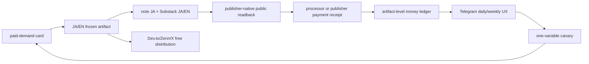
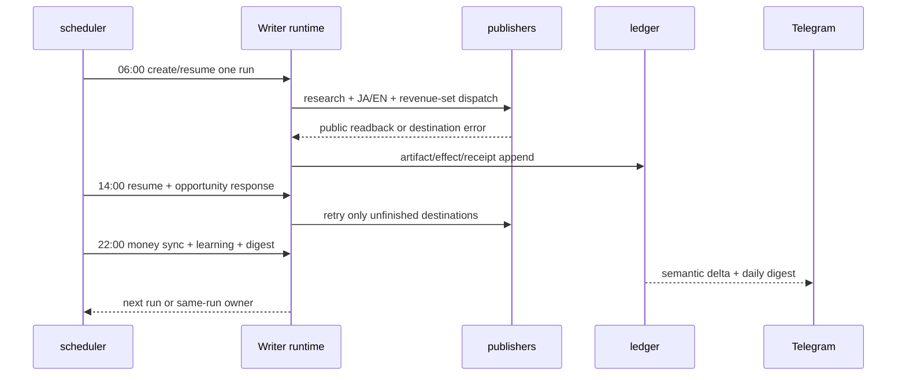

# Writer Agent: 毎日出荷・8時間オーケストレーション・Telegram UX 仕様

**作成日**: 2026-08-20 JST
**状態**: Draft（この仕様を次の実装順序とする）
**正本**: `docs/writer-agent/WRITER-AGENT-SSOT.md`
**対象ランタイム**: Mac Mini `/Users/anicca/.openclaw/`
**対象コード**: `/Users/anicca/profitable-claude` と versioned release tree

## 1. Overview（何を、なぜ直すか）

### 1.1 結論

Writerは「書けない」のではなく、**供給・実行・計測・報告が別々の古いパスに分裂しているため、出版前の安全ゲートで止まり、止まった事実を検出・回復・収益計測できていない**。

8時間ごとに長文記事を3本作ることは現時点の解決策ではない。先に、1本のJA/EN記事を収益面へ確実に出し、同じ`run_id`を復旧し、外部readbackと受取receiptをTelegramへ届ける。8時間 cadence は新規記事の頻度ではなく、**供給・復旧・計測・報告を回す制御面**にする。

### 1.2 実測証拠（Evidence）

| 観測 | 実測値 | 含意 |
|---|---|---|
| 日次run | `daily-2026-08-18`〜`20` は各2ファイルのみ（`git-hash.txt` と `strategy-consumption.json`）、`article-ja.md`/`article-en.md`なし | 6:00の起動後、生成前に終了 |
| 最新日次ログ | `demand topic queue is empty` → `pending claim-loop supply` | モデル呼び出し・公開は実行されていない |
| claim loop | `/Users/anicca/profitable-claude/skills/writer-agent/scripts/claim_loop.py` が存在せず、同じENOENTを繰り返す | 需要カードが補充されない |
| money sync | `scripts/money_sync.py` が存在せずENOENT | 収益台帳が更新されない |
| report worker | `scripts/writer_report_worker.py` が存在せずENOENT | Telegramの新しい日次reportが生成されない |
| healthcheck | `article-healthcheck.sh` が存在せずENOENT | 未出荷runを検出できない |
| self-improve | `scripts/self-improve.sh` が存在せずENOENT | canary/KEEP/REVERTが進まない |
| branch/tree | mutable repo HEAD=`889473ce`（`docs/global-gig-market-expansion`）に`skills/writer-agent` treeがない。完全なWriter treeはrelease `e9ab21ea`にある | sourceと実行中release/stateが不一致 |
| scheduler設定 | `.openclaw/cron/jobs.json`のWriter/article系9件は全て`enabled:false` | cron側は実行主体ではない |
| plists | `article-daily`/`article-resume`だけrelease tree、他のworkerはmutable treeを参照。missing executableを含むplistが複数 | 一つのWriterではなく壊れた複数pipeline |
| 直近の報告 | 8/16の最後のWriter Telegram report出力は「受取`¥0/$0`」。8/17以降はreport workerがENOENTで、外部payment receiptの新しい観測はない | 現在の金額は`unknown/stale`で、0と断定不可 |

### 1.3 推論（Inference）

1. **主因はcadence不足ではなく、canonical rootの不在と依存workerのENOENT**。
2. publication gateを厳格にしているため、judge/model-runnerが無いrunは正しく安全停止する。しかし停止後のsame-run resume、healthcheck、money/reportが壊れているため、停止が「毎日何も起きない」に見える。
3. Zennのように直近24時間の新規投稿数で制限されるdestinationがあるため、全platformへ8時間ごとに同じ長文を出す設計は不適切。distributionはdestination別SLOで動かす。

### 1.4 収益の理想状態

Writerは次の順で外部receiptを積む。閲覧、like、paywall表示、checkout開始、予測額は売上にしない。



収益面は現在のSSOT §2.5に従い、最初の必須setを`note/ja`、`substack/ja`、`substack/en`とする。`self-owned`とeditorial feeはreceipt collectorが実装された時点で同じ契約へ追加する。Dev.to、Zenn、X Article/Post、TikTokは発見・信頼・送客面であり、受取receiptが無い限り収益setをブロックしない。

## 2. Acceptance Criteria（完了条件）

### 2.1 P0: canonical runtime

| # | MUST | 完了receipt |
|---:|---|---|
| A1 | Writerのsourceは一つのmanifestで固定する。`source_repo=/Users/anicca/profitable-claude`、`release_root=/Users/anicca/profitable-claude-releases/writer/<commit>/writer-agent`、`state_root=/Users/anicca/profitable-claude/skills/writer-agent/state`を同じmanifestに記録する | `writer-runtime-manifest.json`とSHA-256 |
| A2 | loaded plistの全ProgramArguments、worker script、model-runner、healthcheck、report、money、claim、opportunity、learningがmanifestから解決でき、missing pathが0 | path census receipt |
| A3 | 新規記事creatorは1つ、same-run resume ownerは1つ。旧`writer-*` engineとdisabled cronのarticle creatorは実行主体から除外する | label census receipt |
| A4 | mutable stateはrelease codeと同じschema/versionを持つ。run開始時にrelease commit、prompt hash、state schemaを保存する | run preflight receipt |
| A5 | source/release/stateの不一致は生成前に止め、Telegramへ`blocked: runtime drift`を1回だけ送る | drift fixture |

### 2.2 P0: 供給・日次出荷・復旧

| # | MUST | 完了receipt |
|---:|---|---|
| A6 | claim loopが24時間先まで最低1枚、最大7枚のpaid-demand cardを`ready`で供給する。queue空は成功扱いにせず、供給workerのincidentを作る | `demand-card` receipt |
| A7 | 06:00 JSTに1つの`run_id`を作り、JA/EN artifactを凍結する。未完runがある場合は新topicを作らず同じrunをresumeする | run/artifact hash |
| A8 | revenue set 3件すべてをpublisher-native public readbackまで進める。1件の失敗は他destinationを止めない | note/Substack readback receipts |
| A9 | 失敗は`run_id + artifact_id + destination + failure_class`で一意化し、`OBSERVE → DIAGNOSE → ACT → VERIFY → RESUME`を同じrunで行う | incident + same-run resume receipt |
| A10 | free distributionは独立SLOで記録し、Zennの24時間windowなど外部制限は対象destinationだけ`PENDING`にする | per-destination receipt |
| A11 | 連続3日、06:00 triggerがarticle artifactまたは明示的blocker receiptを作る。無言終了、空run、URLなしの`published`を許可しない | 3日連続 live receipt |

### 2.3 P0: money truth

| # | MUST | 完了receipt |
|---:|---|---|
| A12 | note/Substack/self-owned/editorialの各collectorが存在し、`artifact_id`へ厳密joinする | collector health receipt |
| A13 | gross、refund、platform fee、compute cost、net、payoutを通貨別に保存する。外部証拠が無い値は`unknown`で、0へ変換しない | balanced ledger row |
| A14 | 最初の非test外部paymentまたはpublisher fee receiptを記事artifact、URL、契約/注文IDへjoinする | S0 receipt |
| A15 | MRRとone-time revenueを分離する。views/likes/paywall/checkoutはrevenue ledgerへ入れない | ledger invariant test |

### 2.4 Telegram UX

| # | MUST | 完了receipt |
|---:|---|---|
| A16 | immediateは公開、売上、payout、failure、recovery、opportunity state changeだけ送る。同一semantic hashは再送しない | delivery receipt with message id |
| A17 | 日次digestは売上0でも必ず1回送る。週次digestも必ず1回送る | daily/weekly message IDs |
| A18 | 各メッセージ先頭は`Codex::: Writer | <state> | run=<id>`。本文は「起きたこと／証拠／お金の真実／次のowner／ユーザー操作」を含む | renderer contract test |
| A19 | `PENDING`には対象、外部理由、最短retry時刻、durable owner、並行作業、Telegram event UUIDを含める。裸の`WAITING`と生stack traceを送らない | pending fixture |
| A20 | TelegramとWeb/Local UIは同じledger snapshotと`semantic_hash`を使う | snapshot parity receipt |

### 2.5 8時間 cadence gate

| # | MUST | 完了receipt |
|---:|---|---|
| A21 | 最初は新規長文を1日1本だけ作る。8時間ごとは`control beat`として供給・復旧・計測・報告を実行する | scheduler matrix |
| A22 | 14日連続でA1〜A20がPASS、重複外部作用0、revenue-set readback成功率100%、budget超過0を満たすまで、3本/日の長文publishを開始しない | 14-day gate |
| A23 | A22後に8時間publishを7日間canaryする場合でも最大3本/日、destination別rate-limit、net revenue/compute、failure率、品質退行を測る。悪化・unknown・policy違反で即REVERT | cadence canary + rollback receipt |

## 3. As-Is / To-Be

| 領域 | As-Is（実測） | To-Be（MUST） |
|---|---|---|
| source | current branchにWriter treeなし。releaseだけが完全tree | release manifestから全workerを同一versionで解決 |
| schedule | article-dailyは6:00で起動するがdemand空でprovider前にexit。cron 9件はdisabled | 6:00 creator、5分 resume/health、15分 opportunity、1時間 money、22:00 learning/reportを一つのregistryで管理 |
| demand | queue=0、claim loopはENOENT | 24h先までpaid-demand cardを供給し、欠損時はincident化 |
| publication | note/Substack/X/Zenn等が混在し、draft/intent/readbackが長期滞留 | revenue-setとfree-distributionを分離し、同じrunをdestination単位で再開 |
| healing | healthcheck、repair、self-improveの入口が欠損 | 失敗signatureを保存し、同一artifactを修復・検証・resume |
| money | money sync欠損。最後のreportは8/16で受取¥0/$0 | receipt-only ledger。未計測はunknown。MRR/one-timeを分離 |
| Telegram | 旧workerの同一semantic hash空振りが続き、8/16以降のreport workerはENOENT | event delta、日次0円digest、週次経済digest、incident owner、message id、dedupe |
| cadence | “毎日”はtriggerの存在であり、shipの証拠ではない | ship = public readback + artifact hash + payment observation（未入金は正直にunknown） |

### 3.1 理想の運用UX

Telegramは一つのDMを「操作画面」ではなく、**お金と未完了workのtruth surface**として使う。

```text
Codex::: Writer | BLOCKED | run=daily-2026-08-20

起きたこと: 06:00 triggerは起動したが、paid-demand cardが0件で生成前停止。
証拠: demand-authority receipt / claim-loop ENOENT
お金: 今回の受取は未発生。直近receipt以降は unknown（0とは扱わない）。
次のowner: writer-claim-loop（供給復旧）→ article-daily（同run再開）
再開: 供給receiptができ次第、次のscheduleを待たずにresume。
あなたの操作: なし。
```

メッセージ種別は次の4つに固定する。

1. **Immediate delta**: `LIVE`、`SALE`、`PAYOUT`、`INCIDENT_OPEN/UPDATE/RECOVERED`、機会の`SUBMITTED/ACCEPTED/DECLINED`だけ。
2. **Daily digest（22:30 JST）**: 今日、月累計、MRR、通貨別gross/net/pending/unknown、記事ごとの全URL、readback、paywall、購入、refund、失敗、復旧、次の1件。
3. **Weekly economics（月曜）**: stream別増減、one-time/MRR、conversion/churn、fee/compute/net margin、KEEP/REVERT、来週の一実験。
4. **Pinned status**: 最新run、未完destination、owner、次のretry、受取truthを1枚に集約。変化がない限り新規メッセージを作らない。

UI上の色・語彙は次に固定する。

| 状態 | 表示 | 意味 |
|---|---|---|
| `LIVE` | 緑 | 外部公開readbackが通った |
| `EARNED` | 金 | 外部payment/publisher receiptがjoinした |
| `PENDING` | 黄 | 外部理由があり、ownerとretryがある |
| `UNKNOWN` | 灰 | 計測不足。0ではない |
| `BLOCKED` | 赤 | 次の安全な自動行動が定義されている |
| `TEST` | 紫 | test/dry-run。収益へ加算しない |

### 3.2 8時間のcontrol beat



`14:00`と`22:00`は前runが未完なら必ず同じrunを優先する。新しい長文を作って未完runを隠すことを禁止する。8時間publish canaryはA22合格後だけ別の実験として起動する。

## 4. Test Matrix

| # | To-Be | Test name | Cover |
|---:|---|---|---|
| 1 | canonical manifest | `test_all_loaded_writer_paths_exist()` | missing path / release drift |
| 2 | one creator/resume | `test_writer_label_census_has_one_creator_and_one_resume()` | duplicate daily creator |
| 3 | demand supply | `test_empty_paid_demand_creates_incident_and_no_provider_call()` | queue empty |
| 4 | daily artifact | `test_daily_run_freezes_ja_en_artifacts_once()` | duplicate run / hash drift |
| 5 | revenue-set | `test_revenue_set_readback_is_required_but_free_destinations_are_nonblocking()` | note/Substack vs Dev.to/Zenn/X |
| 6 | same-run heal | `test_failure_resumes_same_run_artifact_and_effect_once()` | retry / duplicate side effect |
| 7 | honest money | `test_unknown_is_not_zero_and_views_are_not_revenue()` | fake revenue / currency mix |
| 8 | Telegram delta | `test_same_semantic_hash_is_deduped_and_message_id_is_recorded()` | notification spam |
| 9 | Telegram daily | `test_zero_revenue_daily_digest_still_delivers()` | silent day |
| 10 | Telegram pending | `test_pending_includes_owner_reason_retry_and_event_uuid()` | ownerless wait |
| 11 | snapshot parity | `test_telegram_and_web_share_ledger_semantic_hash()` | divergent UX |
| 12 | cadence gate | `test_eight_hour_canary_reverts_on_net_or_policy_regression()` | over-publishing |
| 13 | live E2E | `test_live_trigger_to_public_readback_to_telegram_receipt()` | installed loop truth |

| Item | Value |
|---|---|
| UI変更 | あり（Telegram message contract、pinned status、daily/weekly digest） |
| E2E結論 | Maestro: 不要。Telegram実機E2Eとpublisher-native readbackが必要（iOS UIではないため） |

## 5. Boundaries（今回やらないこと）

- 8時間ごとの長文3本publishを、A22の実績前に開始しない。
- primary sessionが記事を手動公開して成功扱いにしない。
- views、likes、impressions、paywall、checkout、推定収益を受取額にしない。
- Zennの24時間投稿制限、各platformのpolicy、外部KYC・契約・決済承認を回避しない。
- 新しいplatform adapter、派生商品、$10M scale controllerをP0に混ぜない。
- 既存の`~/.cloak`、`~/.openclaw/state/*.jsonl`、credential、memoryを削除・上書きしない。
- 旧SSOT履歴（`docs/loop-engineering/47-*`）を現行TODOとして復活させない。

## 6. Execution Steps（残TODOの順序）

### P0-1 Canonical runtimeを復旧

`/Users/anicca/profitable-claude`のWriter sourceを、release `e9ab21ea`の完全treeと同じ契約へ戻す。manifestを作り、全plistをmanifest経由にする。旧`writer-daily` engineとdisabled article cronは実行主体から外す。完了条件はA1〜A5。

### P0-2 Demand supplyを復旧

`claim_loop.py`、`claim_store.py`、`claim_supply.py`、`demand_authority.py`を同一releaseへ揃え、`state/topics/queue`へ24時間分のカードを作る。queue空を安全停止だけで終わらせず、incident + Telegramへ送る。完了条件はA6。

### P0-3 1日1本のrevenue-set E2E

実際のlaunchd `ai.anicca.article-daily`をkickstartし、`note/ja`、`substack/ja`、`substack/en`を同一runでreadbackする。未完は`article-resume`が同じrunを所有する。完了条件はA7〜A11。

### P0-4 監視・収益・機会・学習workerを同じreleaseに戻す

`article-healthcheck.sh`、`money_sync.py`、`writer_report_worker.py`、`writer-sales-measure-worker.sh`、`opportunity_discovery.py`、`opportunity_response.py`、`self-improve.sh`をmanifestから解決する。実行後に、失敗・受取・MRR・canaryがledgerへ入ることを確認する。完了条件はA12〜A15。

### P0-5 Telegram UXを実装・実機確認

`Codex:::` prefix、semantic-hash dedupe、message id、pinned status、zero-revenue daily、weekly economics、owner付きPENDINGを一つのrendererへ統合する。`openclaw message send --channel telegram --target 8547730585 --json`の実receiptを取得し、同じsnapshotのWeb/Local表示とhash一致を確認する。完了条件はA16〜A20。

### P1-1 8時間control beatを有効化

06:00 creator、14:00 recovery/opportunity、22:00 money/learning/report、5分health/resumeを同じregistryへ登録する。14日間、毎beatにreceiptがあることを観測する。完了条件はA21〜A22。

### P1-2 8時間publish canary（条件付き）

A22を満たした後だけ、1変数・最大3本/日・7日間のcanaryを実行する。net revenue/compute、品質、policy、duplicate、rate-limitを比較し、悪化またはunknownなら自動REVERTする。完了条件はA23。

## 7. 調査ソースと判断根拠

外部取得は`crwl` 6 query（英語3、日本語3）を実行したが、Chromiumの`MACH_PORT_RENDEZVOUS`/code 141、curl/scrapyはDNS failureで取得不能だった。そのため既存の一次情報キャッシュと現行SSOTに記録された一次URLを使い、未取得を成功扱いしていない。

| ソース | URL | 核心の引用 | この仕様への適用 |
|---|---|---|---|
| Anthropic, Building Effective Agents | https://www.anthropic.com/engineering/building-effective-agents | 「agents dynamically direct their process and tool use from environmental feedback」 | 固定cronではなく、外部readbackでreplanする。ただしdeterministic safety boundaryはruntimeが持つ |
| OpenAI Agents SDK, Multi-agent orchestration | https://openai.github.io/openai-agents-python/multi_agent/ | 「LLM orchestration, where the model plans and selects tools, [is separated] from code orchestration used for deterministic boundaries」 | Writerの計画・診断はAgent、schedule/idempotency/money truthはcode |
| OpenClaw FAQ, env loading | https://docs.openclaw.ai/help/faq#how-does-openclaw-load-environment-variables | 「OpenClaw reads env vars from the parent process (shell, launchd/systemd, CI, etc.)」 | plist/launchdが同じ`.env`とrootを使うpreflightを必須化 |
| OpenClaw FAQ, runtime status | https://docs.openclaw.ai/help/faq#why-does-openclaw-gateway-status-say-runtime-running-but-rpc-probe-failed | 「running is the supervisor’s view」 | process/triggerが存在することをshipと誤認せず、外部readbackを完了条件にする |
| OpenClaw FAQ, Telegram propagation | https://docs.openclaw.ai/help/faq#how-do-commands-propagate-between-the-telegram-gateway-and-nodes | 「Telegram messages are handled by the gateway」 | Telegramは状態の配信面。worker内のraw stdoutを直接UIにしない |
| Writer SSOT §2.3/§2.5/§6 | `docs/writer-agent/WRITER-AGENT-SSOT.md` | 「A view, like, or impression is not revenue」「daily revenue set」「Daily and weekly reports are mandatory even when revenue is zero」 | receipt-only会計、revenue-set、0円でも日次報告を固定 |
| Writer release SKILL, Zenn operations | `/Users/anicca/profitable-claude-releases/writer/e9ab21ea/writer-agent/SKILL.md` | 「Zenn limits NEW articles by 直近24時間の投稿数. Publish 1 new article/window」 | 全platform一律8時間publishを禁止し、destination別SLOにする |
